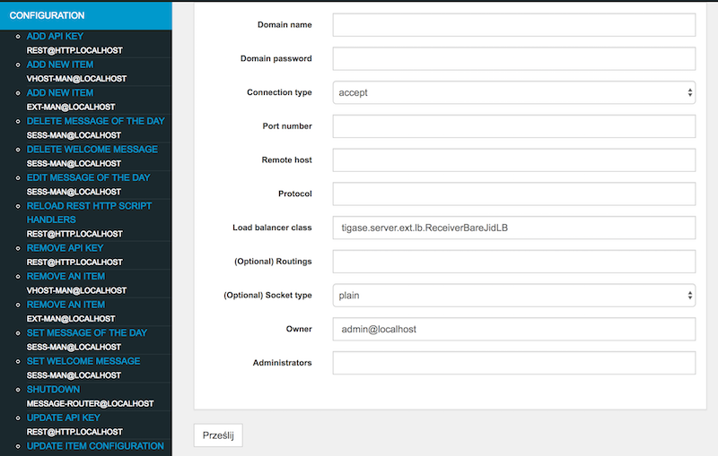

Components
================

The only step is to tell the server what components to load, how to name them and optionally give some extra parameters. To do so open the ``config.tdsl`` file you use in your installation.

Let’s say you want to just add PubSub for now. All you need to do is add the following to the properties file:

.. code:: dsl

   pubsub (class: tigase.pubsub.PubSubComponent) {}

Normally, this is not necessary since pubsub is loaded by default, however this is just an example of loading a class with the DSL format.

.. code:: dsl

   'pubsub-priv' (class: tigase.pubsub.PubSubComponent) {}

As you can see, we can customize the name of a component in the deceleration, here we are using pubsub-priv.

Although this may be rare, it allows for wide compatibility and platform stability.

Normally, however we want to load few different components like PubSub, MUC, MSN Transport and so on…​. Therefore instead of the above second PubSub we can load the MUC component:

.. code:: dsl

   muc (class: tigase.muc.MUCComponent) {}
   pubsub (class: tigase.pubsub.PubSubComponent) {}

Changes to the ``config.tdsl`` file will take effect upon server restart.

Advanced Message Processing - AMP XEP-0079
----------------------------------------------

Tigase server offers support for `XEP-0079: Advanced Message Processing <http://xmpp.org/extensions/xep-0079.html>`__ (often abbreviated to AMP).

It is enabled by default but there are several configuration options that you may tweak.

Configuration of AMP is not very complex, but as it is implemented as a component in the Tigase server it does needs a few settings to get it right.

Here is a first, brief overview of the AMP configuration and later detailed explanation of each parameter.

.. code:: dsl

   'sess-man' {
       amp () {
           'amp-jid' = 'amp@your-domain.tld'
       }
       message (active: false) {}
       msgoffline (active: false) {}
   }
   'amp-security-level' = 'STRICT'

First of all: plugins
^^^^^^^^^^^^^^^^^^^^^^^^^^

Even though the whole functionality is implemented inside the component you need a way to forward messages with ``AMP`` payload to that component. This is what the ``amp`` plugin does. The ``amp`` plugin intercepts all ``<message/>`` packets even without AMP payload, redirecting some of the to the ``AMP`` component and others processing in a standard way. Therefore you no longer need ``message`` plugin or ``msgoffline`` plugin. Those are all functions are offered by the ``amp`` plugin now. Hence you have to switch ``message`` and ``msgoffline`` plugins off (the ``amp`` plugin is loaded by default):

.. code:: dsl

   'sess-man' {
       amp () {}
       message (active: false) {}
       msgoffline (active: false) {}
   }

The ``amp`` plugin needs to know where to forward all the ``AMP`` packets. By default plugin uses hostname of the given machine as this is true to the most installations. However, this is configured by the last line of the example configuration, which forwards all packets to the address ``amp@your-domain.tld``:

.. code:: dsl

   'sess-man' {
       amp () {
           'amp-jid' = 'amp@your-domain.tld'
       }
   }

Secondly: component
^^^^^^^^^^^^^^^^^^^^^^^^^^

By default Tigase loads the component with the standard name ``amp``

Optional parameters
^^^^^^^^^^^^^^^^^^^^^^^^^^

There is also one parameter shared between the component and the plugin. Connection to the database where offline messages are stored. The AMP component has a dedicated schema for storing offline messages designed for a high traffic and high load installations. It does not use ``UserRepository`` for storing messages.

By default the same physical database as for ``UserRepository`` is used but you can change it and store messages in a completely separate location to reduce performance degradation of rest of the system. You can set a database connection string using following property:

.. code:: dsl

   dataSource {
       'default-amp' () {
           uri = 'jdbc:mysql://localhost/tigasedb?user=db_usr&password=db_pwd'
       }
   }

The `XEP-0079 <http://xmpp.org/extensions/xep-0079.html>`__ specification has a `Section 9. - Security Considerations <http://xmpp.org/extensions/xep-0079.html#security>`__. As it describes, in some cases the AMP protocol can be used to reveal user’s presence information by other users who are not authorized for presence updates. There are a few possible ways to prevent this.

Tigase’s implementation offers 3 modes to handle ``AMP`` requests to prevent revealing user’s status to non-authorized users:

.. code:: dsl

   'amp-security-level' = 'STRICT'

In this mode the server performs strict checking. The ``AMP`` specification is fully handled. This however involves roster loading for each offline user, hence it may impact the service performance. It may not be feasible or possible to run in this mode for services under a high load with lots of AMP messages.

In the XEP this mode is described in the following way:

*Accept the relevant condition only if the sender is authorized to receive the receiver’s presence, as a result of which the server MUST reply with a <not-acceptable/> error condition if the sender is not so authorized; this is the RECOMMENDED behavior. This is also the default in Tigase.*

.. code:: dsl

   'amp-security-level' = 'PERFORMANCE'

Dummy checking is performed efficiently by just returning an error response every time there is a chance that the default action may reveal user status without looking into the user’s roster. This does not affect performance but it does impact the ``AMP`` compliance.

In the XEP this mode is described in the following way:

*Accept the relevant condition only if the action is "drop", as a result of which the server MUST reply with a <not-acceptable/> error condition if the action is "alert", "error", or "notify"; this is slightly less restrictive but still unnecessarily restricts the functionality of the system, so is NOT RECOMMENDED.*

It does not do any checking. It acts like all users are authorized to receive notifications, even if it may reveal user status to unauthorized users. It does not impact the server performance and it offers full AMP compliance.

.. code:: dsl

   'amp-security-level' = 'NONE'

Server Monitoring
-----------------------

All the documentation and resources related to the Tigase server monitoring.

-  `Setting up Remote Monitoring in the Server <#Setting-Up-Remote-Monitoring-in-the-Server>`__

-  `Statistics Logger Configuration <#Configuration-of-statistics-loggers>`__

-  `Retrieving Statistics from the Server <#Retrieving-statistics-from-the-server>`__

-  `Monitor Component <#Monitor-Component>`__

Setting Up Remote Monitoring in the Server
^^^^^^^^^^^^^^^^^^^^^^^^^^^^^^^^^^^^^^^^^^^^^^^

Tigase server can be remotely monitored over following protocols: ``JMX/RMI``, ``SNMP`` and ``HTTP``. Even though ``JMX`` offers the biggest control and visibility to the server states, all of the monitoring services give the same basic set of the server statistics:

-  Number of network connections for s2s, c2s and Bosh

-  Last second, last minute and last hour load for all main components: SM, MR, c2s, s2s, Bosh, MUC and PubSub

-  System statistics - memory usage (heap and non heap) and the server uptime in milliseconds and human readable text.

-  Users statistics - number of registered users and number of online user session.

JMX/RMI and SNMP servers offer basic security and can restrict access while the HTTP server doesn’t offer any access restriction mechanisms. Therefore HTTP monitoring is recommended to operate behind a firewall.

The monitoring itself causes very low overhead in terms of the resources and CPU consumption on top of the normal Tigase processing requirements so it can be left on without worrying about performance degradation.

NOTE This works with the Tigase server from version **4.2.0** or build **1418**.

What You Need
~~~~~~~~~~~~~~

Statistics binaries are built-in ``-dist-max`` and no extra files are needed. If you have downloaded ``-dist`` file, you will need tigase-extras[https://github.com/tigase/tigase-extras] built and included in the ``jars/`` directory.

Activation
~~~~~~~~~~~~~~

You can either run the Tigase installer and use the configuration wizard to activate the monitoring or edit etc/config.tdsl file and add following lines:

.. code:: dsl

   monitoring() {
     jmx() {
       port = 9050
     }
     http() {
       port = 9080
     }
     snmp() {
       port = 9060
     }
   }

As you see there is a separate block for each monitoring server you want to activate. Each server is responsible for activation of a different protocol and takes a single parameter - port number. There are following protocols supported right now:

-  ``jmx`` - activating monitoring via JMX/RMI

-  ``http`` - activating monitoring over HTTP protocol

-  ``snmp`` - activating monitoring over SNMP protocol

You can have all protocols active at the same time or any combination of them or none.

Security
~~~~~~~~~~~~~~

Both JMX and SNMP offer security protection to limit access to monitoring data. The security configuration is a bit different for both.

JMX
~~~~~~~~~~~~~~

After the server installation or in the SVN repository you can find 2 files in the ``etc/`` directory: ``jmx.access`` and ``jmx.password``.

-  ``jmx.access`` is a user permission file. You can use it to specify whether the user can access the monitoring data for reading only ``readonly`` or with read-write ``readwrite`` access. There are example entries in the file already and the content may simply look like:

   .. code:: bash

      monitor readonly
      admin readwrite

-  ``jmx.password`` is a user password file. You can set user passwords here and the format again is very simple and the same as for jmx.access. There are example entries already provided for you convenience. Content of the file may look like the example below:

   .. code:: bash

      admin admin_pass
      monitor monitor_pass

Using above to files you can control who and how can access the JMX monitoring services.

SNMP

Access to SNMP monitoring is controlled using ACL (access control lists) which can be configured in the file ``snmp.acl`` located in ``etc/`` directory. It contains lots of detailed instructions how to setup ACL and restrict access per user, host and what kind access is allowed. The simplest possible configuration may look like this:

.. code:: bash

   acl = {
     {
       communities = public, private
       access = read-only
       managers = public.host.com, private.host.com
     }
     {
       communities = admin
       access = read-write
       managers = localhost, admin.host.com
     }
   }

You might also need Tigase MIB definition: `TIGASE-MANAGEMENT-MIB.mib <https://github.com/tigase/tigase-server/blob/master/src/main/resources/mib/JVM-MANAGEMENT-MIB.mib>`__ for the server specific statistics. The MIB contains definition for all the server statistics exposed via SNMP.

HTTP

Access the server at example.com:9080 and you will be presented with an Agent View.

Retrieving statistics from the server
^^^^^^^^^^^^^^^^^^^^^^^^^^^^^^^^^^^^^^^^^^^

By default we can retrieve server statistics using XMPP, no additional setup is necessary.

Retrieving statistics using XMPP
~~~~~~~~~~~~~~~~~~~~~~~~~~~~~~~~~~~~~

Accessing statistics over XMPP protocol requires any XMPP client capable of executing `XEP-0050: Ad-Hoc Commands <http://xmpp.org/extensions/xep-0050.html>`__. It’s essential to remember, that only administrator (a user whose JID is configured as administrative) can access the statistics.

Psi XMPP Client
~~~~~~~~~~~~~~~~~~~~~~~~~~~~~~~~~~~~~

For the purpose of this guide `Psi <http://psi-im.org/>`__ client will be used. After successfully configuring and connecting to account with administrative privileges we need to access *Service Discovery*, either from application menu or from context menu of the particular account account:

|roster-discovery|

In the *Service Discovery* window we need to find *Server Statistics* component:

|discovery-stats|

We can either access statistics for all components or select particular component after expanding the tree. To execute ad-hoc command simply double click on the particular node which will open window with statistics:

|server-stats|

In this window, in addition to see the statistics, we can adjust *Stats level* by selecting desired level from the list and confirm by clicking *Finish*.

Retrieving statistics using JMX
~~~~~~~~~~~~~~~~~~~~~~~~~~~~~~~~~~~~~

In order to access statistics over JMX we need to enable support for it in Tigase - `Monitoring Activation <#monitoring_activation>`__. Afterwards we can use a number of tools to get to the statistics, for example the following:

JConsole
~~~~~~~~~~~~~~~~~~~~~~~~~~~~~~~~~~~~~

After opening JConsole we either select local process or provide details of the remote process, including IP, port and credentials from **etc/jmx.**\ \* files:

|jconsole|

Afterwards we navigate to the MBeans tab from where we can access the ``tigase.stats`` MBean. It offers similar options to XMPP - either accessing statistics for all components or only for particular component as well as adjusting level for which we want to obtain statistics:

|jconsole-1|


StatsDumper.groovy
~~~~~~~~~~~~~~~~~~~~~~~~~~~~~~~~~~~~~

In order to collect statistics over period of time following groovy script can be used: `StatsDumper.groovy <files/StatsDumper.groovy>`__. It’s a Simple JMX client that connects to Tigase and periodically saves all statistics to files.

It takes following parameters:

.. code:: bash

   $ groovy StatsDumper.groovy [hostname] [username] [password] [dir] [port] [delay(ms)] [interval(ms)] [loadhistory(bool)]

-  ``hostname`` - address of the instance

-  ``username`` - JMX username

-  ``password`` - JMX username

-  ``dir`` - directory to which save the files with statistics

-  ``port`` - port on which to make the connection

-  ``delay``\ (ms) - initial delay in milliseconds after which statistics should be saved

-  ``interval``\ (ms) - interval between each retrieval/saving of statistics

-  ``loadhistory``\ (bool) - indicates whether or not load statistics history from server (if such is enabled in Tigase)

.. |roster-discovery| image:: ../../asciidoc/admin/images/admin/monitoring_xmpp_1.png
.. |discovery-stats| image:: ../../asciidoc/admin/images/admin/monitoring_xmpp_2.png
.. |server-stats| image:: ../../asciidoc/admin/images/admin/monitoring_xmpp_3.png
.. |jconsole| image:: ../../asciidoc/admin/images/admin/monitoring_jmx_jconsole_1.png
.. |jconsole-1| image:: ../../asciidoc/admin/images/admin/monitoring_jmx_jconsole_2.png

Monitor Component
^^^^^^^^^^^^^^^^^^^^^

Tigase includes an **Monitor Component** to help with monitoring has been implemented. This allows you to set thresholds for certain predefined tasks and you or other JIDs can be sent a message when those thresholds are passed. You can even configure a mailer extension to have an E-mail sent to system administrators to let them know an event has occurred! Lets begin with setup and requirements.

Monitor Component is based on eventbus which in turn is based on a limited `PubSub <http://www.xmpp.org/extensions/xep-0060.html>`__ specification. Events are delivered to subscribers as a normal PubSub notification.

Each component or client may subscribe for specific types of events. Only components on cluster nodes are allowed to publish events.

Setup
~~~~~~~~~~~~~~~~~~~~~~~~~~~~~~~~~~~~~

Monitor Component is enabled by default on v7.1.0 b4001 and later, so no setup needed!

How it Works
~~~~~~~~~~~~~~~~~~~~~~~~~~~~~~~~~~~~~

Events in Eventbus are identified by two elements: name of event and its namespace:

.. code:: xml

   <EventName xmlns="tigase:demo">
     <sample_value>1</sample_value>
   </EventName>

Where event name is ``EventName`` and namespace is ``tigase:demo``.

Listeners may subscribe for a specific event or for all events with specific a namespace. Because in pubsub, only one node name exists, so we have to add a way to convert the event name and namespace to a node name:

::

   nodename = eventname + "|" + namespace

So for example, to subscribe to ``<EventName xmlns="tigase:demo">``, node must be: ``EventName|tigase:demo``. If you wish to subscribe to all events with a specific namespace, use an asterisk (``*``) instead of the event name: ``*|tigase:demo``.

   **Note**

   If client is subscribed to ``*|tigase:demo node``, then events will not be sent from node ``*|tigase:demo``, but from the **real** node (in this case: ``EventName|tigase:demo``).

Available Tasks
~~~~~~~~~~~~~~~~~~~~~~~~~~~~~~~~~~~~~

Monitor Component has several pre-defined tasks that can be monitored and set to trigger. What follows is the list of tasks with the options attributed to each task.

-  | **disk-task** - Used to check disk usage.
   | Available Options

   1. ``enabled`` - Enable or disable task, Boolean value.

   2. ``period`` - Period of running check, Integer value.

   3. ``threshold`` - Percentage of used space on disk, Float value.

-  | **cpu-temp-task** - Used to check CPU temperature.
   | Available Options

   1. ``enabled`` - Enable or disable task, Boolean value.

   2. ``period`` - Period of running check, Integer value.

   3. ``cpuTempThreshold`` - Temperature threshold of CPU in °C.

-  | **load-checker-task** - Used to check system load.
   | Available Options

   1. ``enabled`` - Enable or disable task, Boolean value.

   2. ``period`` - Period of running check, Integer value.

   3. ``averageLoadThreshold`` - Average percent load threshold, Long value.

-  | **memory-checker-task** - Used to check memory usage.
   | Available Options

   1. ``enabled`` - Enable or disable task, Boolean value.

   2. ``period`` - Period of running check, Integer value.

   3. ``maxHeapMemUsagePercentThreshold`` - Alarm when percent of used Heap memory is larger than, Integer value.

   4. ``maxNonHeapMemUsagePercentThreshold`` - Alarm when percent of used Non Heap memory is larger than, Integer value.

-  | **logger-task** - Used to transmit log entries depending on level entered.

   1. ``enabled`` - Enable or disable task, Boolean value.

   2. ``levelThreshold`` - Minimal log level that will be the threshold. Possible values are SEVERE, WARNING, INFO, CONFIG, FINE, FINER, FINEST, and ALL.

-  | **connections-task** - Used to check users disconnections.
   | **NOTE: The event will be generated only if both thresholds (amount and percentage) will be fulfilled.**

   1. ``enabled`` - Enable or disable task, Boolean value.

   2. ``period`` - Period of running check in ms, Integer value.

   3. ``thresholdMinimal`` - Minimal amount of disconnected users required to generate alarm.

   4. ``threshold`` - Minimal percent of disconnected users required to generate alarm.

Configuration
~~~~~~~~~~~~~~~~~~~~~~~~~~~~~~~~~~~~~

Configuration of the monitor can be done one of two ways; either by lines in ``config.tdsl`` file, or by sending XMPP stanzas to the server. You may also send XMPP stanzas VIA HTTP REST. XMPP stanza configurations will override ones in config.tdsl, but they will only last until the server restarts.

config.tdsl

Tasks can be configured in the ``config.tdsl`` file. See `available tasks <#availableTasks>`__ for the tasks that can be setup.

To enable a specific monitor task, use the following line:

.. code:: dsl

   monitor {
       '$TASKNAME' {
           setting = value
       }
   }

Where monitor is the component name for ``MonitorComponent``, and ``$TASKNAME`` is one of the `available task names <#availableTasks>`__.

This format will be the same for other settings for tasks, and it’s best to group settings under one heading. For example:

.. code:: dsl

   monitor {
       'connections-task' {
           enabled = true
           period = 1000
       }
   }

sets the check period to 1000 milliseconds and enables ``connections-task``.

.. Note::

   Once triggers have been activated, they will become dormant. Think of these as one-shot settings.


Subscription Limitations

To define list of JIDs allowed to subscribe for events:

.. code:: dsl

   eventbus {
       affiliations {
           allowedSubscribers = 'francisco@denmark.lit,bernardo@denmark.lit'
       }
   }

If this is not specified, all users can subscribe.

Configuration via XMPP

We can also configure the eventbus monitor component using XMPP stanzas. This allows us to set and change configurations during server runtime. This is done using a series of ``iq`` stanzas send to the monitor component.

We can query each component for its current settings using the following stanza.

.. code:: xml

   <iq type="set" to="monitor@$DOMAIN/disk-task" id="aad0a">
       <command xmlns="http://jabber.org/protocol/commands" node="x-config"/>
   </iq>

The server will return the component current settings which will make things easier if you wish to edit them. In this case, the server has returned the following to us

.. code:: xml

   <iq from="monitor@$DOMAIN/disk-task" type="result" id="aad0a" to="alice@coffeebean.local/Psi+">
       <command xmlns="http://jabber.org/protocol/commands" status="executing" node="x-config"
                sessionid="0dad3436-a029-4082-b0e0-04d838c6c0da">
           <x xmlns="jabber:x:data" type="">
               <title>Task Configuration</title>
               <instructions/>
               <field type="boolean" label="Enabled" var="x-task#enabled">
                   <value>0</value>
               </field>
               <field type="text-single" label="Period [ms]" var="x-task#period">
                   <value>60000</value>
               </field>
               <field type="text-single" label="Disk usage ratio threshold" var="threshold">
                   <value>0.8</value>
               </field>
           </x>
       </command>
   </iq>

This tells us that the disk-task setting is not active, has a period of 60000ms, and will trigger when disk usage is over 80%.

To send new settings to the monitor component, we can send a similar stanza back to the monitor component.

.. code:: xml

   <iq type="set" to="monitor@$DOMAIN/disk-task" id="aad1a">
       <command xmlns="http://jabber.org/protocol/commands" node="x-config"
                sessionid="0dad3436-a029-4082-b0e0-04d838c6c0da">
           <x xmlns="jabber:x:data" type="submit">
               <field type="boolean" var="x-task#enabled">
                   <value>0</value>
               </field>
               <field type="text-single" var="x-task#period">
                   <value>60000</value>
               </field>
               <field type="text-single" var="threshold">
                   <value>0.8</value>
               </field>
           </x>
       </command>
   </iq>

To which a successful update will give you an XMPP success stanza to let you know everything is set correctly.

Alternatively, you can update specific settings by editing a single field without adding anything else. For example, if we just wanted to turn the disk-task on we could send the following stanza:

.. code:: xml

   <iq type="set" to="monitor@$HOSTNAME/disk-task" id="ab53a">
       <command xmlns="http://jabber.org/protocol/commands" node="x-config">
           <x xmlns="jabber:x:data" type="submit">
               <field type="boolean" var="x-task#enabled">
                   <value>1</value>
               </field>
           </x>
       </command>
   </iq>

To set any other values, do not forget that certain parts may need to be changed, specifically the ``<field type="boolean" var=x-task#enabled">`` fields:

-  | Your field type will be defined by the type of variable specified in the `Available Tasks <#availableTasks>`__ section.

-  ``var=x task#`` will be followed by the property value taken directly from the `Available Tasks <#availableTasks>`__ section.

Getting the Message
''''''''''''''''''''

Without a place to send messages to, monitor will just trigger and shut down. There are two different methods that monitor can deliver alarm messages and relevant data; XMPP messages and using the mailer extension.

XMPP notification

| In order to retrieve notifications, a subscription to the ``eventbus@<VHost>`` user must be made. Keep in mind that subscriptions are not persistent across server restarts, or triggers.
| The monitor schema is very similar to most XMPP subscription requests but with a few tweaks to differentiate it if you wanted to subscribe to a certain task or all of them. Each task is considered a node, and each node has the following pattern: ``eventName|eventXMLNS``. Since each monitoring task has the ``tigase:monitor:event`` event XMLNS, we just need to pick the event name from the list of tasks. So like the above example, our event node for the disk task will be ``disk-task|tigase:monitor:event``. Applied to an XMPP stanza, it will look something like this:

.. code:: xml

   <iq type='set'
       to='eventbus@<VHost>'
       id='sub1'>
     <pubsub xmlns='http://jabber.org/protocol/pubsub'>
       <subscribe node='disk-taskEvent|tigase:monitor:event' jid='$USER_JID'/>
     </pubsub>
   </iq>

Don’t forget to replace ``$USER_JID`` with the bare JID of the user you want to receive those messages. You can even have them sent to a MUC or any component with a JID.

Available events are as follows:

-  DiskUsageMonitorEvent for ``disk-task``

-  LoggerMonitorEvent for ``logger-task``

-  HeapMemoryMonitorEvent for ``memory-checker-task``

-  LoadAverageMonitorEvent for ``load-checker-task``

-  CPUTempMonitorEvent for ``cpu-temp-task``

-  UsersDisconnected for ``connections-task``

Alternatively, you can also subscribe to all events within the eventbus by using a wildcard \* in place of the event XMLNS like this example:

.. code:: xml

   <iq type='set'
       to='eventbus@<VHost>'
       id='sub1'>
     <pubsub xmlns='http://jabber.org/protocol/pubsub'>
       <subscribe node='*|tigase:monitor:event' jid='$USER_JID'/>
     </pubsub>
   </iq>

Sample notification from Monitor

.. code:: xml

   <message from='eventbus.shakespeare.lit' to='francisco@denmark.lit' id='foo'>
     <event xmlns='http://jabber.org/protocol/pubsub#event'>
       <items node='EventName|tigase:demo'>
         <item>
           <EventName xmlns="tigase:demo" eventSource="samplecomponent.shakespeare.lit'" eventTimestamp="1444216850">
             <sample_value>1</sample_value>
           </EventName>
         </item>
       </items>
     </event>
   </message>

Mailer Extension
'''''''''''''''''

*Tigase Server Monitor Mailer Extension* (TSMME) can send messages from the monitor component to a specified E-mail address so system administrators who are not logged into the XMPP server.

For v7.1.0 versions and later, TSMME is already included in your distribution package and no extra installation is needed.

Configuration

Tigase Mailer Extension may be configured via the ``config.tdsl`` file in the following manner:

.. code:: dsl

   monitor {
       'mailer-from-address' = 'sender@<VHost>'
       'mailer-smtp-host' = 'mail.tigase.org'
       'mailer-smtp-password' = '********'
       'mailer-smtp-port' = '587'
       'mailer-smtp-username' = 'sender'
       'mailer-to-addresses' = 'receiver@<VHost>,admin@<VHost>'
   }

Here is an explanation of those variables.

-  ``mailer-smtp-host`` - SMTP Server hostname.

-  ``mailer-smtp-port`` - SMTP Server port.

-  ``mailer-smtp-usernam`` - name of sender account.

-  ``mailer-smtp-password`` - password of sender account.

-  ``mailer-from-address`` - sender email address. It will be set in field from in email.

-  ``mailer-to-addresses`` - comma separated notification receivers email addresses.

It is recommended to create a specific e-mail address in your mail server for this purpose only, as the account settings are stored in plaintext without encryption.

Configuration of statistics loggers
^^^^^^^^^^^^^^^^^^^^^^^^^^^^^^^^^^^^^^^^^

It is possible to enable and configure automatic storage of statistics information. To do that you need to configure any of following statistics loggers as a ``StatisticsCollector`` component sub-beans:

``tigase.stats.CounterDataArchivizer``
   every execution put current basic server metrics (CPU usage, memory usage, number of user connections, uptime) into database (overwrites previous entry).

``tigase.stats.CounterDataLogger``
   every execution insert new row with new set of number of server statistics (CPU usage, memory usage, number of user connections per connector, number of processed packets of different types, uptime, etc) into the database.

``tigase.stats.CounterDataFileLogger``
   every execution store all server statistics into separate file.

As an example to configure ``tigase.stats.CounterDataFileLogger`` to archive statistics data with level ``FINE`` every 60 seconds to file prefixed with ``stat`` and located in ``logs/server_statistics`` following entry is needed:

.. code:: dsl

   stats() {
       'stats-file-logger' (class: tigase.stats.CounterDataFileLogger) {
           'stats-directory' = 'logs/server_statistics'
           'stats-filename' = 'stat'
           'stats-unixtime' = false
           'stats-datetime' = true
           'stats-datetime-format' = 'HH:mm:ss'
           'stats-level' = 'FINEST'
       }
   }

Server to Server Protocol Settings
------------------------------------

Tigase server-to-server communication component facilitates communication with other XMPP servers (federation) and allows you to tweak it’s configuration to get a better performance in your installation.

S2S (or server to server) protocol is enabled by default with optimal settings chosen. There are however, a set of configuration parameters you can adjust the server behavior to achieve optimal performance on your installation.

This documents describes following elements of the Tigase server configuration:

1. Number of concurrent connections to external servers

2. The connection throughput parameters

3. Maximum waiting time for packets addressed to external servers and the connection inactivity time

4. Custom plugins selecting connection to the remote server

Number of Concurrent Connections
^^^^^^^^^^^^^^^^^^^^^^^^^^^^^^^^^^^^^^

Normally only one connection to the remote server is required to send XMPP stanza to that server. In some cases however, under a high load, you can get much better throughput and performance if you open multiple connections to the remote server.

This is especially true when the remote server works in a cluster mode. Ideally you want to open a connection to each of the cluster nodes on the remote server. This way you can spread the traffic evenly among cluster nodes and improve the performance for s2s connections.

Tigase server offers 2 different parameters to tweak the number of concurrent, s2s connections:

-  ``max-out-total-conns`` - this property specifies the maximum outgoing connections the Tigase server opens to any remote XMPP server. This is a **per domain** limit, which means that this limit applies to each of the remote domains Tigase connects to. If it is set to ``4`` then Tigase opens a maximum of 4 connections to ``jabber.org`` plus maximum 4 connections to ``muc.jabber.org`` even if this is the same physical server behind the same IP address.

   To adjust the limit you have to add following to the ``config.tdsl`` file:

   .. code:: dsl

      s2s {
          'max-out-total-conns' = 2
      }

-  ``max-out-per-ip-conns`` - this property specifies the maximum outgoing connections Tigase server opens to any remote XMPP server to its single IP address. This too, is **per domain** limit, which means that this limit applies to each of the remote domains Tigase connects to. If it is set to ``1``, and the above limit is set to ``4``, and the remote server is visible behind 1 IP address, then Tigase opens a maximum of 1 connection to ``jabber.org`` plus a maximum of 1 connection to ``muc.jabber.org`` and other subdomains.

   To adjust the limit you have to add following line to the ``config.tdsl`` file:

   .. code:: dsl

      s2s {
          'max-out-per-ip-conns' = 2
      }


Connection Throughput
^^^^^^^^^^^^^^^^^^^^^^^^^^^^

Of course everybody wants his server to run with maximum throughput. This comes with a cost on resources, usually increased memory usage. This is especially important if you have large number of s2s connections on your installations. High throughput means lots of memory for network buffers for every single s2s connection. You may soon run out of all available memory.

There is one configuration property which allows you to adjust the network buffers for s2s connections to lower your memory usage or increase data throughput for s2s communication.

More details about are available in the `net-buff-high-throughput <#netBuffHighThroughput>`__ or `net-buff-Standard <#netBuffStandard>`__ property descriptions.

Maximum Packet Waiting Time and Connection Inactivity Time
^^^^^^^^^^^^^^^^^^^^^^^^^^^^^^^^^^^^^^^^^^^^^^^^^^^^^^^^^^^^^^^^^^^^^^^^^^^^^^^^^^^^

There are 2 timeouts you can set for the component controlling s2s communication.

-  ``max-packet-waiting-time`` - this sets the maximum time for the packets waiting for sending to some remote server. Sometimes, due to networking problems or DNS problems it might be impossible to send message to remote server right away. Establishing a new connection may take time or there might be communication problems between servers or perhaps the remote server is restarted. Tigase will try a few times to connect to the remote server before giving up. This parameter specifies how long the packet is waiting for sending before it is returned to the sender with an error. The timeout is specified in seconds:

   .. code:: dsl

      s2s {
          'max-packet-waiting-time' = 420L
      }

-  ``max-inactivity-time`` - this parameters specifies the maximum s2s connection inactivity time before it is closed. If a connection is not in use for a long time, it doesn’t make sense to keep it open and tie resources up. Tigase closes s2s connection after specified period of time and reconnects when it is necessary. The timeout is specified in seconds:

   .. code:: dsl

      s2s {
          'max-inactivity-time' = 900L
      }

Custom Plugin: Selecting s2s Connection
^^^^^^^^^^^^^^^^^^^^^^^^^^^^^^^^^^^^^^^^^^^^^^^^^^^^^^^^

Sometimes for very large installations you may want to set larger number of s2s connections to remote servers, especially if they work in cluster of several nodes. In such a case you can also have a control over XMPP packets distribution among s2s connections to a single remote server.

This piece of code is pluggable and you can write your own connection selector. It is enough to implement ``S2SConnectionSelector`` interface and set your class name in the configuration using following parameter in ``config.tdsl`` file:

.. code:: dsl

   s2s {
       's2s-conn-selector' = 'YourSelectorImplementation'
   }

The default selector picks connections randomly.

skip-tls-hostnames
^^^^^^^^^^^^^^^^^^^^^^^^^^^^

The ``s2s-skip-tls-hostnames`` property disables TLS handshaking for s2s connections to selected remote domains. Unfortunately some servers (certain versions of Openfire - [`1 <http://community.igniterealtime.org/thread/36206>`__] or [`2 <http://community.igniterealtime.org/thread/30578>`__]) have problems with TLS handshaking over s2s which prevents establishing a usable connection. This completely blocks any communication to these servers. As a workaround you can disable TLS for these domains to get communication back. Enabling this can be done on any vhost, but must be configured under the s2s component.

.. code:: dsl

   s2s {
       'skip-tls-hostnames' = [ 'domain1', 'domain2' ]
   }

ejabberd-bug-workaround
^^^^^^^^^^^^^^^^^^^^^^^^^^^^

This property activates a workaround for a bug in EJabberd in it’s s2s implementation. EJabberd does not send dialback in stream features after TLS handshaking even if the dialback is expected/needed. This results in unusable connection as EJabberd does not accept any packets on this connection either. The workaround is enabled by default right now until the EJabberd version without the bug is popular enough. A disadvantage of the workaround is that dialback is always performed even if the SSL certificate is fully trusted and in theory this dialback could be avoided. By default, this is not enabled.

.. code:: dsl

   s2s {
       dialback () {
           'ejabbered-bug-workaround' = true
           }
   }

This replaces the old ``--s2s-ejabberd-bug-workaround-active`` property.

Tigase Load Balancing
----------------------------

Tigase includes load balancing functionality allowing users to be redirected to the most suitable cluster node. Functionality relies on a see-other-host XMPP stream error message. The basic principle behind the mechanism is that user will get redirect if the host returned by the implementation differ from the host to which user currently tries to connect. It is required that the user JID to be known for the redirection to work correctly.

Available Implementations
^^^^^^^^^^^^^^^^^^^^^^^^^^^^^^

Tigase implementation is, as usual, extensible and allows for different, pluggable redirection strategies that implement the ``SeeOtherHostIfc`` interface.

Currently there are three strategies available:

-  ``SeeOtherHost`` - most basic implementation returning either single host configured in ``config.tdsl`` file or name of the current host;

-  ``SeeOtherHostHashed`` (default) - default implementation for cluster environment of SeeOtherHostIfc returning redirect host based on the hash value of the user’s JID; list of the available nodes from which a selection would be made is by default composed and reflects all connected nodes, alternatively hosts list can be configured in the config.tdsl;

-  ``SeeOtherHostDB`` - extended implementation of SeeOtherHost using redirect information from database in the form of pairs ``user_id`` and ``node_id`` to which given user should be redirected.

-  ``SeeOtherHostDualIP`` - matches internal Tigase cluster nodes against the lookup table to provide relevant redirection hostname/IP (by default internal Tigase tig_cluster_nodes table will be used)

Configuration Options
^^^^^^^^^^^^^^^^^^^^^^^^^^^^^^

The most basic configuration is related to the choice of actual redirection implementation by declaring class for each connector:

.. code:: dsl

   bosh {
       seeOtherHost (class: <value>) {}
   }
   c2s {
       seeOtherHost (class: <value>) {}
   }
   ws2s {
       seeOtherHost (class: <value>) {}
   }

Possible values are:

-  ``tigase.server.xmppclient.SeeOtherHost``

-  ``tigase.server.xmppclient.SeeOtherHostHashed``

-  ``tigase.server.xmppclient.SeeOtherHostDB``

-  ``tigase.server.xmppclient.SeeOtherHostDualIP``

-  ``none`` - disables redirection

All options are configured on a per-connection-manager basis, thus all options need to be prefixed with the corresponding connection manager ID, i.e. c2s, bosh or ws; we will use c2s in the examples:

.. code:: dsl

   c2s {
       'cm-see-other-host' {
           'default-host' = 'host1;host2;host3'
           'phases' = [ 'OPEN', 'LOGIN' ]
       }
   }

-  ``'default-host' = 'host1;host2;host3'`` - a semicolon separated list of hosts to be used for redirection.

-  ``'phases' = []`` - an array of phases in which redirection should be active, currently possible values are:

   -  ``OPEN`` which enables redirection during opening of the XMPP stream;

   -  ``LOGIN`` which enables redirection upon authenticating user session;

By default redirection is currently enabled only in the ``OPEN`` phase.

SeeOtherHostDB
~~~~~~~~~~~~~~~~~~~

For ``SeeOtherHostDB`` implementation there are additional options:

.. code:: dsl

   c2s {
       'cm-see-other-host' {
           'db-url' = 'jdbc:mysqk://localhost/username?,password?'
           'get-all-query-timeout' = '10'
       }
   }

-  ``db-url`` - a JDBC connection URI which should be used to query redirect information; if not configured the default ``dataSource`` will be used;

-  ``get-host-query`` - a SQL query which should return redirection hostname;

-  ``get-all-data-query`` - a SQL helper query which should return all redirection data from database;

-  ``get-all-query-timeout`` - allows to set timeout for executed queries.

SeeOtherHostDualIP
~~~~~~~~~~~~~~~~~~~

This mechanisms matches internal Tigase cluster nodes against the lookup table to provide matching and relevant redirection hostname/IP. By default internal Tigase ``tig_cluster_nodes`` table is used (and appropriate repository implementation will be used).

To enable this redirection mechanism following configuration / class should be used. Note that for global use, all connection managers must have the same class defined. You can define each connection manager individually.

.. code:: dsl

   bosh {
       seeOtherHost (class: tigase.server.xmppclient.SeeOtherHostDualIP) {}
   }
   c2s {
       seeOtherHost (class: tigase.server.xmppclient.SeeOtherHostDualIP) {}
   }
   ws2s {
       seeOtherHost (class: tigase.server.xmppclient.SeeOtherHostDualIP) {}
   }

It offers following configuration options:

-  ``data-source`` - configuration of the source of redirection information - by default internal Tigase ``tig_cluster_nodes`` table will be used (and appropriate repository implementation will be used); alternatively it’s possible to use ``eventbus`` source;

-  ``db-url`` - a JDBC connection URI which should be used to query redirect information; if not configured ``user-db-uri`` will be used;

-  ``get-all-data-query`` - a SQL helper query which should return all redirection data from database;

-  ``get-all-query-timeout`` - allows to set timeout for executed queries;

-  ``fallback-redirection-host`` - if there is no redirection information present (i.e. secondary hostname is not configured for the particular node) redirection won’t be generated; with this it’s possible to configure fallback redirection address.

All options are configured or on per-component basis:

.. code:: dsl

   <connector> {
       'cm-see-other-host' {
           'data-source' = '<class implementing tigase.server.xmppclient.SeeOtherHostDualIP.DualIPRepository>'
           'db-url' = 'jdbc:<database>://<uri>'
           'fallback-redirection-host' = '<hostname>'
           'get-all-data-query' = 'select * from tig_cluster_nodes'
           'get-all-query-timeout' = 10
       }
   }

EventBus as a source of information

It’s possible to utilize EventBus and internal Tigase events as a source of redirection data. In order to do that ``eventbus-repository-notifications`` needs to be enabled in ClusterConnectionManager:

.. code:: dsl

   'cl-comp' {
       'eventbus-repository-notifications' = true
   }


Auxiliary setup options
^^^^^^^^^^^^^^^^^^^^^^^^^^^^

Enforcing redirection
~~~~~~~~~~~~~~~~~~~~~~

It’s possible to enforce redirection of connections on the particular port of connection manager with ``force-redirect-to`` set to Integer with the following general setting option:

.. code:: dsl

   <connection_manager> {
       connections {
           <listening_port> {
               'force-redirect-to' = <destination_port>
           }
       }
   }

for example, enable additional port ``5322`` for ``c2s`` connection manager and enforce all connections to be redirected to port ``5222`` (it will utilize hostname retrieved from ``SeeOtherHost`` implementation and will be only used when such value is returned):

.. code:: dsl

   c2s {
       connections {
           ports = [ 5222, 5322 ]
           5322 {
               'force-redirect-to' = 5222
               socket = 'plain'
               type = 'accept'
           }
       }
   }


Configuring hostnames
~~~~~~~~~~~~~~~~~~~~~~~~~~~~~~~~~~~~~~

To fully utilize ``SeeOtherHostDualIP`` setup in automated fashion it’s now possible to provide both primary (*internal*) and secondary (*external*) hostname/IP (they need to be correct, ``InetAddress.getByName( property );`` will be used to verify correctness). It can be done via JVM properties ``tigase-primary-address`` and ``tigase-secondary-address``. You can also utilize different implementation of DNS resolver by providing class implementing ``tigase.util.DNSResolverIfc`` interface as value to ``resolver-class`` property. Those properties can be set via ``etc/tigase.conf`` (uncommenting following lines, or manually exposing in environment):

.. code:: bash

   DNS_RESOLVER=" -Dresolver-class=tigase.util.DNSResolverDefault "

   INTERNAL_IP=" -Dtigase-primary-address=hostname.local "
   EXTERNAL_IP=" -Dtigase-secondary-address=hostname "

or in the ``etc/config.tdsl`` (they will be converted to JVM properties):

.. code:: dsl

   'dns-resolver' {
       'tigase-resolver-class' = 'tigase.util.DNSResolverDefault'
       'tigase-primary-address' = 'hostname.local'
       'tigase-secondary-address' = 'hostname'
   }

External Component Configuration
-------------------------------------

Tigase can connect to external components, this guide will show you how this can be accomplished.

Configuration follows the same standards as all other components. It is also much more powerful as a single Tigase instance can control many TCP/IP ports and many external components on each port and even allows for multiple connections for the same component. It supports both XEP-0114 and XEP-0225 with protocol auto-detection mechanisms. Protocols are pluggable so more protocols can be supported or custom extensions to existing protocols can be added.

The implementation also supports a scripting API and new domains with passwords can be added at run-time using ad-hoc commands. New scripts can be loaded to even further control all connected external components.

Pages in this guide describe in details all the administration aspects of setting up and managing external components.

-  `External Component Configuration <#External-Component-Configuration>`__

-  `Tigase as an External Component <#Tigase-as-an-External-Component>`__

-  `Load Balancing External Components in Cluster Mode <#Load-Balancing-External-Components-in-Cluster-Mode>`__

External Component Configuration
^^^^^^^^^^^^^^^^^^^^^^^^^^^^^^^^^^^^^^

As for all Tigase components you can load and configure external components via the ``config.tdsl`` file described in details in the `DSL configuration <#dslConfig>`__ section. This document describes how to enable the component and set the initial configuration to accept or initiate connections for an external component.

First thing to do is to specify the component class and the component name which must be unique within the Tigase installation. The most commonly name used is ``ext`` and the class is ``tigase.server.ext.ComponentProtocol`` (class doesn’t have to be specified when using default name).

The following line in the ``config.tdsl`` will load the component during the server startup time:

.. code:: dsl

   ext (class: tigase.server.ext.ComponentProtocol) {}

While this would load the component, without any additional configurations provided, the component would be practically useless. It is necessary to configure the virtual host domains of the external component during run-time via ad-hoc commands to make use of this component.

You may additionally configure the ```bind-ext-hostnames`` <#bindExtHostnames>`__ property.

To configure external component connections using Admin UI you need to open Admin UI web page (if you are logged in the same computer on which Tigase XMPP Server is running by default it should be available at http://localhost:8080/admin/). Then you should click on ``Configuration`` on the left side of the Admin UI web page and then select ``Add new item`` on ``ext`` component or by execution corresponding ad-hoc command on ``ext`` component using ad-hoc capable XMPP client, ie. `Psi <http://psi-im.org>`__.

|adminui ext add item button|

You will be presented with a form which you should fill to configure external component connection details:

|adminui ext add item form|

-  *Domain name* - external component domain name (``muc.devel.tigase.org``)

-  *Domain password* - password for authentication of the external component connection (``muc-pass``)

-  *Connection type* - ``accept`` to make component wait for connection or ``connect`` force component to connect to the server (``connect``)

-  *Port number* - port on which component should wait for connection or on which it try to connect (``5270``)

-  *Remote host* - host to connect to (``devel.tigase.org``) *(may be left blank if component will only accept connections)*

-  *Protocol* - id of protocol used for establishing connection

   -  if connection type is ``connect``:

      -  ``XEP-0114: Jabber Component Protocol (accept)`` - for `XEP-0114: Jabber Component Protocol <https://xmpp.org/extensions/xep-0114.html>`__

      -  ``XEP-0225: Component Connections`` - for `XEP-0225: Component Connections <https://xmpp.org/extensions/xep-0225.html>`__

   -  if connection type is ``accept``:

      -  ``Autodetect`` - for automatic detection of protocol used by incoming connection *(recommended)*

      -  ``XEP-0114: Jabber Component Protocol (accept)`` - for `XEP-0114: Jabber Component Protocol <https://xmpp.org/extensions/xep-0114.html>`__

      -  ``XEP-0225: Component Connections`` - for `XEP-0225: Component Connections <https://xmpp.org/extensions/xep-0225.html>`__

Additional options may be left with defaults.

Later on if you would like to modify this values, you can do that using Admin UI by clicking on ``Configuration`` and ``Remove an item`` or ``Update item configuration`` at ``ext`` component or by execution corresponding ad-hoc commands on ``ext`` component using ad-hoc capable XMPP client, ie. `Psi <http://psi-im.org>`__.

.. |adminui ext add item button| image:: ../../asciidoc/admin/images/admin/adminui_ext_add_item_button.png
.. |adminui ext add item form| image:: ../../asciidoc/admin/images/admin/adminui_ext_add_item_form.png

Tigase as an External Component
^^^^^^^^^^^^^^^^^^^^^^^^^^^^^^^^^^^^^^

There are cases when you want to deploy one or more Tigase components separately from the main server, or perhaps you want to run some Tigase components connecting to a different XMPP server, or perhaps you work on a component and you do not want to restart the main server every time you make a change.

There is a way to run the Tigase server in *external component mode*. In fact you can run any of Tigase’s components as an external component and connect them to the main XMPP server either via `XEP-0114 <http://xmpp.org/extensions/xep-0114.html>`__ or `XEP-0225 <http://xmpp.org/extensions/xep-0225.html>`__ connection.

Let’s look at the examples…​

Usage with shared database (since version 8.0.0)
~~~~~~~~~~~~~~~~~~~~~~~~~~~~~~~~~~~~~~~~~~~~~~~~~~~~~~~

When you are using Tigase server 8.0.0 or newer in the "external component mode" while using shared default "user repository" and you have main server also running Tigase XMPP Server 8.0.0 or newer, then you can benefit from the remote management of the component connections from the main server. To use that, you need to enable external component and external component manager on the main server by adding following line to the config file:

.. code:: dsl

   'ext' () {}
   'ext-man' () {}

With that in place you can use Admin UI or ad-hoc commands available at ``ext-man`` component of the main server to configure connection details of the servers running in the ``component`` mode.

In Admin UI you click on ``Configuration`` section and select ``Add new item`` at the ``ext-man`` component, which will present you with a following form to fill in external component connectivity details:

|adminui extman add item form|


A Simple Case - MUC as an External Component

A few assumptions:

1. We want to run a MUC component for a domain: ``muc.devel.tigase.org`` and password ``muc-pass``

2. The main server works at an address: devel.tigase.org and for the same virtual domain

3. We want to connect to the server using `XEP-0114 <http://xmpp.org/extensions/xep-0114.html>`__ protocol and port ``5270``.

There is a special configuration type for this case which simplifies setting needed to run Tigase as an external component:

.. code:: dsl

   'config-type' = 'component'

Knowing that we can now create simple configuration file for Tigase XMPP Server:

.. code:: dsl

   admins = [ 'admin@devel.tigase.org' ]
   'config-type' = 'component'
   debug = [ 'server' ]
   'default-virtual-host' = [ 'devel.tigase.org' ]
   dataSource {
       default () {
           uri = 'master_server_default_database_url'
       }
   }
   userRepository {
       default () {}
   }
   authRepository {
       default () {}
   }
   muc (class: tigase.muc.MUCComponent) {}
   ext () {
   }

where ``master_server_default_database_url`` is the same URL as the one used on the main server for default data source.

With that in place we can use ad-hoc commands or Admin UI on the main server to configure Tigase XMPP Server to accept external component connections and to connect from the external component to the master server.

**Adding external component connection settings to the manager (ext-man) using Admin UI.**

|adminui extman add item form external muc|

You need to pass:

-  Domain name - external component domain name (``muc.devel.tigase.org``)

-  Domain password - password for authentication of the external component connection (``muc-pass``)

-  Connection type - ``accept`` to make component wait for connection or ``connect`` force component to connect to the server (``connect``)

-  Port number - port on which component should wait for connection or on which it try to connect (``5270``)

-  Remote host - host to connect to (``devel.tigase.org``)

-  Protocol - id of protocol used for establishing connection

   -  ``XEP-0114: Jabber Component Protocol (accept)`` - establish connection using `XEP-0114: Jabber Component Protocol <https://xmpp.org/extensions/xep-0114.html>`__

   -  ``XEP-0225: Component Connections`` - establish connection using `XEP-0225: Component Connections <https://xmpp.org/extensions/xep-0225.html>`__

Additional options may be left with defaults.

More Components

Suppose you want to run more than one component as an external components within one Tigase instance. Let’s add another - PubSub component to the configuration above and see how to set it up.

The most straightforward way is just to add another component to the server running in the component mode for the component domain

.. code:: dsl

   admins = [ 'admin@devel.tigase.org' ]
   'config-type' = 'component'
   debug = [ 'server' ]
   'default-virtual-host' = [ 'devel.tigase.org' ]
   dataSource {
       default () {
           uri = 'jdbc:derby:/tigasedb'
       }
   }
   userRepository {
       default () {}
   }
   authRepository {
       default () {}
   }
   muc (class: tigase.muc.MUCComponent) {}
   pubsub (class: tigase.pubsub.PubSubComponent) {}
   ext () {}

and then to add new connection domain to the main server external component settings and to the external component manager settings. You basically do the same thing as you did while adding only MUC component as the external component.

Please note however that we are opening two connections to the same server. This can waste resources and over-complicate the system. For example, what if we want to run even more components? Opening a separate connection for each component is a tad overkill.

In fact there is a way to reuse the same connection for all component domains running as an external component. The property ``bind-ext-hostnames`` contains a comma separated list of all hostnames (external domains) which should reuse the existing connection.

There is one catch however. Since you are reusing connections (hostname binding is defined in `XEP-0225 <http://xmpp.org/extensions/xep-0225.html>`__ only), you must use this protocol for the functionality.

Here is an example configuration with a single connection over the `XEP-0225 <http://xmpp.org/extensions/xep-0225.html>`__ protocol used by both external domains:

.. code:: dsl

   admins = [ 'admin@devel.tigase.org' ]
   'bind-ext-hostnames' = [ 'pubsub.devel.tigase.org' ]
   'config-type' = 'component'
   debug = [ 'server' ]
   'default-virtual-host' = [ 'devel.tigase.org' ]
   dataSource {
       default () {
           uri = 'jdbc:derby:/tigasedb'
       }
   }
   ext () {
   }
   userRepository {
       default () {}
   }
   authRepository {
       default () {}
   }
   muc (class: tigase.muc.MUCComponent) {}
   pubsub (class: tigase.pubsub.PubSubComponent) {}

With this configuration you do not need to configure entries in ``ext-man`` for PubSub component, only for MUC component but you need to user ``client`` as the value for protocol field.

Usage with a separate database
~~~~~~~~~~~~~~~~~~~~~~~~~~~~~~~~~~~~

A Simple Case - MUC as an External Component

A few assumptions:

1. We want to run a MUC component for a domain: ``muc.devel.tigase.org`` and password ``muc-pass``

2. The main server works at an address: devel.tigase.org and for the same virtual domain

3. We want to connect to the server using `XEP-0114 <http://xmpp.org/extensions/xep-0114.html>`__ protocol and port ``5270``.

There is a special configuration type for this case which simplifies setting needed to run Tigase as an external component:

.. code:: dsl

   'config-type' = 'component'

This generates a configuration for Tigase with only one component loaded by default - the component used for external component connection. If you use this configuration type, your ``config.tdsl`` file may look like this:

.. code:: dsl

   admins = [ 'admin@devel.tigase.org' ]
   'config-type' = 'component'
   debug = [ 'server' ]
   'default-virtual-host' = [ 'devel.tigase.org' ]
   dataSource {
       default () {
           uri = 'jdbc:derby:/tigasedb'
       }
   }
   userRepository {
       default () {}
   }
   authRepository {
       default () {}
   }
   muc (class: tigase.muc.MUCComponent) {}
   ext () {
   }

To make this new instance connect to the Tigase XMPP Server, you need to create one more file with external connection configuration at ``etc/externalComponentItems`` which will be loaded to the local database and then removed.

.. code:: text

   muc.devel.tigase.org:muc-pass:connect:5270:devel.tigase.org:accept

.. Warning::

    While loading configuration from ``etc/externalComponentItems`` file is supported, we recommend usage of shared database if possible. In future this method may be deprecated.


More Components

Suppose you want to run more than one component as an external components within one Tigase instance. Let’s add another - PubSub component to the configuration above and see how to set it up.

The most straightforward way is just to add another external component connection to the main server for the component domain using Admin UI or ad-hoc command on the main server.

Then we can use following configuration on the server running in the ``component`` mode:

.. code:: dsl

   admins = [ 'admin@devel.tigase.org' ]
   'config-type' = 'component'
   debug = [ 'server' ]
   'default-virtual-host' = [ 'devel.tigase.org' ]
   dataSource {
       default () {
           uri = 'jdbc:derby:/tigasedb'
       }
   }
   userRepository {
       default () {}
   }
   authRepository {
       default () {}
   }
   muc (class: tigase.muc.MUCComponent) {}
   pubsub (class: tigase.pubsub.PubSubComponent) {}
   ext () {
   }

and we need to create a file with configuration for external component connection which will be loaded to the internal database:

.. code:: text

   muc.devel.tigase.org:muc-pass:connect:5270:devel.tigase.org:accept
   pubsub.devel.tigase.org:pubsub-pass:connect:5270:devel.tigase.org:accept

Please note however that we are opening two connections to the same server. This can waste resources and over-complicate the system. For example, what if we want to run even more components? Opening a separate connection for each component is a tad overkill.

In fact there is a way to reuse the same connection for all component domains running as an external component. The property ``bind-ext-hostnames`` contains a comma separated list of all hostnames (external domains) which should reuse the existing connection.

There is one catch however. Since you are reusing connections (hostname binding is defined in `XEP-0225 <http://xmpp.org/extensions/xep-0225.html>`__ only), you must use this protocol for the functionality.

Here is an example configuration with a single connection over the `XEP-0225 <http://xmpp.org/extensions/xep-0225.html>`__ protocol used by both external domains:

.. code:: dsl

   admins = [ 'admin@devel.tigase.org' ]
   'bind-ext-hostnames' = [ 'pubsub.devel.tigase.org' ]
   'config-type' = 'component'
   debug = [ 'server' ]
   'default-virtual-host' = [ 'devel.tigase.org' ]
   dataSource {
       default () {
           uri = 'jdbc:derby:/tigasedb'
       }
   }
   ext () {
   }
   userRepository {
       default () {}
   }
   authRepository {
       default () {}
   }
   muc (class: tigase.muc.MUCComponent) {}
   pubsub (class: tigase.pubsub.PubSubComponent) {}

and example of the external connections configuration file:

.. code:: text

   muc.devel.tigase.org:muc-pass:connect:5270:devel.tigase.org:client


.. |adminui extman add item form external muc| image:: ../../asciidoc/admin/images/admin/adminui_extman_add_item_form_external_muc.png

Load Balancing External Components in Cluster Mode
------------------------------------------------------

This document describes how to load balance any external components using Tigase XMPP Server and how to make Tigase’s components work as external components in a cluster mode.

*Please note, all configuration options described here apply to Tigase XMPP Server version 8.0.0 or later.*

These are actually 2 separate topics:

1. One is to distribute load over many instances of a single component to handle larger traffic, or perhaps for high availability.

2. The second is to make Tigase’s components work as an external component and make it work in a cluster mode, even if the component itself does not support cluster mode.

Here are step by step instructions and configuration examples teaching how to achieve both goals.

Load Balancing External Component
^^^^^^^^^^^^^^^^^^^^^^^^^^^^^^^^^^^^^^

The first, and most simple scenario is to connect multiple instances of an external component to a single Tigase XMPP Server to distribute load.

There are at least 2 reasons why this would be an optimal solution: one would be to spread load over more instances/machines and the second is to improve reliability in case one component fails the other one can take over the work.

So here is a simple picture showing the use case.

|ExternalCompClustering002|

We have a single machine running Tigase XMPP Server and 2 instances of the MUC component connecting to Tigase.

On the server side we will enable ``ComponentProtocol`` component as we need to do to enable external component without clustering support.

Then using Admin UI we will add a new external component connection settings using ``Add item`` position for ``ext`` component in ``Configuration`` section of the web page just as it is described in `External Component Configuration <#tigaseExternalComponent>`__ section.

|adminui ext add item form_1|

The only change here is that we will specify value for field ``Load balancer class`` and we will use ``ReceiverBareJidLB`` as a value.

The configuration for both instances of the MUC component (identical for both of them) can be done in the same way as it is done for a single instance of the MUC component. There is nothing to change here.

The difference is one small element in the server configuration. At the value of ``Load balancer class`` field in ``Add item`` form is set to **ReceiverBareJidLB**.

This is the load balancing plugin class. Load balancing plugin decides how the traffic is distributed among different component connections that is different component instances. For the MUC component it makes sense to distribute the traffic based on the receiver bare JID because this is the MUC room address. This way we just distribute MUC rooms and traffic over different MUC component instances.

This distribution strategy does not always work for all possible components however. For transports for example this would not work at all. A better way to spread load for transports would be based on the source bare JID. And it is possible if you use plugin with class name: **SenderBareJidLB**.

This are two basic load distribution strategies available now. For some use cases none of them is good enough. If you have PubSub, then you probably want to distribute load based on the PubSub node. There is no plugin for that yet but it is easy enough to write one and put the class name in configuration.

External Component and Cluster
^^^^^^^^^^^^^^^^^^^^^^^^^^^^^^^^^^

If you want to use Tigase’s component in a cluster mode which does not have clustering implemented yet there is a way to make it kind of cluster-able. In the previous section we connected many MUC components to a single Tigase server. Now we want to connect a single MUC component to many Tigase servers (or many Tigase cluster nodes).

Let’s say we have Tigase XMPP Server working for domain: **xmpp-test.org** and the server is installed on three cluster nodes: **red.xmpp-test.org,** **green.xmpp-test.org** and **blue.xmpp-test.org.**

|ExternalCompClustering003 0|

We want to make it possible to connect the MUC component to all nodes. To do so, we are configuring Tigase XMPP Server to run in the cluster mode and on each of cluster nodes we need to enable ``ComponentProtocol`` component.

This can be simply done by adding following line to the server configuration file:

.. code:: dsl

   ext () {}

After this is done we need to add a new external component connection settings using ``Add item`` position for ``ext`` component in ``Configuration`` section of the web page just as it is described in `External Component Configuration <#tigaseExternalComponent>`__ section.

As you can see there is nothing special here. The most interesting part comes on the MUC side, but it is only a very small change from the configuration of the component to use with single node Tigase XMPP Server installation.

When you are adding/configuring external component settings using Admin UI (``Add item`` or ``Update item configuration`` for ``ext-man`` component) or using separate configuration file (when you are not using shared database) then you need to pass as a value for ``Remote host`` field a semicolon separated list of all of the cluster nodes to which external component should connect.

In our case it would be:

::

   red.xmpp-test.org;green.xmpp-test.org;blue.xmpp-test.org

As you can see remote host name is not a simple domain but a character string with a few comma separated parts. The first part is our remote domain and the rest are addresses of the host to connect to. This can be a list of domain names or IP addresses.

Of course it is possible to connect multiple external component to all cluster nodes, this way the whole installation would be really working in the cluster and also load balanced.

.. |ExternalCompClustering002| image:: ../../asciidoc/admin/images/admin/ExternalCompClustering002.png
.. |adminui ext add item form_1| image:: ../../asciidoc/admin/images/admin/adminui_ext_add_item_form.png
.. |ExternalCompClustering003 0| image:: ../../asciidoc/admin/images/admin/ExternalCompClustering003_0.png

Client to Server Communication
------------------------------------------

Client to server communication is an integral part of XMPP communication. C2S handles all client communication to the server, and is responsible for filtering and handling remote communications. C2S CAN be disabled, however doing so will only allow communication of internal components, and S2S communications.

Configuration
^^^^^^^^^^^^^^^^

To disable C2S, use the following line in ``config.tdsl`` folder.

.. code:: dsl

   c2s (active: false) {}

Otherwise, C2S component is activated by default.

Connections
^^^^^^^^^^^^^^^^

The connections container houses all configuration related to connections with the component. Each port may be configured individually.

.. code:: dsl

   c2s {
       connections {
           5222 {
               <configuration>
           }
           5080 {
               <configuration>
           }
       }
   }

new-connections-throttling
~~~~~~~~~~~~~~~~~~~~~~~~~~~~~

The property allows you to limit how many new users' connection per second the server accepts on a particular port. Connections established within the limit are processed normally, all others are simply disconnected. This allows you to avoid server overload in case there is a huge number of users trying to connect at the same time. Mostly this happens after a server restart.

.. code:: dsl

   c2s {
       connections {
           5222 {
               'new-connections-throttling' = 150L
           }
       }
   }

Here, this limits the number to 150 connections per second before connection attempts are dropped.

This replaces the old ``--new-connections-throttling`` property.

Resumption timeout
^^^^^^^^^^^^^^^^^^^^^^

It is now possible to set a default stream resumption timeout that the server uses. This allows control of how long a server will wait for a reconnection from a client. This can be particularly helpful to manage mobile clients connecting to your server as they may not have complete coverage, and you do not want to close the stream right away. By default, Tigase sets this value to 60 seconds.

.. code:: dsl

   c2s {
       'urn:xmpp:sm:3' {
           'resumption-timeout' = 90
       }
   }

This sets the default timeout to 90 seconds. You may, if you choose, specify a maximum timeout time, which will allow the server to wait between the default and maximum before a connection is closed.

.. code:: dsl

   c2s {
       'urn:xmpp:sm:3' {
           'max-resumption-timeout' = 900
       }
   }

.. Note::

   If the max-resumption-timeout is not set, it will always equal the resumption-timeout number, or default is none is set.

Available since v7.1.0

Packet Redelivery
^^^^^^^^^^^^^^^^^^^^^

Normally packets are handled by C2S and are typically processed in the first run, however if that fails to send, a retry of sending that packet will occur after 60 seconds. If that second try fails, the delay will increase by a factor of 1.5. This means that the next retry will occur at 90, 135, and so on until the retry count is reached. By default this count is 15, however it can be changed by using the following setting:

.. code:: dsl

   c2s {
       'packet-deliver-retry-count' = '20'
   }

This setting prevents packet redelivery attempts from continuing into infinity (or when the host machine runs out of memory).

Tigase External Service Discovery
-------------------------------------

Welcome to the Tigase External Service Discovery component user guide. Component provides support for `XEP-0215: External Service Discovery <http://xmpp.org/extensions/xep-0215.html>`__ which allows discovery of external services which are not accessible using XMPP protocol.

Setup & Configuration
^^^^^^^^^^^^^^^^^^^^^^^^^^^^

Component (which is implemented in class ``tigase.server.extdisco.ExternalServiceDiscoveryComponent``) is by default registered under name ``ext-disco`` and disabled. To enable it you need to enable it in configuration. Example:

-  in DSL format:

   .. code:: DSL

      ext-disco () { }

Additionally you need to activate ``urn:xmpp:extdisco:2`` XMPP processor in ``SessionManager`` by:

-  in DSL - enable subbean of ``sess-man``:

   .. code:: DSL

      sess-man {
          'urn:xmpp:extdisco:2'() {}
      }

List of external services returned by server is configurable using ad-hoc commands provided for this component. AdHoc commands are accessible only for server administrator using XMPP client with support for AdHoc commands or using Tigase Admin UI. Usage of AdHoc commands provides easiest and flexible way to add, modify or remove entries for services which will be returned by discovery.
