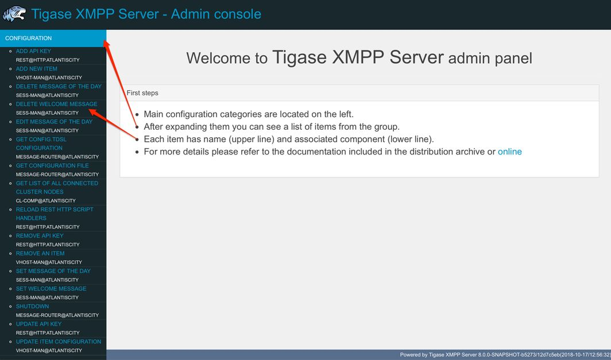
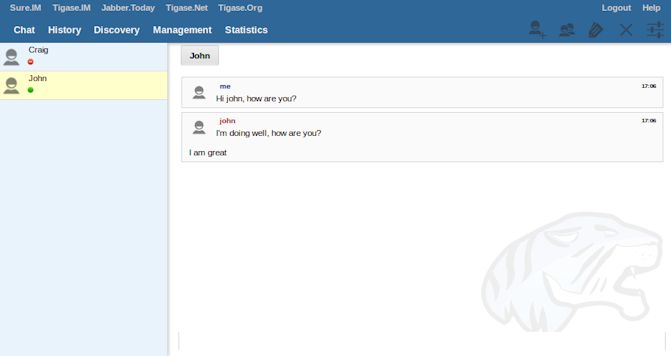
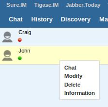

5. HTTP API component
======================

Tigase HTTP API component is a generic container used to provide other HTTP related features as modules. It is configured by default to run under name of http. Installations of Tigase XMPP Server run this component enabled by default under the same name even if not configured.

5.1. Tigase HTTP-API Release Notes
----------------------------------

Welcome to Tigase HTTP-API 2.2.0! This is a feature release for with a number of fixes and update

5.1.1. Tigase HTTP-API 2.2.0 Release Notes
^^^^^^^^^^^^^^^^^^^^^^^^^^^^^^^^^^^^^^^^^^^

Major Changes
~~~~~~~~~~~~~~

-  Enable HTTP File Upload by default with additional, optional, AWS S3 compatible backend

-  Improvements to Web Setup to make installation even more straightforward

-  Allow exposing ``.well-known`` in the root context to facilitate `XEP-0156: Discovering Alternative XMPP Connection Methods <https://xmpp.org/extensions/xep-0156.html>`__

-  Add option to redirect requests from http to https

All Changes
~~~~~~~~~~~~

-  `#http-65 <https://projects.tigase.net/issue/http-65>`__: More detailed logs

-  `#http-86 <https://projects.tigase.net/issue/http-86>`__: Add s3 backend for http-upload

-  `#http-91 <https://projects.tigase.net/issue/http-91>`__: Items in setup on Features screen are misaligned

-  `#http-93 <https://projects.tigase.net/issue/http-93>`__: Update web-installer documentation

-  `#http-95 <https://projects.tigase.net/issue/http-95>`__: Enable HTTP File Upload by default

-  `#http-96 <https://projects.tigase.net/issue/http-96>`__: Enabling cluster mode / ACS doesn’t add it to resulting configuration file

-  `#http-98 <https://projects.tigase.net/issue/http-98>`__: Setup tests are failing since Septempter

-  `#http-99 <https://projects.tigase.net/issue/http-99>`__: Enforce max-file-size limit

-  `#http-100 <https://projects.tigase.net/issue/http-100>`__: Prevent enabling all Message\* plugins

-  `#http-101 <https://projects.tigase.net/issue/http-101>`__: Prevent enabling all Mobile\* plugins

-  `#http-102 <https://projects.tigase.net/issue/http-102>`__: Last activity plugins handling should be improved

-  `#http-103 <https://projects.tigase.net/issue/http-103>`__: Enabling http-upload should give an info about requirement to set domain/store

-  `#http-105 <https://projects.tigase.net/issue/http-105>`__: Handle forbidden characters in filenames

-  `#http-106 <https://projects.tigase.net/issue/http-106>`__: Can’t remove user for non-existent VHost

-  `#http-107 <https://projects.tigase.net/issue/http-107>`__: Allow exposing ``.well-known`` in the root context

-  `#http-108 <https://projects.tigase.net/issue/http-108>`__: Add option to redirect requests from http to https

-  `#http-109 <https://projects.tigase.net/issue/http-109>`__: openAccess option is missing after migrating the component to TK

-  `#http-110 <https://projects.tigase.net/issue/http-110>`__: Add support for querying and managing uploaded files

-  `#http-111 <https://projects.tigase.net/issue/http-111>`__: DefaultLogic.removeExpired removal of slot failed

-  `#http-113 <https://projects.tigase.net/issue/http-113>`__: Add condition to redirect only if the X-Forwarded-Proto has certain value

-  `#http-114 <https://projects.tigase.net/issue/http-114>`__: TigaseDBException: Could not allocate slot

-  `#http-116 <https://projects.tigase.net/issue/http-116>`__: Limiting list of VHosts doesn’t work for JDK based http-server

-  `#http-117 <https://projects.tigase.net/issue/http-117>`__: Http redirection doesn’t work in docker

-  `#http-119 <https://projects.tigase.net/issue/http-119>`__: Can’t change VHost configuration via Admin WebUI

-  `#http-120 <https://projects.tigase.net/issue/http-120>`__: Improve S3 support for HTTP File Upload to accept custom URL and credentials for S3 storage configuration

-  `#http-121 <https://projects.tigase.net/issue/http-121>`__: Deprecate DnsWebService and rewrite /.well-known/host-meta generator

5.2. Available modules
-----------------------

5.2.1. Admin UI module
^^^^^^^^^^^^^^^^^^^^^^^

This is very simple module for administration of Tigase XMPP Server using HTTP browser. It allows administrators to execute ad-hoc commands from HTTP browser allowing to change some configuration options at runtime. It can be accessed by pointing your browser to http://server.address:8080/admin/ and logging in with admin credentials.

5.2.2. Index module
^^^^^^^^^^^^^^^^^^^

This module is deployed at ``/`` by default and provides list of installed and available modules for the virtual host when requested.

5.2.3. REST module
^^^^^^^^^^^^^^^^^^^

This module provides REST-like API for accessing Tigase XMPP Server. It uses Groovy scripts to process HTTP requests and prepare responses.

5.2.4. Server status module
^^^^^^^^^^^^^^^^^^^^^^^^^^^^

.. Warning::

    This module is still a work in progress!

This module is designed to present current server status and report possible issues.

5.2.5. Setup module
^^^^^^^^^^^^^^^^^^^

Module is created to act as a web based installer and configuration utility for Tigase XMPP Server. Allows you to modify basic Tigase XMPP Server settings, ie. related to database access. Changes may be saved to configuration file from this module.

5.2.6. Web UI module
^^^^^^^^^^^^^^^^^^^^^

This module contains full web client based on `Tigase JaXMPP <http://www.tigase.net/content/jaxmpp-library:>`__ client library allowing user to chat, manage contacts list (roster), browse message archive, etc. For more information on this module, consult the `Administration Guide <http://docs.tigase.org/tigase-server/snapshot/Administration_Guide/html/#_use_of_the_http_api>`__.

5.2.7. DNS Web Service module
^^^^^^^^^^^^^^^^^^^^^^^^^^^^^^

For web based XMPP clients it is not possible to execute DNS SRV requests to find address of XMPP server hosting for particular domain. To solve this the DNS Web Service module was created.

It handles incoming HTTP GET request and using ``Host`` HTTP header executes DNS requests as specified in `XEP-0156: Discovering Alternative XMPP Connection Methods <https://xmpp.org/extensions/xep-0156.html>`__. Results are returned in XML or JSON as specified in the XEP mentioned before.

By default it is deployed at ``dns-webservice`` and path for XML response is ``/dns-webservice/.well-known/host-meta`` and for JSON is ``/dns-webservice/-known/host-meta.json``.

5.2.8. User Status Endpoint module
^^^^^^^^^^^^^^^^^^^^^^^^^^^^^^^^^^^

This module is designed as an endpoint required for REST API User Status to work properly. It is not accessible using HTTP/REST API, so it can (and in most cases should) be active.

5.3. Common module configuration
--------------------------------

5.3.1. Enabling/disabling module
^^^^^^^^^^^^^^^^^^^^^^^^^^^^^^^^^

Every module can be activated or disabled by adjusting it’s activity in following way:

.. code:: DSL

   http {
       %module_id% (active: false) {}
   }

.. Note::

   You need to replace ``%module_id%`` with the id of module which you want to change activity (in this case, it will disable module).

**Disabling REST module.**

.. code:: DSL

   http {
       rest (active: false) {}
   }

5.3.2. Context path
^^^^^^^^^^^^^^^^^^^^

This property allows you to change the context path that is used by module. In other words, it allows you to change the prefix used by module. By default every module (with exception of the Index module) uses a context path that is the same as module id. For example, the REST module ID results in the context path ``/rest``

**Changing context path for REST module to ``/api``.**

.. code:: dsl

   http {
       rest {
           context-path = '/api'
       }
   }

5.3.3. List of virtual hosts
^^^^^^^^^^^^^^^^^^^^^^^^^^^^^^

This provides the ability to limit modules to be available only on listed virtual hosts, and allows to set context path to ``/`` for more than one module. Property accepts list of strings, which in the case of config.tdsl file format is list of comma separated domain names and in DSL it is written as list of strings (see `Complex Example <#complexExample>`__).

**Moving the REST module to be available only for requests directed to ``api.example.com``.**

.. code:: dsl

   http {
       rest {
           vhosts = [ 'api.example.com' ]
       }
   }

5.3.4. Complex example
^^^^^^^^^^^^^^^^^^^^^^^^

In this example we will disable the Index module and move REST module to ``http://api.example.com/`` and ``http://rest.example.com``.

.. code:: dsl

   http {
       index (active: false) {}
       rest {
           context-path = '/'
           vhosts = [ 'api.example.com', 'rest.example.com' ]
       }
   }

5.4. Module specific configuration
-----------------------------------

Tigase will try to start a standalone Jetty HTTP server at port 8080 and start up the default modules, including ``RestModule`` which will add context for REST API in the /rest path. ``RestModule`` will also load all groovy scripts located in ``scripts/rest/*`` directories and will bind them to proper actions for the ``/rest/*`` paths.

**NOTE:** Scripts that handle HTTP requests are available in the component repository in ``src/scriopts/groovy/tigase/rest/`` directory.

Tigase’s REST Component comes with two modules that can be enabled, disabled, and configured separately. Common settings for modules for component properties are used in the following format: ``component_name (module: value) {}`` the following settings are available for both listed modules:

-  ``active`` - Boolean values true/false to enable or disable the module.

-  ``context-path`` - Path of HTTP context under which the module should be available.

-  ``vhosts`` - Comma separated list of virtual hosts for which the module should be available. If not configured, the module will be available for all vhosts.

5.4.1. Rest Module
^^^^^^^^^^^^^^^^^^^

This is the Module that provides support for the REST API. Available properties:

-  ``rest-scripts-dir`` - Provides ability to specify path to scripts processing REST requests if you do not wish to use default (scripts/rest).

API keys
~~~~~~~~~

In previous version it was possible to configure ``api-keys`` for REST module using entries within configuration file. In the recent version we decided to remove this configuration option. Now, by default Tigase XMPP Server requires API key to be passed to all requests and you need to configure them before you will be able to use REST API.

Instead, you should use ad-hocs available on the REST module JID to:

-  Add API key (``api-key-add``)

-  Update API key (``api-key-update``)

-  Remove API key (``api-key-remove``);

.. Tip::

   If you have Admin UI enabled, you may log in using admin credentials to this UI and when you select ``CONFIGURATION`` section on the left sidebar, it will expand and allow you to execute any of those ad-hoc commands mentioned above.

Requests made to the HTTP service must conclude with one of the API keys defined using ad-hoc commands: ``http://localhost:8080/rest/adhoc/sess-man@domain.com?api-key=test1``

.. Note::

   If you want to allow access to REST API without usage of any keys, it is possible. To do so, you need to add an API key with ``API key`` field value equal ``open_access``.

.. Note::

   You can also completely disable api-keys by adding ``'open-access' = true`` to the TDSL configuration file, either in ``http`` bean or any of the modules of that bean, e.g. ``rest``, \`admin, etc

5.4.2. DNS Web Service module
^^^^^^^^^^^^^^^^^^^^^^^^^^^^^^

For web based XMPP clients it is not possible to execute DNS SRV requests to find address of XMPP server hosting for particular domain. To solve this the DNS Web Service module was created.

It handles incoming HTTP GET request and using passed ``domain`` and ``callback`` HTTP parameters executes DNS requests as specified in `XEP-0156: Discovering Alternative XMPP Connection Methods <https://xmpp.org/extensions/xep-0156.html>`__. Results are returned in JSON format for easy processing by web based XMPP client.

By default it is deployed at ``dns-webservice``

Parameters
~~~~~~~~~~~

**domain**
   Domain name to look for XMPP SRV client records.

**callback**
   Due to security reasons web based client may not be able to access some DNS Web Service due to cross-domain AJAX requests. Passing optional ``callback`` parameter sets name of callback for JSONP requests and results proper response in JSONP format.

Discover way to connect to XMPP server
~~~~~~~~~~~~~~~~~~~~~~~~~~~~~~~~~~~~~~~

Using ``host-meta``
''''''''''''''''''''

You should access endpoint available at ``/dns-webservice/.well-known/host-meta``.

To make it follow specification you should configure a redirection from the root path of your http server to above path. For example, using nginx:

::

   location  /.well-known/ {
       proxy_pass http://localhost:8080/dns-webservice/.well-known/;
       proxy_set_header Host $host;
   }

Query particular domain
''''''''''''''''''''''''''

If we want to know connectivity options for ``sure.im`` we should send HTTP GET request to ``http://our-xmpp-server:8080/dns-webservice/?domain=sure.im&version=2``. We will receive following response:

.. code:: java

   {
     domain: 'sure.im',
     c2s: [
       {
         host: 'tigase.me',
         ip: ['198.100.157.101','198.100.157.103','198.100.153.203'],
         port: 5222,
         priority: 5
       }
     ],
     bosh: [
       {url:'http://blue.sure.im:5280/bosh'},
       {url:'http://green.sure.im:5280/bosh'},
       {url:'http://orange.sure.im:5280/bosh'}
     ],
     websocket: [
       {url:'ws://blue.sure.im:5290/'},
       {url:'ws://green.sure.im:5290/'},
       {url:'ws://orange.sure.im:5290/'}
     ]
   }

As you can see in here we have names and IP address of XMPP servers hosting ``sure.im`` domain as well as list of URI for establishing connections using BOSH or WebSocket.

This module is activated by default. However, if you are operating in a test environment where you may not have SRV and A records setup to the domain you are using, you may want to disable this in your config.tdsl file with the following line:

.. code:: dsl

   rest {
       'dns-webservice' (active: false) {}
   }

5.4.3. Enabling password reset mechanism
^^^^^^^^^^^^^^^^^^^^^^^^^^^^^^^^^^^^^^^^^

It is possible to provide users with a mechanism for a password change in case if they forgot their password to the XMPP account. To do that you need to have ``tigase-extras.jar`` in your classpath (it is part of ``-dist-max`` distribution package), enable ``mailer`` and ``account-email-password-resetter``.

**Example configuration.**

.. code:: tdsl

   account-email-password-resetter () {}
   mailer (class: tigase.extras.mailer.Mailer) {
       'mailer-from-address' = 'email-address@to-send-emails-from'
       'mailer-smtp-host' = 'smtp.email.server.com'
       'mailer-smtp-password' = 'password-for-email-account'
       'mailer-smtp-port' = '587' # Email server SMTP port
       'mailer-smtp-username' = 'username-for-email-account'
   }

.. Note::

   You need to replace example configuration parameters with correct ones.

With this configuration in place and after restart of Tigase XMPP Server at url http://localhost:8080/rest/user/resetPassword will be available web form which may be used for password reset.

.. Note::

   This mechanism will only work if user provided real email address during account registration and if user still remembers and has access to email address used during registration.

5.5. Admin UI Guide
-------------------

The Admin User Interface is an HTTP-based interface that sends REST commands to the server to update configurations, change settings, and retrieve statistics.

5.5.1. A Note about REST
^^^^^^^^^^^^^^^^^^^^^^^^^

REST stands for REpresentational State Transfer which is a stateless communication method that in our case passes commands using HTTP GET, PUT, POST, and DELETE commands to resources within the Tigase server.

5.5.2. General overview of the UI
^^^^^^^^^^^^^^^^^^^^^^^^^^^^^^^^^^

After navigating to the Admin WebUI you will see basic information about navigation. The panel itself consists of two main parts: \* left navigation menu, which groups all configuration items into categories; \* central, main configuration page displaying configuration options of the selected items.

|adminUI main|

Each configuration item has name (upper line) and associated component (lower line) as some features can be executed in the context of different component (for example ``Update Item Configuration`` can be executed for VirtualHost Manager or ExternalConnection Manager)

5.5.3. Configuration
^^^^^^^^^^^^^^^^^^^^^

Allows you to configure some of the servers settings, such as message of the day, welcome message or initialize shutdown of the cluster node.

5.5.4. Example Scripts
^^^^^^^^^^^^^^^^^^^^^^

This is a list of script examples that can be run and do menial functions for each component. They may not have particular value themselves, but are present to be used as reference when writing custom scripts. Get list of available commands is one script, that is present for every component that is active on the server, and as its title implies, will provide a list of all commands for that component. Lastly, the two scripts from the `Scripting section <#scriptingSupport>`__ of this guide. Generally, there is not much needed to see in this section.

5.5.5. Notifications
^^^^^^^^^^^^^^^^^^^^^^

This section has one simple command: to be able to send a mass message to all logged in users. There are three types of messages that can be sent from this section: - **normal** Messages will show as a pop-up in most clients. - **headline** Certain clients will take headline messages and insert them into MUC or chats between users, otherwise it will create a pop-up like normal messages. - **chat** Chat messages will open up a chat dialog with users.

5.5.6. Other
^^^^^^^^^^^^^^^

This section contains a considerable list of options and settings affecting server functions.

Activate log tracker for a user
~~~~~~~~~~~~~~~~~~~~~~~~~~~~~~~~

This allows you to set a log file to track a specific user. Set the bare or full JID of the user you want to log, and a name of the files you wish the log to be written to. The files will be written in the root Tigase directory unless you give a directory like logs/filename. The log files will be named with a .0 extension and will be named .1, .2, .3 and so on as each file reaches 10MB by default. filename.0 will always be the most recent. Logging will start once the command has been issued, and cease once the server restarts.

Add SSL certificate
~~~~~~~~~~~~~~~~~~~~

Here you can add SSL certificates from PEM files to specific virtual hosts. Although Tigase can generate its own self-signed certificates, this will override any default certificates. The certificates cannot contain a passphrase, or be encrypted. Be sure that the contents contain both the certificate and private key data. You also have the option to save the certificate to disk, making the change permanent.

Add listener script
~~~~~~~~~~~~~~~~~~~

This section allows you to create a custom function for the eventbus component. These scripts can have the server conduct certain operations if set criteria are met. You may write the script in either Groovy or EMCAscript. Please see the `eventbus section <#eventbus>`__ for more details.

Add Monitor Task
~~~~~~~~~~~~~~~~~

You can write scripts for Groovy or ECMAScript to add to monitor tasks here. This only adds the script to available scripts however, you will need to run it from another prompt. Note that these scripts may only work with the monitor component.

Add Monitor Timer Task
~~~~~~~~~~~~~~~~~~~~~~~

This section allows you to add monitor scripts in Groovy while using a delay setting which will delay the start of the script.

Add New Item - ext
~~~~~~~~~~~~~~~~~~~

Depending on whether you have any external components loaded or not, this may show. This allows you to add additional external components to the running instance of Tigase.

Add New Item - Vhost
~~~~~~~~~~~~~~~~~~~~~

This allows you to add new virtual hosts to the XMPP server. A breakdown of the fields is as follows:

-  Domain name: the full domain name of the new vhost. Tigase will not add anything to this domain, so if it is ti be a subdomain of example.com, you will need to enter sub.domain.com.

-  Enabled: Whether the domain is turned on or off.

-  Anonymous enabled: Allow anonymous logins.

-  In-band registration: Whether or not to allow users to register accounts upon login.

-  TLS required: Require logins to the vhost to conduct a TLS handshake before opening streams.

-  S2S secret: a server-generated code to differentiate traffic between servers, typically there is no need to enter your own, but you may if you need to get into low level code.

-  Domain filter policy: Sets the filter policy for this domain, see `This section <#domainBasedPacketFiltering>`__ for a description of the rules.

-  Domain filter domains: a specific setting to restrict or control cross domain traffic.

-  Max users: maximum users allowed to be registered to the server.

-  Allowed C2S, BOSH, Websocket ports: Comma separated list of ports that this vhost will check for all of these services.

-  Presence forward address: specific address where presence information is forwarded too. This may be handy if you are looking to use a single domain for presence processing and handling.

-  Message forward address: Specific address where all messages will be sent too. This may be useful to you if you have a single server handling AMP or message storage and want to keep the load there.

-  Other Parameters: Other settings you may wish to pass to the server, consider this a section for options after a command.

-  Owner: The owner of the vhost who will also be considered an administrator.

-  Administrators: comma separated list of JIDs who will be considered admins for the vhost.

-  XEP-0136 Message Archiving Enabled: Whether to turn on or off this feature.

-  XEP-0136 Required store method: If XEP-0136 is turned on, you may restrict the portion of message that is saved. This is required for any archiving, if null, any portion of the message may be stored.

-  Client certificate required: Whether the client should submit a certificate to login.

-  Client certificate CA: The Certificate Authority of the client certificate.

-  XEP-0136 retention period: integer of number of days message archives will be set.

-  Trusted JIDs: Comma separated list of JIDs who will be added to the trusted list, these are JIDS that may conduct commands, edit settings, or other secure work without needed secure logins.

-  XEP-0136 retention type: Sets the type of data that retention period will use. May be User defined (custom number type), Unlimited, or Number of Days.

-  XEP-0136 - store MUC messages: Whether or not to store MUC messages for archiving. Default is user, which allows users to individually set this setting, otherwise true/false will override.

-  see-other-host redirection enabled: in servers that have multiple clusters, this feature will help to automatically repopulate the cluster list if one goes down, however if this is unchecked, that list will not change and may attempt to send traffic to a down server.

-  XEP-0136 Default store method: The default section of messages that will be stored in the archive.

Change user inter-domain communication permission
~~~~~~~~~~~~~~~~~~~~~~~~~~~~~~~~~~~~~~~~~~~~~~~~~~

Here you can restrict users to be able to communicate on specific domains, this works similar to the domain filtering policy using the same rule sets. For more details, see `Domain Based Packet Filtering <#domainBasedPacketFiltering>`__ section for rule details and specifics. Note that the changes may be made to multiple JIDs at the same time.

Connections Time
~~~~~~~~~~~~~~~~~

Lists the longest and average connection time from clients to servers.

Create Node
~~~~~~~~~~~~

This section allows you to create a new node for the pubsub component. Here is a breakdown of the fields:

-  The node to create: this is the name of the node that will be created.

-  Owner JID: user JID who will be considered the owner of the node.

-  pubsub#node type: sets the type of node the the new node will be. Options include:

   -  **leaf** Node that can publish and be published too.

   -  **collection** A collection of other nodes.

-  A friendly name for the node: Allows spaces and other characters to help differentiate it from other nodes.

-  Whether to deliver payloads with event notifications: as it says, to publish events or not.

-  Notify subscribers when the configuration changes: default is false

-  Persist items to storage: whether or not to physically store items in the node.

-  Max # of items to persist: Limit how many items are kept in the node archive.

-  The collection with which the node is affiliated: If the node is to be in a collection, place that node name here.

-  Specify the subscriber model: Choose what type of subscriber model will be used for this node. Options include:

   -  **authorize** - Requires all subscriptions to be approved by the node owner before items will be published to the user. Also only subscribers may retrieve items.

   -  **open** - All users may subscribe and retrieve items from the node.

   -  **presence** - Typically used in an instant message environment. Provides a system under which users who are subscribed to the owner JID’s presence with a from or both subscription may subscribe from and retrieve items from the node.

   -  **roster** - This is also used in an instant message environments, Users who are both subscribed to the owners presence AND is placed in specific allowed groups by the roster are able to subscribe to the node and retrieve items from it.

   -  **whitelist** - Only explicitly allowed JIDs are allowed to subscribe and retrieve items from the node, this list is set by the owner/administrator.

-  Specify the Publisher model: Choose what type of publisher model will be used for this node. Options include:

   -  **open** - Any user may publish to this node.

   -  **publishers** - Only users listed as publishers may be able to publish.

   -  **subscribers** - Only subscribers may publish to this node.

-  When to send the last published item: This allows you to decide if and when the last published item to the node may be sent to newly subscribed users.

   -  **never** - Do not send the last published item.

   -  **on_sub** - Send the last published item when a user subscribes to the node.

   -  **on_sub_and_presence** - Send the last published item to the user after a subscription is made, and the user is available.

-  The domains allowed to access this node: Comma separated list of domains for which users can access this node. By default is is blank, and there is no domain restriction.

-  Whether to deliver items to available users only: Items will only be published to users with available status if this is selected.

-  Whether to subscription expired when subscriber going offline: This will make all subscriptions to the node valid for a single session and will need to be re-subscribed upon reconnect.

-  The XSL transformation which can be applied to payloads in order to generate an appropriate message body element: Since you want a properly formatted <body> element, you can add an XSL transformation here to address any payloads or extra elements to be properly formatted here.

-  The URL of the XSL transformation which can be applied to payloads in order to generate an appropriate message body element: This would be the URL of the XSL Transform, e.g. http://www.w3.org/1999/XSL/Transform.

-  Roster groups allowed to subscribe: a list of groups for whom users will be able to subscribe. If this is blank, no user restriction will be imposed.

-  Notify subscribers when owner changes their subscription or affiliation state: This will have the node send a message in the case of an owner changing affiliation or subscription state.

-  Allows get list of subscribers for each subscriber: Allows subscribers to produce a list of other subscribers to the node.

-  Whether to sort collection items by creation date or update time: options include

   -  **byCreationDate** - Items will be sorted by the creation date, i.e. when the item was made.

   -  **byUpdateTime** - Items will be sorted by the last update time, i.e. when the item was last edited/published/etc..

DNS Query
~~~~~~~~~

A basic DNS Query form.

Default config - Pubsub
~~~~~~~~~~~~~~~~~~~~~~~~

Here you may set the default configuration for any new pubsub node. These changes will be made for all future nodes, but will not affect currently active nodes.

Default room config
~~~~~~~~~~~~~~~~~~~~

This page allows admins to set the default configuration for any new MUC rooms that may be made on the server.

Delete Monitor Task
~~~~~~~~~~~~~~~~~~~~~

This removes a monitor task from the list of available monitor scripts. This action is not permanent as it will revert to initial settings on server restart.

Delete Node
~~~~~~~~~~~~

Provides a space to remove a node from the server. It must be the full name of the node, and only one node can be removed at a time.

Deleting ALL Nodes
~~~~~~~~~~~~~~~~~~~~~

This page allows the logged in admin to delete all nodes from the associated vhost. This change is irreversible, be sure to read and check the box before submitting the command.

Fix User’s Roster
~~~~~~~~~~~~~~~~~~

You can fix a users roster from this prompt. Fill out the bare JID of the user and the names you wish to add or remove from the roster. This will NOT edit a user’s roster, but rather compare client roster to database and fix any errors between them.

Fix User’s Roster on Tigase Cluster
~~~~~~~~~~~~~~~~~~~~~~~~~~~~~~~~~~~~

This does the same as the Fix User’s Roster, but can apply to users who may not be logged into the local vhost, but are logged into a clustered server.

Get User Roster
~~~~~~~~~~~~~~~~~~

As the title implies this gets a users' roster and displays it on screen. You can use a bare or full JID to get specific rosters.

Get any file
~~~~~~~~~~~~~~~~~~

Enables you to see the contents of any file in the tigase directory. By default you are in the root directory, if you wish to go into directory use the following format: logs/tigase.log.0

Get Configuration File
~~~~~~~~~~~~~~~~~~~~~~~

If you don’t want to type in the location of a configuration file, you can use this prompt to bring up the contents of either tigase.conf or config.tdsl.

Get config.tdsl File
~~~~~~~~~~~~~~~~~~~~

Will output the current config.tdsl file, this includes any modifications made during the current server session.

Get list available commands
~~~~~~~~~~~~~~~~~~~~~~~~~~~~

This may be listed multiple times for different components, but this will do as the section suggest and list available commands for that particular component.

Load test
~~~~~~~~~~~

Here you can run a test with the pubsub component on any node to test functionality and proper settings for the node.

Load Errors
~~~~~~~~~~~~~

Will display any errors the server encounters in loading and running. Can be useful if you need to address any issues.

New command script
~~~~~~~~~~~~~~~~~~~

This space allows you to create a new command script that will work within the associated component. Note that under the hyperlinked title, there is a listing of muc.server.org or pubsub.server.org, use these to determine where the new command will operate.

OAuth Credentials
~~~~~~~~~~~~~~~~~

This allows the setting of new custom OAuth credentials for the server, and you can also require the use of OAuth tokens for users when they login. This is a setting for the specific host you are logged into. If you are logged into xmpp1.domain.com, it will not affect settings for xmpp2.domain.com.

Pre-Bind BOSH user session
~~~~~~~~~~~~~~~~~~~~~~~~~~~~~~~~~~

This allows a JID to be paired with a BOSH session before that user logs in, can reduce CPU use if you have a user that logs in via BOSH on a regular basis, or a web client that will regularly connect. You may also specify HOLD and WAIT integers to affect how BOSH operates with the associated JID.

Publish item to node
~~~~~~~~~~~~~~~~~~~~~

This window allows you to not only test, but publish an item to the specified node. All fields must be filled in in order to avoid the server dropping an improperly formatted stanza.

Read ALL nodes
~~~~~~~~~~~~~~~~~~~~~

This will load a tree of pubsub nodes in memory, it will not output anything as it is mainly for developer use.

Rebuild database
~~~~~~~~~~~~~~~~~~~~~

This will force Tigase to rebuild databases for the pubsub component, this may be useful for pubsub subscribers who continue to get pushed events after they unsubscribe.

Reload component repository
~~~~~~~~~~~~~~~~~~~~~~~~~~~~

This will reload any vhosts that the server is running. This may be useful if one is disconnected or broken during runtime.

Remove an item
~~~~~~~~~~~~~~~~~~~~~~~~~~~~

This will remove a running vhost from the server, you will be presented with a list to pick from.

Remove command script
~~~~~~~~~~~~~~~~~~~~~~~~~~~~

Like new command script, take a look at the subheading to determine which component you want to remove the script from. Once there, select the command you wish to remove from the server. If remove from disk is selected, then the change will be permanent. Otherwise, the command will be removed until the next server restart.

Remove listener script
~~~~~~~~~~~~~~~~~~~~~~~~~~~~

Select from a list the listener script you wish to remove. This will only affect custom listener scripts added to the eventbus component.

Remove room
~~~~~~~~~~~~~~~~~~~~~~~~~~~~

This provides fields to remove a room from the MUC component. you may suggest an alternative room which will move occupants to the alternative room once the current one is removed.

Retrieve items
~~~~~~~~~~~~~~~~~~~~~~~~~~~~

Here you can retrieve items from PubSub nodes, this simulates the get IQ stanza from the pubsub component. - Service name - The address of the pubsub component. - Node name - Item node to retrieve items from. - Item ID - The item ID of the item you wish to retrieve. - Items Since - UTC timestamp to start search from: YYYY-MM-DDTHH:MM:SSZ

S2S Bad State Connections
~~~~~~~~~~~~~~~~~~~~~~~~~~~~

This will list any connections to other servers that are considered bad or stale. This will populate very rarely as Tigase automatically adjusts around clustered servers that go down. In the event a connection stays bad, it is recommended to reset those connections in the next space.

S2S Reset Bad State Connections
~~~~~~~~~~~~~~~~~~~~~~~~~~~~~~~~

This will reset the connections with other servers that are considered bad and have shown up in the S2S Bad State Connections page.

S2S Get CID Connection State
~~~~~~~~~~~~~~~~~~~~~~~~~~~~~

For internal developer use only.

Subscribe to a node
~~~~~~~~~~~~~~~~~~~~~~~~~~~~

This provides a space for an administrator to manually have a JID subscribe to a particular node.

Unsubscribe from node
~~~~~~~~~~~~~~~~~~~~~~~~~~~~

Here you can unsubscribe users from a particular node. Users can be a comma separated list.

Update item configuration
~~~~~~~~~~~~~~~~~~~~~~~~~~~~

Typically you will see only one item for vhost-man, but some additional components (ie. ext) may provided them as well. They each have their own sections, but provide for a plethora of server options. Changes to the server are done in real time, and may not be permanent.

vhost-man
~~~~~~~~~

You will be presented with a list of domains that Tigase is currently hosting, you will be able to change settings for one domain at a time using this function. Once a domain is selected, you will be able to set or change the following settings:

-  Domain name: the full domain name of the new vhost. Tigase will not add anything to this domain, so if it is ti be a subdomain of example.com, you will need to enter sub.domain.com.

-  Enabled: Whether the domain is turned on or off.

-  Anonymous enabled: Allow anonymous logins.

-  In-band registration: Whether or not to allow users to register accounts upon login.

-  TLS required: Require logins to the vhost to conduct a TLS handshake before opening streams.

-  S2S secret: a server-generated code to differentiate traffic between servers, typically there is no need to enter your own, but you may if you need to get into low level code.

-  Domain filter policy: Sets the filter policy for this domain, see `This section <#domainBasedPacketFiltering>`__ for a description of the rules.

-  Domain filter domains: a specific setting to restrict or control cross domain traffic.

-  Max users: maximum users allowed to be registered to the server.

-  Allowed C2S, BOSH, Websocket ports: Comma separated list of ports that this vhost will check for all of these services.

-  Presence forward address: specific address where presence information is forwarded too. This may be handy if you are looking to use a single domain for presence processing and handling.

-  Message forward address: Specific address where all messages will be sent too. This may be useful to you if you have a single server handling AMP or message storage and want to keep the load there.

-  Other Parameters: Other settings you may wish to pass to the server, consider this a section for options after a command.

-  Owner: The owner of the vhost who will also be considered an administrator.

-  Administrators: comma separated list of JIDs who will be considered admins for the vhost.

-  XEP-0136 Message Archiving Enabled: Whether to turn on or off this feature.

-  XEP-0136 Required store method: If XEP-0136 is turned on, you may restrict the portion of message that is saved. This is required for any archiving, if null, any portion of the message may be stored.

-  Client certificate required: Whether the client should submit a certificate to login.

-  Client certificate CA: Client Certificate Authority.

-  XEP-0136 retention period: Integer of number of days message archives will be set.

-  Trusted JIDs: Comma separated list of JIDs who will be added to the trusted list, these are JIDS that may conduct commands, edit settings, or other secure work without needed secure logins.

-  XEP-0136 retention type: Sets the type of data that retention period will use. May be User defined (custom number type), Unlimited, or Number of Days.

-  XEP-0136 - store MUC messages: Whether or not to store MUC messages for archiving. Default is user, which allows users to individually set this setting, otherwise true/false will override.

-  see-other-host redirection enabled: in servers that have multiple clusters, this feature will help to automatically repopulate the cluster list if one goes down, however if this is unchecked, that list will not change and may attempt to send traffic to a down server.

-  XEP-0136 Default store method: The default section of messages that will be stored in the archive.

Update user roster entry
~~~~~~~~~~~~~~~~~~~~~~~~~~~~

This section allows admins to edit individual users rosters, although it provides similar functionality to fix users roster, this is designed for precision editing of a user roster.

-  Roster owner JID: The BareJID of the user roster you wish to edit.

-  JID to manipulate: The specific BareJID you want to add/remove/change.

-  Comma separated groups: Groups you wish to add the JID too.

-  Operation Type: What function will be performed?

   -  **Add** - Add the JID to manipulate to the owner JID’s roster and groups.

   -  **Remove** - Remove the JID to manipulate from the owner JID’s roster and groups.

-  Subscription type: The type of subscription stanza that will be sent to the server, and subsequently between the two users will be employed.

   -  **None** - Select this if neither the owner or the user to be manipulated wishes to receive presence information.

   -  **From** - The Roster Owner will not receive presence information from the JID to manipulate, but the opposite will be true.

   -  **To** - The JID to manipulate will not receive presence information from the Roster Owner, but the opposite will be true.

   -  **Both** - Both JIDs will receive presence information about each other.

Update user roster entry extended version
~~~~~~~~~~~~~~~~~~~~~~~~~~~~~~~~~~~~~~~~~~~

This section is an expanded version of the previous one, all fields already specified are the same with these additions:

-  Roster owner name: A friendly name or nickname if you wish to change/create one. **not required**

-  Comma separated of owner groups: Groups that the user wants to join/leave. **not required**

-  Roster item JID: The specific JID that needs to be edited.

-  Roster item name: A friendly name or nickname that will be changed/created. **not required**

-  Comma separated list of item groups: A group or list of groups that the roster item JID will be added to/removed from.

-  Action:

   -  **Add/update item** - Will add or update the item JID in the roster owner’s roster.

   -  **Remove item** - Will remove the item JID from the roster owner’s roster.

   -  **Add/update both rosters** - Will add or update the item in both roster owner and roster item’s roster.

   -  **Remove from both rosters** - Will remove the item from both roster owner and roster item’s roster.

5.5.7. Scripts
^^^^^^^^^^^^^^^

This section will enable administrators to custom write or enter their own scripts for specific components. Each active component will have an entry for new and remove command scripts and scripts written there will be for that component.

New Command Script
~~~~~~~~~~~~~~~~~~~~~~~~~~~~

-  Description: A friendly name of the script, will be the title of the link in the menu on the left.

-  Command ID: Internal command that Tigase will use when referencing this script.

-  Group: The group for the script, which may be any of the headings on the left (Configuration, Example scripts, Notifications, Other etc..) or your own. If no group exists, a new one will be created.

-  Language: The language the script is written in. Currently Tigase supports Groovy and EMCAScript.

-  Script text: the fulltext of the script.

-  Save to disk: Scripts that are saved to disk will be permanently stored in the server’s directory /scripts/admin/[Component]/commandID.js **NOTE** Scripts that are NOT saved to disk will not survive a server restart.

Remove Command Script
~~~~~~~~~~~~~~~~~~~~~~~~~~~~

As with New Command Script, there is an entry for each component. This page will provide a space to remove commands for the selected component. You will be provided a list of scripts associated with that component. You also have the open to remove from disk, which will permanently delete the script from the hard drive the server is on. If this is unchecked, the script will be unavailable until the next restart.

5.5.8. Statistics
^^^^^^^^^^^^^^^^^^^^

This section is more useful to test statistics scripts and components, as many of them produce very small amounts of information, however these may be collected by other components or scripts for a better information display.

Get User Statistics
~~~~~~~~~~~~~~~~~~~~~~~~~~~~

Provides a script output of user statistics including how many active sessions are in use, number of packets used, specific connections and their packet usage and location. All resources will return individual stats along with IP addresses.

Get Active User List
~~~~~~~~~~~~~~~~~~~~~~~~~~~~

Provides a list of active users under the selected domain within the server. An active user is considered a user currently logged into the XMPP server.

Get list of idle users
~~~~~~~~~~~~~~~~~~~~~~~~~~~~

Provides a list of users who are idle on the server.

Get list of online users
~~~~~~~~~~~~~~~~~~~~~~~~~~~~

Provides a list of users who are currently online.

Get number of active users
~~~~~~~~~~~~~~~~~~~~~~~~~~~~

Provides a list of active users, users who are not idle or away.

Get number of idle users
~~~~~~~~~~~~~~~~~~~~~~~~~~~~

Provides a number of idle users.

Get top active users
~~~~~~~~~~~~~~~~~~~~~~~~~~~~

Will produce a list of user-limited users who are considered most active in packets sent.

5.5.9. Users
^^^^^^^^^^^^^

Add User
~~~~~~~~~

Here you can add new users to any domain handled by vHosts, users are added to database immediately and are able to login. **NOTE: You cannot bestow admin status to these users in this section.**

Change User Password
~~~~~~~~~~~~~~~~~~~~~

This enables you to change the password of any user in the database. Although changes will take effect immediately, users currently logged in will not know the password has been changed until they try to log in again.

Delete User
~~~~~~~~~~~~~~~~~~~~~

This removes the user or users (comma separated) from the database. The deleted users will be kicked from the server once submit is clicked.

End user session
~~~~~~~~~~~~~~~~~~~~~

Disconnects the current selected user by ending their session with the server.

Get User Info
~~~~~~~~~~~~~~~~~~~~~

This section allows admins to get information about a specific user including current connections as well as offline and online messages awaiting delivery.

Get registered user list
~~~~~~~~~~~~~~~~~~~~~~~~~

This will display all registered users for the selected domain up to the number specified.

Modify User
~~~~~~~~~~~~~~~~~~~~~

Allows you to modify some user details including E-mail and whether it is an active user.

5.6. Tigase Web Client
----------------------

Tigase now has a fully featured XMPP client built right into the HTTP interface. Everything you would expect from an XMPP client can now be done from the comfort of your browser window with no software install required!

The web client is active and available by default on servers v7.2.0 and later.

To access the client, point a browser to the following address: xmpp.your-server.net:8080/ui/

It will ask you for a login, any bare JID of users registered with the server will work. **NOTE: Use your bare JID for login**

Once you have logged in successfully, you will be presented with the following screen.

|WebUI Home|

The commands are broken into categories shown here. All changes made in these sections are instant and should be seen the same as if you were using an external XMPP client like Psi.

**NOTE** The BOSH client will automatically translate all requests to the server name. In some rare cases this may not be resolvable by the browser and you will be unable to login. Should that happen, you may disable that feature using the following line in your config.tdsl:

.. code:: dsl

   bosh {
       'send-node-hostname' = false
   }

You may have to specifically designate the bosh URL when using the advanced tag in the login screen.

5.6.1. Chat
^^^^^^^^^^^

This is the default window, and your main interface for chatting inside XMPP with this server. **NOTE: you can only communicate to users logged onto the current server, or connected clusters** Users from your roster will be on the left panel, the right all active discussions and MUCs, as well as the currently selected chat will be available.

|WebUI Chat|

Users that are logged in and on your roster will be displayed on the left side. Double-clicking will bring up a new chat window with the user. You can Right-click on them to bring up a sub menu with the following;

|WebUI Usersubmenu|

-  **Chat** replicates a double-click and opens a new window for chat.

-  **Modify** brings up a dialogue that allows you to change the JID of the contact, a nickname, and group.

-  **Delete** removes the user from your roster. This will also remove subscription authorization for the selected user to receive presence information effectively removing you from their roster. **NOTE: this will not block user packets from your JID**

-  **Info** brings up the User Info (this is the disco#info command for the selected user)

The top right section has a few icons with specific functionality, they are;

|WebUI Chat Add New| adds a new user to your roster.

|WebUI Chat NewMUC| creates a new Multi-user chatroom.

|WebUI Chat Profile| allows you to edit your user information such as picture and nickname.

|WebUI Chat CloseWindow| closes the active chat window.

|WebUI Chat settings| provides a place to change your password or publish changes to your user info. **NOTE: you are limited to changing the General fields**

5.6.2. Discovery
^^^^^^^^^^^^^^^^^

This is your service discovery panel, which breaks down by component in the sidebar. Each component name and its associated JID is listed to help you find what you need. Most components give you an option to Execute commands with a few exceptions allowing browsing and the ability to join a MUC.

**Browse** allows you to dig deeper into certain components; for example list the chatrooms available in the MUC component. At the top of the page the specific JID of the component are you in will be displayed. This is a text field, and can be edited to reflect the JID of the component (or just the server name) to navigate.

|WebUI Browse Comp|

**Join to Room** will join you to a MUC room that is selected. Alternatively, selecting Join to Room while MUC component is selected, you can join and start a new MUC room.

**Execute Command** Provides a hierarchy of commands and options to view and edit settings, run commands and scripts, view contents of files, and see statistics. Since each Component can have a unique structure it is best to explore each to see what options are available.

5.6.3. Management
^^^^^^^^^^^^^^^^^^

This is an advanced window for settings and management for the XMPP server.

Configuration
~~~~~~~~~~~~~~

Here you can manage some of the server settings.

Notifications
~~~~~~~~~~~~~~

This section has one simple command: to be able to send a mass message to all logged in users. You may choose to change the type of message to headline or Normal which will show as a pop-up in most XMPP clients. Chat messages will open up a chat dialog with users.

Other
~~~~~

This section contains a considerable list of options and settings affecting server functions.

Activate log tracker for a user
~~~~~~~~~~~~~~~~~~~~~~~~~~~~~~~~

This allows you to set a log file to track a specific user. Set the bare or full JID of the user you want to log, and a name of the files you wish the log to be written to. The files will be written in the root Tigase directory unless you give a directory like logs/filename. The log files will be named with a .0 extension and will be named .1, .2, .3 and so on as each file reaches 10MB by default. filename.0 will always be the most recent. Logging will cease once the server restarts.

Add SSL certificate
~~~~~~~~~~~~~~~~~~~~

Here you can add SSL certificates from PEM files to specific virtual hosts. Although Tigase can generate its own self-signed certificates, this will override those default certificates.

Add Monitor Task
~~~~~~~~~~~~~~~~~

You can write scripts for Groovy or ECMAScript to add to monitor tasks here. This only adds the script to available scripts however, you will need to run it from another prompt.

Add Monitor Timer Task
~~~~~~~~~~~~~~~~~~~~~~~

This section allows you to add monitor scripts in Groovy while using a delay setting which will delay the start of the script.

Add New Item - ext
~~~~~~~~~~~~~~~~~~~

Provides a method to add external components to the server. By default you are considered the owner, and the Tigase load balancer is automatically filled in.

Add New Item - Vhost
~~~~~~~~~~~~~~~~~~~~~

This allows you to add new virtual hosts to the XMPP server. A breakdown of the fields is as follows:

-  Domain name: the full domain name of the new vhost. Tigase will not add anything to this domain, so if it is ti be a subdomain of example.com, you will need to enter sub.domain.com.

-  Enabled: Whether the domain is turned on or off.

-  Anonymous enabled: Allow anonymous logins.

-  In-band registration: Whether or not to allow users to register accounts upon login.

-  TLS required: Require logins to the vhost to conduct a TLS handshake before opening streams.

-  S2S secret: a server-generated code to differentiate traffic between servers, typically there is no need to enter your own, but you may if you need to get into low level code.

-  Domain filter policy: Sets the filter policy for this domain, see `This section <#domainBasedPacketFiltering>`__ for a description of the rules.

-  Domain filter domains: a specific setting to restrict or control cross domain traffic.

-  Max users: maximum users allowed to be registered to the server.

-  Allowed C2S, BOSH, Websocket ports: Comma separated list of ports that this vhost will check for all of these services.

-  Presence forward address: specific address where presence information is forwarded too. This may be handy if you are looking to use a single domain for presence processing and handling.

-  Message forward address: Specific address where all messages will be sent too. This may be useful to you if you have a single server handling AMP or message storage and want to keep the load there.

-  Other Parameters: Other settings you may wish to pass to the server, consider this a section for options after a command.

-  Owner: The owner of the vhost who will also be considered an administrator.

-  Administrators: comma separated list of JIDs who will be considered admins for the vhost.

-  XEP-0136 Message Archiving Enabled: Whether to turn on or off this feature.

-  XEP-0136 Required store method: If XEP-0136 is turned on, you may restrict the portion of message that is saved. This is required for any archiving, if null, any portion of the message may be stored.

-  Client certificate required: Whether the client should submit a certificate to login.

-  Client certificate CA: The Certificate Authority of the client certificate.

-  XEP-0136 retention period: integer of number of days message archives will be set.

-  Trusted JIDs: Comma separated list of JIDs who will be added to the trusted list, these are JIDS that may conduct commands, edit settings, or other secure work without needed secure logins.

-  XEP-0136 retention type: Sets the type of data that retention period will use. May be User defined (custom number type), Unlimited, or Number of Days.

-  XEP-0136 - store MUC messages: Whether or not to store MUC messages for archiving. Default is user, which allows users to individually set this setting, otherwise tue/false will override.

-  see-other-host redirection enabled: in servers that have multiple clusters, this feature will help to automatically repopulate the cluster list if one goes down, however if this is unchecked, that list will not change and may attempt to send traffic to a down server.

-  XEP-0136 Default store method: The default section of messages that will be stored in the archive.

Change user inter-domain communication permission
~~~~~~~~~~~~~~~~~~~~~~~~~~~~~~~~~~~~~~~~~~~~~~~~~~

You can restrict users to only be able to send and receive packets to and from certain virtual hosts. This may be helpful if you want to lock users to a specific domain, or prevent them from getting information from a statistics component.

Connections Time
~~~~~~~~~~~~~~~~~

Lists the longest and average connection time from clients to servers.

DNS Query
~~~~~~~~~~

A basic DNS Query form.

Default config - Pubsub
~~~~~~~~~~~~~~~~~~~~~~~~

This section enables you to change the default pubsub node configuration for all future nodes. **Note: these changes will be reset on server restart.** - pubsub#node type: sets the type of node the the new node will be. Options include:

-  **leaf** Node that can publish and be published too.

-  **collection** A collection of other nodes.

   -  A friendly name for the node: Allows spaces and other characters to help differentiate it from other nodes.

   -  Whether to deliver payloads with event notifications: as it says, to publish events or not.

   -  Notify subscribers when the configuration changes: default is false

   -  Persist items to storage: whether or not to physically store items in the node.

   -  Max # of items to persist: Limit how many items are kept in the node archive.

   -  The collection with which the node is affiliated: If the node is to be in a collection, place that node name here.

   -  Specify the subscriber model: Choose what type of subscriber model will be used for this node. Options include:

-  **authorize** - Requires all subscriptions to be approved by the node owner before items will be published to the user. Also only subscribers may retrieve items.

-  **open** - All users may subscribe and retrieve items from the node.

-  **presence** - Typically used in an instant message environment. Provides a system under which users who are subscribed to the owner JID’s presence with a from or both subscription may subscribe from and retrieve items from the node.

-  **roster** - This is also used in an instant message environments, Users who are both subscribed to the owners presence AND is placed in specific allowed groups by the roster are able to subscribe to the node and retrieve items from it.

-  **whitelist** - Only explicitly allowed JIDs are allowed to subscribe and retrieve items from the node, this list is set by the owner/administrator.

   -  Specify the Publisher model: Choose what type of publisher model will be used for this node. Options include:

-  **open** - Any user may publish to this node.

-  **publishers** - Only users listed as publishers may be able to publish.

-  **subscribers** - Only subscribers may publish to this node.

   -  When to send the last published item: This allows you to decide if and when the last published item to the node may be sent to newly subscribed users.

-  **never** - Do not send the last published item.

-  **on_sub** - Send the last published item when a user subscribes to the node.

-  **on_sub_and_presence** - Send the last published item to the user after a subscription is made, and the user is available.

   -  The domains allowed to access this node: Comma separated list of domains for which users can access this node. If left blank there is no domain restriction.

   -  Whether to deliver items to available users only: Items will only be published to users with available status if this is selected.

   -  Whether to subscription expired when subscriber going offline: This will make all subscriptions to the node valid for a single session and will need to be re-subscribed upon reconnect.

   -  The XSL transformation which can be applied to payloads in order to generate an appropriate message body element: Since you want a properly formatted <body> element, you can add an XSL transformation here to address any payloads or extra elements to be properly formatted here.

   -  The URL of the XSL transformation which can be applied to payloads in order to generate an appropriate message body element: This would be the URL of the XSL Transform, e.g. http://www.w3.org/1999/XSL/Transform.

   -  Roster groups allowed to subscribe: a list of groups for whom users will be able to subscribe. If this is blank, no user restriction will be imposed.

   -  Notify subscribers when owner changes their subscription or affiliation state: This will have the node send a message in the case of an owner changing affiliation or subscription state.

   -  Allows get list of subscribers for each subscriber: Allows subscribers to produce a list of other subscribers to the node.

   -  Whether to sort collection items by creation date or update time: options include

-  **byCreationDate** - Items will be sorted by the creation date, i.e. when the item was made.

-  **byUpdateTime** - Items will be sorted by the last update time, i.e. when the item was last edited/published/etc..

Default room config
~~~~~~~~~~~~~~~~~~~~~

Allows you to set the default configuration for new MUC rooms. This will not be able to modify current in use and persistent rooms.

Delete Monitor Task
~~~~~~~~~~~~~~~~~~~~

This removes a monitor task from the list of available monitor scripts. This action is not permanent as it will revert to initial settings on server restart.

Fix User’s Roster
~~~~~~~~~~~~~~~~~

You can fix a users roster from this prompt. Fill out the bare JID of the user and the names you wish to add or remove from the roster. You can edit a users roster using this tool, and changes are permanent.

Fix User’s Roster on Tigase Cluster
~~~~~~~~~~~~~~~~~~~~~~~~~~~~~~~~~~~~

This does the same as the Fix User’s Roster, but can apply to users in clustered servers.

Get User Roster
~~~~~~~~~~~~~~~

As the title implies this gets a users' roster and displays it on screen. You can use a bare or full JID to get specific rosters.

Get any file
~~~~~~~~~~~~

Enables you to see the contents of any file in the tigase directory. By default you are in the root directory, if you wish to go into directory use the following format: logs/tigase.log.0

Get Configuration File
~~~~~~~~~~~~~~~~~~~~~~~~

If you don’t want to type in the location of a configuration file, you can use this prompt to bring up the contents of either tigase.conf or config.tdsl.

Get config.tdsl File
~~~~~~~~~~~~~~~~~~~~~~~~

Will output the current config.tdsl file, this includes any modifications made during the current server session.

Load Errors
~~~~~~~~~~~~~~~

Will display any errors the server encounters in loading and running. Can be useful if you need to address any issues.

New command script - Monitor
~~~~~~~~~~~~~~~~~~~~~~~~~~~~~

Allows you to write command scripts in Groovy and store them physically so they can be saved past server restart and run at any time. Scripts written here will only be able to work on the Monitor component.

New command script - MUC
~~~~~~~~~~~~~~~~~~~~~~~~

Allows you to write command scripts in Groovy and store them physically so they can be saved past server restart and run at any time. Scripts written here will only be able to work on the MUC component.

OAUth credentials
~~~~~~~~~~~~~~~~~~~

Uses OAuth to set new credentials and enable or disable a registration requirement with a signed form.

Pre-Bind BOSH user session
~~~~~~~~~~~~~~~~~~~~~~~~~~~

Allows admins to pre-bind a BOSH session with a full or bare JID (with the resource automatically populated on connection). You may also specify HOLD or WAIT parameters.

Reload component repository
~~~~~~~~~~~~~~~~~~~~~~~~~~~~

This will show if you have any external components and will reload them in case of any stuck threads.

Scripts
~~~~~~~~

This section provides a list of command scripts for all active components. Each component has the following options - **New command script** provides a method to author new command scripts for specific components written in EMCAScript or Groovy. You do have an option to save the script to disk which will make the script permanent within the server. - **Remove command script** allows you to remove the selected script from the repository. If Remove from disk is not checked, the script will be unavailable until server restart. If it is, it will be permanently removed from the server.

Newly made commands will be listed under the Group listing in the left column.

Statistics
~~~~~~~~~~~

These statistics might be more useful as script results yield small bits of data, but you may find them useful when looking for server loads or finding user issues.

Get User Statistics
~~~~~~~~~~~~~~~~~~~

Provides a script output of user statistics including how many active sessions are in use, number of packets used, specific connections and their packet usage and location. All resources will return individual stats along with IP addresses.

Get Active User List
~~~~~~~~~~~~~~~~~~~~

Provides a list of active users under the selected domain within the server. An active user is considered a user currently logged into the XMPP server.

Get list of idle users
~~~~~~~~~~~~~~~~~~~~~~

This will list all idle users separated by vhost.

Get list of online users
~~~~~~~~~~~~~~~~~~~~~~~~

This will list users separated by the vhost they are connected to. The list will include the bare JID as well as any resources for that JID.

Get number of active users
~~~~~~~~~~~~~~~~~~~~~~~~~~

This displays the number of current active users.

Get number of idle users
~~~~~~~~~~~~~~~~~~~~~~~~

This section returns the number of active users per specific vhost.

Get top active users

This will list the top number of active users by packets sent and online time. This list will only be built with users currently online and from all vhosts.

Users
~~~~~

Add New User
'''''''''''''

Here you can add new users to any domain handled by vHosts, users are added to database immediately and are able to login. **NOTE: You cannot bestow admin status to these users in this section.**

Change user password
'''''''''''''''''''''

Allows for admins to change the password of a specific user without needing to know the original password for the selected bare JID. Users currently logged in will not know password has been changed until they attempt to re-login.

Delete user
''''''''''''

Provides a text window for admins to input the bare JID of the user they wish to remove from the server.

Get User Info
'''''''''''''

This section allows admins to get information about a specific user including current connections as well as offline and online messages awaiting delivery.

Get registered user list
'''''''''''''''''''''''''

Provides a list of vhosts to search and a maximum number of users to list. Once run, the script will display a list of registered bare JIDs of users from the selected vhost.

Modify User
''''''''''''

Allows you to modify some user details including E-mail and whether it is an active user.

.. |WebUI Home| image:: images/web/WebUI-Home.jpg

.. |WebUI Browse Comp| image:: images/web/WebUI-Browse-Comp.jpg

