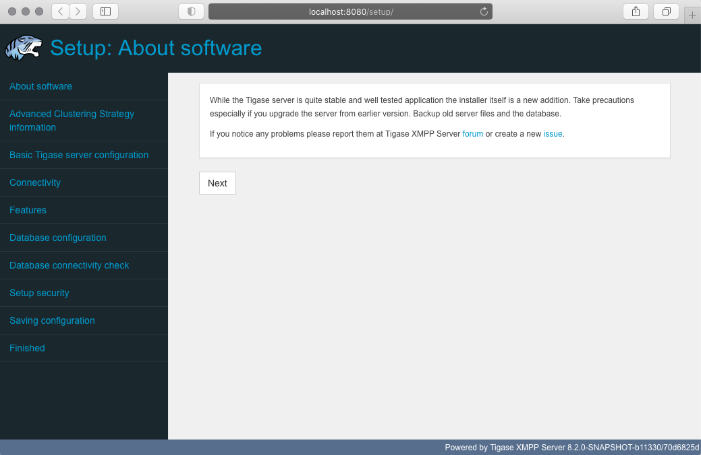
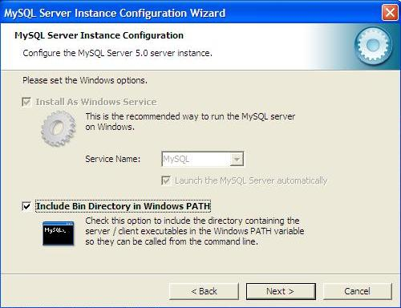

Quick Start Guide
===================

Minimum Requirements
-----------------------

Before you begin installing Tigase server onto your system, please make sure the minimum requirements are met first:

-  **Java Development Kit (JDK) 11 (LTS)** - We recommend OpenJDK

-  **Administrator access** - We recommend that you install Tigase Server from a user login with administrator access.

..

.. Important::

   You should always run the latest point/bugfix release of the recommended JDK.

.. Note::

   While it should be possible to use newer versions of the JDK, we don’t guarantee it and we recommend using the one mentioned above.

Contents
----------

This is a set of documents allowing you to quickly start with our software. Every document provides an introduction to a single topic allowing you to start using/developing or just working on the subject. Please have a look at the documents list below to find a topic you are looking for. If you don’t find a document for the topic you need please `let us know <http://www.tigase.net/contact>`__.

-  `Installation Using Web Installer <#webinstall>`__

-  `Manual installation in console mode <#manualinstall>`__

-  `Installing Tigase on Windows <#windowsInstallation>`__

-  `Network settings for Tigase <#setupTigaseServer>`__

-  `Running Tigase XMPP Server as a service <#tigaseScriptStart>`__

.. _webinstall:

Installation Using Web Installer
-----------------------------------

When Tigase XMPP Server starts up, it looks for the default configuration file: ``etc/config.tdsl``. If this file has not been modified you can run the web installer. Which will step you through the process of configuring Tigase. If you are installing Tigase in a Windows environment, please see the `Windows Installation <#winWebInstall>`__ section.

Download and Extract
^^^^^^^^^^^^^^^^^^^^^^^^

First download Tigase XMPP Server and extract it. You can download the `official binaries <https://tigase.net/downloads>`__, or the latest and greatest `nightly builds <https://build.tigase.net/nightlies/dists/>`__. Once you have the distribution binary extract it and navigate to the directory:

.. code:: bash

   $ tar -xf tigase-server-<version>-dist-max.tar.gz
   $ cd tigase-server-<version>

.. Tip::

   Do not run as root user!

Start the Server
^^^^^^^^^^^^^^^^

.. Note::

   Please make sure ``JAVA_HOME`` is set and points to your JVM installation

.. code:: bash

   scripts/tigase.sh start etc/tigase.conf

Verify Tigase is ready to start installation
^^^^^^^^^^^^^^^^^^^^^^^^^^^^^^^^^^^^^^^^^^^^^^^

Tigase should start listening on port 8080 - you can check it using ``lsof`` command:

.. code:: bash

   $ lsof -i -P
   COMMAND   PID   USER   FD   TYPE   DEVICE SIZE/OFF NODE NAME
   java    18387 tigase  141u  IPv6 22185825      0t0  TCP *:8080 (LISTEN)

You can also check console log under ``logs/tigase-console.log``, which should point you directly to the installer.

Connect to the Web Installer
^^^^^^^^^^^^^^^^^^^^^^^^^^^^^^

Some points before you can connect:

This setup page is restricted access, however for first setup there is a default account set to setup Tigase: Username: ``admin`` Password: ``tigase``

This combination will only be valid once as it will be removed from ``config.tdsl`` file on completion of setup process. After this point the setup page will only be accessible using the following:

1. JID accounts listed as administrators in admins line in ``config.tdsl`` file.

2. Username and password combinations added to ``config.tdsl`` file manually, or at the last page in this process.

Point your browser to http://localhost:8080/setup/ unless you are working remotely. You can also use the domain name, or IP address.

Enter the username and password above to gain access.

Step Through the Installation Process
^^^^^^^^^^^^^^^^^^^^^^^^^^^^^^^^^^^^^^^

You will be greeted by the following "About software" page.

|web install 01|

Read it and then click "Next"

The setup consists of several steps that help you configure your installation: selecting features and providing database configuration.

.. Note::

   Order and design of the steps may slightly differ thus we only provide a broad overview of how to proceed:

1. **Advanced Clustering Strategy information**

   You will see some information about our commercial products and licensing. Please read though the agreement, and as a confirmation of agreement type in your name or company and click "Next" to go to the next page.

2. **Basic Tigase server configuration**

   This page will look over your basic configuration settings, those include the server type, domain you wish to use, and gives you a chance to specify an administrator for the domain. Also, you will be selecting what type of database Tigase server will be using (configuration comes later).

   If you do not specify an administrator and password, one is made for you, which will be admin@yourdomain and password is tigase.

3. **Connectivity**

   At this page you will be presented with a list of possible connectivity options supported by Tigase XMPP Server and a way to enable/disable each of them (desktop, mobile, http, websocket, federation, etc.). After making this decisions, click "Next".

4. **Features**

   Now you will be able to select which features of Tigase XMPP Server (such as MUC, PubSub, MIX, MAM, Push Notifications) should be enabled or disabled.

   At this step will also be able to enable clustering on your installation

   When you will be ready, click "Next".

5. **Database configuration**

   This is where the database is configured. The type of database selected in step 3 will influence available options. **BE SURE TO SPECIFY DATABASE ROOT USER ACCOUNT AND PASSWORD**

6. **Database connectivity check**

   After database setup, you should see a page with executed actions and their results. All presented items should be "green", meaning that everything went well. If anything is presented in "red" or "yellow", please read description presented below this header to learn more about this issue. If setup is completed, click "Next".

7. **Setup security**

   The Setup Access Page will be locked from the admin/tigase user as specified above. This is your chance to have the setup pages add a specific user in addition to admin accounts to re-access this setup process later. If left blank, only JIDs listed in admin will be allowed to access.

8. **Saving configuration**

   The installation is almost complete and you will be presented with a page showing what the resulting configuration (stored in ``config.tdsl`` file) will look like.

   If you have a custom setup, or would like to put your own settings in, you may copy and past the contents here to edit the current ``config.tdsl`` file.

   Click "Save" to write the file to disk.

9. **Finished**

   You have now finished the installation, proceed to the next step to restart the server.

Restart the Server
^^^^^^^^^^^^^^^^^^^^^

It is recommended at this point to stop the server manually and restart it using the proper script for your OS. From the Tigase base directory enter

.. code:: bash

   ./scripts/tigase.sh stop

   ./scripts/tigase.sh start etc/tigase.conf

.. Note::

   In order to make Tigase XMPP Server start automatically during system startup you should setup startup scripts as described in `??? <#tigaseScriptStart>`__

To further fine tune the server you should edit ``etc/tigase.conf``. Ensure ``JAVA_HOME`` path is correct, and increase memory if needed using ``JAVA_OPTIONS`` -Xmx (max), and -Xms (initial). You will need to direct Tigase to read settings from this file on startup as follows.

Everything should be running smooth at this point. Check the logfiles in ``logs/`` if you experience any problems.

Verify Tigase is Running
^^^^^^^^^^^^^^^^^^^^^^^^^^

You should see a list of listening ports.

.. code:: bash

   $ lsof -i -P
   COMMAND   PID   USER   FD   TYPE   DEVICE SIZE/OFF NODE NAME
   java    18387 tigase  141u  IPv6 22185825      0t0  TCP *:8080 (LISTEN)
   java    18387 tigase  148u  IPv6 22185834      0t0  TCP *:5222 (LISTEN)
   java    18387 tigase  149u  IPv6 22185835      0t0  TCP *:5223 (LISTEN)
   java    18387 tigase  150u  IPv6 22185836      0t0  TCP *:5290 (LISTEN)
   java    18387 tigase  151u  IPv6 22185837      0t0  TCP *:5280 (LISTEN)
   java    18387 tigase  152u  IPv6 22185838      0t0  TCP *:5269 (LISTEN)

Windows Instructions for using Web Installer
^^^^^^^^^^^^^^^^^^^^^^^^^^^^^^^^^^^^^^^^^^^^^^^^^

There are a few steps involved with setting up Tigase with the web installer in a Windows environment. Please follow this guide.

First step is to extract the distribution archive in it’s entirety to the intended running directory. Once there, run the ``Setup.bat`` file inside the ``win-stuff`` folder. This will move the necessary files to the correct folders before Tigase begins operation.

From here, you have a few options how to run Tigase; ``run.bat`` will operate Tigase using a java command, or ``tigase.bat`` which will start Tigase using the wrapper. You may also install Tigase and run it as a service.

Once this setup is finished, web installer will continue the same from `here <#connecttoWebInstall>`__.

.. _manualinstall:

Manual Installation in Console Mode
----------------------------------------

Our preferred way to install the Tigase server is using `Web installer <#webinstall>`__ and configuration program which comes with one of the binary packages. Please pick up the latest version of the distribution archive in our `download section <https://tigase.net/downloads>`__.

In many cases however it is not always possible to use the web installer. In many cases you have just an ssh access or even a direct access in console mode only. We are going to provide a text-only installer in one of the next releases but for the time being you can use our binary packages to install the server manually. Please continue reading to learn how to install and setup the server in a few easy steps…​

If you have an old version of the Tigase server running and working and you intend to upgrade it please always backup the old version first.

.. Note::

   Please note that these instructions are for \*nix operating systems, and some modifications may be required for other Operating Systems!

Get the Binary Package
^^^^^^^^^^^^^^^^^^^^^^^^^^^

Have a look at our `download area <https://tigase.net/downloads>`__. Always pick the latest version of the package available. For manual installation either ``zip`` or ``tar.gz`` file is available. Pick one of files with filename looking like: ``tigase-server-<version>-b<build>-<type>.<archive>``, where ``<version>`` is in the form of ``major.minor.bugfix``, ``<type>`` can be either ``dist`` (basic package) or ``dist-max`` (extended set of components) and archive type can be eitehr ``tar.gz`` or ``zip``.

Unpack the Package
^^^^^^^^^^^^^^^^^^^^^^

Unpack the file using command for the tar.gz file:

.. code:: sh

    $ tar -xzvf tigase-server-x.y.z-bv.tar.gz

or for the zip file:

.. code:: sh

    $ unzip tigase-server-x.y.z-bv.zip

A new directory will be created: **tigase-server-x.y.z-bv/**.

Sometimes after unpacking package on unix system startup script doesn’t have execution permissions. To fix the problem you have to run following command:

.. code:: sh

    $ chmod u+x ./scripts/tigase.sh

Prepare Configuration
^^^^^^^^^^^^^^^^^^^^^^^^^^

If you look inside the new directory, it should like this output:

.. code:: sh

    $ ls -l
   total 88
   drwxr-xr-x 2 tigase tigase  4096 Aug 15 18:17 certs
   -rw-r--r-- 1 tigase tigase     0 Aug 15 18:26 ChangeLog
   drwxr-xr-x 2 tigase tigase 12288 Aug 15 18:17 database
   drwxrwxr-x 4 tigase tigase  4096 Oct 12 09:48 docs
   drwxrwxr-x 2 tigase tigase  4096 Oct 12 09:48 etc
   drwxrwxr-x 2 tigase tigase  4096 Oct 12 09:48 jars
   -rw-r--r-- 1 tigase tigase 34203 Aug 15 18:26 License.html
   drwxr-xr-- 2 tigase tigase  4096 Aug 15 18:26 logs
   -rw-r--r-- 1 tigase tigase  3614 Aug 15 18:26 package.html
   -rw-r--r-- 1 tigase tigase  2675 Aug 15 18:26 README
   drwxr-xr-x 9 tigase tigase  4096 Aug 15 18:17 scripts
   drwxr-xr-x 5 tigase tigase  4096 Aug 15 18:17 tigase
   drwxrwxr-x 4 tigase tigase  4096 Oct 12 09:48 win-stuff

At the moment the most important is the etc/ directory with these files:

.. code:: sh

    $ ls -l etc/
   total 36
   -rw-r--r-- 1 tigase tigase  153 Aug 15 18:11 bosh-extra-headers.txt
   -rw-r--r-- 1 tigase tigase  325 Aug 15 18:11 client-access-policy.xml
   -rw-r--r-- 1 tigase tigase  124 Aug 15 18:11 config.tdsl
   -rw-r--r-- 1 tigase tigase  263 Aug 15 18:11 cross-domain-policy.xml
   -rw-r--r-- 1 tigase tigase 2337 Aug 15 18:11 jmx.access
   -rw-r--r-- 1 tigase tigase 2893 Aug 15 18:11 jmx.password
   -rw-r--r-- 1 tigase tigase  735 Aug 15 18:11 logback.xml
   -rw-r--r-- 1 tigase tigase 3386 Aug 15 18:11 snmp.acl
   -rw-r--r-- 1 tigase tigase 1346 Aug 15 18:11 tigase.conf

Configure tigase.conf
~~~~~~~~~~~~~~~~~~~~~~~~~~

Tigase.conf is a file that contains general program operating parameters, and java settings for Tigase to run. For now, the only setting we need to set is the **JAVA_HOME** directory.

.. code:: sh

   JAVA_HOME="${JDKPath}"

Replace **${JDKPath}** with a path to Java JDK installation on your system.

Configure config.tdsl
~~~~~~~~~~~~~~~~~~~~~~~~~~~~~

You need also to edit the ``config.tdsl`` file. It contains initial parameters normally set by the configuration program. As this is a manual installation, you will have to edit this document yourself. It contains already a few lines:

.. code:: dsl

   'config-type' = 'setup'

   http () {
       setup () {
           'admin-user' = 'admin'
           'admin-password' = 'tigase'
       }
   }

You will need to set a few things in order to get Tigase up and running.

Step 1: Change config-type

Refer to `config-type <#configType>`__ property description for details, but for most operations, change ``setup`` to ``default``.

Step 2: Set virtual host

Without a virtual host, your XMPP server has no domain with which to operate. To set a virtual host use the following configuration:

.. code:: dsl

   'default-virtual-host' = 'hostname'

You have to replace ``hostname`` with a domain name used for your XMPP installation. Let’s say this is **jabber.your-great.net**. Your setting should look like this:

.. code:: dsl

   'default-virtual-host' = 'jabber.your-great.net'

There are many other settings that can be configured `visit this section for details <#tigase41virtualHosts>`__.

Step 3: Set Administrators

At least one administrator is required, and once the database is setup will have the default password of ``tigase``. Be sure to change this once you have finished setting up your server. To add admins, use the following line in the ``config.tdsl`` file:

.. code:: dsl

   admins = [ 'admin@jabber.your-great.net', 'user2jabber.your-great.net' ]

Step 4: Set databases

You will also need to configure connection to the database. First you have to decide what database you want to use: ``Derby``, ``MySQL``, ``PostgreSQL``, ``MSSQL``, or ``MondoDB``. Each database will have slightly different configurations. If we are using derby, in a directory called ``tigasedb``, your configuration would look like this:

.. code:: dsl

   dataSource () {
       default () {
           uri = 'jdbc:derby:tigasedb;create=true'
       }
   }

Consult `dataSource <#dataSource>`__ property for more configuration info.

This is enough basic configuration to have your Tigase server installation running.

Install Database
^^^^^^^^^^^^^^^^^^^

Creating the database is the next step. Previously, we had scripts to handle this process, but we now have the advantage of functions in the ``tigase.sh`` script that can be used. Setting up the database can now be done using a single command.

.. code:: dsl

   ./scripts/tigase.sh install-schema etc/tigase.conf -T derby -D tigasedb -H localhost -U tigase_user -P tigase_pass -R root -A rootpass -J admin@jabber.your-great.net -N pass

This command will install tigase using a Derby database on one named ``tigasedb`` hosted on ``localhost``. The username and password editing the database is ``tigase_pass`` and ``root``. Note that ``-J`` explicitly adds the administrator, this is highly recommended with the ``-N`` passing the password. You may customize this command as needed, refer to the `install-schema <#install-schema>`__ section of the documentation for more information.

On a windows system, you need to call the program directly:

.. code:: windows

   C:\tigase>java -cp "jars/*" tigase.db.util.SchemaManager "install-schema" -T derby -D tigasedb -H localhost -U tigase_user -P tigase_pass -R root -A rootpass -J admin@jabber.your-great.net -N pass

If this successfully passes, you should see some information printed out

.. code:: bash

   LogLevel: CONFIG
   2017-10-12 20:05:47.987 [main]             DBSchemaLoader.init()                   CONFIG:   Parameters: [ingoreMissingFiles: false, logLevel: CONFIG, adminPassword: pass, admins: [admin@jabber.your-great.net], dbRootPass: rootpass, dbRootUser: root, dbType: derby, dbName: tigasedbx, dbHostname: localhost, dbUser: tigase_user, dbPass: tigase_pass, useSSL: false, useLegacyDatetimeCode: false, serverTimezone: null, file: null, query: null]
   Oct 12, 2017 8:05:48 PM tigase.util.DNSResolverDefault <init>
   WARNING: Resolving default host name: ubuntu took: 7
   Oct 12, 2017 8:05:49 PM tigase.db.util.SchemaManager loadSchemas
   INFO: found 1 data sources to upgrade...
   Oct 12, 2017 8:05:49 PM tigase.db.util.SchemaManager loadSchemas
   INFO: begining upgrade...
   LogLevel: CONFIG
   2017-10-12 20:05:49.877 [main]             DBSchemaLoader.init()                   CONFIG:   Parameters: [ingoreMissingFiles: false, logLevel: CONFIG, adminPassword: pass, admins: [admin@jabber.your-great.net], dbRootPass: rootpass, dbRootUser: root, dbType: derby, dbName: tigasedbx, dbHostname: null, dbUser: null, dbPass: null, useSSL: null, useLegacyDatetimeCode: false, serverTimezone: null, file: null, query: null]
   2017-10-12 20:05:49.877 [main]             DBSchemaLoader.validateDBConnection()   INFO:     Validating DBConnection, URI: jdbc:derby:tigasedbx;create=true
   2017-10-12 20:05:50.932 [main]             DBSchemaLoader.validateDBConnection()   CONFIG:   DriverManager (available drivers): [org.apache.derby.jdbc.AutoloadedDriver@65262308, jTDS 1.3.1, com.mysql.jdbc.Driver@54997f67, com.mysql.fabric.jdbc.FabricMySQLDriver@189633f2, org.postgresql.Driver@76fc5687]
   2017-10-12 20:05:50.932 [main]             DBSchemaLoader.validateDBConnection()   INFO:     Connection OK
   2017-10-12 20:05:50.933 [main]             DBSchemaLoader.validateDBExists()       INFO:     Validating whether DB Exists, URI: jdbc:derby:tigasedbx;create=true
   2017-10-12 20:05:50.936 [main]             DBSchemaLoader.withConnection()         CONFIG:   DriverManager (available drivers): [org.apache.derby.jdbc.AutoloadedDriver@65262308, jTDS 1.3.1, com.mysql.jdbc.Driver@54997f67, com.mysql.fabric.jdbc.FabricMySQLDriver@189633f2, org.postgresql.Driver@76fc5687]
   2017-10-12 20:05:50.937 [main]             DBSchemaLoader.lambda$validateDBExists$283()  INFO: Exists OK
   2017-10-12 20:05:50.939 [main]             DBSchemaLoader.loadSchemaFile()         INFO:     Loading schema from file(s): database/derby-schema-7-2.sql, URI: jdbc:derby:tigasedbx;create=true
   2017-10-12 20:05:50.941 [main]             DBSchemaLoader.withConnection()         CONFIG:   DriverManager (available drivers): [org.apache.derby.jdbc.AutoloadedDriver@65262308, jTDS 1.3.1, com.mysql.jdbc.Driver@54997f67, com.mysql.fabric.jdbc.FabricMySQLDriver@189633f2, org.postgresql.Driver@76fc5687]
   2017-10-12 20:05:51.923 [main]             DBSchemaLoader.lambda$loadSchemaFile$287()  INFO:  completed OK
   2017-10-12 20:05:51.925 [main]             DBSchemaLoader.loadSchemaFile()         INFO:     Loading schema from file(s): database/derby-message-archiving-schema-1.3.0.sql, URI: jdbc:derby:tigasedbx;create=true
   2017-10-12 20:05:51.926 [main]             DBSchemaLoader.withConnection()         CONFIG:   DriverManager (available drivers): [org.apache.derby.jdbc.AutoloadedDriver@65262308, jTDS 1.3.1, com.mysql.jdbc.Driver@54997f67, com.mysql.fabric.jdbc.FabricMySQLDriver@189633f2, org.postgresql.Driver@76fc5687]
   2017-10-12 20:05:52.209 [main]             DBSchemaLoader.lambda$loadSchemaFile$287()  INFO:  completed OK
   2017-10-12 20:05:52.210 [main]             DBSchemaLoader.loadSchemaFile()         INFO:     Loading schema from file(s): database/derby-muc-schema-2.5.0.sql, URI: jdbc:derby:tigasedbx;create=true
   2017-10-12 20:05:52.211 [main]             DBSchemaLoader.withConnection()         CONFIG:   DriverManager (available drivers): [org.apache.derby.jdbc.AutoloadedDriver@65262308, jTDS 1.3.1, com.mysql.jdbc.Driver@54997f67, com.mysql.fabric.jdbc.FabricMySQLDriver@189633f2, org.postgresql.Driver@76fc5687]
   2017-10-12 20:05:52.305 [main]             DBSchemaLoader.lambda$loadSchemaFile$287()  INFO:  completed OK
   2017-10-12 20:05:52.306 [main]             DBSchemaLoader.loadSchemaFile()         INFO:     Loading schema from file(s): database/derby-pubsub-schema-3.3.0.sql, URI: jdbc:derby:tigasedbx;create=true
   2017-10-12 20:05:52.307 [main]             DBSchemaLoader.withConnection()         CONFIG:   DriverManager (available drivers): [org.apache.derby.jdbc.AutoloadedDriver@65262308, jTDS 1.3.1, com.mysql.jdbc.Driver@54997f67, com.mysql.fabric.jdbc.FabricMySQLDriver@189633f2, org.postgresql.Driver@76fc5687]
   2017-10-12 20:05:52.731 [main]             DBSchemaLoader.lambda$loadSchemaFile$287()  INFO:  completed OK
   2017-10-12 20:05:52.732 [main]             DBSchemaLoader.addXmppAdminAccount()    INFO:     Adding XMPP Admin Account, URI: jdbc:derby:tigasedbx;create=true
   2017-10-12 20:05:52.732 [main]             DBSchemaLoader.addXmppAdminAccount()    CONFIG:   RepositoryFactory.getAuthRepository(null, jdbc:derby:tigasedbx;create=true,{data-repo-pool-size=1})
   Oct 12, 2017 8:05:52 PM tigase.db.jdbc.DataRepositoryImpl initialize
   INFO: Table schema found: jdbc:derby:tigasedbx;create=true, database type: derby, database driver: org.apache.derby.jdbc.EmbeddedDriver
   Oct 12, 2017 8:05:52 PM tigase.db.jdbc.DataRepositoryImpl initialize
   INFO: Initialized database connection: jdbc:derby:tigasedbx;create=true
   2017-10-12 20:05:52.884 [main]             DBSchemaLoader.addXmppAdminAccount()    INFO:     All users added
   2017-10-12 20:05:52.884 [main]             DBSchemaLoader.postInstallation()       INFO:     Post Installation, URI: jdbc:derby:tigasedbx;create=true
   2017-10-12 20:05:52.891 [main]             DBSchemaLoader.withConnection()         CONFIG:   DriverManager (available drivers): [org.apache.derby.jdbc.AutoloadedDriver@65262308, jTDS 1.3.1, com.mysql.jdbc.Driver@54997f67, com.mysql.fabric.jdbc.FabricMySQLDriver@189633f2, org.postgresql.Driver@76fc5687]
   2017-10-12 20:05:52.892 [main]             DBSchemaLoader.lambda$postInstallation$286()  INFO: Finalizing...
   2017-10-12 20:05:52.893 [main]             DBSchemaLoader.lambda$postInstallation$286()  INFO:  completed OK
   2017-10-12 20:05:52.895 [main]             DBSchemaLoader.shutdownDerby()          INFO:     Validating DBConnection, URI: jdbc:derby:tigasedbx;create=true
   2017-10-12 20:05:53.129 [main]             DBSchemaLoader.withConnection()         SEVERE:

   =====
   Failure: Database 'tigasedbx' shutdown.
   =====

   Oct 12, 2017 8:05:53 PM tigase.db.util.SchemaManager loadSchemas
   INFO: schema upgrade finished!

     =============================================================================
       Schema installation finished

     Data source: default with uri jdbc:derby:tigasedbx;create=true
       Checking connection to database ok
       Checking if database exists ok
       Loading schema: Tigase XMPP Server (Core), version: 8.0.0   ok
       Loading schema: Tigase Message Archiving Component, version: 1.3.0  ok
       Loading schema: Tigase MUC Component, version: 2.5.0    ok
       Loading schema: Tigase PubSub Component, version: 3.3.0 ok
       Adding XMPP admin accounts  ok
       Post installation action    ok

     Example etc/config.tdsl configuration file:

     'config-type' = 'default'
     debug = [ 'server' ]
     'default-virtual-host' = [ 'ubuntu' ]
     dataSource () {
         default () {
             uri = 'jdbc:derby:tigasedbx;create=true'
         }
     }
     amp () {}
     bosh () {}
     c2s () {}
     eventbus () {}
     http () {}
     'message-archive' () {}
     monitor () {}
     muc () {}
     pubsub () {}
     s2s () {}
     ws2s () {}
     =============================================================================

Note at the end, the script will output a recommended example file. You may use this in conjunction with your written config file, but some settings may not be set using this configuration. Again, it is only an **EXAMPLE**.

Start the Server
^^^^^^^^^^^^^^^^^^^^

You can start the server using the tigase file found in the scripts sub-directory of Tigase server base directory. There, select the type of linux you have, debian, gentoo, mendriva or redhat. In the root server directory type the following command:

.. code:: bash

   ./scripts/{OS}/init.d/tigase start etc/tigase.conf

Where {OS} is your \*nix operating system.

and you should get the output like this:

.. code:: sh

   Starting Tigase:
   nohup: redirecting stderr to stdout
   Tigase running pid=18103

Check if it is Working
^^^^^^^^^^^^^^^^^^^^^^^

The server is started already but how do you know if it is really working and there were no problems. Have a look in the ``logs/`` directory. There should be a few files in there:

.. code:: sh

    $ ls -l logs/
   total 40K
   -rw-r--r-- 1 20K 2009-02-03 21:48 tigase-console.log
   -rw-r--r-- 1 16K 2009-02-03 21:48 tigase.log.0
   -rw-r--r-- 1   0 2009-02-03 21:48 tigase.log.0.lck
   -rw-r--r-- 1   6 2009-02-03 21:48 tigase.pid

The first 2 files are the most interesting for us: **tigase-console.log** and **tigase.log.0**. The first one contains very limited information and only the most important entries. Have a look inside and check if there are any **WARNING** or **SEVERE** entries. If not everything should be fine.

Now you can connect with an XMPP client of your choice with the administrator account you setup earlier.

.. _windowsInstallation:

Windows Installation
-----------------------

Tigase XMPP Server can also work on Microsoft Windows systems and servers, although some slight modifications may be necessary to get things ready to run.

Although you may wish to use command line, take note that commands entered in shell may require quotations in some cases.

Make sure that you have Java JDK v8 installed on your system prior to installing Tigase. It will also help to fully setup whatever database software you will be using as well.

Step 1: Initial Setup
^^^^^^^^^^^^^^^^^^^^^^^^

Download the Tigase XMPP Server archive from `our repository <https://tigase.net/downloads>`__ and extract it to a directory of your choice.

Once that is completed, enter the directory ``win-stuff`` and run the setup.bat program. This program when run, will extract the necessary files to appropriate places on your computer. The bat file should look like the following:

.. code:: bat

   copy "tigase.ico" "..\"
   copy "wrapper\wrapper.jar" "..\jars"
   copy "wrapper\wrapper.dll" "..\jars"
   copy "wrapper\wrapper.exe" "..\"
   copy "wrapper\wrapper.conf" "..\"
   copy "wrapper\wrapper-community-license-1.2.txt" "..\"
   copy "scripts\*.*" "..\"

Step 2: Starting Server
^^^^^^^^^^^^^^^^^^^^^^^^

To start the server you may use a command prompt from the installation directory

.. code:: bash

   java -cp "jars/*" tigase.server.XMPPServer

..

   **Note**

   this may freeze the command window, and will only display output from Tigase.

Or you may run wrapper.exe or tigase.bat from the GUI.

2A: Installing as a service
~~~~~~~~~~~~~~~~~~~~~~~~~~~~~~~

The cleanest way to operate Tigase in a Windows environment is to install Tigase as a Service by running the InstallTigaseService.bat program. This will install Tigase as a system service, and now the server can be controlled from the services.msc panel. This allows for stopping, starting, and pausing of Tigase XMPP Server and allowing for graceful shutdowns.

For a basic installation, MySQL is recommended over Derby DB. For that purpose, we have included a basic installation guide for MySQL on Windows systems here:

MySQL Database Installation
^^^^^^^^^^^^^^^^^^^^^^^^^^^^^

The section describes installation and configuration of the MySQL database to work with Tigase server.

Download the binary package from MySQL download area at `mysql.com <http://dev.mysql.com/downloads/mysql/5.0.html#win32>`__. Make sure you select executable proper for your operating system.

Run the installation program and follow default installation steps. When the installation is complete find the MySQL elements in the Windows Start menu and run the MySQL Configuration Wizard. Follow the wizard and make sure to check settings against the screenshots in the guide below.

In Welcome window just press 'Next'.(pic.1)

|sql1|

In the next window select option: 'Detailed Configuration' and press 'Next' (pic. 2)

|sql2|

On the next screen select option: 'Server Machine' and press 'Next' (pic. 3)

|sql3|

On the forth windows leave the default" 'Multi-functional Database' and press 'Next' (pic. 4)

|sql4|

On the step number five just press 'Next' using defaults. (pic. 5)

|sql5|

Again, on window 6 select the default - 'Decision Support (DSS)/OLAP' and press 'Next' (pic.6)

|sql6|

Make sure you switch OFF the 'Strict mode' and and press 'Next' (pic. 7)

|sql7|

On the character encoding page select: 'Manual Selected Default Character set/ Collation' and 'utf8', press 'Next' (pic.8)

|sql8|

On next window select 'Include Bin Directory in Windows PATH' and press 'Next' (pic.9)

|sql9|

On this window just enter the database super user password and make sure you remember it. When ready press 'Next' (pic. 10)

|sql10|

This is the last screen. Press 'Execute' to save the configuration parameters. (pic. 11)

|sql11|

When the configuration is saved you can repeat all the steps and change settings at any time by running: **START ⇒ Programs ⇒ MYSQL⇒ MYSQL serwer machine⇒ MySQL Server Instance Config Wizard**

Now we have to setup Tigase database. From the Start menu run the MySQL console and enter all commands below finishing them with **<ENTER>**:

1. Create the database:

   .. code:: sql

      mysql>create database tigasedb;

2. Add database user:

   .. code:: bash

      mysql> GRANT ALL ON tigasedb.* TO tigase_user@'%' IDENTIFIED BY 'tigase_passwd';
      mysql> GRANT ALL ON tigasedb.* TO tigase_user@'localhost' IDENTIFIED BY 'tigase_passwd';
      mysql> GRANT ALL ON tigasedb.* TO tigase_user IDENTIFIED BY 'tigase_passwd';
      mysql> FLUSH PRIVILEGES;

3. Load Tigase database schema:

   .. code:: bash

      mysql> use tigasedb;
      mysql> source c:/Program Files/Tigase/database/mysql-schema.sql;

When the system is up and running you can connect with any XMPP client (Psi for example) to your server to see if it is working.

.. |sql1| image:: ../../asciidoc/admin/images/admin/sql1.JPG
.. |sql2| image:: ../../asciidoc/admin/images/admin/sql2.JPG
.. |sql3| image:: ../../asciidoc/admin/images/admin/sql3.JPG
.. |sql4| image:: ../../asciidoc/admin/images/admin/sql4.JPG
.. |sql5| image:: ../../asciidoc/admin/images/admin/sql5.JPG
.. |sql6| image:: ../../asciidoc/admin/images/admin/sql6.JPG
.. |sql7| image:: ../../asciidoc/admin/images/admin/sql7.JPG
.. |sql8| image:: ../../asciidoc/admin/images/admin/sql8.JPG

.. |sql10| image:: ../../asciidoc/admin/images/admin/sql10.JPG
.. |sql11| image:: ../../asciidoc/admin/images/admin/sql11.JPG

.. _setupTigaseServer:

Tigase Server Network Instructions
------------------------------------

One you have installed Tigase XMPP Server on a machine, you’re going to want to use it. If you are just using for local communications on a network behind a router, you’re all set. Enjoy and use!

However, if you want to have people from other computers outside your network connect to your server, you’re going to have to go through a few more steps to show your server out to the public.

   **Note**

   This guide is merely a recommendation of how to get a local server to be open to incoming communications. Any time you open ports, or take other security measures you risk compromising your network security. These are only recommendations, and may not be appropriate for all installations. Please consult your IT Security expert for securing your own installation.

XMPP, being a decentralized communication method, relies on proper DNS records to figure out where and how an XMPP server is setup. Operating an XMPP Server will require you to properly setup DNS routing so not only can clients connect to you, but if you decide to run a federated server and enable server to server communication, you will need to do the same. If you already have a DNS server already, you should have little issue adding these records. If you do not have a DNS setup pointing to your server, you may use a free dynamic name service such as dynu.com.

A Records
^^^^^^^^^^

You will not be able to use an IP Address or a CNAME record to setup an XMPP Server. While it’s not required, an A record can provide some other benefits such serving as a backup in case the SRV record is not configured right.

SRV Records
^^^^^^^^^^^^

You will need to set SRV records both for client-to-server (c2s) communication and, if you plan to use it, server to server (s2s) communication. We recommend both records are entered for every server as some resources or clients will check for both records. For this example we will use tigase.org is our domain, and xmpp as the xmpp server subdomain.

SRV records have the following form:

::

   _service._protocol.name. TTL class SRV Priority weight port target.

The key is as follows:

-  ``service``: is the symbolic name of the desired service, in this case it would be *xmpp-client* or *xmpp-server*.

-  ``protocol``: is the transport protocol, either TCP or UDP, XMPP traffic will take place over *TCP*.

-  ``name``: the domain name where the server resides, in this case *tigase.org*.

-  ``TTL``: a numeric value for DNS time to live in milliseconds, by default use *86400*.

-  ``class``: DNS class field, this is always *IN*.

-  ``priority``: the priority of the target host with lower numbers being higher priority. Since we are not setting up multiple SRV records, we can use *0*.

-  ``weight``: the relative weight for records with the same priority. We can use *5*.

-  ``port``: the specific TCP or UDP port where the service can be found. In this case it will be *5222* or *5269*.

-  ``target``: the hostname of the machine providing the service, here we will use *xmpp.tigase.org*.

For our example server, the SRV records will then look like this:

::

   _xmpp-client._TCP.tigase.org 86400 IN SRV 0 5 5222 xmpp.tigase.org
   _xmpp-server._TCP.tigase.org 86400 IN SRV 0 5 5269 xmpp.tigase.org

Tigase and Vhosts
^^^^^^^^^^^^^^^^^^^^

If you are running multiple vhosts or subdomains that you wish to separate, you will need another record. In this case an A record will be all you need if you are using default ports. If you are using custom ports, you will need to have a new SRV record for each subdomain.

Hosting via Tigase.me
^^^^^^^^^^^^^^^^^^^^^^^

If you don’t want to do all the hosting yourself, you can still have an XMPP service running in your own domain. The only condition right now is proper DNS service record (SRV) configuration that point to the following DNS address: ``tigase.me``.

We highly encourage using SRV records. If you want to register: **your-domain.tld** on our XMPP service make sure that it resolves correctly:

+----------------------------------------------+----------+--------------------------+--------------------------------------+
| Service                                      | DNS Type | DNS record               | Comment                              |
+----------------------------------------------+----------+--------------------------+--------------------------------------+
| ``_xmpp-client._tcp.your-domain.tld``        | SRV      | ``10 0 5222 tigase.me.`` | Basic XMPP                           |
+----------------------------------------------+----------+--------------------------+--------------------------------------+
| ``_xmpps-client._tcp.your-domain.tld``       | SRV      | ``10 0 5223 tigase.me.`` | DirectTLS                            |
+----------------------------------------------+----------+--------------------------+--------------------------------------+
| ``_xmpp-server._tcp.your-domain.tld``        | SRV      | ``10 0 5269 tigase.me.`` | Federation / s2s connection          |
+----------------------------------------------+----------+--------------------------+--------------------------------------+
| ``_xmpp-server._tcp.muc.your-domain.tld``    | SRV      | ``10 0 5269 tigase.me.`` | Federation / s2s connection (MUC)    |
+----------------------------------------------+----------+--------------------------+--------------------------------------+
| ``_xmpp-server._tcp.mix.your-domain.tld``    | SRV      | ``10 0 5269 tigase.me.`` | Federation / s2s connection (MIX)    |
+----------------------------------------------+----------+--------------------------+--------------------------------------+
| ``_xmpp-server._tcp.pubsub.your-domain.tld`` | SRV      | ``10 0 5269 tigase.me.`` | Federation / s2s connection (PubSub) |
+----------------------------------------------+----------+--------------------------+--------------------------------------+

..

   **Note**

   If you want to have MUC, MIX and PubSub available under your domain as subdomains, you have to setup DNS for your ``muc.your-domain.tld``, ``mix.your-domain.tld`` and ``pubsub.your-domain.tld`` domains too but they are optional.

You can check if the configuration is correct by issuing following commands:

.. code:: sh

   $ host -t SRV _xmpp-client._tcp.your-domain.tld
   $ host -t SRV _xmpps-client._tcp.your-domain.tld
   $ host -t SRV _xmpp-server._tcp.your-domain.tld
   $ host -t SRV _xmpp-server._tcp.muc.your-domain.tld
   $ host -t SRV _xmpp-server._tcp.pubsub.your-domain.tld

Now, how do you register your domain with our service?

There are a few ways. We recommend checking with the `Add and Manage Domains <#addManageDomain>`__ section of the documentation on setting that up. If you cannot or don’t want to do it on your own, the way described in the guide please send us a message, either via XMPP to admin@tigase.im or the contact form requesting new domain. User registration is available via in-band registration protocol. You can also specify whether you want to allow anonymous authentication to be available for your domain and you can specify maximum number of users for your domain.

Providing certificate
~~~~~~~~~~~~~~~~~~~~~~~~~

It’s also encouraged to provide dedicated SSL certificate - there are various ways to do it and they are described in `??? <#InstallingSSLCertificate>`__. You may want to take advantage of free Let’s Encrypt certificates and automate whole upload and renewal process as described in `??? <#LetsEncryptCertificate>`__

Checking setup
^^^^^^^^^^^^^^^^^^^

If you have a cell phone on a separate network with an XMPP client, you can now try to login to test the server. If that is not handy, you can use an online tool to check proper DNS records such as kingant’s: https://kingant.net/check_xmpp_dns/ and it will tell you if anything is missing.

Ports description
^^^^^^^^^^^^^^^^^^^

Once your server is setup, you may need to open at least two ports. By default XMPP communication happens on ports 5222/5269, to which point SRV records. Other ports used by the server are:

-  ``3478`` - TURN or STUN, plain socket, TCP and UDP

-  ``5349`` - TURN or STUN, over TLS, TCP and UDP

-  ``5222`` - incoming client to server XMPP connections

-  ``5223`` - incoming client to server XMPP connections over TLS/SSL, including DirectTLS

-  ``5269`` - default s2s port, i.e.: federation support

-  ``5277`` - inter-cluster communication

-  ``5280`` - default BOSH connections

-  ``5290`` - default WebSocket connections

-  ``5291`` - default WebSocket connections over TLS/SSL

-  ``8080`` - for HTTP server (web-based setup, REST API, file upload extension, etc.)

-  ``9050`` - JMX Monitoring

If for any reason you can’t use default ports and have to change them it’s possible to point SRV records those ports. Please keep in mind, that you have to open those ports for incoming connections in your firewall. In case you are using ``iptables`` you can use following command to include those ports in your rules:

.. code:: bash

   iptables -A INPUT -p tcp -m tcp --dport 5222 -j ACCEPT
   iptables -A INPUT -p tcp -m tcp --dport 5223 -j ACCEPT
   iptables -A INPUT -p tcp -m tcp --dport 5269 -j ACCEPT
   iptables -A INPUT -p tcp -m tcp --dport 5277 -j ACCEPT
   iptables -A INPUT -p tcp -m tcp --dport 5280 -j ACCEPT
   iptables -A INPUT -p tcp -m tcp --dport 5290 -j ACCEPT
   iptables -A INPUT -p tcp -m tcp --dport 8080 -j ACCEPT
   iptables -A INPUT -p tcp -m tcp --dport 9050 -j ACCEPT

Both ports should be setup to use TCP only. If for any reason you want to make service available for different ports you can:

1. change ports in Tigase configuration and update DNS SRV records;

2. forward those ports to default Tigase ports (this is especially useful under \*nix operating system if you want to utilize ports lower than ``1024`` while running, as recommended, Tigase service from user account - there is a limitation and user accounts can bind to ports lower than ``1024``), for example using ``iptables`` rules (in following example we are making available Tigase SSL websocket port available under port ``443``, which is usually opened in corporate firewalls):

   .. code:: bash

      iptables -t nat -A PREROUTING -p tcp --dport 443 -j REDIRECT --to-ports 5291

.. _tigaseScriptStart:

Tigase Script Selection
--------------------------

As mentioned in each of the quick start sections, each distribution of Tigase XMPP server comes with a number of scripts that are customized for different versions of Linux.

.. table:: init.d chart

   +------------------+--------------------------------------------------+-----------------------------------------------------------------------------------------------------------------+
   | Operating system | init.d file path                                 | Types of Operating Systems                                                                                      |
   +==================+==================================================+=================================================================================================================+
   | Systemd          | ``tigase-server/scripts/systemd/*``              | Systemd-based distributions                                                                                     |
   +------------------+--------------------------------------------------+-----------------------------------------------------------------------------------------------------------------+
   | Debian           | ``tigase-server/scripts/debian/tigase.init.d``   | Knoppix, Ubuntu (before v15.04), Raspbian or Duvian                                                             |
   +------------------+--------------------------------------------------+-----------------------------------------------------------------------------------------------------------------+
   | Gentoo           | ``tigase-server/scripts/gentoo/init.d/tigase``   | CoreOS (before v94.0.0), Tin Hat Linux or other \*too based systems                                             |
   +------------------+--------------------------------------------------+-----------------------------------------------------------------------------------------------------------------+
   | Mandriva         | ``tigase-server/scripts/mandriva/init.d/tigase`` | Specific init.d file for Mandriva Linux                                                                         |
   +------------------+--------------------------------------------------+-----------------------------------------------------------------------------------------------------------------+
   | Redhat           | ``tigase-server/scripts/redhat/init.d/tigase``   | RedHat (before v7.0) and other RPM based linux derivatives like CentOS (before v.7.14), openSUSE (before v12.2) |
   +------------------+--------------------------------------------------+-----------------------------------------------------------------------------------------------------------------+

.. Note::

   If your operating system is a systemd-based linux distribution, we recommend to use systemd service scripts. It may be possible to use (in this case legacy) ``init.d`` startup files as before, but usage of systemd startup scripts will allow better control of the startup process and will even allow for automatic restart of the Tigase XMPP Server in the case of JVM crash.

Configuration: For Linux Distributions using systemd
^^^^^^^^^^^^^^^^^^^^^^^^^^^^^^^^^^^^^^^^^^^^^^^^^^^^^^^

To set up Tigase XMPP Server as a system service it is required to copy ``tigase-server.service`` file to ``/etc/systemd/system/`` directory

.. code:: bash

   sudo cp $SCRIPT_FILE_PATH/tigase-server.service /etc/systemd/system/

This file contains following parameters which may need to be adjusted:

-  ``User`` - Specifies the user that will run the program. This should be a user with SU permissions.

-  ``WorkingDirectory`` - Specifies installation directory *(default: ``/home/tigase/tigase-server``)*

-  ``ExecStart`` - Specifies startup command *(default: runs ``scripts/tigase.sh start etc/tigase.conf`` in the Tigase installation directory)*

-  ``ExecStop`` - Specifies shutdown command *(default: runs ``scripts/tigase.sh stop etc/tigase.conf`` in the Tigase installation directory)*

-  ``PIDFile`` - Specifies location of the PID file *(default: ``logs/tigase.pid`` file in the Tigase installation directory)*

It is also required to copy options file ``tigase-server`` to ``/etc/default/`` directory

.. code:: bash

   sudo cp $SCRIPT_FILE_PATH/tigase-server /etc/default/

With those files in place you need to reload ``systemctl`` daemon

.. code:: bash

   sudo systemctl daemon-reload

..

   **Note**

   If you are upgrading from the previous version of the Tigase XMPP Server which was not running as the systemd system service it is required to uninstall old service and remove old service files.

Configuration: For All Linux Distributions
^^^^^^^^^^^^^^^^^^^^^^^^^^^^^^^^^^^^^^^^^^^^

Once you’ve located the appropriate distribution scripts (please take a look at the table above), copy it to your system’s init.d folder (usually it’s ``/etc/init.d/``):

.. code:: bash

   sudo cp $SCRIPT_FILE_PATH /etc/init.d/tigase

You may also need to make it executable:

.. code:: bash

   sudo chmod +x /etc/init.d/tigase

It is recommended that you open the script files or configuration files as some have some parameters that you will need to specify.

Gentoo
~~~~~~~~~~

The conf.d script must contain the following parameters:

.. code:: conf

   TIGASE_HOME="/home/tigase/tigase-server"
   TIGASE_USER=tigase
   TIGASE_CONF="etc/tigase.conf"

The following should be configured:

-  ``TIGASE_HOME`` - Specifies the Tigase Server installation directory.

-  ``TIGASE_USER`` - Specifies the user that will run the program. This should be a user with SU permissions.

-  ``TIGASE_CONF`` - The location of tigase.conf file, relative to the ``TIGASE_HOME`` directory.

Mandriva
'''''''''

Mandriva has a single init.d file, however it should be configured:

.. code:: bash

   …
   export JAVA_HOME=/usr/java/jdk1.8.0
   export TIGASE_DIR=/opt/tigase/server/
   tigase=$TIGASE_DIR/scripts/tigase.sh
   prog=tigase
   config=$TIGASE_DIR/etc/tigase.conf
   …

The following should be configured:

-  ``JAVA_HOME`` - The location of your JDK Installation.

-  ``TIGASE_DIR`` - Tigase Server installation directory.

-  ``tigase`` - The location of your tigase.sh script. This should not need adjusting if you maintain the default file structure.

-  ``config`` - The location of your tigase.conf file. This should not need adjusting if you maintain the default file structure.

``pid`` file will be stored in ``/var/run/ser.pid``

Redhat
~~~~~~~~~~

Similar to Mandriva, you will need to configure the init.d file:

.. code:: bash

   …
   JAVA_HOME=/usr/lib/jvm/java/

   USERNAME=tigase
   USERGROUP=tigase
   NAME=tigase
   DESC="Tigase XMPP server"

   TIGASE_HOME=/home/tigase/tigase-server
   TIGASE_LIB=${TIGASE_HOME}/jars
   TIGASE_CONFIG=/etc/tigase.conf
   TIGASE_OPTIONS=
   TIGASE_PARAMS=

   PIDFILE=
   TIGASE_CONSOLE_LOG=
   …

-  ``USERNAME`` - Username running Tigase, should have su permissions.

-  ``USERGROUP`` - The usergroup of the username.

-  ``NAME`` - OS name for Tigase program.

-  ``DESC`` - Optional description.

-  ``TIGASE_HOME`` - The location of your Tigase Server installation directory.

-  ``TIGASE_LIB`` - The location of your Tigase Jars folder, you should not need to adjust this if you set ``TIGASE_HOME`` properly, and maintain the default file structure.

-  ``TIGASE_CONFIG`` - The location of your tigase.conf file relative to ``TIGASE_HOME``

-  ``TIGASE_OPTIONS`` - Legacy options for Tigase, most are now handled in ``config.tdsl`` or tigase.conf.

-  ``TIGASE_PARAMS`` - Parameters passed to command line when launching Tigase.

-  ``PIDFILE`` - Location of Tigase PID file if you wish to use custom directory. Default will be located in /logs or /var/temp directory.

-  ``TIGASE_CONSOLE_LOG`` - Location of Tigase Server console log file if you wish to use a custom directory. Default will be located in /logs directory, failing that /dev/null.

After you’ve copied the script, in order to install sysinit script you have to add it to the configuration:

.. code:: bash

   /sbin/chkconfig --add tigase

Service can be enabled or disabled service with:

.. code:: bash

   /sbin/chkconfig tigase <on|off|reset>

Debian
~~~~~~~~~~

As with other distributions you should copy init.d script to the correct location. Afterwards it should be edited and correct values for variables need to be set:

.. code:: bash

   …
   USERNAME=tigase
   USERGROUP=tigase
   NAME=tigase
   DESC="Tigase XMPP server"

   TIGASE_HOME=/usr/share/tigase
   TIGASE_CONFIG=/etc/tigase/tigase.config
   TIGASE_OPTIONS=
   TIGASE_PARAMS=

   PIDFILE=
   TIGASE_CONSOLE_LOG=
   …

-  ``USERNAME`` - Username running Tigase, should have su permissions.

-  ``USERGROUP`` - The usergroup of the username.

-  ``NAME`` - OS name for Tigase program.

-  ``DESC`` - Optional description.

-  ``TIGASE_HOME`` - The location of your Tigase Server installation directory.

-  ``TIGASE_CONFIG`` - The location of your tigase-server.xml file relative (old configuration format)

-  ``TIGASE_OPTIONS`` - command line arguments passed to Tigase server (which may include path to ``init.properies`` (if correct ``tigase.conf`` configuration will be found then it will translate to ``TIGASE_OPTIONS=" --property-file etc/config.tdsl "``

-  ``TIGASE_PARAMS`` - Parameters passed to command line when launching Tigase.

-  ``PIDFILE`` - Location of Tigase PID file if you wish to use custom directory. Default will be located in ``/var/run/tigase/tigase.pid`` or under (in this case relative to tigase home directory)\ ``logs/tigase.pid``.

-  ``TIGASE_CONSOLE_LOG`` - Location of Tigase Server console log file if you wish to use a custom directory. Default will be located in /logs directory, failing that /dev/null.

Afterwards we need to install service in the system with following command:

.. code:: bash

   update-rc.d tigase defaults

Running Tigase as a system service
^^^^^^^^^^^^^^^^^^^^^^^^^^^^^^^^^^^^^^

There are a number of benefits to running Tigase as a service, one of which is to ensure that the program will run even in the event of a power outage or accidental server restart, Tigase will always be up and running.

For systemd-based linux distributions
~~~~~~~~~~~~~~~~~~~~~~~~~~~~~~~~~~~~~~~~~~~~

Once installation is complete you may start Tigase as a typical systemd service using following command:

.. code:: bash

   sudo systemctl start tigase-server

To stop it, you may run following command:

.. code:: bash

   sudo systemctl stop tigase-server

It is also possible to enable service, to make it start during startup of the operating system:

.. code:: bash

   sudo systemctl enable tigase-server

For other linux distributions
~~~~~~~~~~~~~~~~~~~~~~~~~~~~~~~~~~~~~~~~~~~~

Once installation is complete, you should be able to start Tigase using the following command:

.. code:: bash

   service tigase start

Tigase should begin running in the background. Since Tigase is now installed as a service, it can be controlled with any of the service commands, such as:

-  ``service tigase stop``

-  ``service tigase restart``

Shutting Down Tigase
----------------------

Although Tigase XMPP Server can be terminated by ending the process, it is preferred and recommended to use it’s own shutdown scripts instead. Not only does this allow for a proper purge of Tigase form the system, but allows for all shutdown functions to operate, such as amending logs and completing statistics. To trigger a shutdown of Tigase server, the following command can be used from the tigase directory:

.. code:: bash

   ./scripts/tigase.sh stop

You may specify the config file if you want, but it will make no differences

This will:

-  Begin shutdown thread

-  Stop accepting new connections

-  Close all current connections

-  Collect runtime statistics

-  Write statistics to log

-  Dump full stacktrace to a file

-  Run GC and clear from memory

Shutdown statistics
^^^^^^^^^^^^^^^^^^^^^^^

Upon shutdown, statistics for the server’s runtime will be appended to the log file. For a description of the statistics and what they mean, refer to the `Statistics Description <#statsticsDescription>`__ portion of the documentation.

Shutdown StackTrace Dump
^^^^^^^^^^^^^^^^^^^^^^^^^^

To aid with troubleshooting purposes, the full stacktrace will be dumped to a seperate file located at $serverdir/logs/threads-dump.log.# Stacktrace logs will follow the same log file numbering scheme described in `Log file description <#logs>`__.

This feature is enabled by default, however you may disable this by adding the following to your ``config.tdsl`` file:

.. code:: dsl

   'shutdown-thread-dump' = false

Shutting Down Cluster Nodes
~~~~~~~~~~~~~~~~~~~~~~~~~~~~

Starting with v8.0.0 you can now shut down individual cluster nodes without shutting down the whole server. This command will use the *SeeOtherHost* strategy to direct traffic to other nodes and update the cluster map to gracefully shut down the single node

Shutting down individual nodes can be done VIA Ad-hoc command and fill out the response forms. The command is available from message-router as http://jabber.org/protocol/admin#shutdown.

Upgrading to v8.0.0 from v7.1.0
------------------------------------

There have been a number of changes to the user and auth databases since v7.1.0. As a result, if you are upgrading from older versions, you will need to follow this guide.

.. Note::

   We recommend installing Tigase XMPP Server 8.0.0 in a separate directory.

Backup your data
^^^^^^^^^^^^^^^^^^^^^

As with any migration it is highly recommended that you backup your repository before conducting any upgrade operations.

For MySQL databases:

.. code:: bash

   mysqldump [dbname] --routines -u [username] -p [password] > [filename].sql

Setup Tigase XMPP Server 8.0.0
^^^^^^^^^^^^^^^^^^^^^^^^^^^^^^^^^^

After downloading Tigase XMPP Server 8.0.0 from our website, or using wget, extract the files to a separate directory.

Copy the ``tigase.conf`` and ``init.properties`` files from the old directory to v8.0.0 directory.

.. code:: bash

   cd tigase-server-8.0.0
   cp ../tigase-server/etc/tigase.conf etc/
   cp ../tigase-server/etc/init.properties etc/

Import the database.

.. code:: bash

   mysql -h [host address] [dbname] -u [username] -p [password] < [filename].sql
   mysql -h 198.27.120.213 tigase_tpub -u USERNAME -p <../tpub.2017-05-30.sql
   Enter password:

Upgrade configuration file
^^^^^^^^^^^^^^^^^^^^^^^^^^^^^^^^^^^^^^^^^^

Tigase XMPP Server has a utility that can be called using ``upgrade-config`` that will update your old ``init.properties`` file and create a new file using DSL.

.. code:: bash

   ./scripts/tigase.sh upgrade-config etc/tigase.conf

When everything is ready it will printout following information

::

   ===============================================================================
     Configuration file etc/init.properties was converted to DSL format.
     Previous version of a configuration file was saved at etc/init.properties.old
   ===============================================================================

Connect new database
^^^^^^^^^^^^^^^^^^^^^

Edit your new ``config.tdsl`` file to connect to the new database you created during the import step.

.. code:: dsl

   dataSource {
       default () {
           uri = 'jdbc:mysql://localhost/tigase_tpub?user=tigase_user&password=mypass'
       }
   }
   userRepository {
       default () {}
   }
   authRepository {
       default () {}
   }

Upgrade Database schema
^^^^^^^^^^^^^^^^^^^^^^^^^

Upgrading database schemas is now possible using the ``upgrade-schema`` option. Do this now.

.. code:: bash

   ./scripts/tigase.sh upgrade-schema etc/tigase.conf

.. Warning::

    Your database schema MUST be v8 or conversion will not occur properly!

You will be asked the following prompts:

.. code:: bash

   Database root account username used to create tigase user and database at 198.27.120.213 :

   Database root account password used to create tigase user and database at 198.27.120.213 :

Upon success, you should see the following:

.. code:: bash

   =============================================================================
           Schema upgrade finished

     Data source: default with uri
   jdbc:mysql://HOST/DATABASE?user=USERNAME&password=PASSWORD
           Checking connection to database ok
           Checking if database exists     ok
           Loading schema: Tigase XMPP Server (Core), version: 8.0.0       ok
           Loading schema: Tigase Message Archiving Component, version: 1.3.0      ok
           Loading schema: Tigase MUC Component, version: 2.5.0    ok
           Loading schema: Tigase PubSub Component, version: 3.3.0 ok
           Adding XMPP admin accounts      warning
                   Message: Error: No admin users entered
           Post installation action        ok

   =============================================================================

Start Tigase!

Help?
^^^^^^^^^^^^^^^^^^^^^

Both ``upgrade`` commands also have a build in help function, they can be called if needed from the command line. You can also run these commands for help.

::

   scripts/tigase.sh upgrade-config etc/tigase.conf --help
   scripts/tigase.sh upgrade-schema etc/tigase.conf --help

Upgrade/Restore with a script [experimental!]
^^^^^^^^^^^^^^^^^^^^^^^^^^^^^^^^^^^^^^^^^^^^^^^^^^^^^^^^^^^^^^^

To make upgrade process easier it’s possible to utilize `tigase-upgrade.sh <files/tigase-upgrade.sh>`__ \*nix shell script. It permits upgrading to new version (supports downloading version from provided URL).

It’s usage is as follows:

.. code:: bash

   ./tigase-upgrade.sh {upgrade|rollback} install_package install_directory [tar|dir]

Where: \* ``{upgrade|rollback}`` - defines whether to perform upgrade or rollback to previous version \* ``install_package`` - package to which perform upgrade (can be URL) in case of upgrade or backed-up installation (from which we want to restore) in case of rollback \* ``install_directory`` - destination directory (both in upgrade and rollback); can be symlink in which case it will be preserved with upgraded/restored path as target \* ``[tar|dir]`` - (optional) type of backup (either simply copy directory or also archive it using ``tar`` command); by default ``dir`` is used.

To upgrade installation to version ``tigase-server-8.0.0-SNAPSHOT-b5285-dist-max.tar.gz`` execute the script as follows:

.. code:: bash

   $ ./tigase-upgrade.sh upgrade tigase-server-8.0.0-SNAPSHOT-b5285-dist-max.tar.gz tigase-server

To rollback from ``tigase-server-8.0.0-SNAPSHOT-b5264_backup-18-11-05_1712`` backup execute script as follows:

.. code:: bash

   bash -x ./tigase-upgrade.sh rollback tigase-server-8.0.0-SNAPSHOT-b5264_backup-18-11-05_1712/ tigase-server
