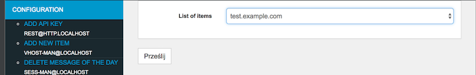
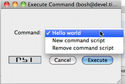
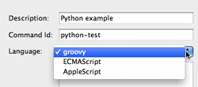

Using Tigase
==============

This section keeps set of documents which apply to all the Tigase server version and contain more generic or introductory information on general use and features.

-  `Tigase Log Guide <#Tigase-Log-Guide>`__

-  `Debugging Tigase <#Debuging-Tigase>`__

-  `Basic System Checks <#Basic-System-Checks>`__

-  `Add and Manage Domains <#Add-and-Manage-Domains-(VHosts)>`__

-  `Presence Forwarding <#Presence-Forwarding>`__

-  `Watchdog <#Watchdog>`__

   1. `Runtime Environment Tip <#Tigase-Tip-Checking-the-Runtime-Environment>`__

   2. `Checking Cluster Connections <#Checking-Cluster-Connections>`__

   3. `Best Practices for Connecting to Tigase XMPP server From Web Browser <#Best-Practices-for-Connecting-to-Tigase-XMPP-server-From-Web-Browser>`__

-  `Scripting Support in Tigase <#Scripting-support-in-Tigase>`__

   1. `Scripting Introduction - Hello World! <#Scripting-Introduction - Hello-World!>`__

   2. `Tigase Scripting Version 4.4.x Update for Administrators <#Tigase-Scripting-Version-4.4.x-Update-for-Administrators>`__

   3. `Tigase and Python Scripting <#Tigase-and-Python>`__

-  `Configuration Wizards <#tigase3xconfiguration>`__

Offline Messages
---------------------

Tigase like any XMPP server supports storing of messages for users who are offline so that they may receive messages sent to them while they were not logged in.

By default, Tigase ``MessageAmp`` processor is responsible for storing offline messages, and will automatically store offline messages. This guide has multiple sections for setting limits globally, per user, and others.

Many of the features listed here require the use of the Advanced Message Processor Plugin which is turned on by default. To ensure AMP is turned on your system, view your ``config.tdsl`` file and be sure the following is there in your plugins line:

.. code:: dsl

   'sess-man' {
       amp () {}
   }

Messages will be delivered to intended recipients when they first login after roster exchange.

Offline Message Limits
^^^^^^^^^^^^^^^^^^^^^^^^^^^^

Support for limiting number of stored offline messages on a per-user basis has now been added to Tigase as of v7.1.0. By default, Tigase comes with a limit of stored offline messages which is set for every user. This limit by default is 100 offline messages for barejid-barejid pair. This value can be changed by the ``store-limit`` property. To change to 200 messages on barejid-barejid paid, add the following entries to the ``config.tdsl`` file:

.. code:: dsl

   amp {
       'store-limit' = 200L
   }
   'sess-man' {
       amp () {
           'store-limit' = 200L
       }
   }

This setting applies to every user.

User Limit
~~~~~~~~~~~~~~~~~

Each user is able to configure the number of offline messages which should be stored for him. To enable this feature, the following lines need to be entered into the ``config.tdsl`` file:

.. code:: dsl

   amp {
       'user-store-limit-enable' = true
   }
   'sess-man' {
       amp () {
           'user-store-limit-enable' = true
       }
   }

Values of user-specific limits will be stored in UserRepository under subnode of ``offline-msgs`` and key ``store-limit``. Data storage will be stored in ``tig_pairs`` key with the value and a proper record from ``tig_nodes`` points to this record.

Handling of Offline Messages Exceeding Limits
~~~~~~~~~~~~~~~~~~~~~~~~~~~~~~~~~~~~~~~~~~~~~~~~~~~

There are two possible ways to handle offline messages that exceed the limitations: . ``error`` sending message with error type back to sender. . ``drop`` drop of message without notifications to sender.

By default, Tigase sends a message back to the original sender with an error type of ``service-unavailable`` with a proper description of error according to `XEP-0160 <http://www.xmpp.org/extensions/xep-0160.html>`__. However, it is possible to change this behavior to better suit your needs. This is done by adding the following line to your ``config.tdsl`` file.

.. code:: dsl

   'sess-man' {
       amp () {
           'quota-exceeded' = 'drop'
       }
   }

This will force Tigase to drop packets that exceed the offline message limit.

Setting the Limits by User
~~~~~~~~~~~~~~~~~~~~~~~~~~~~~~~~~~

Users wishing to set a custom limit of stored offline messages for barejid-barejid pairs needs to send the following XMPP stanza to the server:

.. code:: xml

   <iq type="set" id="${random-id}">
     <msgoffline xmlns="msgoffline" limit="${limit}"/>
   </iq>

Where: . ``${random-id}`` is a random ID of the stanza (can be any string). . ``${limit}`` is the integer value of the offline message limit. This can be set to ``false`` to disable offline message limits.

In response, the server will send back an ``iq`` stanza with a result type:

.. code:: xml

   <iq type="result" id="${random-id}">
     <msgoffline xmlns="msgoffline" limit="${limit}"/>
   </iq>

Example of Setting Limit of Stored Offline Messages to 10

XMPP client sends the following to the server:

.. code:: xml

   <iq type="set" id="aabba">
     <msgoffline xmlns="msgoffline" limit="10"/>
   </iq>

Server response:

.. code:: xml

   <iq type="result" id="aabba">
     <msgoffline xmlns="msgoffline" limit="10"/>
   </iq>

Example of Disabling Offline Message Limit

XMPP client sends the following to the server:

.. code:: xml

   <iq type="set" id="aabbb">
     <msgoffline xmlns="msgoffline" limit="false"/>
   </iq>

Server response:

.. code:: xml

   <iq type="result" id="aabbb">
     <msgoffline xmlns="msgoffline" limit="false"/>
   </iq>

Storing offline messages without body content
^^^^^^^^^^^^^^^^^^^^^^^^^^^^^^^^^^^^^^^^^^^^^^^^^

Tigase can now store offline messages without ``<body/>`` content.

See `XEP-0334 <http://xmpp.org/extensions/xep-0334.html>`__ for protocol details.

This can include message receipts, and messages with specific ``do-not-store`` tags.

Support has been added to set a list of paths and xmlns to trigger and place storage of offline messages using the following settings in ``config.tdsl``:

.. code:: dsl

   'sess-man' {
       amp () {
           'msg-store-offline-paths' = [ '/message/received[urn:xmpp:receipts]', '/message/store-offline' ]
       }
   }

This example results in two settings:

``/message/received[urn:xmpp:receipts]``
   Results in storage of messages with a ``recieved`` subelement and with the xlmns set to ``urn:xmpp:receipts``

``/message/store-offline``
   Results in storing messages with a ``store-offline`` subelement without checking xmlns.

Filtering of offline storage
~~~~~~~~~~~~~~~~~~~~~~~~~~~~~~~~~~

It is possible to set storage of other types to save:

.. code:: dsl

   'sess-man' {
       amp () {
           'msg-store-offline-paths' = [ '/message/store-offline', '-/message/do-not-store' ]
       }
   }

The above setting in the ``config.tdsl`` file will cause that:

-  messages with ``<store-offline>`` subelement will be stored without checking for associated xmlns.

-  messages with ``<do-not-store>`` element **will not** be saved.

Any of these can be adjusted for your installation, remember that a '-' will stop storage of messages with the indicated property. Messages will be checked by these matchers and if any of them result in a positive they will override default settings.

For example, if you wanted to store messages with <received> element, but not ones with <plain> element, your filter will look like this:

.. code:: dsl

   'sess-man' {
       amp () {
           'msg-store-offline-paths' = [ '/message/received', '-/message/plain' ]
       }
   }

However…​.

.. Note::

   **THE ABOVE STATEMENT WILL NOT WORK** As it will just store all messages with <received> subelement.

The below statement will properly filter your results.

.. code:: dsl

   'sess-man' {
       amp () {
           'msg-store-offline-paths' = [ '-/message/plain', '-/message/received' ]
       }
   }

Filtering logic is done in order from left to right. Matches on the first statement will ignore or override matches listed afterwards.

Disabling Offline Messages
^^^^^^^^^^^^^^^^^^^^^^^^^^^^^^^

If you wish to disable the storing of offline messages, use the following line in your ``config.tdsl`` file. This will not disable other features of the AMP plugin.

.. code:: dsl

   'sess-man' {
       amp () {
           msgoffline (active: false) {}
       }
   }

Last Activity
----------------

Tigase XMPP Server supports `XEP-0012: Last Activity <https://xmpp.org/extensions/xep-0012.html>`__ extension, which allows retrieval information when particular contact was active last time. It’s not enabled by default.

The functionality itself is split in two plugins:

-  ``jabber:iq:last-marker`` - responsible for updating information about last activity of user

-  ``jabber:iq:last`` - responsible for handling requests to retrieve last activity information (it depends on ``jabber:iq:last-marker`` plugin).

In order to enable functionality you should add both plugins to your configuration file

.. code:: dsl

   'sess-man' {
       'jabber:iq:last-marker' (active: true) {
           'jabber:iq:last' (active: true) {}
       }
   }

What updates last activity
^^^^^^^^^^^^^^^^^^^^^^^^^^^^^^^^

By default marker plugin will only update last activity information on presence stanza. It’s possible to control whether ``<presence/>`` and/or ``<message/>`` should update with respective options:

.. code:: dsl

   'sess-man' {
       'jabber:iq:last-marker' (active: true) {
           message = true
           presence = true
       }
   }

Those settings will cause updating last activity information for both ``<message/>`` and ``<presence/>`` stanzas

Persist everything to repository
^^^^^^^^^^^^^^^^^^^^^^^^^^^^^^^^^^^^^^^^^^^^^^^^^^^^^^^^^^^^^^^^

To lower impact on performance, by default last activity information is persisted to repository less frequently. This can yield slightly less accurate results on installations with multiple cluster nodes with users having multiple resources connected. To get more accurate results you should set ``persistAllToRepository`` to ``true``, which will cause all update times to be persisted (please bear in mind that this could cause higher impact on the repository).

.. code:: dsl

   'sess-man' {
       'jabber:iq:last-marker' (active: true) {
           persistAllToRepository = true
       }
   }

Tigase Log Guide
--------------------

Tigase has multiple levels of logging available to help provide targeted and detailed information on processes, components, or traffic. In these documents we will look at where tigase generates logs, what they contain, and how we can customize them to our needs.

install.log
^^^^^^^^^^^^^^^

This log file is a basic list of files that are made on install of Tigase server. Although you may not need to use it, it can provide a handy list to see if any files were not written to your hard drive upon installation.

derby.log
^^^^^^^^^^^^^^^

If you are using the derby database installed with Tigase, this is the startup log for the database itself. Issues that might be related to the database, can be found in this file. Typically, if everything works okay, it’s a very small file with only 10 lines. It is overwritten on startup of the database.

etc/config-dump.properties
^^^^^^^^^^^^^^^^^^^^^^^^^^^^^^

The config-dump.properties is dump file of all your properties listed for every option within Tigase and components. The structure of the log lines is the same as the structure of Tigase XMPP Server config file - TDSL. Lets take the value for admins, listing who is administrator for the server.

::

   admins = [ 'admin@jabber.freehost.org', 'administrator@jabber.freehost.org', 'fJones@jabber.freehost.org' ]

The admin parameter which is an array of strings and has 3 users listed.

This file is re-written every time tigase starts.

logs/tigase.log.#
^^^^^^^^^^^^^^^^^^^^^^^^^^^^^^

The tigase.log files are where the majority of logging will take place. The rules for writing to these longs can be manipulated by editing files in the int.properties file. To see how, see the `Debugging Tigase <#debuggingTigase>`__ section of this manual for more details about how to turn on debug logging, and how to manipulate log settings. Entries to these logs are made in the following format:

::

   2015-08-10 13:09:41.504 [main]      Sctipr.init()         INFO: Initilized script command, id: comp-manager, lang:Groovy, ext: groovy

The format of these logs is below: ``<timestamp> <thread_name> <class>.<method>    <log_level>: <message> <thread_name>``. This can vary - for components it would be ``<direction>_<int>_<component name>``, for plugins it will just be the plugin name.

Let’s look at another example from the log file.

::

   2015-08-10 12:31:40.893 [in_14_muc] InMemoryMucRepository.createNewRoom()   FINE: Creating new room 'chatroom@muc.localhost.com'

The process ID may sometimes come in a different format such as ``[in_14-muc]`` which specifies the component (muc) along with the process thread identifier (14). As you can see, the format otherwise is nearly identical.

``tigase.log.#`` files are *rotated* - this means that server begins writing to tigase.log.0 when it is first run, and continues to dump information until the log size limit is hit. At this point, Tigase renames tigase.log.0 as tigase.log.1. A new tigase.log.0 will be created, and Tigase will begin logging to this file. When this file is full, tigase.log.1 will be renamed tigase.log.2 and tigase.log.0 will be renamed tigase.log.1. Using this scheme, tigase.log.0 will **always** be your most recent log.

By default, Tigase has a limit of 10000000 bytes or 10MB with a file rotation of 10 files. You can edit these values by editing the ``config.tdsl`` file and adding the following lines.

.. code:: dsl

   logging {
       java.util.logging.FileHandler {
           count = '15'
           limit = '20000000'
       }
   }

This code, if entered into the ``config.tdsl`` file increases the size of the files to 15, and enlarges the maximum size to 20MB. Note the larger the collective log space is, the larger number of sectors on hard disk are active. Large log blocks may impact system performance.

*You may see a tigase.log.0.lck file in the directory while the server is running. This is a temporary file only and is deleted once Tigase is cleanly shut down.*

logs/statistics.log.#
^^^^^^^^^^^^^^^^^^^^^^^^^^^^^^

Statistics log will duplicate any information that is related to sending of statistics to Tigase if you are using an unlicensed copy of Tigase XMPP server. Mainly it will consist output of LicenceChecker. The numbering logic will be the same as ``tigase.log.#`` files.

logs/tigase.pid
^^^^^^^^^^^^^^^^^^^^^^^^^^^^^^

``tigase.pid`` is a file that just contains the Process ID or PID for the current run of Tigase. It is only valid for the current or most recent run cycle and is overwritten every time Tigase starts.

logs/tigase-console.log
^^^^^^^^^^^^^^^^^^^^^^^^^^^^^^

.. Important::

   This is the most important log file containing the most essential information related to operation of the Tigase XMPP Server. Any errors or exceptions in this file indicate with high probability serious issues with server operation.

This file contains information related to Tigase’s running environment, and is a dump from the server itself on what is being loaded, when, and if any issues are encountered. It will start by loading Java classes (consequently making sure the Java environment is present and functioning). Then it will begin loading the configuration file, and adding default values to settings that have not been customized. You can then see all the components being loaded, and settings added where default values are needed. Lastly you will see a log of any plugins that are loaded, and any parameters therein. You may see tags such as INFO or WARNING in the logs. Although they may contain important information, the program will continue to operate as normal are not of too great concern.

ERROR flags are issues you will want to pay attention as they may list problems that prevent Tigase or components from properly functioning.

.. Note::

   Windows does not create this file, rather the output is shown in the command line and is not dumped to a file.

If Tigase is gracefully shut down, tigase-console.log will add statistics from the server’s operation life in the following format.

::

   component/statistic = value

*Any component that may have a statistic, whether used or not, will place a value here*

This file can be handy if you are tracking issues in the server.

tigase-console.log is appended during each run session of the server.

Log File Location
^^^^^^^^^^^^^^^^^^^^^^^^^^^^^^

You can also change the location of log files if you have a specific directory you wish to use. The configuration may be made by the following lines in your ``config.tdsl`` file:

.. code:: dsl

   logging {
       java.util.logging.FileHandler {
           pattern = '/var/log/tigase/tigase.log'
       }
   }

This setting changes the log file location to /var/log/tigase/ where all log files will be made. Files in the original location will be left.

Debuging Tigase
--------------------

If something goes wrong and you can’t find out why it is not working as expected, you might want more detailed debugging options switched on.

Tigase is a Java application and it uses Java logging library, this gives you the flexibility to switch logging on for selected Java packages or even for a single Java class.

Logs files are stored in ``logs/`` directory. ``tigase-console.log`` stores basic log data, but is the main log file. ``tigase.log.N`` files keep all the detailed logging entries. So this is the place where you should look in case of problems.

Configuration
^^^^^^^^^^^^^^^^

By default, Tigase has the old ``debug = ['server']`` setting is turned on and does not need to be added.

However, people want to see what is going on the network level. That is what has been sent and what has been received by the server - the actual character data. The class which would print all received and sent character data is: ``tigase.xmpp.XMPPIOService``. To enable all debugging info for this class you have to modify the debug line:

.. code:: dsl

   debug = [ 'xmpp.XMPPIOService' ]

You can also have debugging switched on for many packages/classes at the same time:

.. code:: dsl

   debug = [ 'cluster' , 'xmpp.XMPPIOService' ]

Other packages you might be interested in are:

-  ``io`` can print out what is going on a very low level network level including TLS/SSL stuff.

-  ``xml`` would print the XML parser debugging data.

-  ``cluster`` would print all the clustering related stuff.

-  ``xmpp.impl`` would print logs from all plugins loaded to Tigase server.

Non-Tigase packages
~~~~~~~~~~~~~~~~~~~~~~~~

To enable logging for your own packages from those different than Tigase, you have to use another option which has been made available for this:

.. code:: bash

   debug-packages = [ your.com.package ]

Basic System Checks
----------------------

Previously, a configuration article is available about `Linux settings for high load systems <#linuxhighload>`__. This has a description of basic settings which are essential to successfully run XMPP service for hundreds or thousands of online users.

Of course, high load and high traffic systems require much more tuning and adjustments. If you use selinux you have to be careful as it can interfere with the service while it is under a high load. Also some firewall settings may cause problems as the system may decide it is under a DDOS attack and can start blocking incoming connections or throttle the traffic.

In any case, there are some basic checks to do every time you deploy XMPP service to make sure it will function properly. I am trying to keep the article mentioned above up to date and add all the settings and parameters I discover while working with different installations. *If you have some suggestions for different values or different parameters to add, please let me know.*

If you want to run a service on a few cluster nodes (5 or even 10), then manually checking every machine and adjusting these settings is time consuming and it is very easy to forget about.

To overcome this problem I started to work on a shell script which would run all the basic checks and report problems found. Ideally it should be also able to adjust some parameters for you.

Inside the Tigase server `scripts/ <https://github.com/tigase/tigase-server/blob/master/scripts/>`__ repository find a script called ``machine-check.sh``. It performs all the basic checks from the article and also tries to adjust them when necessary. Have a `look at the code <https://github.com/tigase/tigase-server/blob/master/scripts/machine-check.sh>`__ and run for yourself.

Any comments or suggestions, as usual, are very much appreciated.

Add and Manage Domains (VHosts)
------------------------------------

Tigase XMPP Server offers an easy to use and very flexible way to add and manage domains hosted on installation (vhosts).

There are two ways of managing domains you host on your server:

-  using web-based admin management console - `Admin UI <#usingAdminUI>`__

-  using XMPP ad-hoc commands by XMPP client, ie. `Psi <http://psi-im.org/>`__

.. Note::

   To use any of those ways, you need to be an administrator of the server, which means that you have a XMPP account created on this XMPP server and your account JID is added to `the list of the administrators <#admins>`__ in the Tigase XMPP Server configuration file.

Using Admin UI
^^^^^^^^^^^^^^^^^^

First, you need to open Admin UI web page. By default Admin UI is enabled and available at the port ``8080`` at path ``/admin/`` on the XMPP server. Assuming that your are logged on the same machine which hosts Tigase XMPP Server, it will be available at http://localhost:8080/admin/.

When you will be prompted for username and password to login to the Admin UI please fill username with full JID of your XMPP admin account and fill password field with password for this account. When you submit correct credentials you will get access to the Admin UI and Tigase XMPP Server configuration and management web-based interface.

Adding a new domain
~~~~~~~~~~~~~~~~~~~~~~~~

To add a new domain you need to open ``Configuration`` section of the Admin UI (by clicking on ``Configuration`` label and then selecting ``Add new item`` position which mentions ``vhost-man``.

|adminui vhost add item button|

After doing that, you will be presented with a form which you need to fill in. This form allows you to pass ``Domain name`` to add and other options (some of the are advanced options).

|adminui vhost add item form|

.. Tip::

   All options with exception of ``Domain name`` may be changed later on by modifying vhost settings.

When you will be ready, please submit the form using button below the form. As a result you will be presented with a result of this operation. If it was successful it show ``Operation successful`` message and if something was not OK, it will display an error to help you fix this issue which you encountered.

Modifying domain settings
~~~~~~~~~~~~~~~~~~~~~~~~~~~~~~~~~~

Modifying a domain settings is very similar to adding a new domain. You need to open ``Configuration`` section of the Admin UI and then select ``Update item configuration`` position which mentions ``vhost-man``.

|adminui vhost update item button|

You will be presented with a list of domains hosted on this Tigase XMPP Server installation. From them you should choose the one for which you wish to modify settings.

|adminui vhost update item domains list|

After submitting this selection, you will be presented with a the same form as the one used during adding a new domain. It presents configuration options for this domain and currently used values.

|adminui vhost update item form|

Now you should adjust them as you wish and submit this form using the button below the form.

As a result you will be presented with a result of this operation. If it was successful it show ``Operation successful`` message and if something was not OK, it will display an error to help you fix this issue which you encountered.

Removing a domain
~~~~~~~~~~~~~~~~~~~~~

Removing a hosted domain from the Tigase XMPP Server installation is quite simple as well. You need to open ``Configuration`` section of the Admin UI and then select ``Remove an item`` position which mentions ``vhost-man``.

|adminui vhost remove item button|

You will be presented with a list of domains hosted on this Tigase XMPP Server installation. From them you should select the one which should be removed.

|adminui vhost remove item domains list|

After submitting your selection, Tigase XMPP Server will try to remove this domain from the list of hosted domains and will present you with the result. If it was successful it show ``Operation successful`` message and if something was not OK, it will display an error to help you fix this issue which you encountered.

Using ad-hoc commands
^^^^^^^^^^^^^^^^^^^^^^

For everybody interested in using our service to host their own XMPP domain we have good news! You do not have to ask an administrator to add your domain or add users for your domain anymore. You can do it on your own.

Please note, this is very new stuff. Something may go wrong or may not be polished. Please report any problems, notices or suggestions.

This is the guide to walk you through the new functions and describes how to add a new domain and new users within your domain.

You can do everything from your XMPP client or you can use our web application that allows you to connect to the service and execute admin commands. I recommend `Psi <http://psi-im.org/>`__ because of its excellent support for parts of the XMPP protocol which are used for domains and user management. You may use other clients as well, but we can only offer support and help if you use Psi client.

Secondly, you need an account on the server. This is because all the commands and features described here are available to local users only. Therefore, if you do not have a registered domain with us yet, please go ahead and register an account on the website either the `Tigase.IM <http://www.tigase.im/>`__ or `Jabber.Today <http://jabber.today/>`__.

Adding a New Domain
~~~~~~~~~~~~~~~~~~~~~

Once you register an account on one of the websites, connect to the XMPP server using the account on the Psi client. We will be using the following account: green@tigase.im which is this guide.

When you are ready right click on the account name in Psi roster window to bring up context menu. Select **Service Discovery** element.

|service disco menu|

A new windows pops up as in the example on the right. The service discovery window is where all the stuff installed on XMPP service should show up. Most of elements on the list are well known transports, MUC and PubSub components. The new stuff on the list, which we are interested in, are 2 elements: **VHost Manager** and **Session Manager**.

|service disco window vhost|

**VHost Manager** component in Tigase is responsible for managing and controlling virtual hosts on the installation. It provides virtual hosts information to all other parts of the system and also allows you to add new hosts and remove/update existing virtual hosts.

**Session Manager** component in Tigase is responsible for managing users. In most cases online users but it can also perform some actions on user repository where all user data is stored.

Select **VHost Manager** and double click on it. A new windows shows up (might be hidden behind the service discovery window). The window contains another menu with a few items: **Add…​, Remove…​** and **Update…​** . These are for adding, removing and updating VHost information. For now, just select the first element **Add…​.**

|command menu add vhost|

Click **Execute** and you get a new window where you can enter all of your VHost configuration details. All fields should be self explanatory. Leave a blank field for **Other parameters** for now. **Owner** is you, that is Jabber ID which controls the domain and can change the domain configuration settings or can remove the domain from the service. **Administrators** field can be left blank or can contain comma separated list of Jabber IDs for people who can manage users within the domain. You do not need to add your user name to the list as Owners can always manage users for the domain.

|add vhost window|

When you are ready click the **Finish** button. All done, hopefully. You can get either a window confirming everything went well or a window printing an error message if something went wrong. What can be wrong? There are some restrictions I decided to put on the service to prevent abuse. One of the restrictions is the maximum number of domains a user can register for himself which is **25** right now. Another restriction is that the domain which you add must have a valid DNS entry pointing to our service. The XMPP guide describes all the details about DNS settings. Please refer to these instructions if you need more details.

Adding a New User
~~~~~~~~~~~~~~~~~~~~~

Adding a new user process is quite similar, almost identical to adding a new domain. This time, however we have to select **Session Manager** in the service discovery window.

|service disco window sm|

Double click on the **Session Manager** and a window with SM’s commands list shows up. Right now, there is only one command available to domain administrators - **Add user**. I am going to make available more commands in the future and I am waiting for your suggestions.

|command menu add user|

If you click **Execute** a window presented on the left shows up. Fill all fields accordingly and press **Finish**.

|add user window|

If everything went well you have just added a new user and you should get a window confirming successful operation. If something went wrong, a window with an error message should show up. Possible errors may be you tried to add a user which is already present, or you may have tried to add a user for a domain to which you do not have permission or to non-existen domain.

SSL Certificate Management
~~~~~~~~~~~~~~~~~~~~~~~~~~~~~~~~~~~~~~~~~~

SSL Certificate Management has been implemented, and certificates can be manipulated when in a .pem form. For more details, see `Creating and Loading the Server Certificate in pem Files <#certspem>`__ section of documentation for more information.

.. |adminui vhost add item button| image:: ../../asciidoc/admin/images/admin/adminui_vhost_add_item_button.png
.. |adminui vhost add item form| image:: ../../asciidoc/admin/images/admin/adminui_vhost_add_item_form.png
.. |adminui vhost update item button| image:: ../../asciidoc/admin/images/admin/adminui_vhost_update_item_button.png

.. |adminui vhost update item form| image:: ../../asciidoc/admin/images/admin/adminui_vhost_update_item_form.png
.. |adminui vhost remove item button| image:: ../../asciidoc/admin/images/admin/adminui_vhost_remove_item_button.png
.. |adminui vhost remove item domains list| image:: ../../asciidoc/admin/images/admin/adminui_vhost_remove_item_domains_list.png
.. |service disco menu| image:: ../../asciidoc/admin/images/admin/service_disco_menu.png
.. |service disco window vhost| image:: ../../asciidoc/admin/images/admin/service_disco_window_vhost.png
.. |command menu add vhost| image:: ../../asciidoc/admin/images/admin/command_menu_add_vhost.png
.. |add vhost window| image:: ../../asciidoc/admin/images/admin/add_vhost_window.png
.. |service disco window sm| image:: ../../asciidoc/admin/images/admin/service_disco_window_sm.png
.. |command menu add user| image:: ../../asciidoc/admin/images/admin/command_menu_add_user.png
.. |add user window| image:: ../../asciidoc/admin/images/admin/add_user_window.png

Presence Forwarding
------------------------

Have you ever thought of displaying your users presence status on the website? Or, maybe, you wanted to integrate XMPP service with your own system and share not only users' accounts but also presence status?

Not only is it possible but also very simple. You have a new option in the domain control form.

Actually there are 2 new options:

1. Presence forward address

2. Message forward address - not fully implemented yet

Presence forward address can be any XMPP address. Usually you want it to be a bot address which can collect your users' presence information. Once this option is set to a valid XMPP address Tigase forwards user’s presence, every time the user changes his status. The presence is processed normally, of course, and distributed to all people from the contact list (roster), plus to this special address. It can be a component or a bot. If this is a bot connecting to a regular XMPP account, **Make sure the presence forward address contains resource part and the bot is connecting with this resource.** Otherwise the presence won’t be delivered to the bot.

|vhost presence forward|

As the screenshot shows, there are new input lines with option for presence forwarding address and message forwarding address. As you can see this option can be specified separately for each domain, so you can have a different forward address for each domain.

If you have your own Tigase installation, the forwarding address can be also set globally and can be the same for all domains. However, for this website, we offer this feature to all our users who have own domains and this can be set on per-domain basis.

Now, the big question. How this can be used? I am attaching below an example code. With just a few lines of code you can connect a command line bot to the server as a client which would collect all presences from users. Code below is a simple Groovy script which receives presence packet and displays them on the console. However, it should be easy enough to store users' presence information in a database and then load it from a web application.

The bot/client uses our `JaXMPP2 <https://github.com/tigase/jaxmpp>`__ library which is included in current builds of Tigase XMPP Server.

You should be able to find a few more code examples on the wiki page.

.. code:: groovy

   package jaxmppexample

   import tigase.jaxmpp.core.client.BareJID
   import tigase.jaxmpp.core.client.SessionObject
   import tigase.jaxmpp.core.client.exceptions.JaxmppException
   import tigase.jaxmpp.core.client.observer.Listener
   import tigase.jaxmpp.core.client.xmpp.modules.presence.PresenceModule
   import tigase.jaxmpp.core.client.xmpp.modules.presence.PresenceModule.PresenceEvent
   import tigase.jaxmpp.j2se.Jaxmpp

   final Jaxmpp jaxmpp = new Jaxmpp()
   jaxmpp.getProperties().setUserProperty( SessionObject.USER_BARE_JID,
     BareJID.bareJIDInstance( "test4@test.tigase.org" ) )
   jaxmpp.getProperties().setUserProperty(SessionObject.RESOURCE, "presence-collector")
   jaxmpp.getProperties().setUserProperty( SessionObject.PASSWORD, "pass" )
   jaxmpp.getModulesManager().getModule( PresenceModule.class ).addListener(
     PresenceModule.ContactChangedPresence,  new Listener() {
       public void handleEvent( PresenceEvent be ) {
         def msg = (be.getStatus() != null) ? be.getStatus() : "none"
         println( "Presence received:\t" + be.getJid() + " is now " + be.getShow() +
           " (" + msg + ")" )
       }
     }
   )
   println( "Loging in..." )
   jaxmpp.login()
   println( "Waiting for the presence for 10 minutes" )
   Thread.sleep( 10 * 60 * 1000 )
   disconnect()

.. |vhost presence forward| image:: ../../asciidoc/admin/images/admin/vhost-presence-forward.png

Watchdog
-------------

Tigase’s Watchdog was implemented to help Tigase close connections that have become stale or inactive. Sometimes the connection is delayed, maybe dropped packets, or a service interruption. After a time, if that connection is re-established, both server and client (or server and server) will continue on as if nothing happened. However, these gaps in connection can last longer, and some installations will rely on the operating system to detect and close stale connections. Some operating systems or environments can take up to 2 hours or more to determine whether a connection is bad and wait for a response from a foreign entity and may not be configured. This can not only slow down performance, but can lead to security issues as well. To solve this problem, we have introduced Watchdog to monitor connections independent of operating system and environments to keep those broken connections from becoming a problem.

Setup
^^^^^^^

No extra setup is necessary, Watchdog is already included with your build of Tigase (as long as it’s 7.1.0 or newer). Follow the steps in the configuration section.

Watchdog Configuration
^^^^^^^^^^^^^^^^^^^^^^^^^

To configure watchdog, the following lines need to be present or edited in ``config.tdsl`` file:

.. code:: dsl

   'watchdog-timeout' = 70000
   'watchdog-delay' = 60000
   'watchdog-ping-type' = 'xmpp'

The three settings are as follows:

-  ``'watchdog-timeout'= 70000`` This setting sets the amount of time that watchdog will consider before it determines a connection may be stale. This setting sets the timeout at 70000ms or 70 seconds.

-  ``'watchdog-delay' = 60000`` This setting sets how often the watchdog should conduct the check, the default delay at 60000ms or 60 seconds.

-  ``'watchdog-ping-type'`` This setting determines the type of ping sent to components when watchdog is testing for activity.

You may, if you choose, to specify individual watchdog settings for specific components by adding them to the component settings, for example if we wanted to change the Client2Server settings to include watchdog, use the following lines in config.tdsl:

.. code:: dsl

   c2s {
       watchdog-delay = '1500'
       watchdog-timeout = '3000'
   }

If any settings are not set, the global or settings will be used. ``watchdog-delay`` default is set to 10 min ``watchdog-ping-type`` default is set to XMPP

Logic
^^^^^^^^

Watchdog compares it’s own pings, and records the time it takes for a round trip to different components, clustered connections, and if one variable is larger than the other, watchdog will commence closing that stale connection. Here is a breakdown:

1. A check is performed of a connection(s) on every ``watchdog-delay`` interval.

2. During this check two things occur

   -  If the last transfer time exceeds ``max-inactivity-time`` a stop service command is given to terminate and broadcast unavailable presence.

   -  If the last transfer time is lower than ``max-inactivity-time`` but exceeds ``watchdog-timeout`` watchdog will try to send a ping (of ``watchdog-ping-type``). This ping may be one of two varieties (set in config.tdsl)

      -  ``WHITESPACE`` ping which will yield the time of the last data transfer in any direction.

      -  ``XMPP`` ping which will yield the time of the last received xmpp stanza.

3. If the 2nd option is true, the connection will remain open, and another check will begin after the ``watchdog-delay`` time has expired.

For example, lets draw this out and get a visual representation

::

   -----+-----+-----+-----+-----+-----+-----+-----+-----+-----+-----+-- 
        |     |     |     |     |     |     |     |     |     |     |
   ---+---------------------------------------------------------------- 
      1 2     3     4     5     6
   ---*-*-----*-----*-----*----------- 

-  This line represents how often the check is performed. Each ``-`` (dash) is 10 seconds, so the check is done every 60 seconds (``'watchdog-delay' = 60000``)

-  This line is client activity, here the client sent a message at 40 seconds (marked by ``+``) and has gone idle.

-  The following line represents the watchdog logic, with timeout at 120 seconds and max inactivity timeout at 180 seconds:

   .. code:: dsl

      'watchdog-timeout' = 120000
      c2s {
          'max-inactivity-time' = '180000'
      }
      (timeout at 120 seconds and max inactivity timeout at 180 seconds)

How the check is performed:

1. 30 seconds - at this point *last transfer* or *last received* time is updated.

2. 60 seconds - watchdog runs - it check the connection and says: \_ok, last client transfer was 20s ago - but it’s lower than both inactivity (so don’t disconnect) and timeout (so don’t send ping).

3. 120 seconds - 2nd check - last transfer was 100s ago - still lower than both values - do nothing.

4. 180 seconds - 3rd check - last transfer was 160s ago - lower than inactivity but greater than delay - ping it sent.

5. 240 seconds - 4th check - last transfer was 220s ago - client still hasn’t responded, watchdog compares idle time to ``max-inactivity-timeout`` and finds out that it is greater, connection is terminated.

6. 300 seconds - watchdog is run again but given the connection was terminatet there is no XMPP session to check for that particular client.

.. Tip::

   It is possible that the connection is broken, and could be detected during the sending of a ping and the connection would be severed at step 4 instead of waiting for step 5. **NOTE** This MAY cause JVM to throw an exception.

.. Note::

   Global settings may not be ideal for every setup. Since each component has its own settings for ``max-inactivity-time`` you may find it necessary to design custom watchdog settings, or edit the inactivity times to better suit your needs. Below is a short list of components with thier default settings:

   .. code:: dsl

      bosh {
          'max-inactivity-time' = 600L
      }
      c2s {
          'max-inactivity-time' = 86400L
      }
      'cl-comp' {
          'max-inactivity-time' = 180L
      }
      s2s {
          'max-inactivity-time' = 900L
      }
      ws2s {
          'max-inactivity-time' = 86400L
      }

.. Important::

   Again remember, for Watchdog to properly work, the ``max-inactivity-time`` MUST be longer than the ``watchdog-timeout`` setting

Testing
~~~~~~~~

The tigase.log.0 file can reveal some information about watchdog and how it is working (or how it might be fighting your settings). To do so, enter the following line into your ``config.tdsl`` file:

::

   debug = [ 'server', 'xmpp.init' ]

This will set debug mode for your log, and enable some more information about what Tigase is doing. These logs are truncated for simplicity. Lets look at the above scenario in terms of the logs:

**Stage Two.**

::

   2015-10-16 08:00:00.000 [Watchdog - c2s]   ConnectionManager$Watchdog$1.check()  FINEST: Testing service: c2s@xmpp.domain.com/192.168.0.150_5222_192.168.0.201_50368, type: accept, Socket: TLS: c2s@xmpp.domain.com/192.168.0.150_5222_192.168.0.201_50368 Socket[addr=/192.168.0.201,port=50368,localport=5222], jid: user@xmpp.domain.org/mobile, sinceLastTransfer: 20,000, maxInactivityTime: 180,000, watchdogTimeout: 120,000, watchdogDelay: 60,000, watchdogPingType: XMPP

**Stage Three.**

::

   2015-10-16 08:01:00.000 [Watchdog - c2s]   ConnectionManager$Watchdog$1.check()  FINEST: Testing service: c2s@xmpp.domain.com/192.168.0.150_5222_192.168.0.201_50368, type: accept, Socket: TLS: c2s@xmpp.domain.com/192.168.0.150_5222_192.168.0.201_50368 Socket[addr=/192.168.0.201,port=50368,localport=5222], jid: user@xmpp.domain.org/mobile, sinceLastTransfer: 100,000, maxInactivityTime: 180,000, watchdogTimeout: 120,000, watchdogDelay: 60,000, watchdogPingType: XMPP

**Stage Four.**

::

   2015-10-16 08:02:00.000 [Watchdog - c2s]   ConnectionManager$Watchdog$1.check()  FINEST: Testing service: c2s@xmpp.domain.com/192.168.0.150_5222_192.168.0.201_50368, type: accept, Socket: TLS: c2s@xmpp.domain.com/192.168.0.150_5222_192.168.0.201_50368 Socket[addr=/192.168.0.201,port=50368,localport=5222], jid: user@xmpp.domain.org/mobile, sinceLastTransfer: 160,000, maxInactivityTime: 180,000, watchdogTimeout: 120,000, watchdogDelay: 60,000, watchdogPingType: XMPP
   2015-10-16 08:02:00.697 [Watchdog - c2s]   ConnectionManager$Watchdog$1.check()  FINEST: c2s@xmpp.domain.com/192.168.0.150_5222_192.168.0.201_50368, type: accept, Socket: TLS: c2s@xmpp.domain.com/192.168.0.150_5222_192.168.0.201_50368 Socket[addr=/192.168.0.201,port=50368,localport=5222], jid: user@xmpp.domain.org/mobile, sending XMPP ping from=null, to=null, DATA=<iq from="xmpp.domain.com" id="tigase-ping" to="user@xmpp.domain.com/mobile" type="get"><ping xmlns="urn:xmpp:ping"/></iq>, SIZE=134, XMLNS=null, PRIORITY=NORMAL, PERMISSION=NONE, TYPE=get

**Stage Five.**

::

   2015-10-16 08:03:00.000 [Watchdog - c2s]   ConnectionManager$Watchdog$1.check()  FINEST: Testing service: c2s@xmpp.domain.com/192.168.0.150_5222_192.168.0.201_50368, type: accept, Socket: TLS: c2s@xmpp.domain.com/192.168.0.150_5222_192.168.0.201_50368 Socket[addr=/192.168.0.201,port=50368,localport=5222], jid: user@xmpp.domain.org/mobile, sinceLastTransfer: 100,000, maxInactivityTime: 180,000, watchdogTimeout: 120,000, watchdogDelay: 60,000, watchdogPingType: XMPP
   2015-10-16 08:03:00.248 [pool-20-thread-6]  ConnectionManager.serviceStopped()  FINER:  [[c2s]] Connection stopped: c2s@xmpp./domain.com/192.168.0.150_5222_192.168.0.201_50368, type: accept, Socket: TLS: c2s@lenovo-z585/192.168.0.150_5222_192.168.0.201_50368 Socket[unconnected], jid: user@xmpp.domain.com
   2015-10-16 08:03:00.248 [pool-20-thread-6]  ClientConnectionManager.xmppStreamClosed()  FINER: Stream closed: c2s@xmpp.domain.com/192.168.0.150_5222_192.168.0.201_50368

Tips and Tricks
----------------------

The section contains some short tricks and tips helping in different kinds of issues related to the server administration and maintenance.

-  `Runtime Environment Tip <#tigaseTip_RuntimeEnvironment>`__

-  `Best Practices for Connecting to Tigase XMPP server From Web Browser <#bestWebPrax>`__

Tigase Tip: Checking the Runtime Environment
^^^^^^^^^^^^^^^^^^^^^^^^^^^^^^^^^^^^^^^^^^^^^^^^^

It has happened recently that we have tried very hard to fix a few annoying problems on one of the Tigase installations. Whatever we did, the problem still existed after uploading a new version and restarting the server. It worked fine in our development environment and it just didn’t on the target system.

It turned out that due to specific environment settings on the target system, an old version of Tigase server was always started regardless of what updates uploaded. We finally located the problem by noticing that the logs were not being generated in the proper locations. This led us to finding the issue: improper environment settings.

The best way to check all the environment settings used to start the Tigase server is to use… ``check`` command line parameter:

.. code:: bash

   $ ./scripts/tigase.sh check etc/tigase.conf

   Checking arguments to Tigase
   TIGASE_HOME = .
   TIGASE_JAR = jars/tigase-server.jar
   TIGASE_PARAMS = etc/tigase.conf
   TIGASE_CONFIG = etc/tigase.xml
   TIGASE_RUN = tigase.server.XMPPServer -c etc/tigase.xml --property-file etc/init.properties
   TIGASE_PID = ./logs/tigase.pid
   TIGASE_OPTIONS = --property-file etc/init.properties
   JAVA_OPTIONS = -Dfile.encoding=UTF-8 -Dsun.jnu.encoding=UTF-8 \
       -Djdbc.drivers=com.mysql.jdbc.Driver:org.postgresql.Driver \
       -server -Xms100M -Xmx200M -XX:PermSize=32m -XX:MaxPermSize=256m
   JAVA = /System/Library/Frameworks/JavaVM.framework/Versions/1.6/Home/bin/java
   JAVA_CMD =
   CLASSPATH = ./jars/tigase-server.jar:./libs/jdbc-mysql.jar:./libs/jdbc-postgresql.jar:\
       ./libs/tigase-extras.jar:./libs/tigase-muc.jar:./libs/tigase-pubsub.jar:\
       ./libs/tigase-utils.jar:./libs/tigase-xmltools.jar
   TIGASE_CMD = /System/Library/Frameworks/JavaVM.framework/Versions/1.6/Home/bin/java \
       -Dfile.encoding=UTF-8 -Dsun.jnu.encoding=UTF-8 \
       -Djdbc.drivers=com.mysql.jdbc.Driver:org.postgresql.Driver \
       -server -Xms100M -Xmx200M -XX:PermSize=32m -XX:MaxPermSize=256m \
       -cp ./jars/tigase-server.jar:./libs/jdbc-mysql.jar:./libs/jdbc-postgresql.jar:\
       ./libs/tigase-extras.jar:./libs/tigase-muc.jar:./libs/tigase-pubsub.jar:\
       ./libs/tigase-utils.jar:./libs/tigase-xmltools.jar tigase.server.XMPPServer \
       -c etc/tigase.xml --property-file etc/init.properties
   TIGASE_CONSOLE_LOG = ./logs/tigase-console.log

In our case ``TIGASE_HOME`` was set to a fixed location pointing to an old version of the server files. The quick ``check`` command may be a real time saver.

Best Practices for Connecting to Tigase XMPP server From Web Browser
~~~~~~~~~~~~~~~~~~~~~~~~~~~~~~~~~~~~~~~~~~~~~~~~~~~~~~~~~~~~~~~~~~~~~~~~~

Currently we have 2 ways to connect to Tigase XMPP Server from web browsers:

1. BOSH (Bidirectional-streams Over Synchronous HTTP)

2. WebSocket (XMPP over WebSocket)

You will find more information about these ways for connecting to Tigase XMPP Server with some useful tips below.

BOSH
^^^^^

BOSH protocol specified in `XEP-0124 <http://xmpp.org/extensions/xep-0124.html>`__ is one of first protocols defined to allow to establish XMPP connection to XMPP servers from web browsers due to this protocol being widely supported and used. It is also easy to use in single server mode. It’s enabled by default in Tigase XMPP Server and available at port 5280.

In clustered mode we can deploy it with load balancer deployed with guarantees that each BOSH connection from web browser will be forwarded to same Tigase XMPP Server instance. So in clustered mode if we have two XMPP server ``t1`` and ``t2`` which are hosting domain ``example.com`` we would need to have load balancer which will respond for HTTP request to domain ``example.com`` and forward all requests from same IP address to same node of a cluster (i.e. all request from ``192.168.122.32`` should be forwarded always to node ``t1``.

Tip #1 - BOSH in Cluster Mode Without Load Balancer

There is also a way to use BOSH without load balancer enabled. In this case the XMPP client needs to have more logic and knowledge about all available cluster nodes (with names of nodes which will identify particular cluster nodes from internet). Using this knowledge XMPP client should select one random node from list of available nodes and always establish BOSH connections to this particular node. In case if BOSH connection fails due to network connection issues, the XMPP client should randomly pick other node from list of rest of available nodes.

*Solution:*

Tigase XMPP Server by default provides server side solution for this issue by sending additional ``host`` attribute in ``body`` element of BOSH response. As value of this attribute Tigase XMPP Server sends domain name of server cluster node to which client connected and to which next connections of this session should be opened. It is possible to disable this custom feature by addition of of following line to ``etc/config.tdsl`` config file:

.. code:: dsl

   bosh {
       'send-node-hostname' = false
   }

*Example:*

We have servers ``t1.example.com`` and ``t2.example.com`` which are nodes of a cluster hosting domain ``example.com``. Web client retrieves list of cluster nodes from web server and then when it needs to connect to the XMPP server it picks random host from list of retrieved cluster nodes (i.e. ``t2.example.com``) and tries to connect using BOSH protocol to host ``t2.example.com`` but it should send ``example.com`` as name of the server it tries to connect to (``example.com`` should be value of ``to`` attribute of XMPP stream).

WebSocket
^^^^^^^^^^^^^^

WebSocket protocol is newly standardized protocol which is supported by many of current versions of browsers. Currently there is a draft of protocol `draft-ietf-xmpp-websocket-00 <https://datatracker.ietf.org/doc/draft-ietf-xmpp-websocket/>`__ which describes usage of WebSocket to connect to XMPP servers. Tigase XMPP Server implementation of WebSocket protocol to connect to XMPP server is very close to this draft of this specification. By default Tigase XMPP Server has XMPP-over-WebSocket protocol enabled without encryption on port 5290. To use this protocol you need to use library which supports XMPP-over-WebSocket protocol.

Tip #1 - Encrypted WebSocket Connection

It is possible to enable encrypted WebSocket connection in Tigase XMPP Server. To do this you need to add following lines to ``etc/config.tdsl`` config file:

.. code:: dsl

   ws2s {
       connections {
           ports = [ 5290, 5291 ]
           5290 {
               socket = 'ssl'
               type = 'accept'
           }
           5291 {
               socket = 'plain'
               type = 'accept'
           }
       }
   }

In this example we enabled WebSocket endpoint on port 5290 allowing unencrypted connections, and encrypted WebSocket endpoint on port 5291. As this is TLS/SSL connection (no STARTTLS) it uses default certificate installed in Tigase XMPP Server instance. This certificate is located in ``certs/default.pem``.

.. Note::

   There is no default configuration for non-default ports. All ports outside 443 MUST be configured.

Tip #2 - Encrypted WebSocket Connection - Dealing With Multiple VHosts

As mentioned in Tip #1 WebSocket endpoint is plain TLS/SSL port, so it always serves default certificate for Tigase XMPP Server instance. That is ok if we are hosting single domain and if default certificate matches matches our domain. But If we host multiple domain we cannot use ``wss://example1.com:5291/`` connection URL, if our default certificate is for domain ``example2.com``. In this situation it is recommended to use the default certificate for the domain under which the server is accessible from the internet. This domain should identify this server, so this domain would not point to two nodes of a cluster. After we deploy separate certificate for each of cluster nodes, we should follow same tip as Tip #1 for BOSH. Our web-based XMPP client should have knowledge about each node of a cluster and when it needs to connect it should randomly select one node from list of available cluster nodes and try to connect using connection URL that would contain name of server under which it can be identified from internet.

*Example:*

We have servers ``t1.example1.com`` and ``t2.example1.com`` which are nodes of a cluster in hosting domain ``example2.com``. Each of our nodes contains default SSL certificate with domain names matching the cluster node. Web client retrieves list of cluster nodes from web server and then when it needs to connect to XMPP server it picks random host from list of retrieved cluster nodes (i.e. ``t2.example1.com``) and tries to connect using WebSocket encrypted protocol to host ``t2.example1.com`` using the following URL: ``wss://t2.example1.com:5291/``. Upon connection the client should still send example2.com as name of server to which it tries to connect (``example2.com`` should be value of to attribute of XMPP stream). This will allow browser to validate certificate as it will be for the same domain to which browser connects, and it will allow XMPP client to connect to domain ``example2.com``, which is one of hosted vhosts.

Licensing
--------------

With the release of v7.1.0, users and commercial clients alike may now be able to register and request a license file from our servers on their own. This process makes it easier for everyone to obtain valid license file when needed. Users who do not wish to register will not be required to register. However, If you are using Tigase ACS or other commercial pieces of software, you will be required to register.

.. Warning::

    Tigase XMPP Server will shut down during license check if no installation-id or license is received within a given period of time.

**Again, Tigase XMPP Server will still be available free under AGPLv3, and free users will not need to register.**

.. Note::

   COMMERCIAL COMPONENTS REQUIRE THE USE OF A LICENSE.

Registering for a License
^^^^^^^^^^^^^^^^^^^^^^^^^^^^

There are currently two ways for registering for a license with Tigase commercial products. **The easiest and recommended method is using the built in automatic registration function**. However, you may also register via a web portal if your installation has limitations on network connectivity.

Automatic Registration (recommended)
~~~~~~~~~~~~~~~~~~~~~~~~~~~~~~~~~~~~~~

Once a commercial component is activated on Tigase XMPP Server, the program will then retrieve an *Installation ID* from our servers, and make a file called ``installation-id`` in your ``etc/`` directory including the *Installation ID* for your instance. An installation ID is generated using the complete cluster map and all machines within the same cluster should have the same *Installation ID*. This *Installation ID* will then be sent along with server details to a license server, and appropriate license files will be made in your *tigasedir/etc* directory. When the license is due to be expired, this mechanism will update your license file automatically.

Manual
~~~~~~~~~~~

.. Caution::

   This method should be used only in extreme cases when `Automatic Registration (recommended) <#AutomaticLicenceRegistration>`__ can’t be used.

If you do not wish to use the automatic method, you may decide to generate a license file using our web portal. Offline installation may obtain *Installation IDs* from our web portal in a three-step process: registration, generating hash, and obtaining license file.

Generating Installation ID

For offline installations, you may obtain an *Installation ID* from this address: https://license.tigase.software/register.

Data Fields:

-  ``Customer name``: Company or user name used to identify machines. Multiple clusters or servers can have the same customer name.

-  ``VHosts``: Comma separated list of VHosts you will be using on this node. NOTE: these fields are case sensitive!

-  ``Legacy license hashes``: Copy the digest hash generated for all legacy licenses - it’s available in the ``etc/tigase-console.log`` after startup (if such licenses are present).

-  ``Captcha question``: Enter the basic math answer for this form to prove you are not a robot.

The next page will provide you with an installation ID like the following:

::

   1TCICGG7K8AS2JSSEVMDA9QOLR4NVLJSR

Edit your ``config.tdsl`` file and add your installation-id

.. code:: dsl

   'installation-id' = '1TCICGG7K8AS2JSSEVMDA9QOLR4NVLJSR'

Note that the ``installation-id`` file will be made automatically once the license file is installed and verified by the server.

Obtaining a Server Code

Once you have the *Installation ID*, you will need to generate a server code. This can be done by accessing the admin UI page and navigating to the License section. Once there, click on Retrieve code for license. Select the component you wish to generate a code for and click Submit. You will see a fields with installation-id, module, VHosts filled out based on your server’s configuration. Copy the contents of the Code field and proceed to the next section.

Obtaining license file

Open a new browser and navigate to this address: https://license.tigase.software/retrieve once there, paste the generated code from the last step in the field and click submit. Afterwards you will be prompted to download a license file, place this file in your *etc/* folder and restart your server, your license is now activated and installed on your server.

**If you are provided a manually produced license, you will need to place it in the same ``etc/`` directory with the name ``<component_name>.license`` (e.g.: ``etc/acs.license``)**

What happens if I do not use a license file or it is expired?
^^^^^^^^^^^^^^^^^^^^^^^^^^^^^^^^^^^^^^^^^^^^^^^^^^^^^^^^^^^^^^^^^

Tigase permits commercial products to be used without a license, but a validation process must complete otherwise the server will shutdown. Within the first hour of runtime, Tigase will check for the presence and validity of the license file. If none is found, or it is invalid or expired the server will then contact Tigase master server in order to obtain a valid one.

Communications will be made to license.tigase.software over https (port 443) to verify the license or download a new one.

Demo mode
^^^^^^^^^^^

If no valid license can be found, Tigase will revert to a demonstration mode. Most functions will be available and usable, but with a caveat. Statistics from that server will be sent to https://stats.tigase.software about your server and it’s usage. Details are in the next section. If this information cannot be sent, the server will assume unauthorized use and will shut down.

Statistics Sent
~~~~~~~~~~~~~~~~~~~

Statistics of your server may be sent to Tigase server’s if the all of following happens:

-  You are using commercial Tigase components.

-  You have registered an ``installation-id``.

-  You do not have a current license to run Tigase commercial components.

If these conditions exist, statistics will be sent to our servers and a warning will be posted in your logs. The following is an example of what information will be sent.

.. Note::

   The text below has been better formatted for readability, but does not reflect the actual text being sent to Tigase.

.. code:: xml

   <statistics version="1">
       <domain>xmppserver</domain>
       <timestamp>2016-06-23T17:16:24.777-0700</timestamp>
       <vhosts>
           <item>vhost1.xmppserver.com</item>
       </vhosts>
       <uptime>308833</uptime>
       <heap>
           <used>30924376</used>
           <max>1426063360</max>
       </heap>
       <cluster>
           <nodes_count>1</nodes_count>
       </cluster>
       <users>
           <online>0</online>
           <active>0</active>
           <max_today>1</max_today>
           <max_yesterday>0</max_yesterday>
       </users>
       <additional_data>
           <components>
               <cmpInfo>
                   <name>amp</name>
                   <title>Tigase XMPP Server</title>
                   <version>7.1.0-SNAPSHOT-b4226/5e7210f6 (2016-06-01/23:15:52)</version>
                   <class>tigase.cluster.AmpComponentClustered</class>
               </cmpInfo>

               <cmpInfo>
                   <name>bosh</name>
                   <title>Tigase XMPP Server</title>
                   <version>7.1.0-SNAPSHOT-b4226/5e7210f6 (2016-06-01/23:15:52)</version>
                   <class>tigase.cluster.BoshConnectionClustered</class>
               </cmpInfo>

               <cmpInfo>
                   <name>c2s</name>
                   <title>Tigase XMPP Server</title>
                   <version>7.1.0-SNAPSHOT-b4226/5e7210f6 (2016-06-01/23:15:52)</version>
                   <class>tigase.cluster.ClientConnectionClustered</class>
               </cmpInfo>

               <cmpInfo>
                   <name>cl-comp</name>
                   <title>Tigase XMPP Server</title>
                   <version>7.1.0-SNAPSHOT-b4226/5e7210f6 (2016-06-01/23:15:52)</version>
                   <class>tigase.cluster.ClusterConnectionManager</class>
               </cmpInfo>

               <cmpInfo>
                   <name>eventbus</name>
                   <title>Tigase XMPP Server</title>
                   <version>7.1.0-SNAPSHOT-b4226/5e7210f6 (2016-06-01/23:15:52)</version>
                   <class>tigase.disteventbus.component.EventBusComponent</class>
               </cmpInfo>

               <cmpInfo>
                   <name>http</name>
                   <title>Tigase HTTP API component: Tigase HTTP API component</title>
                   <version>1.2.0-SNAPSHOT-b135/27310f9b-7.1.0-SNAPSHOT-b4226/5e7210f6 (2016-06-01/23:15:52)</version>
                   <class>tigase.http.HttpMessageReceiver</class>
               </cmpInfo>

               <cmpInfo>
                   <name>monitor</name>
                   <title>Tigase XMPP Server</title>
                   <version>7.1.0-SNAPSHOT-b4226/5e7210f6 (2016-06-01/23:15:52)</version>
                   <class>tigase.monitor.MonitorComponent</class>
               </cmpInfo>

               <cmpInfo>
                   <name>muc</name>
                   <title>Tigase ACS - MUC Component</title>
                   <version>1.2.0-SNAPSHOT-b62/74afbb91-2.4.0-SNAPSHOT-b425/d2e26014</version>
                   <class>tigase.muc.cluster.MUCComponentClustered</class>
                   <cmpData>
                       <MUCClusteringStrategy>class tigase.muc.cluster.ShardingStrategy</MUCClusteringStrategy>
                   </cmpData>
               </cmpInfo>

               <cmpInfo>
                   <name>pubsub</name>
                   <title>Tigase ACS - PubSub Component</title>
                   <version>1.2.0-SNAPSHOT-b65/1c802a4c-3.2.0-SNAPSHOT-b524/892f867f</version>
                   <class>tigase.pubsub.cluster.PubSubComponentClustered</class>
                   <cmpData>
                       <PubSubClusteringStrategy>class tigase.pubsub.cluster.PartitionedStrategy</PubSubClusteringStrategy>
                   </cmpData>
               </cmpInfo>

               <cmpInfo>
                   <name>s2s</name>
                   <title>Tigase XMPP Server</title>
                   <version>7.1.0-SNAPSHOT-b4226/5e7210f6 (2016-06-01/23:15:52)</version>
                   <class>tigase.server.xmppserver.S2SConnectionManager</class>
               </cmpInfo>

               <cmpInfo>
                   <name>sess-man</name>
                   <title>Tigase XMPP Server</title>
                   <version>7.1.0-SNAPSHOT-b4226/5e7210f6 (2016-06-01/23:15:52)</version>
                   <class>tigase.cluster.SessionManagerClustered</class>
                   <cmpData>
                       <ClusteringStrategy>class tigase.server.cluster.strategy.OnlineUsersCachingStrategy
                       </ClusteringStrategy>
                   </cmpData>
               </cmpInfo>

               <cmpInfo>
                   <name>ws2s</name>
                   <title>Tigase XMPP Server</title>
                   <version>7.1.0-SNAPSHOT-b4226/5e7210f6 (2016-06-01/23:15:52)</version>
                   <class>tigase.cluster.WebSocketClientConnectionClustered</class>
               </cmpInfo>

               <cmpInfo>
                   <name>vhost-man</name>
                   <title>Tigase XMPP Server</title>
                   <version>7.1.0-SNAPSHOT-b4226/5e7210f6 (2016-06-01/23:15:52)</version>
                   <class>tigase.vhosts.VHostManager</class>
               </cmpInfo>

               <cmpInfo>
                   <name>stats</name>
                   <title>Tigase XMPP Server</title>
                   <version>7.1.0-SNAPSHOT-b4226/5e7210f6 (2016-06-01/23:15:52)</version>
                   <class>tigase.stats.StatisticsCollector</class>
               </cmpInfo>

               <cmpInfo>
                   <name>cluster-contr</name>
                   <title>Tigase XMPP Server</title>
                   <version>7.1.0-SNAPSHOT-b4226/5e7210f6 (2016-06-01/23:15:52)</version>
                   <class>tigase.cluster.ClusterController</class>
               </cmpInfo>
           </components>

           <unlicencedComponenents>
               <ComponentAdditionalInfo name=&quot;acs&quot;/>
           </unlicencedComponenents>
       </additional_data>
   </statistics>

Unauthorized use
^^^^^^^^^^^^^^^^^^^^

Tigase will consider itself unauthorized if the following conditions are met:

-  if Tigase XMPP Server does not have a valid license file and

-  cannot contact the licensing server to obtain installation id and attached licenses.

Then the program will then attempt to send statistics.

-  if unable to sent statistics the server after a random number of retries.

-  if these retries are not successful within 10 attempts, the server will then shutdown.

If you are experiencing this condition, please contact Tigase.

Manual mode
^^^^^^^^^^^^^^^^

If you cannot open communication to ``stats.tigase.software`` or ``license.tigase.software`` over the required ports (https over port 443), you may request to use manual mode. Manual mode requires Tigase to create a license file to be used on your machine locally. This must be placed in the same folder as the above information, and the license check system will not seek communication unless the license is invalid or expired.

Tigase Clustering
-----------------------

Tigase Clustering allows the use of a number of servers to be unified in delivering, from what a client or user sees, a single unified platform. There are two typical reasons why clustering should be employed:

-  High Availability

   ::

      By using clustering, services can be provided with a high reliability and redundancy. By using a network of multiple servers, content or services can be served on any of the clustered servers maintaining a consistent uptime without relying on one machine.

-  Load Balancing

   ::

      This type of cluster helps to distribute a workload over a number of servers to reduce bottlenecking from heavy resource loads on a particular server.

With Tigase, you don’t have to choose between either/or!

**Tigase Clustering** offers **Full Redundancy** and **Automatic Load Balancing** allowing addition of new nodes at runtime with a simple configuration. All without a severe tax on resource consumption.

All basic components support clustering configuration, and some may be turned on or off.

Configuration
^^^^^^^^^^^^^^^^

To enable Clustering on Tigase servers, use the following line in your ``config.tdsl`` file:

.. code:: dsl

   'cluster-mode' = true

That’s it!

Custom Ports
~~~~~~~~~~~~~~~~

You can customize ports for the cluster component, just be sure that each clustered server also has the same settings so they can communicate.

.. code:: dsl

   cl-comp {
       connections {
           4250 {}
           3540 {}
       }
   }

You can fine tune each port configuration, however this is not typically needed.

Custom Port Configuration
~~~~~~~~~~~~~~~~~~~~~~~~~~~~~

Each port has it’s own details that can be manipulated via the following ports. Again **THIS IS OPTIONAL**

.. code:: dsl

   'cl-comp' {
       connections {
           4250 {
               ifc = [ '*' ]
               'remote-host' = 'localhost'
               socket = 'plain'
               type = 'accept'
               connections {
                   tls {
                       required = false
                   }
               }
           }
       }
   }

Multi-node configuration
~~~~~~~~~~~~~~~~~~~~~~~~~~~~~~~

Each node should have ``'cluster-mode' = true`` enabled that you wish to connect to the cluster. They will automatically discover other nodes to connect to VIA Server to Server traffic. Nodes that are added or removed will be periodically updated.

Traffic Control
~~~~~~~~~~~~~~~~~~

You can customize the traffic going between clustered servers with a few options.

cm-ht-traffic-throttling

This setting will control the number of bytes sent over non-user connections. Namely, Server to Server or S2S connections.

.. code:: dsl

   'cm-ht-traffic-throttling' = 'xmpp:25k:0:disc,bin:200m:0:disc'

The format is as follows: ``{traffic-type}:{maximum-traffic}:{max-lifespan-traffic}:{action}``

**traffic-type**
   Specifies the type of traffic controlled. This can either be **XMPP** or **bin**. XMPP limits the number of packets transferred, whereas bin limits the number of bytes transferred.

**maximum-traffic**
   Specifies how many bytes or packets may be sent within one minute.

**max-lifespan-traffic**
   Specifies how many bytes or packets may be sent within the lifetime of the connection. 0 means unlimited.

**action**
   Specifies the action to be taken which can be **disc** which disconnects the connection, or **drop** which will drop any data exceeding the thresholds.

cm-see-other-host

This allows the specific use of a load balancing mechanism by selecting ``SeeOtherHostIfc`` implementation. For more details, see `Tigase Load Balancing <#loadBalancing>`__ documentation.

Old configuration method
^^^^^^^^^^^^^^^^^^^^^^^^^^^

While these options are still available these settings CAN be less reliable. **Use ONLY if you need specific setups that cannot be accommodated by the automatic cluster mode**.

Specifying Specific nodes
~~~~~~~~~~~~~~~~~~~~~~~~~~~~~

You can still use the old method of specifying every node on each server. Server 3 needs the following set

.. code:: dsl

   'cluster-nodes' = [ 'serv1.xmpp-test.org' , 'serv2.xmpp-test.org' ]

Server 2 needs

.. code:: dsl

   'cluster-nodes' = [ 'serv1.xmpp-test.org' , 'serv3.xmpp-test.org' ]

and so on…​

However, we do not recommend this.

Password and Port configuration

You may specify a password and port to specific cluster servers if that is required. To do so, you will need to add {password}:{port} to the domain, like this example:

.. code:: properties

   'cluster-nodes' = [ 'serv1.xmpp-test.org:domainpass:5600' ]

Checking Cluster Connections
^^^^^^^^^^^^^^^^^^^^^^^^^^^^^^^^^^^

After setting up clustering you may want to verify that the clusters are operational. Right now it can be done in two manners - first by checking that there are actual network connections established between cluster nodes. The other is to check internal status of the server.

Established connections
~~~~~~~~~~~~~~~~~~~~~~~~~~~

There are number of ways to check for opened connections, simplest one use command line. (Tigase uses port *5277* for cluster connections)

-  Linux

   .. code:: sh

      $ lsof -iTCP:5277 -sTCP:ESTABLISHED -P -n

-  Windows

   .. code:: sh

      C:\WINNT>netstat -anp tcp | find ":5277 "

Cluster nodes connected (using XMPP)
~~~~~~~~~~~~~~~~~~~~~~~~~~~~~~~~~~~~~~~~~

Verifying clustering connectivity over XMPP protocol requires any XMPP client capable of `XEP-0030: Service Discovery <http://xmpp.org/extensions/xep-0030.html>`__. It’s essential to remember that only an administrator (a user whose JID is configured as administrative) has access.

Psi XMPP Client

For the purpose of this guide a `Psi <http://psi-im.org/>`__ client will be used. After successfully configuring and connecting to account with administrative privileges we need to access *Service Discovery*, either from application menu or from context menu of the particular account account:

|roster-discovery|

In the *Service Discovery* window we need to find *Cluster Connection Manager* component. After expanding the tree node for the component a list of all cluster nodes will be presented with the current status (either *connected* or *disconnected*). Node column will contain actual hostname of the cluster node:

|discovery-nodes|

.. |roster-discovery| image:: ../../asciidoc/admin/images/admin/monitoring_xmpp_1.png
.. |discovery-nodes| image:: ../../asciidoc/admin/images/admin/monitoring_clustering.png

Anonymous Users & Authentication
-------------------------------------

To support anonymous users, you must first enable anonymous authentication on your server.

Anonymous Authentication
^^^^^^^^^^^^^^^^^^^^^^^^^^^^^^

Tigase Server can support anonymous logins via SASL-ANONYMOUS in certain scenarios. This can be enabled on per-VHost basis by adjusting *Anonymous enabled* option as described in ` Add and Manage Domains (VHosts)<#Add-and-Manage-Domains-(VHosts)>`__ This setting is false by default as SASL-ANONYMOUS may not be totally secure as users can connect without prior permission (username and password).

Anonymous User Features
^^^^^^^^^^^^^^^^^^^^^^^^^^^^

To connect to your server anonymously, you must use a client that supports anonymous authentication and users. Connect to the server with the name of the server as the username, and no password. For example, to connect anonymously to ``xmpp.example.com`` use the following credentials,

Username: ``xmpp.example.com`` Password:

In this mode all login information is stored in memory, and cannot be retrieved at a later date.

Other features of Anonymous Authentication

-  Temporary Jid is assigned and destroyed the moment of login/logout.

-  Anonymous users cannot access the database

-  Anonymous users cannot communicate outside the server (use s2s connections)

-  Anonymous users have a default limit on traffic generated per user.

Reconnection on Anonymous
~~~~~~~~~~~~~~~~~~~~~~~~~~~~~~~~~

On products such as our JaXMPP Server, users connected using SASL-ANONYMOUS can reconnect to existing sessions using cookie management. However, reconnection can be improved and extended using `Bosh Session Cache <http://docs.tigase.org/tigase-server/snapshot/Development_Guide/html/#boshsessioncache>`__ which allows for session storage in memory rather than using client-side data for reconnection.

Scripting support in Tigase
--------------------------------

Tigase server supports scripting languages in versions 4.3.1 and higher. These pages describe this feature in details how to create new scripts, upload them to the server, and execute them. The guide also contains API description with code examples.

.. Note::

   Tigase server is known for it very low memory consumption and successfully runs with less then 10MB of RAM memory. However adding scripting support for any non-standard (default) language to Tigase server significantly increases memory requirements for the installation. You cannot expect Tigase server to run on 10MB RAM system if you enabled Python, Scala or any other non-standard language.

Scripting Introduction - Hello World!
^^^^^^^^^^^^^^^^^^^^^^^^^^^^^^^^^^^^^^^

This document is the first in a series describing scripting support in the Tigase server showing how to load, install, update and call a script. It contains also an introduction to the scripting API with the first *Hello world!* example.

Since Tigase version 4.3.1 the server supports scripting for administrator commands as well as standard commands.

In theory many different languages can be used to write scripts and the only requirement is that support `JSR-223 <http://www.jcp.org/en/jsr/detail?id=223>`__ for the language is installed. More details can be found on the `Java scripting project site <https://docs.oracle.com/javase/8/docs/technotes/guides/scripting/prog_guide/api.html>`__.

In practice some languages are better supported than others, at the moment we recommend `Groovy <http://groovy-lang.org/>`__. However the following languages are also confirmed to be working: `Scala <http://www.scala-lang.org/>`__, `Python <http://www.python.org/>`__ and `Ruby <http://www.ruby-lang.org/>`__. The `tigase-server GitHub <https://github.com/tigase/tigase-server/blob/master/src/main>`__ contains a few examples for these languages.

.. Note::

   the default Tigase installation contains only libraries for Groovy. Adding support for a different language is as simple as copying a few JAR files to the Tigase ``libs/`` directory.

All the examples presented in this guide are also available as ready to use scripts in the Tigase SVN repository in directory: `src/main/groovy/tigase/admin <https://github.com/tigase/tigase-server/blob/master/src/main/groovy/tigase/admin>`__.

The scripting utilizes only standard XMPP extensions and is by no means specific to any particular solution. We use and prefer Psi client. The whole guide and all the screen-shots are created using Psi client. You can, however, use any other client which supports these extensions as well. As the whole thing is based on the service discovery and ad-hoc commands you need a XMPP client with a good support for both features.

To follow the guide and run all the examples you need will need to have installed Tigase server version 4.3.1 or newer and you have to connect to the server as administrator.

Loading Script at Run Time
~~~~~~~~~~~~~~~~~~~~~~~~~~~~~

All the scripting stuff is usually based on the service discovery and ad-hoc commands in the Tigase server.

|service disco|

The first thing to do, therefore, is to browse service discovery on the running server. The result you receive will depend on your installation and installed components.

The most interesting things right now are all items with "http://jabber.org/protocol/admin" in their node part. You may have a few scripts loaded already but there are two commands used for scripting management. Their names are descriptive enough: ``New command script`` and ``Remove command script``.

The first is for adding a new script or updating existing and the second is for removing script from the server.

To add a new script you have just to execute ``New command script``. In Psi this is done by double clicking on the element in service discovery list.

|hello1 new script|

The screenshot above shows a couple of options to set for the loaded script:

Description
   is what shows as the script name in the service discovery window. There are no special restrictions on what to put there.

Command id
   is a unique ID of the script (admin command). This is what shows after the "http://jabber.org/protocol/admin" in node part. This needs to be unique or existing script is overwritten.

Language
   a drop down list of all supported scripting languages for your installation. Tigase automatically detects all libraries for scripting languages and lists them here. So all you need is to select the correct language for your script.

Script text
   is just your script content.

When your script is ready and all fields are correctly set, simply press "**Finish**" button and you should receive a message confirming that the script has been loaded successfully.

|loaded ok small|

In this guide we are creating a simple "Hello world" script written in Groovy. What it does is displays a window (ad-hoc command result) with a message: "*Hello admin, how are you?*".

It uses a basic scripting API which is described line by line below:

1. It imports basic Tigase classes.

2. Sets a local variable ``p`` which points to a ``packet`` variable with data received from the client.

3. Creates a ``res`` variable which is response sent back to the client (administrator). The response to the client is of type ``result``. Other possible types will be introduced later.

4. We operate on ad-hoc commands here so the script uses Tigase utility class to set/retrieve command parameters. It sets the window title and a simple message displayed to the user (administrator).

5. The last line returns new packet as a script execution result.

The first, very simple version looks like this:

.. code:: groovy

   import tigase.server.*
   def p = (Packet)packet
   def res = p.commandResult(Command.DataType.result)
   Command.addTitle(res, "Hello World Script")
   Command.addInstructions(res, "Hello admin, how are you?")
   return res

Executing Script
~~~~~~~~~~~~~~~~~~~~~

Once the script is successfully loaded you will have to reload/refresh the service discovery window which now should display one more element on the list.

|service disco with new hello|

As you can see script name is set to what you have entered as "Description" in script loading window - "*Hello world script*". The command node is set to: "http://jabber.org/protocol/admin#hello" if "**hello**" is what is set as the script ID.

To execute the script you just have to double click on the script name (or click execute command if you use any other client).

As a result you should see a simple window similar to the screenshot below displaying our message.

|hello1 result small|

Interaction in Scripts
~~~~~~~~~~~~~~~~~~~~~~~~~~~~

Displaying just a message is very nice but is not very useful in most cases. Normally you need to ask the user for some more data or parameters before you can perform any real processing.

Therefore in most cases the administrator script has to display a new window with input fields asking the user for some more data. In this document we present very simple examples, just an introduction so let’s ask about the administrator name before displaying a greeting.

|hello2 asking for name small|

To ask the user for some more information we have to extend example above with some more code:

.. code:: groovy

   import tigase.server.*

   def p = (Packet)packet

   def name = Command.getFieldValue(packet, "name")

   if (name == null) {
     def res = p.commandResult(Command.DataType.form);
     Command.addTitle(res, "Hello World Script")
     Command.addInstructions(res, "Please provide some details")
     Command.addFieldValue(res, "name", name ?: "", "text-single",
       "Your name")
     return res
   }

   def res = p.commandResult(Command.DataType.result)
   Command.addTitle(res, "Hello World Script")
   Command.addInstructions(res, "Hello ${name}, how are you?")

   return res

If you compare both scripts you see that they are quite similar. Before displaying greeting, however, the script tries to retrieve data from the ``name`` input field. If the name had been provided the greeting is displayed, otherwise the script asks for the user name.

|hello2 result small|

Please note, in this case the packet sent back to the user is of type form instead of ``result``. The practical difference is that the type ``result`` displays only **OK** button which when pressed doesn’t send any data to the server. The form packet displays more buttons - **Finish** and **Cancel**. Whichever you press some data is sent back to the server.

This script demonstrates use of two new methods from the utility class "Command": getFieldValue and addFieldValue.

-  The first argument to all Command methods is the packet with ad-hoc command.

-  The second argument is usually the input field name

These two method parameters are actually enough to read the ad-hoc command data. Methods creating input fields in the ad-hoc command need a few arguments more:

-  Next arguments sets a default value displayed to the user. The way to it is set in the example above is specific to Groovy language and is quite useful what will be apparent in later examples.

-  After that we have to specify the field type. All field types are defined in the `XEP-0004 <http://xmpp.org/extensions/xep-0004.html#protocol-fieldtypes>`__ article.

-  The last argument specifies the field label which is displayed to the user.

|hello2 new script|

There are a few other different utility methods in the Command class to set different types of input fields and they will be described in details later on.

To reload the script simply call "New command script" again, enter the script text and make sure you entered exactly the same command ID to replace the old script with the new one.

Or of course, you can enter a new command id to create a new command and make it available on your server.

When the script is loaded on the server, try to execute it. You should get a new dialog window asking for your name as in the screenshot at the beginning of this section. When you have entered your name and clicked the "Finish" button you will see another window with a greeting message along with your name.

Automatic Scripts Loading at Startup Time
~~~~~~~~~~~~~~~~~~~~~~~~~~~~~~~~~~~~~~~~~~~~

The last thing described in this guide is how to automatically load your scripts when the Tigase server starts. The ability to load scripts at run time, update and remove remove them is very useful, especially in emergency cases if something wrong is going on and you want to act without affecting the service.

If you, however have a few dozens scripts you don’t want to manually load them every time the server restarts.

Tigase server automatically loads all scripts at the startup time which are located in the admin scripts directory. Unless you set it differently in the configuration it is: **YourTigaseInstallationDir/scripts/admin/**. All you have to do is to copy all your scripts to this directory and they will be loaded next time the server starts.

But hold on. What about the script parameters: language, description, command id? How are you supposed to set them?

Language is simple. It is detected automatically by the script file extension. So just make sure file extensions are correct and the language is sorted.

The script description and command id needs a little bit more work. You have to include in your script following lines:

::

   AS:Description: The command description
   AS:CommandId: command-id
   AS:Component: comp_name

Please note, there must be at least a single space after the ``AS:Description:`` or ``AS:CommandId:`` string. Everything rest after that, until the end of the line, is treated as either the script description or command id. Put these in your script file and the loader will detect them and set correctly for your script.

.. |service disco| image:: ../../asciidoc/admin/images/admin/service-disco.png
.. |hello1 new script| image:: ../../asciidoc/admin/images/admin/hello1-new-script.png
.. |loaded ok small| image:: ../../asciidoc/admin/images/admin/loaded-ok-small.png
.. |service disco with new hello| image:: ../../asciidoc/admin/images/admin/service-disco-with-new-hello.png
.. |hello1 result small| image:: ../../asciidoc/admin/images/admin/hello1-result-small.png
.. |hello2 asking for name small| image:: ../../asciidoc/admin/images/admin/hello2-asking-for-name-small.png
.. |hello2 result small| image:: ../../asciidoc/admin/images/admin/hello2-result-small.png
.. |hello2 new script| image:: ../../asciidoc/admin/images/admin/hello2-new-script.png

Tigase Scripting Version 4.4.x Update for Administrators
^^^^^^^^^^^^^^^^^^^^^^^^^^^^^^^^^^^^^^^^^^^^^^^^^^^^^^^^^^^^

Scripting functionality is quite useful in Tigase server for all sorts of administrator tasks. The possibility to load new scripts or replace old ones at the server runtime opens quite new area for the service maintenance.

In earlier versions of the Tigase server scripting capabilities was available only in the session manager component while it might be very useful in many other places - connection managers, MUC, PubSub, VHostManager and what even more important in completely new, custom components created for specific needs. It would be quite wasteful to reinvent the wheel every time and implementing scripting capabilities for each component separately.

Therefore the scripting capabilities has been implemented in the core of the Tigase server. It is now part of the API and is automatically available to all components without any additional coding. A detailed developer guide will be published separately.

This document describes changes from the user/administrator perspective because there are some usability changes related to the new implementation.

Please note. The description and screenshots are taken from the Psi client and most likely interface for ad-hoc commands and service discovery on other client looks different. I recommend to do some initial testing and experiments using Psi client and then switch to your preferred application for your day-to-day use.

As it always was in the Tigase you can access all the functions via XMPP service discovery on the server. However, as soon as you connect to the server you can see some changes there.

|new service disco admin|

There are no command on the list. They are hidden from the main service discovery list. You can see on the list only the server main components.

This had to be done for many reasons. One of them is, obviously, the cleaner access to the main server stuff. Another, probably more important, is to avoid a long list of commands for different components mixed together. Commands for different components can have the same name/description and they can even do similar things but they are executed on a different server component. To avoid any confusion and minimize opportunities for mistake the commands are now closely tight to their components. To access a list of commands for a particular component you have to double click on the component name on the list or click 'Execute command" icon on top of the window when your component is selected.

A new window should show up with drop-down list of available commands. All the commands are related to the selected component and are executed kind of "inside the component environment". You can of course add new command or delete existing one and of course execute any of the commands showing on the list.

|new command list|

As a reminder, in the window title you can see the component ID and you should check it before running any command to make sure you accidentally don’t break your system.

|new add command|

There has been also a small change made to the script adding window. As you can see on the screenshot there is one additional option added - "Save to disk". This means that once you submitted the script to the server it is written to the hard drive and will be automatically loaded at next startup time.

This option is enabled by default as this seems to be a logical choice that the administrator wants to save his new script for later reuse. This, however requires proper configuration of the server and give writing permission to the directory where all scripts are stored. Otherwise the server won’t be able to write script files on the hard drive.

As in previous version only users with administrator permissions can execute commands and access all the critical elements on the server. There has been, however, another change made, long time requested by users. In the new version all the administrator specific elements are hidden for the rest of users.

Server components don’t show up on the service discovery, the user can’t see administrator commands nor he can execute them. This hasn’t been implemented to improve the server security but to reduce confusion for general users who would otherwise see a lot of stuff which can’t be used by them anyway.

.. |new service disco admin| image:: ../../asciidoc/admin/images/admin/new-service-disco-admin.png

.. |new add command| image:: ../../asciidoc/admin/images/admin/new-add-command.png

Tigase and Python
^^^^^^^^^^^^^^^^^^^^

This article describes how to get Python working as a scripting language for ad-hoc commands in Tigase server. The first part is installation, and the second shows a few code examples with explanation of the differences between Python usage and some other languages.

*Please note, we are not a Python developer, and by no means this is Python development guide. All the code examples are used only to present the API available and there are certainly better ways to do it in the proper Python style. If you have any suggestions or have a better code examples I am happy to include them in the guide.*

Installation
~~~~~~~~~~~~~~~

In short, installation is extremely simple: just copy the file attached to this article to your Tigase installation, to the ``libs/`` directory. Restart the server and you are ready to start scripting and executing Python.

In theory the Tigase offers scripting support defined in `JSR-223 <http://www.jcp.org/en/jsr/detail?id=223>`__. You can use any language for which there is such support for JVM. This includes also stand-alone python implementations and the JSR-223 plugins acts just as a bridge. This, however, does not make much sense as you are not able to interact with JVM code (Tigase API). Therefore you need a language which is executed within JVM and can easily exchange data between the main application (Tigase server) and the script.

|lang list no python small|

The best way to go is to use Jython implementation. It works very well within JVM and more importantly, perfectly integrates with Tigase server. Tigase server is tested with **Jython-2.2.1** and is confirmed to work fine. Version **Jython-2.5.1** is recommended however, and all the examples are executed with this version installed. Please note, *Jython-2.5.0* does not work at all. Both supported versions can be downloaded from the `Jython website <http://wiki.python.org/jython/DownloadInstructions>`__.

**Version 2.5.1** is a bit simpler to install. When you download and run the Jython installer, find ``jython.jar`` file in the directory where you installed Jython. Copy the file to the Tigase’s **libs/** directory and all is ready to go. Please note, this is the same file as the one attached to this article for your convenience.

**Version 2.2.1** needs a little bit more work. The first part is the same. It is not, however enough to copy the ``jython.jar`` file. One more file is necessary for the Jython to work with the Tigase server. You have to install JSR-223 engine separately. The binary file has to be unpacked and ``jython-engine.jar`` file needs to be copied to the Tigase ``libs/`` directory.

The best way to check if the Jython is installed correctly and support for Python is enabled, is by trying to submit a new script to the Tigase server. Browser the server service discovery, select "*Session manager*" component and run "*Execute command*" function. A new window should show with a list of all available ad-hoc commands. Select "*New command script*" item and click "*Execute*". Ad-hoc command dialog windows should show up. One of the field is "*Language*" with pull down list of available scripting languages. If "*python*" is on the list it means everything is ok and support for Python is enabled.

|lang list with python small|

Writing Python Scripts
~~~~~~~~~~~~~~~~~~~~~~~~~~~~

Python scripts work in a similar way to Groovy or other languages scripts, except one significant difference. You cannot call "*return*" from the script itself. Hence you cannot simply pass script results by calling "*return*" statement directly from the script.

To overcome the problem, Tigase offers another way to pass script execution results. It checks the value of a special variables on the script completion: “result” and “packet”. By assigning value to one of these variables the Python (or any other language) can pass execution results back to the Tigase server.

-  ``result`` allows to return simple text (or characters String) from the script.

-  ``packet`` allows to return Packet instance which is send back to the user.

The simplest possible Python script may look like this one:

``result = "Hello world!"``

For instructions how to load and execute the script, please refer to the `introductory article <#scriptingintro>`__ for scripting in Tigase server. There were some minor changes in Tigase 4.4.0 and later versions, so please have a look at the `article <#newElements>`__ describing new elements as well.

An example of a more advanced script asks the user for providing required parameters for the actual script execution:

.. code:: python

   from java.lang import *
   from tigase.server import *

   num1 = Command.getFieldValue(packet, "num1")
   num2 = Command.getFieldValue(packet, "num2")

   if num1 is None or num2 is None:
     res = Iq.commandResultForm(packet)
     Command.addTextField(res, "Note", "This is a Python script!")
     Command.addFieldValue(res, "num1", "")
     Command.addFieldValue(res, "num2", "")
     packet = res
   else:
     result = num1 + num2

Except this minor difference, the rest part of scripting in Python for the Tigase administrator commands is the same as all other languages. As all languages can return execution results via these special variables, it could be argued there is no difference at all.

In article *"Component Implementation - Lesson 6 - Scripting Support"* in Developer guide, I am going to present the Tigase server API available for scripting framework. My main language is Groovy as it offers the best integration with JVM and Tigase API, however I will try to include Python example code as well.

.. |lang list with python small| image:: ../../asciidoc/admin/images/admin/lang-list-with-python-small.png
