1. Tigase Development Guide
============================

1.1. Basic Information
----------------------

1.1.1. Tigase Architecture
^^^^^^^^^^^^^^^^^^^^^^^^^^

The most important thing to understand is that Tigase is very modular and you can have multiple components running inside single instance. However one of the most important components is MessageRouter, which sits in the centre and serves as a, as name suggest, packet router directing packets to the appropriate components.

There is also a group of specialised component responsible for handling users connections: ``ConnectionManagers`` (``c2s``, ``s2s``, ``ws2s``, ``bosh``). They receive packets from the incoming connection, then subsequently they forward processed packet to ``MessageRouter``. Most of the time, especially for packets coming from user connections, packet is routed to ``SessionManager`` component (with the session object referring to appropriate user in case of client to server connection). After processing in ``SessionManager`` packet goes back to ``MessageRouter`` and then, based on the stanza addressing\` can go to different component (muc, pubsub) or if it’s addressed to another user it can go through:

-  ``SessionManager`` (again), ``MessageRouter`` and then (user) ``ConnectionManagers`` or,

-  ``s2s`` (*server to server connection manager*) if the user or component is on the different, federated, xmpp server;

In a very broad view this can be depicted with a following graph:

|Tigase architecture|

1.1.2. Tigase Server Elements
^^^^^^^^^^^^^^^^^^^^^^^^^^^^^^

To make it easier to get into the code below are defined basic terms in the Tigase server world and there is a brief explanation how the server is designed and implemented. This document also points you to basic interfaces and implementations which can be used as example code reference.

Logically all server code can be divided into 3 kinds of modules: **components**, **plug-ins** and **connectors**.

1. **Components** are the main element of Tigase server. Components are a bigger piece of code which can have separate address, receive and send stanzas, and be configured to respond to numerous events. Sample components implemented for Tigase server are: *c2s connection manager*, *s2s connection manager*, *session manager*, *XEP-0114 - external component connection manager*, *MUC - multi user char rooms*.

2. **Plug-ins** are usually small pieces of code responsible for processing specific XMPP stanzas. They don’t have their own address. As a result of stanza processing they can produce new XMPP stanzas. Plug-ins are loaded by *session manager* component or the *c2s connection manager* component. Sample plug-ins are: *vCard* stanza processing, *jabber:iq:register* to register new user accounts, *presence* stanza processing, and *jabber:iq:auth* for non-sasl authentication.

3. **Connectors** are modules responsible for access to data repositories like databases or LDAP to store and retrieve user data. There are 2 kinds of connectors: authentication connectors and user data connectors. Both of them are independent and can connect to different data sources. Sample connectors are: *JDBC database* connector, *XMLDB - embedded database* connector, *Drupal database* connector.

There is an API defined for each kind of above modules and all you have to do is enable the implementation of that specific interface. Then the module can be loaded to the server based on it’s configuration settings. There is also abstract classes available, implementing these interfaces to make development easier.

Here is a brief list of all interfaces to look at and for more details you have to refer to the guide for specific kind of module.

Components
~~~~~~~~~~~

This is list of interfaces to look at when you work on a new component:

1. **tigase.server.ServerComponent** - This is the very basic interface for component. All components must implement it.

2. **tigase.server.MessageReceiver** - This interface extends ``ServerComponent`` and is required to implement by components which want to receive data packets like *session manager* and *c2s connection manager*.

3. **tigase.conf.Configurable** - Implementing this interface is required to make it configurable. For each object of this type, configuration is pushed to it at any time at runtime. This is necessary to make it possible to change configuration at runtime. Be careful to implement this properly as it can cause issues for modules that cannot be configured.

4. **tigase.disco.XMPPService** - Objects using this interface can respond to "ServiceDiscovery" requests.

5. **tigase.stats.StatisticsContainer** - Objects using this interface can return runtime statistics. Any object can collect job statistics and implementing this interface guarantees that statistics will be presented in consisted way to user who wants to see them.

Instead of implementing above interfaces directly, it is recommended to extend one of existing abstract classes which take care of the most of "dirty and boring" stuff. Here is a list the most useful abstract classes:

-  **tigase.server.AbstractMessageReceiver** - Implements 4 basic interfaces:

   ``ServerComponent``, ``MessageReceiver``, ``Configurable`` and ``StatisticsContainer``. AbstractMessageReceiver also manages internal data queues using it’s own threads which prevents dead-locks from resource starvation. It offers even-driven data processing which means whenever packet arrives the ``abstract void processPacket(Packet packet);`` method is called to process it. You have to implement this abstract method in your component, if your component wants to send a packet (in response to data it received for example).

   .. code:: java

      boolean addOutPacket(Packet packet)

-  **tigase.server.ConnectionManager** - This is an extension of ``AbstractMessageReceiver`` abstract class. As the name says this class takes care of all network connection management stuff. If your component needs to send and receive data directly from the network (like c2s connection, s2s connection or external component) you should use this implementation as a basic class. It takes care of all things related to networking, I/O, reconnecting, listening on socket, connecting and so on. If you extend this class you have to expect data coming from to sources:

   From the ``MessageRouter`` and this is when the ``abstract void processPacket(Packet packet);`` method is called and second, from network connection and then the ``abstract Queue processSocketData(XMPPIOService serv);`` method is called.

Plug-ins
~~~~~~~~~

All Tigase plugins currently implemented are located in package: tigase.xmpp.impl. You can use this code as a sample code base. There are 3 types of plug-ins and they are defined in interfaces located in ``tigase.xmpp`` package:

1. **XMPPProcessorIfc** - The most important and basic plug-in. This is the most common plug-in type which just processes stanzas in normal mode. It receives packets, processes them on behalf of the user and returns resulting stanzas.

2. **XMPPPreprocessorIfc** - This plugin performs pre-processing of the packet, intended for the pre-processors to setup for packet blocking.

3. **XMPPPostprocessorIfc** - This plugin performs processing of packets for which there was no specific processor.

1.1.3. Connector
^^^^^^^^^^^^^^^^^

Data, Stanzas, Packets - Data Flow and Processing
~~~~~~~~~~~~~~~~~~~~~~~~~~~~~~~~~~~~~~~~~~~~~~~~~~

Data received from the network are read from the network sockets as bytes by code in the ``tigase.io`` package. Bytes then are changed into characters in classes of ``tigase.net`` package and as characters they are sent to the XML parser (``tigase.xml``) which turns them to XML DOM structures.

All data inside the server is exchanged in XML DOM form as this is the format used by XMPP protocol. For basic XML data processing (parsing characters stream, building DOM, manipulate XML elements and attributes) we use `Tigase XML parser and DOM builder <https://github.com/tigase/tigase-xmltools>`__.

Each stanza is stored in the ``tigase.xml.Element`` object. Every Element can contain any number of **Child Elements** and any number of attributes. You can access all these data through the class API.

To simplify some, most common operations Element is wrapped in ``tigase.server.Packet`` class which offers another level of API for the most common operations like preparation of response stanza based on the element it contains (swap to/from values, put type=result attribute and others).

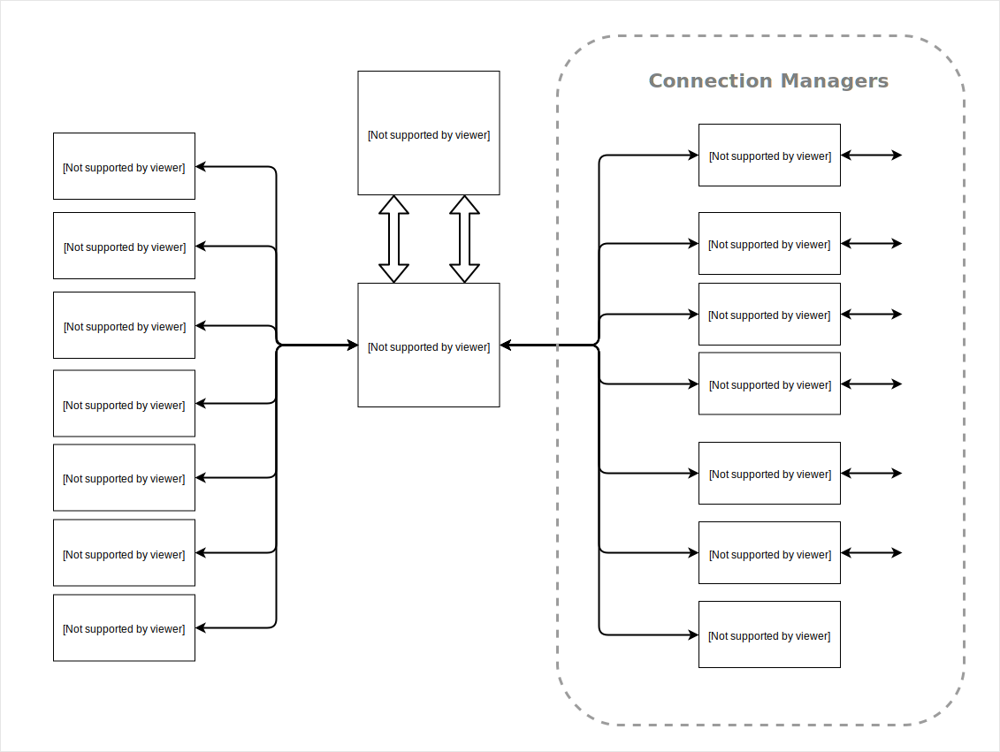

1.2. Tigase Code Style
----------------------

1.2.1. Introduction
^^^^^^^^^^^^^^^^^^^^


This documents defines and describes coding style and standard used in Tigase projects source code.

Examples should be considered as **non-normative**, that is formatting choices should not be treated as rules.

1.2.2. Source file basics
^^^^^^^^^^^^^^^^^^^^^^^^^^

Technicals details
~~~~~~~~~~~~~~~~~~~

-  File name consists of the case-sensitive, camel-cased name of the top-level class it contains plus the ``.java`` extension.

-  Source files are encoded in **UTF-8**.


1.2.3. Source file structure
^^^^^^^^^^^^^^^^^^^^^^^^^^^^^

A source file consists of, **in order**:

1. License or copyright information, if present

2. Package statement

3. Import statements

4. Exactly one top-level class

Additionally:

-  **Exactly one blank line** separates sections 2-4;

-  The package statement is **not line-wrapped** (column limit does not apply);

Import statements
~~~~~~~~~~~~~~~~~~~~

-  Wildcard imports can be used for:

   -  more than 5 class imports;

   -  more than 3 name imports;

-  import statements are **not line-wrapped** (column limit does not apply);

-  following import ordering applies:

   -  all imports not pertaining to any of the groups listed below

   -  ``blank line``

   -  ``javax.*`` classes

   -  ``java.*`` classes

   -  ``blank line``

   -  all static imports in single block

-  items in each block are ordered by names in ASCII sort order (since ``;`` sorts before ``.``)

Class declaration
~~~~~~~~~~~~~~~~~~

-  Each top-level class resides in a source file of its own.

Class contents order
~~~~~~~~~~~~~~~~~~~~

Following order of the elements of the class is mandatory:

-  ``final``, ``static`` fields in following order:

   -  ``public``

   -  ``protected``

   -  ``package-private``

   -  ``private``

-  ``public`` ``enum``

-  ``static`` fields in following order:

   -  ``public``

   -  ``protected``

   -  ``package-private``

   -  ``private``

-  ``static`` initializer block

-  ``final`` fields in following order:

   -  ``public``

   -  ``protected``

   -  ``package-private``

   -  ``private``

-  fields without modifiers in following order:

   -  ``public``

   -  ``protected``

   -  ``package-private``

   -  ``private``

-  initializer block

-  ``static`` method(s)

-  constructor(s)

-  methods(s) without modifiers

-  enums(s) without modifiers

-  interfaces(s) without modifiers

-  inner ``static`` classes

-  inner classes

In addition:

-  Getters and Setters are kept together

-  Overloads are never split - multiple constructors or methods with the same name appear sequentially.

1.2.4. Formatting
^^^^^^^^^^^^^^^^^^

Braces
~~~~~~~

-  Braces are mandatory in optional cases - for all syntax where braces use can be optional, Tigase mandate using braces even if the body is empty or contains only single statement.

-  Braces follow the Kernighan and Ritchie style (`Egyptian brackets <http://www.codinghorror.com/blog/2012/07/new-programming-jargon.html>`__):

   -  No line break before the opening brace.

   -  Line break after the opening brace.

   -  Line break before the closing brace.

   -  Line break after the closing brace, *only if* that brace terminates a statement or terminates the body of a method, constructor, or *named* class. For example, there is *no* line break after the brace if it is followed by ``else`` or a comma.


Block indentation: tab
~~~~~~~~~~~~~~~~~~~~~~~

All indentation (opening a new block of block-like construct) must be made with tabs. After the block, then indent returns to the previous.

Ideal tab-size: 4

Column limit: 120
~~~~~~~~~~~~~~~~~~~~

Defined column limit is 120 characters and must be line-wrapped as described below Java code has a column limit of 100 characters. Except as noted below, any line that would exceed this limit must be line-wrapped, as explained in section `Line-wrapping <#line-wrapping>`__.

Line-wrapping
~~~~~~~~~~~~~~

*line-wrapping* is a process of dividing long lines that would otherwise go over the defined Column Limit (above). It’s recommended to wrap lines whenever it’s possible even if they are not longer than defined limit.

Whitespace
~~~~~~~~~~

Vertical Whitespace
''''''''''''''''''''

A single blank line appears:

-  after package statement;

-  before imports;

-  after imports;

-  around class;

-  after class header;

-  around field in interface;

-  around method in interface;

-  around method;

-  around initializer;

-  as required by other sections of this document.

Multiple blank lines are not permitted.

Horizontal whitespace
''''''''''''''''''''''

Beyond where required by the language or other style rules, and apart from literals, comments and Javadoc, a single ASCII space also appears in the following places **only**.

1. Separating any reserved word, such as ``if``, ``for``, ``while``, ``switch``, ``try``, ``catch`` or ``synchronized``, from an open parenthesis (``(``) that follows it on that line

2. Separating any reserved word, such as ``else`` or ``catch``, from a closing curly brace (``}``) that precedes it on that line

3. Before any open curly brace (``{``), with two exceptions:

   -  ``@SomeAnnotation({a, b})`` (no space is used)

   -  ``String[][] x = {{"foo"}};`` (no space is required between ``{{``, by item 8 below)

4. On both sides of any binary or ternary operator. This also applies to the following "operator-like" symbols:

   -  the ampersand in a conjunctive type bound: ``<T extends Foo & Bar>``

   -  the pipe for a catch block that handles multiple exceptions: ``catch (FooException | BarException e)``

   -  the colon (``:``) in an enhanced ``for`` ("foreach") statement

   -  the arrow in a lambda expression: ``(String str) → str.length()``

      **but not:**

   -  the two colons (``::``) of a method reference, which is written like ``Object::toString``

   -  the dot separator (``.``), which is written like ``object.toString()``

5. After ``,:;`` or the closing parenthesis (``)``) of a cast

6. Between the type and variable of a declaration: ``List<String> list``

Horizontal alignment: never required
'''''''''''''''''''''''''''''''''''''

*Horizontal alignment* is the practice of adding a variable number of additional spaces in your code with the goal of making certain tokens appear directly below certain other tokens on previous lines.

This practice is permitted, but is **never required**. It is not even required to *maintain* horizontal alignment in places where it was already used.

Specific constructs
~~~~~~~~~~~~~~~~~~~~

Enum classes
'''''''''''''

After each comma that follows an enum constant, a line break is mandatory.

Variable declarations
''''''''''''''''''''''

-  One variable per declaration - Every variable declaration (field or local) declares only one variable: declarations such as ``int a, b;`` are not used.

-  Declared when needed -Local variables are **not** habitually declared at the start of their containing block or block-like construct. Instead, local variables are declared close to the point they are first used (within reason), to minimize their scope. Local variable declarations typically have initializers, or are initialized immediately after declaration.

Arrays
'''''''

Any array initializer may *optionally* be formatted as if it were a "block-like construct." (especially when line-wrapping need to be applied).

1.2.5. Naming
^^^^^^^^^^^^^^^^^

Rules common to all identifiers
~~~~~~~~~~~~~~~~~~~~~~~~~~~~~~~~~

Identifiers use only ASCII letters and digits, and, in a small number of cases noted below, underscores. Thus each valid identifier name is matched by the regular expression ``\w+`` .

Specific Rules by identifier type
''''''''''''''''''''''''''''''''''

-  Package names are all lowercase, with consecutive words simply concatenated together (no underscores, not camel-case).

-  Class names are written in **UpperCamelCase**.

-  Method names are written in **lowerCamelCase**.

-  Constant names use ``CONSTANT_CASE``: all uppercase letters, with words separated by underscores.

-  Non-constant field names (static or otherwise) are written in **lowerCamelCase**.

-  Parameter names are written in **lowerCamelCase** (one-character parameter names in public methods should be avoided).

-  Local variable names are written in **lowerCamelCase**.

1.2.6. Programming Practices
^^^^^^^^^^^^^^^^^^^^^^^^^^^^^^

-  A method is marked with the ``@Override`` annotation whenever it is legal. This includes a class method overriding a superclass method, a class method implementing an interface method, and an interface method re-specifying a super-interface method.

-  Caught exceptions should not be ignored (and if this is a must then a log entry is required).

1.2.7. Javadoc
^^^^^^^^^^^^^^^

-  blank lines should be inserted after:

   -  description,

   -  parameter description,

   -  return tag;

-  empty tag should be included for following tags:

   -  ``@params``

   -  ``@return``

   -  ``@throws``

Usage
~~~~~~

At the *minimum*, Javadoc is present for every ``public`` class, and every ``public`` or ``protected`` member of such a class, with a few exceptions:

-  is optional for "simple, obvious" methods like ``getFoo``, in cases where there *really and truly* is nothing else worthwhile to say but "Returns the foo".

-  in methods that overrides a supertype method.

1.3. Hack Tigase XMPP Server in Eclipse
----------------------------------------

If you want to write code for **Tigase** server we recommend using `Eclipse IDE <//https://eclipse.org/downloads/>`__. Either the IDE for Java or Java EE developers will work.

1.3.1. Requirements
^^^^^^^^^^^^^^^^^^^^

Eclipse IDE currently requires the use of `Java Development Kit 8 <http://www.oracle.com/technetwork/java/javase/downloads/jdk8-downloads-2133151.html>`__.

You will also need the M2E plugin for Maven integration, however this can be done inside Eclipse now, so refer to the `Plugin Installation <#m2EPlugin>`__ section for that.

1.3.2. Installation
^^^^^^^^^^^^^^^^^^^^

Eclipse does not come as an installer, but rather an archive. Extract the directory to a working location wherever you would like. Now install the JDK software, location is not important as Eclipse will find it automatically.

Before we begin, we will need to clone the repository from git.

Linux
~~~~~~~

For linux operating systems, navigate to a directory where you want the repository to be cloned to and type the following into terminal.

::

   git clone https://repository.tigase.org/git/tigase-server.git

Windows
~~~~~~~

Please see the Windows coding guide for instructions on how to obtain source code from git. If you don’t want to install git software specifically, you can use Eclipse’s git plugin to obtain the repository without any new software. First click on File, then Import…​ Next select from Git folder and the Projects from Git

|win git1|

Click next, and now select clone URI

|win git2|

Now click next, and in this window enter the following into the URI field

::

   git://repository.tigase.org/git/tigase-server.git

The rest of the fields will populate automatically

|win git3|

Select the master branch, and any branches you wish to edit. **The master branch should be the only one you need, branches are used for specific code changes**

|win git4|

Now select the directory where you wanted to clone the repository to. This was function as the project root directory you will use later on in the setup.

|win git5|

Once you click next Eclipse will download the repository and any branches you selected to that directory. Note you will be unable to import this git directory since there are no git a project specific files downloaded. However, once downloading is complete you may click cancel, and the git repository will remain in the directory you have chosen.

1.3.3. Setup
^^^^^^^^^^^^^

Once you have the main window open and have established a workspace (where most of your working files will be stored), click on Help and then Install New Software…​

|Eclipse help|

Under the Work With field enter the following and press enter: http://download.eclipse.org/technology/m2e/releases/

**Note: You may wish to click the Add…​ button and add the above location as a permanent software location to keep the location in memory**

|Eclipse m2Einstall|

You should see the M2 Eclipse software packages show in the main window. Click the check-box and click Next. Once the installer is finished it will need to restart Eclipse.

Once that is done, lets connect Eclipse to the cloned repository.

Click File and Import…​ to bring up the import dialog window. Select Maven and then Existing Maven Project.

|Eclipse importMaven|

Now click Next and point the root directory to where you cloned the git repository, Eclipse should automatically see the pom.xml file and show up in the next window.

|Eclipse importMaven2|

Once the import is finished, you are able to now begin working with Tigase’s code inside Eclipse! Happy coding!

.. |win git1| image:: images/win-git1.jpg
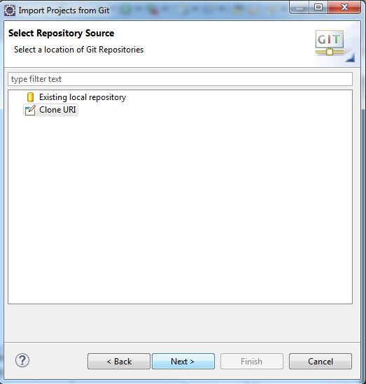
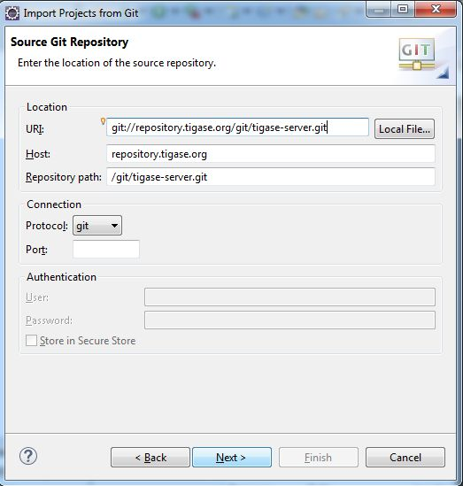
.. |win git4| image:: images/win-git4.jpg
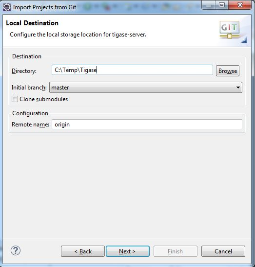
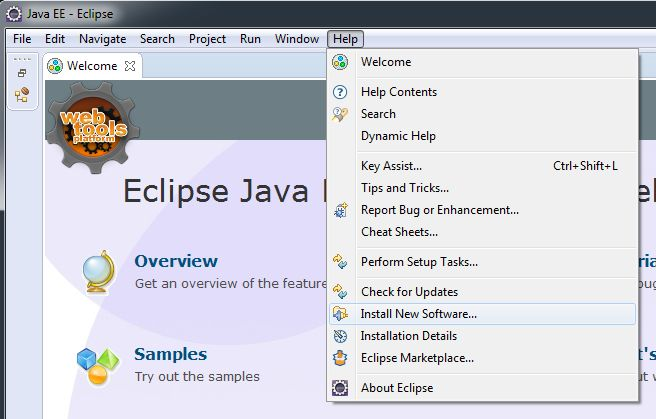
.. |Eclipse m2Einstall| image:: images/Eclipse-m2Einstall.jpg
.. |Eclipse importMaven| image:: images/Eclipse-importMaven.jpg
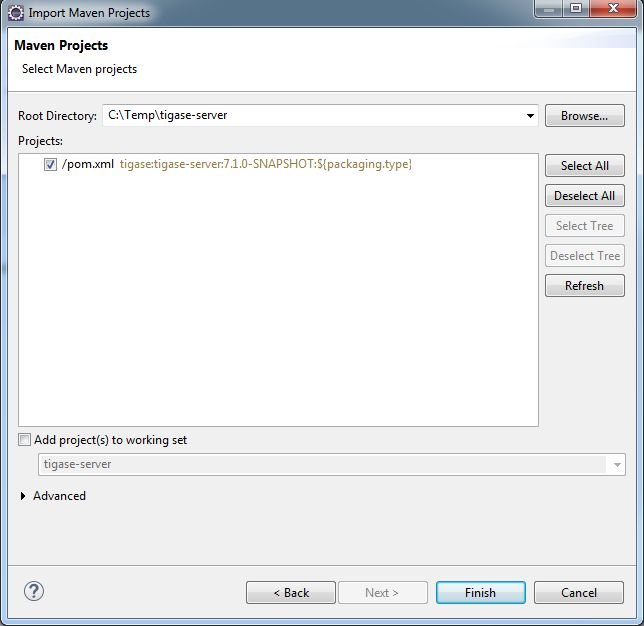

1.4. Server Compilation
------------------------

Tigase XMPP Server Project uses Maven for compilation. For details on Maven and it’s use, please see the `Maven Guide. <#usingMaven>`__

1.4.1. Distribution Packages
^^^^^^^^^^^^^^^^^^^^^^^^^^^^

Once Compiled, Tigase creates two separate distribution archives:

-  **-dist** is a minimal version containing only tigase-server, tigase-xmltools and tigase-utils, MUC, Pubsub, and HTTP.

-  **-dist-max** is a version containing all additional tigase components as well as dependencies required by those components.

They will be available as both zip and tarball.

1.4.2. Building Server and Generating Packages
^^^^^^^^^^^^^^^^^^^^^^^^^^^^^^^^^^^^^^^^^^^^^^^^^

Server binary and it’s documentation
~~~~~~~~~~~~~~~~~~~~~~~~~~~~~~~~~~~~~

After cloning tigase-server repository:

.. code:: bash

   git clone https://repository.tigase.org/git/tigase-server.git
   cd tigase-server

You compile server with maven :

.. code:: bash

   mvn clean install

This will: - Build Tigase XMPP tigase-server jar in tigase-server/target.

If you wish to include compilation of the documentation use *distribution* profile:

.. code:: bash

   mvn -Pdist clean install

This will - compile server binaries. - generate javadoc and manual documentation ``tigase-server/target/_docs`` directory.

Server distribution packages
~~~~~~~~~~~~~~~~~~~~~~~~~~~~~

Distribution building is handled by separate project (`Tigase Server Distribution <https://github.com/tigase/tigase-server-distribution>`__)

In order to build distribution packages \* clone tigase-server-distribution repository:

.. code:: bash

   git clone https://git.tigase.tech/tigase-server-distribution
   tigase-server-distribution

and compile it using maven with *distribution* profile:

.. code:: bash

   mvn -Pdist clean install

This will:

-  compile all documentation sources (including dependencies) and place them in ``tigase-server-distribution/target/_docs`` directory

-  download all dependencies in defined versions and put them in ``tigase-server-distribution/target/dist/jars/`` directory.

-  create both types of distribution packages (-dist and -dist-max) and place them in ``tigase-server-distribution/target/_dist/`` directory.

1.4.3. Running Server
^^^^^^^^^^^^^^^^^^^^^^^

Afterwards you can run the server with the regular shell script from within ``server`` module:

.. code:: bash

   cd server
   ./scripts/tigase.sh start etc/tigase.conf

Please bear in mind, that you need to provide correct setup in etc/config.tdsl configuration files for the server to work correctly.

1.5. Tigase Kernel
------------------

Tigase Kernel is an implementation of `IoC <https://en.wikipedia.org/wiki/Inversion_of_control>`__ created for Tigase XMPP Server. It is responsible for maintaining object lifecycle and provides mechanisms for dependency resolutions between beans.

Additionally, as and optional feature, Tigase Kernel is capable of configuring beans using a provided bean configurator.

1.5.1. Basics
^^^^^^^^^^^^^^

What is kernel?
~~~~~~~~~~~~~~~~

Kernel is an instance of the ``Kernel`` class which is responsible for managing scope and visibility of beans. Kernel handles bean:

-  registration of a bean

-  unregistration of a bean

-  initialization of a bean

-  deinitialization of a bean

-  dependency injection to the bean

-  handling of bean lifecycle

-  registration of additional beans based on annotations *(optionally using registered class implementing ``BeanConfigurator`` as ``defaultBeanConfigurator``)*

-  configuration of a bean *(optionally thru registered class implementing ``BeanConfigurator`` as ``defaultBeanConfigurator``)*

Kernel core is responsible for dependency resolution and maintaining lifecycle of beans. Other features, like proper configuration of beans are done by additional beans working inside the Kernel.

Kernel identifies beans by their name, so each kernel may have only one bean named ``abc``. If more than one bean has the same name, then the last one registered will be used as its registration will override previously registered beans. You may use whatever name you want to name a bean inside kernel but it cannot:

-  be ``service`` as this name is used by Tigase Kernel internally when \`RegistrarBean`s are in use (see `RegistrarBean <#registrarBean>`__

-  end with ``#KERNEL`` as this names are also used by Tigase Kernel internally

.. Tip::

   Kernel initializes beans using lazy initialization. This means that if a bean is not required by any other beans, or not retrieved from the kernel manually, an instance will not be created.

During registration of a bean, the kernel checks if there is any beans which requires this newly registered bean and if so, then instance of a newly registered bean will be created and injected to fields which require it.

What is a kernel scope?
~~~~~~~~~~~~~~~~~~~~~~~~~

Each kernel has its own scope in which it can look for beans. By default kernel while injecting dependencies may look for them only in the same kernel instance in which new instance of a bean is created or in the direct parent kernel. This way it is possible to have separate beans named the same in the different kernel scopes.

.. Note::

   If bean is marked as ``exportable``, it is also visible in all descendants kernel scopes.

What is a bean?
~~~~~~~~~~~~~~~

A bean is a named instance of the class which has parameterless constructor and which is registered in the kernel.

.. Warning::

    Parameterless constructor is a required as it will be used by kernel to create an instance of the bean, see `bean lifecycle <#beanLifecycle>`__.

1.5.2. Lifecycle of a bean
^^^^^^^^^^^^^^^^^^^^^^^^^^^

Creating instance of a bean
~~~~~~~~~~~~~~~~~~~~~~~~~~~~

Instantiation of a bean
'''''''''''''''''''''''''

During this step, kernel creates instance of the class which was registered for this bean (for more details see **Registration of a bean**). Instance of a bean is created using paremeterless constructor of a class.

.. Note::

   Bean instance is only created for required beans (i.e. beans that were injected somewhere).

.. Note::

   It’s possible to create bean instance without the need to inject it anywhere - such bean should be annoted with ``@Autostart`` annotation.

Configuring a bean *(optional)*
''''''''''''''''''''''''''''''''

In this step kernel passes class instance of a bean to the configurator bean (an instance of ``BeanConfigurator`` if available), for configuring it. During this step, ``BeanConfigurator`` instance, which is aware of the configuration loaded from the file, injects this configuration to the bean fields annotated with ``@ConfigField`` annotation. By default configurator uses reflections to access those fields. However, if a bean has a corresponding public ``setter``/``getter`` methods for a field annotated with ``@ConfigField`` (method parameter/return type matches field type), then configurator will use them instead of accessing a field via reflection.

.. Note::

   If there is no value for a field specified in the configuration or value is equal to the current value of the field, then configurator will skip setting value for this field (It will also not call ``setter`` method even if it exists).

At the end of the configuration step, if bean implements ``ConfigurationChangedAware`` interface, then method ``beanConfigurationChanged(Collection<String> changedFields)`` is being called, to notify bean about field names which values has changed. This is useful, if you need to update bean configuration, when you have all configuration available inside bean.

.. Note::

   Configuration of the bean may be changed at runtime and it will be applied in the same way as initial configuration is passed to the bean. So please keep in mind that ``getter``/``setter`` may be called multiple times - even for already configured and initialized bean.

Injecting dependencies
'''''''''''''''''''''''

At this point kernel looks for the bean class fields annotated with ``@Inject`` and looks for a value for each of this fields. During this step, kernel checks list of available beans in this kernel, which matches field type and additional constraints specified in the annotation.

When a required value (instance of a bean) is found, then kernel tries to inject it using reflection. However, if there is a matching ``getter``/``setter`` defined for that field it will be called instead of reflection.

.. Note::

   If dependency changes, ie. due to reconfiguration, then value of the dependent field will change and ``setter`` will be called if it exists. So please keep in mind that ``getter``/``setter`` may be called multiple times - even for already configured and initialized bean.

Initialization of a bean
'''''''''''''''''''''''''

When bean is configured and dependencies are set, then initialization of a bean is almost finished. At this point, if bean implements ``Initializable`` interface, kernel calls ``initialize()`` method to allow bean initialize properly if needed.

Destroying instance of a bean
~~~~~~~~~~~~~~~~~~~~~~~~~~~~~~

When bean is being unloaded, then reference to its instance is just dropped. However, if bean class implements ``UnregisterAware`` interface, then kernel calls ``beforeUnregister()`` method. This is very useful in case which bean acquires some resources during initialization and should release them now.

.. Note::

   This method will not be called if bean was not initialized fully (bean initialization step was note passed)!

Reconfiguration of a bean *(optional)*
~~~~~~~~~~~~~~~~~~~~~~~~~~~~~~~~~~~~~~~

At any point in time bean may be reconfigured by default bean configurator (instance of ``BeanConfigurator``) registered in the kernel. This will happen in the same way as it described in `Configuring a bean <#beanConfiguration>`__ in **Creating instace of a bean** section.

Updating dependencies
~~~~~~~~~~~~~~~~~~~~~~

It may happen, that due to reconfiguration or registration/unregistration or activation/deactivation of some other beans dependencies of a bean will change. As a result, Tigase Kernel will inject new dependencies as described in `Injecting dependencies <#beanInjectingDependencies>`__

1.5.3. Registration of a bean
^^^^^^^^^^^^^^^^^^^^^^^^^^^^^^

There are few ways to register a bean.

Using annotation *(recommended but optional)*
~~~~~~~~~~~~~~~~~~~~~~~~~~~~~~~~~~~~~~~~~~~~~~~

To register a bean using annotation you need to annotate it with ``@Bean`` annotation and pass values for following properties:

-  ``name`` - name under which item should be registered

-  ``active`` - ``true`` if bean should be enabled without enabling it in the configuration *(however it is still possible to disable it using configuration)*

-  ``parent`` - class of the parent bean which activation should trigger registration of your bean. **In most cases parent class should be implementing ``RegistrarBean``**

-  ``parents`` - array of classes which should be threaten as ``parent`` classes if more than one parent class is required *(optional)*

-  ``exportable`` - ``true`` if bean should be visible in all descendant kernels (in other case default visibility rules will be applied) *(optional)*

-  ``selectors`` - array of selector classes which will decide whether class should be registered or not *(optional)*

.. Tip::

   If ``parent`` is set to ``Kernel.class`` it tells kernel to register this bean in the root/main kernel (top-level kernel).

If you want your bean ``SomeDependencyBean`` to be registered when another bean ``ParentBean`` is being registered (like a required dependency), you may annotate your bean ``SomeDependencyBean`` with ``@Bean`` annotation like this example:

.. code:: java

   @Bean(name = "nameOfSomeDependencyBean", parent = ParentBean.class, active = true)
   public class SomeDependencyBean {
       ...
   }

.. Warning::

    Works only if bean registered as ``defaultBeanConfigurator`` supports this feature. By default Tigase XMPP Server uses ``DSLBeanConfigurator`` which is subclass of ``AbstractBeanConfigurator`` which provides support for this feature.

Setting ``parent`` to class not implementing ``RegistrarBean`` interface
~~~~~~~~~~~~~~~~~~~~~~~~~~~~~~~~~~~~~~~~~~~~~~~~~~~~~~~~~~~~~~~~~~~~~~~~~

If ``parent`` is set to the class which is not implementing ``RegistrarBean`` interface, then your bean will be registered in the same kernel scope in which parent bean is registered. If you do so, ie. by setting parent to the class of the bean which is registered in the ``kernel1`` and your bean will be also registered in ``kernel1``. As the result it will be exposed to other beans in the same kernel scope. This also means that if you will configure it in the same way as you would set ``parent`` to the ``parent`` of annotation of the class to which your ``parent`` point to.

**Example.**

.. code:: java

   @Bean(name="bean1", parent=Kernel.class)
   public class Bean1 {
       @ConfigField(desc="Description")
       private int field1 = 0;
       ....
   }

   @Bean(name="bean2", parent=Bean1.class)
   public class Bean2 {
       @ConfigField(desc="Description")
       private int field2 = 0;
       ....
   }

In this case it means that ``bean1`` is registered in the root/main kernel instance. At the same time, ``bean2`` is also registered to the root/main kernel as its value of ``parent`` property of annotation points to class not implementing ``RegistrarBean``.

To configure value of ``field1`` in instance of ``bean1`` and ``field2`` in instance of ``bean2`` in DSL (for more information about DSL format please check section ``DSL file format`` of the ``Admin Guide``) you would need to use following entry in the config file:

.. code:: dsl

   bean1 {
       field1 = 1
   }
   bean2 {
       field2 = 2
   }

As you can see, this resulted in the ``bean2`` configuration being on the same level as ``bean1`` configuration.

Calling kernel methods
~~~~~~~~~~~~~~~~~~~~~~~

As a class
''''''''''''

To register a bean as a class, you need to have an instance of a Tigase Kernel execute it’s ``registerBean()`` method passing your ``Bean1`` class.

.. code:: java

   kernel.registerBean(Bean1.class).exec();

.. Note::

   To be able to use this method you will need to annotate ``Bean1`` class with ``@Bean`` annotation and provide a bean name which will be used for registration of the bean.

As a factory
'''''''''''''

To do this you need to have an instance of a Tigase Kernel execute it’s ``registerBean()`` method passing your bean ``Bean5`` class.

.. code:: java

   kernel.registerBean("bean5").asClass(Bean5.class).withFactory(Bean5Factory.class).exec();

As an instance
'''''''''''''''

For this you need to have an instance of a Tigase Kernel execute it’s ``registerBean()`` method passing your bean ``Bean41`` class instance.

.. code:: java

   Bean41 bean41 = new Bean41();
   kernel.registerBean("bean4_1").asInstance(bean41).exec();

.. Warning::

    Beans registered as an instance will not inject dependencies. As well this bean instances will not be configured by provided bean configurators.

Using config file *(optional)*
~~~~~~~~~~~~~~~~~~~~~~~~~~~~~~~

If there is registered a bean ``defaultBeanConfigurator`` which supports registration in the config file, it is possible to do so. By default Tigase XMPP Server uses ``DSLBeanConfigurator`` which provides support for that and registration is possible in the config file in DSL. As registration of beans using a config file is part of the admin of the Tigase XMPP Server tasks, it is described in explained in the Admin Guide in subsection ``Defining bean`` of ``DSL file format`` section.

.. Tip::

   This way allows admin to select different class for a bean. This option should be used to provide alternative implementations to the default beans which should be registered using annotations.

.. Warning::

    Works only if bean registered as ``defaultBeanConfigurator`` supports this feature. By default Tigase XMPP Server uses ``DSLBeanConfigurator`` which provides support for that.

1.5.4. Defining dependencies
^^^^^^^^^^^^^^^^^^^^^^^^^^^^^

All dependencies are defined with annotations:

.. code:: java

   public class Bean1 {
     @Inject
     private Bean2 bean2;

     @Inject(bean = "bean3")
     private Bean3 bean3;

     @Inject(type = Bean4.class)
     private Bean4 bean4;

     @Inject
     private Special[] tableOfSpecial;

     @Inject(type = Special.class)
     private Set<Special> collectionOfSpecial;

     @Inject(nullAllowed = true)
     private Bean5 bean5;
   }

Kernel automatically determines type of a required beans based on field type. As a result, there is no need to specify the type of a bean in case of ``bean4`` field.

When there are more than one bean instances matching required dependency fields, the type needs to be an array or collection. If kernel is unable to resolve dependencies, it will throw an exception unless ``@Inject`` annotation has ``nullAllowed`` set to ``true``. This is useful to make some dependencies optional. To help kernel select a single bean instance when more that one bean will match field dependency, you may set name of a required bean as shown in annotation to field ``bean3``.

Dependencies are inserted using getters/setters if those methods exist, otherwise they are inserted directly to the fields. Thanks to usage of setters, it is possible to detect a change of dependency instance and react as required, i.e. clear internal cache.

.. Warning::

    Kernel is resolving dependencies during injection only using beans visible in its scope. This makes it unable to inject an instance of a class which is not registered in the same kernel as a bean or not visible in this kernel scope (see `Scope and visibility <#kernelScope>`__).

.. Warning::

    If two beans have bidirectional dependencies, then it is required to allow at least one of them be ``null`` (make it an optional dependency). In other case it will create circular dependency which cannot be satisfied and kernel will throw exceptions at runtime.


1.5.5. Nested kernels and exported beans
^^^^^^^^^^^^^^^^^^^^^^^^^^^^^^^^^^^^^^^^^^

Tigase Kernel allows the usage of nested kernels. This allows you to create complex applications and maintain proper separation and visibility of beans in scopes as each module (subkernel) may work within its own scope.

Subkernels may be created using one of two ways:

Manual registration of new a new kernel
~~~~~~~~~~~~~~~~~~~~~~~~~~~~~~~~~~~~~~~~~~

You can create an instance of a new kernel and register it as a bean within the parent kernel.

.. code:: java

   Kernel parent = new Kernel("parent");
   Kernel child = new Kernel("child");
   parent.registerBean(child.getName()).asInstance(child).exec();

Usage of RegistrarBean
~~~~~~~~~~~~~~~~~~~~~~~~~

You may create a bean which implements the ``RegistrarBean`` interfaces. For all beans that implement this interface, subkernels are created. You can access this new kernel within an instance of ``RegistrarBean`` class as ``register(Kernel)`` and ``unregister(Kernel)`` methods are called once the ``RegistrarBean`` instance is created or destroyed.

There is also an interface named ``RegistrarBeanWithDefaultBeanClass``. This interface is very useful if you want or need to create a bean which would allow you to configure many subbeans which will have the same class but different names and you do not know names of those beans before configuration will be set. All you need to do is to implement this interface and in method ``getDefaultBeanClass()`` return class which should be used for all subbeans defined in configuration for which there will be no class configured.

As an example of such use case is ``dataSource`` bean, which allows administrator to easily configure many data sources without passing their class names, ie.

.. code:: dsl

   dataSource {
       default () { .... }
       domain1 () { .... }
       domain2 () { .... }
   }

With this config we just defined 3 beans named ``default``, ``domain1`` and ``domain2``. All of those beans will be instances of a class returned by a ``getDefaultBeanClass()`` method of ``dataSource`` bean.

Scope and visibility
~~~~~~~~~~~~~~~~~~~~~~

Beans that are registered within a parent kernel are visible to beans registered within the first level of child kernels. However, **beans registered within child kernels are not available to beans registered in a parent kernel** with the exception that they are visible to bean that created the subkernel (an instance of ``RegistrarBean``).

It is possible to export beans so they can be visible outside the first level of child kernels.

To do so, you need to mark the bean as exportable using annotations or by calling the ``exportable()`` method.

**Using annotation.**

.. code:: java

   @Bean(name = "bean1", exportable = true)
   public class Bean1 {
   }

**Calling ``exportable()``.**

.. code:: java

   kernel.registerBean(Bean1.class).exportable().exec();

Dependency graph
~~~~~~~~~~~~~~~~~

Kernel allows the creation of a dependency graph. The following lines will generate it in a format supported by `Graphviz <http://www.graphviz.org>`__.

.. code:: java

   DependencyGrapher dg = new DependencyGrapher(krnl);
   String dot = dg.getDependencyGraph();

1.5.6. Configuration
^^^^^^^^^^^^^^^^^^^^^

The kernel core does not provide any way to configure created beans. Do do that you need to use the ``DSLBeanConfigurator`` class by providing its instance within configuration and registration of this instances within kernel.

**Example.**

.. code:: java

   Kernel kernel = new Kernel("root");
   kernel.registerBean(DefaultTypesConverter.class).exportable().exec();
   kernel.registerBean(DSLBeanConfigurator.class).exportable().exec();
   DSLBeanConfigurator configurator = kernel.getInstance(DSLBeanConfigurator.class);
   Map<String, Object> cfg = new ConfigReader().read(file);
   configurator.setProperties(cfg);
   // and now register other beans...

DSL and kernel scopes
~~~~~~~~~~~~~~~~~~~~~~~~~

DSL is a structure based format explained in `Tigase XMPP Server Administration Guide: DSL file format section <http://docs.tigase.org/tigase-server/snapshot/Administration_Guide/html/#dslConfig>`__. **It is important to know that kernel and beans structure have an impact on what the configuration in DSL will look like.**

**Example kernel and beans classes.**

.. code:: java

   @Bean(name = "bean1", parent = Kernel.class, active = true )
   public class Bean1 implements RegistrarBean {
     @ConfigField(desc = "V1")
     private String v1;

     public void register(Kernel kernel) {
       kernel.registerBean("bean1_1").asClass(Bean11.class).exec();
     }

     public void unregister(Kernel kernel) {}
   }

   public class Bean11 {
     @ConfigField(desc = "V11")
     private String v11;
   }

   @Bean(name = "bean1_2", parent = Bean1.class, active = true)
   public class Bean12 {
     @ConfigField(desc = "V12")
     private String v12;
   }

   @Bean(name = "bean2", active = true)
   public class Bean2 {
     @ConfigField(desc = "V2")
     private String v2;
   }

   public class Bean3 {
     @ConfigField(desc = "V3")
     private String v3;
   }

   public class Main {
     public static void main(String[] args) {
       Kernel kernel = new Kernel("root");
       kernel.registerBean(DefaultTypesConverter.class).exportable().exec();
       kernel.registerBean(DSLBeanConfigurator.class).exportable().exec();
       DSLBeanConfigurator configurator = kernel.getInstance(DSLBeanConfigurator.class);
       Map<String, Object> cfg = new ConfigReader().read(file);
       configurator.setProperties(cfg);

       configurator.registerBeans(null, null, config.getProperties());

       kernel.registerBean("bean4").asClass(Bean2.class).exec();
       kernel.registerBean("bean3").asClass(Bean3.class).exec();
     }
   }

Following classes will produce following structure of beans:

-  "bean1" of class ``Bean1``

   -  "bean1_1" of class ``Bean11``

   -  "bean1_2" of class ``Bean12``

-  "bean4" of class ``Bean2``

-  "bean3" of class ``Bean3``

.. Note::

   This is a simplified structure, the actual structure is slightly more complex. However. this version makes it easier to explain structure of beans and impact on configuration file structure.

.. Warning::

    Even though ``Bean2`` was annotated with name ``bean2``, it was registered with name ``bean4`` as this name was passed during registration of a bean in ``main()`` method.

.. Tip::

   ``Bean12`` was registered under name ``bean1_2`` as subbean of ``Bean1`` as a result of annotation of ``Bean12``

As mentioned DSL file structure depends on structure of beans, a file to set a config field in each bean to bean name should look like that:

.. code:: dsl

   'bean1' () {
       'v1' = 'bean1'

       'bean1_1' () {
           'v11' = 'bean1_1'
       }
       'bean1_2' () {
           'v12' = 'bean1_2'
       }
   }
   'bean4' () {
       'v2' = 'bean4'
   }
   'bean3' () {
       'v3' = 'bean3'
   }

1.6. Data Source and Repositories
----------------------------------

In Tigase XMPP Server 8.0.0 a new concept of data sources was introduced. It was introduced to create distinction between classes responsible for maintaining connection to actual data source and classes operating on this data source.

1.6.1. Data sources
^^^^^^^^^^^^^^^^^^^^^

|Relations between DataSourceBean and DataSources|

DataSource
~~~~~~~~~~~

``DataSource`` is an interface which should be implemented by all classes implementing access to data source, i.e. implementing access to database using JDBC connection or to MongoDB. Implementation of ``DataSource`` is automatically selected using uri provided in configuration and ``@Repository.Meta`` annotation on classes implementing ``DataSource`` interface.

DataSourcePool
~~~~~~~~~~~~~~~

``DataSourcePool`` is interface which should be implemented by classes acting as a pool of data sources for single domain. There is no requirement to create class implementing this interface, however if implementation of ``DataSource`` is blocking and does not support concurrent requests, then creation of ``DataSourcePool`` is recommended. An example of such case is implementation of ``DataRepositoryImpl`` which executes all requests using single connection and for this class there is ``DataRepositoryPool`` implementing ``DataSourcePool`` interface and improving performance. Implementation of ``DataSourcePool`` is automatically selected using uri provided in configuration and ``@Repository.Meta`` annotation on classes implementing ``DataSourcePool`` interface.

DataSourceBean
~~~~~~~~~~~~~~~~~~

This class is a helper class and provides support for handling multiple data sources. You can think of a ``DataSourceBean`` as a map of named ``DataSource`` or ``DataSourcePool`` instances. This class is also responsible for initialization of data source. Moreover, if data source will change during runtime ``DataSourceBean`` is responsible for firing a ``DataSourceChangedEvent`` to notify other classes about this change.

1.6.2. User and authentication repositories
^^^^^^^^^^^^^^^^^^^^^^^^^^^^^^^^^^^^^^^^^^^^

This repositories may be using existing (configured and initialized) data sources. However, it is also possible to that they may have their own connections. Usage of data sources is recommended if possible.

|Relations between AuthRepositories and DataSources|

|Relations between UserRepositories and DataSources|

AuthRepository and UserRepository
~~~~~~~~~~~~~~~~~~~~~~~~~~~~~~~~~~

This are a base interfaces which needs to be implemented by authentication repository (``AuthRepository``) and by repository of users (``UserRepository``). Classes implementing this interfaces should be only responsible for retrieving data from data sources.

AuthRepositoryPool and UserRepositoryPool
~~~~~~~~~~~~~~~~~~~~~~~~~~~~~~~~~~~~~~~~~~~~

If class implementing ``AuthRepositoryPool`` or ``UserRepositoryPool`` is not using data sources or contains blocking or is not good with concurrent access, then it should be wrapped within proper repository pool. Most of implementations provided as part of Tigase XMPP Server do not require to be wrapped within repository pool. If your implementation is blocking or not perform well with concurrent access (ie. due to synchronization), then it should be wrapped within this pool. To wrap implementation within a pool, you need to set ``pool-cls`` property of configured user or authentication repository in your configuration file.

AuthRepositoryMDPoolBean and UserRepositoryMDPoolBean
~~~~~~~~~~~~~~~~~~~~~~~~~~~~~~~~~~~~~~~~~~~~~~~~~~~~~~

This classes are for classes implementing ``AuthRepository`` and ``UserRepository`` what ``DataSourceBean`` is for classes implementing ``DataSource`` interface. This classes holds map of named authentication or user repositories. They are also responsible for initialization of classes implementing this repositories.


1.6.3. Other repositories
^^^^^^^^^^^^^^^^^^^^^^^^^^

It is possible to implement repositories not implementing ``AuthRepository`` or ``UserRepository``. Each type of custom repository should have its own API and its own interface.

|Relations between custom repositories and DataSources|

DataSourceAware
~~~~~~~~~~~~~~~~

Custom repositories should implement they own interface specifying its API. This interfaces should extend ``DataSourceAware`` interface which is base interface required to be implemented by custom repositories. ``DataSourceAware`` has a method ``setDataSource()`` which will be called with instance of data source to initialize instance of custom repository. Implementations should be annotated with ``@Repository.Meta`` implementation to make the automatically selected for proper type of ``DataSource`` implementation.

MDRepositoryBean
~~~~~~~~~~~~~~~~~

It is required to create a class extending ``MDRepositoryBean`` implementing same custom interface as the custom repository. This class will be a multi domain pool, allowing you to have separate implementation of custom repository for each domain. Moreover, it will be responsible for creation and initialization of your custom repository instances.

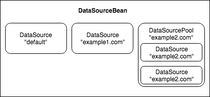
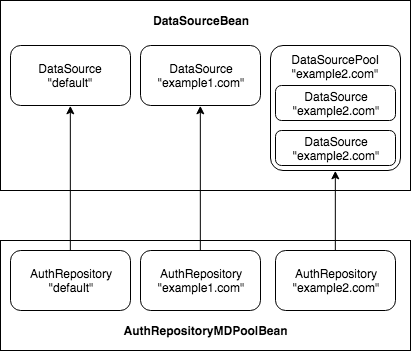
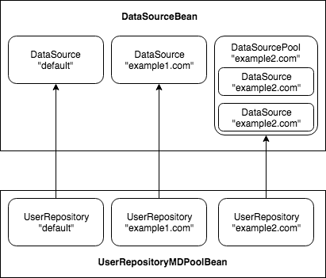
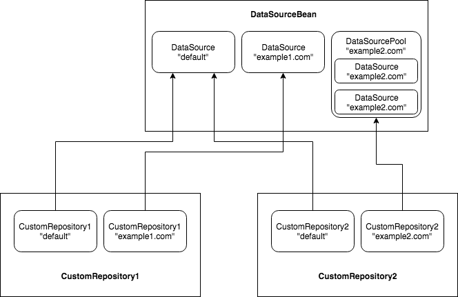

1.7. Component Development
---------------------------

A component in the Tigase is an entity with its own JID address. It can receive packets, process them, and can also generate packets.

An example of the best known components is MUC or PubSub. In Tigase however, almost everything is actually a component: Session Manager, s2s connections manager, Message Router, etc…​ Components are loaded based on the server configuration, new components can be loaded and activated at run-time. You can easily replace a component implementation and the only change to make is a class name in the configuration entry.

Creating components for Tigase server is an essential part of the server development hence there is a lot of useful API and ready to use code available. This guide should help you to get familiar with the API and how to quickly and efficiently create your own component implementations.

1. `Component implementation - Lesson 1 - Basics <#cil1>`__

2. `Component implementation - Lesson 2 - Configuration <#cil2>`__

3. `Component implementation - Lesson 3 - Multi-Threading <#cil3>`__

4. `Component implementation - Lesson 4 - Service Discovery <#cil4>`__

5. `Component implementation - Lesson 5 - Statistics <#cil5>`__

6. `Component implementation - Lesson 6 - Scripting Support <#cil6>`__

7. `Component implementation - Lesson 7 - Data Repository <#cil7>`__

8. `Component implementation - Lesson 8 - Startup Time <#cil8>`__

9. `Packet Filtering in Component <#packetfiltering>`__

1.7.1. Component Implementation - Lesson 1 - Basics
^^^^^^^^^^^^^^^^^^^^^^^^^^^^^^^^^^^^^^^^^^^^^^^^^^^^

Creating a Tigase component is actually very simple and with broad API available you can create a powerful component with just a few lines of code. You can find detailed API description elsewhere. This series presents hands on lessons with code examples, teaching how to get desired results in the simplest possible code using existing Tigase API.

Even though all Tigase components are just implementations of the **ServerComponent** interface I will keep such a low level information to necessary minimum. Creating a new component based on just interfaces, while very possible, is not very effective. This guide intends to teach you how to make use of what is already there, ready to use with a minimal coding effort.

This is just the first lesson of the series where I cover basics of the component implementation.

Let’s get started and create the Tigase component:

.. code:: java

   import java.util.logging.Logger;
   import tigase.component.AbstractKernelBasedComponent;
   import tigase.server.Packet;

   public class TestComponent extends AbstractKernelBasedComponent {

     private static final Logger log = Logger.getLogger(TestComponent.class.getName());

     @Override
     public String getComponentVersion() {
       String version = this.getClass().getPackage().getImplementationVersion();
       return version == null ? "0.0.0" : version;
     }

     @Override
     public boolean isDiscoNonAdmin() {
       return false;
     }

     @Override
     protected void registerModules(Kernel kernel) {
       // here we need to register modules responsible for processing packets
     }

   }

As you can see we have 3 mandatory methods when we extends **AbstractKernelBasedComponent**:

-  **String getComponentVersion()** which returns version of a component for logging purposes

-  **boolean isDiscoNonAdmin()** which decides if component will be visible for users other that server administrators

-  **void registerModules(Kernel kernel)** which allows you to register component modules responsible for actual processing of packets

.. Tip::

   If you decide you do not want to use modules for processing packets (even though we strongly suggest to use them, as thanks to modules components are easily extendible) you can implement one more method **void processPacket(Packet packet)** which will be called for every packet sent to a component. This method is actually logical as the main task for your component is processing packets.

Class name for our new component is **TestComponent** and we have also initialized a separated logger for this class. Doing This is very useful as it allows us to easily find log entries created by our class.

With these a few lines of code you have a fully functional Tigase component which can be loaded to the Tigase server; it can receive and process packets, shows as an element on service discovery list (for administrators only), responds to administrator ad-hoc commands, supports scripting, generates statistics, can be deployed as an external component, and a few other things.

Next important step is to create modules responsible for processing packets. For now let’s create module responsible for handling messages by appending them to log file:

.. code:: java

   @Bean(name = "test-module", parent = TestComponent.class, active = true)
   public static class TestModule extends AbstractModule {

     private static final Logger log = Logger.getLogger(TestModule.class.getCanonicalName());

     private static final Criteria CRITERIA = ElementCriteria.name("message");

     @Override
     public Criteria getModuleCriteria() {
       return CRITERIA;
     }

     @Override
     public void process(Packet packet) throws ComponentException, TigaseStringprepException {
       log.finest("My packet: " + packet.toString());
     }
   }

Instance of ``Criteria`` class returned by ``Criteria getModuleCriteria()`` is used by component class to decide if packet should be processed by this module or not. In this case we returned instance which matches any packet which is a **message**.

And finally we have a very important method ``void process(Packet packet)`` which is main processing method of a component. If component will receive packet that matches criteria returned by module - this method will be called.

But how we can send packet from a module? **AbstractModule** contains method **void write(Packet packet)** which you can use to send packets from a component.

Before we go any further with the implementation let’s configure the component in Tigase server so it is loaded next time the server starts. Assuming our **init.tdsl** file looks like this one:

::

   'config-type' = 'default'
   'debug' = ['server']
   'default-virtual-host' = [ 'devel.tigase.org' ]
   admins = [ 'admin@devel.tigase.org' ]
   dataSource {
     default () {
       uri = 'jdbc:derby:/Tigase/tigasedb'
     }
   }
   muc() {}
   pubsub() {}

We can see that it already is configured to load two other components: **MUC** and **PubSub**. Let’s add a third - our new component to the configuration file by appending the following line in the properties file:

.. code:: java

   test(class: TestComponent) {}

Now we have to restart the server.

There are a few ways to check whether our component has been loaded to the server. Probably the easiest is to connect to the server from an administrator account and look at the service discovery list.

|service disco test comp admin 300|

If everything goes well you should see an entry on the list similar to the highlighted one on the screenshot. The component description is "*Undefined description*" which is a default description and we can change it later on, the component default JID is: **test@devel.tigase.org**, where **devel.tigase.org** is the server domain and test is the component name.

Another way to find out if the component has been loaded is by looking at the log files. Getting yourself familiar with Tigase log files will be very useful thing if you plan on developing Tigase components. So let’s look at the log file **logs/tigase.log.0**, if the component has been loaded you should find following lines in the log:

.. code:: bash

   MessageRouter.setProperties() FINER: Loading and registering message receiver: test
   MessageRouter.addRouter() INFO: Adding receiver: TestComponent
   MessageRouter.addComponent() INFO: Adding component: TestComponent

If your component did not load you should first check configuration files. Maybe the Tigase could not find your class at startup time. Make sure your class is in **CLASSPATH** or copy a JAR file with your class to Tigase **jars/** directory.

Assuming everything went well and your component is loaded by the sever and it shows on the service discovery list as on the screenshot above you can double click on it to get a window with a list of ad-hoc commands - administrator scripts. A window on the screenshot shows only two basic commands for adding and removing script which is a good start.

|commands list test 200|

Moreover, you can browse the server statistics in the service discovery window to find your new test component on the list. If you click on the component it shows you a window with component statistics, very basic packets counters.

|service disco stats 200|

As we can see with just a few lines of code our new component is quite mighty and can do a lot of things without much effort from the developer side.

Now, the time has come to the most important question. Can our new component do something useful, that is can it receive and process XMPP packets?

Let’s try it out. Using you favorite client send a message to JID: **test@devel.tigase.org** (assuming your server is configured for **devel.tigase.org** domain). You can either use kind of XML console in your client or just send a plain message to the component JID. According to our code in **process(…​)** method it should log our message. For this test I have sent a message with subject: "*test message*" and body: "*this is a test*". The log file should contain following entry:

.. code:: bash

   TestModule.process() FINEST: My packet: to=null, from=null,
   data=<message from="admin@devel.tigase.org/devel"
     to="test@devel.tigase.org" id="abcaa" xmlns="jabber:client">
     <subject>test message</subject>
     <body>this is a test</body>
   </message>, XMLNS=jabber:client, priority=NORMAL

If this is a case we can be sure that everything works as expected and all we now have to do is to fill the **process(…​)** method with some useful code.

.. |service disco test comp admin 300| image:: images/service-disco-test-comp-admin-300.png
.. |commands list test 200| image:: images/commands-list-test-200.png
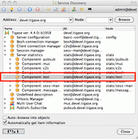

1.7.2. Component Implementation - Lesson 2 - Configuration
^^^^^^^^^^^^^^^^^^^^^^^^^^^^^^^^^^^^^^^^^^^^^^^^^^^^^^^^^^^^^^

It might be hard to tell what the first important thing you should do with your new component implementation. Different developers may have a different view on this. It seems to me however that it is always a good idea to give to your component a way to configure it and provide some runtime settings.

This guide describes how to add configuration handling to your component.

To demonstrate how to implement component configuration let’s say we want to configure which types of packets will be logged by the component. There are three possible packet types: **message**, **presence** and **iq** and we want to be able to configure logging of any combination of the three. Furthermore we also want to be able to configure the text which is prepended to the logged message and to optionally switch secure login. (Secure logging replaces all packet CData with text: *CData size: NN* to protect user privacy.)

Let’s create the following private variables in our component **TestModule**:

.. code:: java

   private String[] packetTypes = {"message", "presence", "iq"};
   private String prependText = "My packet: ";
   private boolean secureLogging = false;

To make them configurable we have to annote them with ``@ConfigField`` annotation. It requires ``desc`` field (describing configuration option) and has following optional properties: \* ``alias`` - alternative name of the variable \* ``allowAliasFromParent`` - specifies whether value from alias from parent bean should be allowed \* ``type`` - specifies general type of the field, which impacts possible obfuscation of the value in the logs/"config-dump" file; possible values: ``Plain`` (no changes), ``Password`` (complete value will be obfuscated) and ``JdbcUrl`` (only password part will be obfuscated from the URL)

.. code:: java

   @ConfigField(desc = "Logged packet types", alias = "packet-types")
   private String[] packetTypes = {"message", "presence", "iq"};
   @ConfigField(desc = "Prefix", alias = "log-prepend")
   private String prependText = "My packet: ";
   @ConfigField(desc = "Secure logging", alias = "secure-logging")
   private boolean secureLogging = false;

And this is it. Tigase Kernel will take care of this fields and will update them when configuration will change.

The syntax in ``config.tdsl`` file is very simple and is described in details in the *Admin Guide*. To set the configuration for your component in ``config.tdsl`` file you have to append following lines to the file inside test component configuration block:

.. code:: dsl

   test-module {
     log-prepend = 'My packet: '
     packet-types = [ 'message', 'presence', 'iq' ]
     secure-logging = true
   }

The square brackets are used to mark that we set a list consisting of a few elements, have a look at the *Admin Guide* documentation for more details.

And this is the complete code of the new component module with a modified ``process(…​)`` method taking advantage of configuration settings:

.. code:: java

   @Bean(name = "test-module", parent = TestComponent.class, active = true)
   public static class TestModule extends AbstractModule {

     private static final Logger log = Logger.getLogger(TestModule.class.getCanonicalName());

     private Criteria CRITERIA = ElementCriteria.name("message");

     @ConfigField(desc = "Logged packet types", alias = "packet-types")
     private String[] packetTypes = {"message", "presence", "iq"};
     @ConfigField(desc = "Prefix", alias = "log-prepend")
     private String prependText = "My packet: ";
     @ConfigField(desc = "Secure logging", alias = "secure-logging")
     private boolean secureLogging = false;

     @Override
     public Criteria getModuleCriteria() {
       return CRITERIA;
     }

     public void setPacketTypes(String[] packetTypes) {
       this.packetTypes = packetTypes;
       Criteria crit = new Or();
       for (String packetType : packetTypes) {
         crit.add(ElementCriteria.name(packetType));
       }
       CRITERIA = crit;
     }

     @Override
     public void process(Packet packet) throws ComponentException, TigaseStringprepException {
       log.finest(prependText + packet.toString(secureLogging));
     }
   }

Of course we can do much more useful packet processing in the ``process(…​)`` method. This is just an example code.

.. Tip::

   Here we used a setter **setPacketType(String[] packetTypes)** which is a setter for field **packetTypes**. Tigase Kernel will use it instead of assigning value directly to a field which gives up opportunity to convert value to different type and update other field - in our case we updated **CRITERIA** field which will result in change of packet types which for which method **void process(…​)** will be called.

1.7.3. Component Implementation - Lesson 3 - Multi-Threading
^^^^^^^^^^^^^^^^^^^^^^^^^^^^^^^^^^^^^^^^^^^^^^^^^^^^^^^^^^^^^^^

Multi core and multi CPU machines are very common nowadays. Your new custom component however, processes all packets in a single thread.

This is especially important if the packet processing is CPU expensive like, for example, SPAM checking. In such a case you could experience single Core/CPU usage at 100% while other Cores/CPUs are idling. Ideally, you want your component to use all available CPUs.

Tigase API offers a very simple way to execute component’s ``processPacket(Packet packet)`` method in multiple threads. Methods ``int processingOutThreads()`` and ``int processingInThreads()`` returns number of threads assigned to the component. By default it returns just '1' as not all component implementations are prepared to process packets concurrently. By overwriting the method you can return any value you think is appropriate for the implementation. Please note, there are two methods, one is for a number of threads for incoming packets to the component and another for outgoing packets from the component. It used to be a single method but different components have different needs and the best performance can be achieved when the outgoing queues have a separate threads pool from incoming queues. Also some components only receive packets while other only send, therefore assigning an equal number of threads for both that could be a waste of resources.

.. Note::

   Due to how Kernel works you MUST avoid using variables in those methods. If you would like to have this configurable at startup time you could simply set ``processing-in-threads`` and ``processing-out-threads`` in your component’s bean configuration.

If the packet processing is CPU bound only, you normally want to have as many threads as there are CPUs available:

.. code:: java

   @Override
   public int processingInThreads() {
     return Runtime.getRuntime().availableProcessors();
   }
   @Override
   public int processingOutThreads() {
     return Runtime.getRuntime().availableProcessors();
   }

If the processing is I/O bound (network or database) you probably want to have more threads to process requests. It is hard to guess the ideal number of threads right on the first try. Instead you should run a few tests to see how many threads is best for implementation of the component.

Now you have many threads for processing your packets, but there is one slight problem with this. In many cases packet order is essential. If our ``processPacket(…​)`` method is executed concurrently by a few threads it is quite possible that a message sent to user can takeover the message sent earlier. Especially if the first message was large and the second was small. We can prevent this by adjusting the method responsible for packet distribution among threads.

The algorithm for packets distribution among threads is very simple:

.. code:: java

   int thread_idx = hashCodeForPacket(packet) % threads_total;

So the key here is using the ``hashCodeForPacket(…​)`` method. By overwriting it we can make sure that all packets addressed to the same user will always be processed by the same thread:

.. code:: java

   @Override
   public int hashCodeForPacket(Packet packet) {
     if (packet.getElemTo() != null) {
       return packet.getElemTo().hashCode();
     }
     // This should not happen, every packet must have a destination
     // address, but maybe our SPAM checker is used for checking
     // strange kind of packets too....
     if (packet.getStanzaFrom() != null) {
       return packet.getStanzaFrom().hashCode();
     }
     // If this really happens on your system you should look
     // carefully at packets arriving to your component and
     // find a better way to calculate hashCode
     return 1;
   }

The above two methods give control over the number of threads assigned to the packets processing in your component and to the packet distribution among threads. This is not all Tigase API has to offer in terms of multi-threading.

Sometimes you want to perform some periodic actions. You can of course create Timer instance and load it with TimerTasks. As there might be a need for this, every level of the Class hierarchy could end-up with multiple Timer (threads in fact) objects doing similar job and using resources. There are a few methods which allow you to reuse common Timer object to perform all sorts of actions.

First, you have three methods allowing your to perform some periodic actions:

.. code:: java

   public synchronized void everySecond();
   public synchronized void everyMinute();
   public synchronized void everyHour();

An example implementation for periodic notifications sent to some address could look like this one:

.. code:: java

   @Override
   public synchronized void everyMinute() {
     super.everyMinute();
     if ((++delayCounter) >= notificationFrequency) {
       addOutPacket(Packet.getMessage(abuseAddress, getComponentId(),
         StanzaType.chat, "Detected spam messages: " + spamCounter,
         "Spam counter", null, newPacketId("spam-")));
       delayCounter = 0;
       spamCounter = 0;
     }
   }

This method sends every **notificationFrequency** minute a message to **abuseAddress** reporting how many spam messages have been detected during last period. Please note, you have to call ``super.everyMinute()`` to make sure other actions are executed as well and you have to also remember to keep processing in this method to minimum, especially if you overwrite ``everySecond()`` method.

There is also a method which allow you to schedule tasks executed at certain time, it is very similar to the ``java.util.Timer`` API. The only difference is that we are using **ScheduledExecutorService** as a backend which is being reused among all levels of Class hierarchy. There is a separate ``ScheduledExecutorService`` for each Class instance though, to avoid interferences between separate components:

.. code:: java

   addTimerTask(tigase.util.TimerTask task, long delay);

Here is a code of an example component and module which uses all the API discussed in this article:

**Example component code.**

.. code:: java

   public class TestComponent extends AbstractKernelBasedComponent {

     private static final Logger log = Logger.getLogger(TestComponent.class.getName());

     @Inject
     private TestModule testModule;

     @Override
     public synchronized void everyMinute() {
       super.everyMinute();
       testModule.everyMinute();
     }

     @Override
     public String getComponentVersion() {
     String version = this.getClass().getPackage().getImplementationVersion();
       return version == null ? "0.0.0" : version;
     }

     @Override
     public int hashCodeForPacket(Packet packet) {
       if (packet.getElemTo() != null) {
         return packet.getElemTo().hashCode();
       }
       // This should not happen, every packet must have a destination
       // address, but maybe our SPAM checker is used for checking
       // strange kind of packets too....
       if (packet.getStanzaFrom() != null) {
         return packet.getStanzaFrom().hashCode();
       }
       // If this really happens on your system you should look carefully
       // at packets arriving to your component and decide a better way
       // to calculate hashCode
       return 1;
     }

     @Override
     public boolean isDiscoNonAdmin() {
       return false;
     }

     @Override
     public int processingInThreads() {
       return Runtime.getRuntime().availableProcessors();
     }

     @Override
     public int processingOutThreads() {
       return Runtime.getRuntime().availableProcessors();
     }

     @Override
     protected void registerModules(Kernel kernel) {
       // here we need to register modules responsible for processing packets
     }

   }

**Example module code.**

.. code:: java

   @Bean(name = "test-module", parent = TestComponent.class, active = true)
   public static class TestModule extends AbstractModule {

     private static final Logger log = Logger.getLogger(TestModule.class.getCanonicalName());

     private Criteria CRITERIA = ElementCriteria.name("message");

     @ConfigField(desc = "Bad words", alias = "bad-words")
     private String[] badWords = {"word1", "word2", "word3"};
     @ConfigField(desc = "White listed addresses", alias = "white-list")
     private String[] whiteList = {"admin@localhost"};
     @ConfigField(desc = "Logged packet types", alias = "packet-types")
     private String[] packetTypes = {"message", "presence", "iq"};
     @ConfigField(desc = "Prefix", alias = "log-prepend")
     private String prependText = "Spam detected: ";
     @ConfigField(desc = "Secure logging", alias = "secure-logging")
     private boolean secureLogging = false;
     @ConfigField(desc = "Abuse notification address", alias = "abuse-address")
     private JID abuseAddress = JID.jidInstanceNS("abuse@locahost");
     @ConfigField(desc = "Frequency of notification", alias = "notification-frequency")
     private int notificationFrequency = 10;
     private int delayCounter = 0;
     private long spamCounter = 0;

     @Inject
     private TestComponent component;

     public void everyMinute() {
       if ((++delayCounter) >= notificationFrequency) {
         write(Message.getMessage(abuseAddress, component.getComponentId(), StanzaType.chat,
                                  "Detected spam messages: " + spamCounter, "Spam counter", null,
                                  component.newPacketId("spam-")));
         delayCounter = 0;
         spamCounter = 0;
       }
     }

     @Override
     public Criteria getModuleCriteria() {
       return CRITERIA;
     }

     public void setPacketTypes(String[] packetTypes) {
       this.packetTypes = packetTypes;
       Criteria crit = new Or();
       for (String packetType : packetTypes) {
         crit.add(ElementCriteria.name(packetType));
       }
       CRITERIA = crit;
     }

     @Override
     public void process(Packet packet) throws ComponentException, TigaseStringprepException {
       // Is this packet a message?
       if ("message" == packet.getElemName()) {
         String from = packet.getStanzaFrom().toString();
         // Is sender on the whitelist?
         if (Arrays.binarySearch(whiteList, from) < 0) {
           // The sender is not on whitelist so let's check the content
           String body = packet.getElemCDataStaticStr(Message.MESSAGE_BODY_PATH);
           if (body != null && !body.isEmpty()) {
             body = body.toLowerCase();
             for (String word : badWords) {
               if (body.contains(word)) {
                 log.finest(prependText + packet.toString(secureLogging));
                 ++spamCounter;
                 return;
               }
             }
           }
         }
       }
       // Not a SPAM, return it for further processing
       Packet result = packet.swapFromTo();
       write(result);
     }
   }

1.7.4. Component Implementation - Lesson 4 - Service Discovery
^^^^^^^^^^^^^^^^^^^^^^^^^^^^^^^^^^^^^^^^^^^^^^^^^^^^^^^^^^^^^^^

You component still shows in the service discovery list as an element with "*Undefined description*". It also doesn’t provide any interesting features or sub-nodes.

In this article I will show how to, in a simple way, change the basic component information presented on the service discovery list and how to add some service disco features. As a bit more advanced feature the guide will teach you about adding/removing service discovery nodes at run-time and about updating existing elements.

In order for the component to properly respond to ``disco#info`` and ``disco#items`` request you should register ``DiscoveryModule`` in your component:

.. code:: java

   @Override
   protected void registerModules(Kernel kernel) {
       kernel.registerBean("disco").asClass(DiscoveryModule.class).exec();
   }

NOTE It’s essential to **explicitly** register ``DiscoveryModule`` in your component.

Component description and category type can be changed by overriding two following methods:

.. code:: java

   @Override
   public String getDiscoDescription() {
     return "Spam filtering";
   }

   @Override
   public String getDiscoCategoryType() {
     return "spam";
   }

Please note, there is no such **'spam'** category type defined in the `Service Discovery Identities registry <http://xmpp.org/registrar/disco-categories.html>`__. It has been used here as a demonstration only. Please refer to the Service Discovery Identities registry document for a list of categories and types and pick the one most suitable for you.

After you have added the two above methods and restarted the server with updated code, have a look at the service discovery window. You should see something like on the screenshot.

|spam filtering disco small|

Now let’s add method which will allow our module ``TestModule`` to return supported features. This way our component will automatically report features supported by all it’s modules. To do so we need to implement a method **String[] getFeatures()** which returns array of ``String`` items. This items are used to generate a list of features supported by component.

Although this was easy, this particular change doesn’t affect anything apart from just a visual appearance. Let’s get then to more advanced and more useful changes.

One of the limitations of methods above is that you can not update or change component information at run-time with these methods. They are called only once during initialization of a component when component service discovery information is created and prepared for later use. Sometimes, however it is useful to be able to change the service discovery during run-time.

In our simple spam filtering component let’s show how many messages have been checked out as part of the service discovery description string. Every time we receive a message we can to call:

.. code:: java

   updateServiceDiscoveryItem(getName(), null, getDiscoDescription() + ": [" + (++messagesCounter) + "]", true);

*A small performance note, in some cases calling ``updateServiceDiscoveryItem(…​)`` might be an expensive operation so probably a better idea would be to call the method not every time we receive a message but maybe every 100 times or so.*

The first parameter is the component JID presented on the service discovery list. However, Tigase server may work for many virtual hosts so the hostname part is added by the lower level functions and we only provide the component name here. The second parameter is the service discovery node which is usually '**null**' for top level disco elements. Third is the item description (which is actually called 'name' in the disco specification). The last parameter specifies if the element is visible to administrators only.

|spam filter counter small|

The complete method code is presented below and the screenshot above shows how the element of the service discovery for our component can change if we apply our code and send a few messages to the component.

Using the method we can also add submodes to our component element. The XMPP service discovery really is not for showing application counters, but this case it is good enough to demonstrate the API available in Tigase so we continue with presenting our counters via service discovery. This time, instead of using 'null' as a node we put some meaningful texts as in example below:

.. code:: java

   // This is called whenever a message arrives
   // to the component
   updateServiceDiscoveryItem(getName(), "messages",
     "Messages processed: [" + (++messagesCounter) + "]", true);
   // This is called every time the component detects
   // spam message
   updateServiceDiscoveryItem(getName(), "spam", "Spam caught: [" +
     (++totalSpamCounter) + "]", true);

Again, have a look at the full method body below for a complete code example. Now if we send a few messages to the component and some of them are spam (contain words recognized as spam) we can browse the service discovery of the server. Your service discovery should show a list similar to the one presented on the screenshot on the left.

Of course depending on the implementation, initially there might be no sub-nodes under our component element if we call the ``updateServiceDiscoveryItem(…​)`` method only when a message is processed. To make sure that sub-nodes of our component show from the very beginning you can call them in ``setProperties(…​)`` for the first time to populate the service discovery with initial sub-nodes.

Please note, the ``updateServiceDiscoveryItem(…​)`` method is used for adding a new item and updating existing one. There is a separate method though to remove the item:

.. code:: java

   void removeServiceDiscoveryItem(String jid,
     String node, String description)

Actually only two first parameters are important: the **jid** and the **node** which must correspond to the existing, previously created service discovery item.

There are two additional variants of the *update* method which give you more control over the service discovery item created. Items can be of different categories and types and can also present a set of features.

The simpler is a variant which sets a set of features for the updated service discovery item. There is a `document <http://xmpp.org/registrar/disco-features.html>`__ describing existing, registered features. We are creating an example which is going to be a spam filter and there is no predefined feature for spam filtering but for purpose of this guide we can invent two feature identification strings and set it for our component. Let’s call ``update`` method with following parameters:

.. code:: java

   updateServiceDiscoveryItem(getName(), null, getDiscoDescription(),
     true, "tigase:x:spam-filter", "tigase:x:spam-reporting");

The best place to call this method is the ``setProperties(…​)`` method so our component gets a proper service discovery settings at startup time. We have set two features for the component disco: *tigase:x:spam-filter* and *tigase:x:spam-reporting*. This method accepts a variable set of arguments so we can pass to it as many features as we need or following Java spec we can just pass an array of **Strings**.

Update your code with call presented above, and restart the server. Have a look at the service discovery for the component now.

The last functionality might be not very useful for our case of the spam filtering component, but it is for many other cases like MUC or PubSub for which it is setting proper category and type for the service discovery item. There is a document listing all currently registered service discovery identities (categories and types). Again there is entry for spam filtering. Let’s use the *automation* category and *spam-filter* type and set it for our component:

.. code:: java

   updateServiceDiscoveryItem(getName(), null, getDiscoDescription(),
     "automation", "spam-filtering", true,
     "tigase:x:spam-filter", "tigase:x:spam-reporting");

Of course all these setting can be applied to any service discovery create or update, including sub-nodes. And here is a complete code of the component:

**Example component code.**

.. code:: java

   public class TestComponent extends AbstractKernelBasedComponent {

     private static final Logger log = Logger.getLogger(TestComponent.class.getName());

     @Inject
     private TestModule testModule;

     @Override
     public synchronized void everyMinute() {
       super.everyMinute();
       testModule.everyMinute();
     }

     @Override
     public String getComponentVersion() {
     String version = this.getClass().getPackage().getImplementationVersion();
       return version == null ? "0.0.0" : version;
     }

     @Override
     public String getDiscoDescription() {
       return "Spam filtering";
     }

     @Override
     public String getDiscoCategoryType() {
         return "spam";
     }

     @Override
     public int hashCodeForPacket(Packet packet) {
       if (packet.getElemTo() != null) {
         return packet.getElemTo().hashCode();
       }
       // This should not happen, every packet must have a destination
       // address, but maybe our SPAM checker is used for checking
       // strange kind of packets too....
       if (packet.getStanzaFrom() != null) {
         return packet.getStanzaFrom().hashCode();
       }
       // If this really happens on your system you should look carefully
       // at packets arriving to your component and decide a better way
       // to calculate hashCode
       return 1;
     }

     @Override
     public boolean isDiscoNonAdmin() {
       return false;
     }

     @Override
     public int processingInThreads() {
       return Runtime.getRuntime().availableProcessors();
     }

     @Override
     public int processingOutThreads() {
       return Runtime.getRuntime().availableProcessors();
     }

     @Override
     protected void registerModules(Kernel kernel) {
       // here we need to register modules responsible for processing packets
       kernel.registerBean("disco").asClass(DiscoveryModule.class).exec();
     }

   }

**Example module code.**

.. code:: java

   @Bean(name = "test-module", parent = TestComponent.class, active = true)
   public static class TestModule extends AbstractModule {

     private static final Logger log = Logger.getLogger(TestModule.class.getCanonicalName());

     private Criteria CRITERIA = ElementCriteria.name("message");
     private String[] FEATURES = { "tigase:x:spam-filter", "tigase:x:spam-reporting" };

     @ConfigField(desc = "Bad words", alias = "bad-words")
     private String[] badWords = {"word1", "word2", "word3"};
     @ConfigField(desc = "White listed addresses", alias = "white-list")
     private String[] whiteList = {"admin@localhost"};
     @ConfigField(desc = "Logged packet types", alias = "packet-types")
     private String[] packetTypes = {"message", "presence", "iq"};
     @ConfigField(desc = "Prefix", alias = "log-prepend")
     private String prependText = "Spam detected: ";
     @ConfigField(desc = "Secure logging", alias = "secure-logging")
     private boolean secureLogging = false;
     @ConfigField(desc = "Abuse notification address", alias = "abuse-address")
     private JID abuseAddress = JID.jidInstanceNS("abuse@locahost");
     @ConfigField(desc = "Frequency of notification", alias = "notification-frequency")
     private int notificationFrequency = 10;
     private int delayCounter = 0;
     private long spamCounter = 0;
     private long totalSpamCounter = 0;
     private long messagesCounter = 0;


     @Inject
     private TestComponent component;

     public void everyMinute() {
       if ((++delayCounter) >= notificationFrequency) {
         write(Message.getMessage(abuseAddress, component.getComponentId(), StanzaType.chat,
                                  "Detected spam messages: " + spamCounter, "Spam counter", null,
                                  component.newPacketId("spam-")));
         delayCounter = 0;
         spamCounter = 0;
       }
     }

     @Override
     public String[] getFeatures() {
       return FEATURES;
     }

     @Override
     public Criteria getModuleCriteria() {
       return CRITERIA;
     }

     public void setPacketTypes(String[] packetTypes) {
       this.packetTypes = packetTypes;
       Criteria crit = new Or();
       for (String packetType : packetTypes) {
         crit.add(ElementCriteria.name(packetType));
       }
       CRITERIA = crit;
     }

     @Override
     public void process(Packet packet) throws ComponentException, TigaseStringprepException {
       // Is this packet a message?
       if ("message" == packet.getElemName()) {
         component.updateServiceDiscoveryItem(component.getName(), "messages",
                                              "Messages processed: [" + (++messagesCounter) + "]", true);
         String from = packet.getStanzaFrom().toString();
         // Is sender on the whitelist?
         if (Arrays.binarySearch(whiteList, from) < 0) {
           // The sender is not on whitelist so let's check the content
           String body = packet.getElemCDataStaticStr(Message.MESSAGE_BODY_PATH);
           if (body != null && !body.isEmpty()) {
             body = body.toLowerCase();
             for (String word : badWords) {
               if (body.contains(word)) {
                 log.finest(prependText + packet.toString(secureLogging));
                 ++spamCounter;
                 component.updateServiceDiscoveryItem(component.getName(), "spam", "Spam caught: [" +
                                                      (++totalSpamCounter) + "]", true);
                 return;
               }
             }
           }
         }
       }
       // Not a SPAM, return it for further processing
       Packet result = packet.swapFromTo();
       write(result);
     }
   }

.. |spam filtering disco small| image:: images/spam-filtering-disco-small.png
.. |spam filter counter small| image:: images/spam-filter-counter-small.png

1.7.5. Component Implementation - Lesson 5 - Statistics
^^^^^^^^^^^^^^^^^^^^^^^^^^^^^^^^^^^^^^^^^^^^^^^^^^^^^^^^

In most cases you’ll want to gather some run-time statistics from your component to see how it works, detect possible performance issues or congestion problems. All server statistics are exposed and are accessible via XMPP with ad-hoc commands, HTTP, JMX and some selected statistics are also available via SNMP. As a component developer you don’t have to do anything to expose your statistic via any of those protocols, you just have to provide your statistics and the admin will be able to access them any way he wants.

This lesson will teach you how to add your own statistics and how to make sure that the statistics generation doesn’t affect application performance.

|spam statitics small|

Your component from the very beginning generates some statistics by classes it inherits. Let’s add a few statistics to our spam filtering component:

.. code:: java

   @Override
   public void getStatistics(StatisticsList list) {
     super.getStatistics(list);
     list.add(getName(), "Spam messages found", totalSpamCounter, Level.INFO);
     list.add(getName(), "All messages processed", messagesCounter, Level.FINER);
     if (list.checkLevel(Level.FINEST)) {
       // Some very expensive statistics generation code...
     }
   }

The code should be pretty much self-explanatory.

You have to call ``super.getStatistics(…​)`` to update stats of the parent class. ``StatisticsList`` is a collection which keeps all the statistics in a way which is easy to update, search, and retrieve them. You actually don’t need to know all the implementation details but if you are interested please refer to the source code and JavaDoc documentation.

The first parameter of the ``add(…​)`` method is the component name. All the statistics are grouped by the component names to make it easier to look at particular component data. Next is a description of the element. The third parameter is the element value which can be any number or string.

The last parameter is probably the most interesting. The idea has been borrowed from the logging framework. Each statistic item has importance level. Levels are exactly the same as for logging methods with **SEVERE** the most critical and **FINEST** the least important. This parameter has been added to improve performance and statistics retrieval. When the **StatisticsList** object is created it gets assigned a level requested by the user. If the ``add(…​)`` method is called with lower priority level then the element is not even added to the list. This saves network bandwidth, improves statistics retrieving speed and is also more clear to present to the end-user.

One thing which may be a bit confusing at first is that, if there is a numerical element added to statistics with **0** value then the Level is always forced to **FINEST**. The assumption is that the administrator is normally not interested **zero-value** statistics, therefore unless he intentionally request the lowest level statistics he won’t see elements with **zeros**.

The **if** statement requires some explanation too. Normally adding a new statistics element is not a very expensive operation so passing it with ``add(…​)`` method at an appropriate level is enough. Sometimes, however preparing statistics data may be quite expensive, like reading/counting some records from database. Statistics can be collected quite frequently therefore it doesn’t make sense to collect the statistics at all if there not going to be used as the current level is higher then the item we pass anyway. In such a case it is recommended to test whether the element level will be accepted by the collection and if not skip the whole processing altogether.

As you can see, the API for generating and presenting component statistics is very simple and straightforward. Just one method to overwrite and a simple way to pass your own counters. Below is the whole code of the example component:

**Example component code.**

.. code:: java

   public class TestComponent extends AbstractKernelBasedComponent {

     private static final Logger log = Logger.getLogger(TestComponent.class.getName());

     @Inject
     private TestModule testModule;

     @Override
     public synchronized void everyMinute() {
       super.everyMinute();
       testModule.everyMinute();
     }

     @Override
     public String getComponentVersion() {
     String version = this.getClass().getPackage().getImplementationVersion();
       return version == null ? "0.0.0" : version;
     }

     @Override
     public String getDiscoDescription() {
       return "Spam filtering";
     }

     @Override
     public String getDiscoCategoryType() {
         return "spam";
     }

     @Override
     public int hashCodeForPacket(Packet packet) {
       if (packet.getElemTo() != null) {
         return packet.getElemTo().hashCode();
       }
       // This should not happen, every packet must have a destination
       // address, but maybe our SPAM checker is used for checking
       // strange kind of packets too....
       if (packet.getStanzaFrom() != null) {
         return packet.getStanzaFrom().hashCode();
       }
       // If this really happens on your system you should look carefully
       // at packets arriving to your component and decide a better way
       // to calculate hashCode
       return 1;
     }

     @Override
     public boolean isDiscoNonAdmin() {
       return false;
     }

     @Override
     public int processingInThreads() {
       return Runtime.getRuntime().availableProcessors();
     }

     @Override
     public int processingOutThreads() {
       return Runtime.getRuntime().availableProcessors();
     }

     @Override
     protected void registerModules(Kernel kernel) {
       // here we need to register modules responsible for processing packets
     }

     @Override
     public void getStatistics(StatisticsList list) {
       super.getStatistics(list);
       list.add(getName(), "Spam messages found", testModule.getTotalSpamCounter(), Level.INFO);
       list.add(getName(), "All messages processed", testModule.getMessagesCounter(), Level.FINE);
       if (list.checkLevel(Level.FINEST)) {
         // Some very expensive statistics generation code...
       }
     }

   }

**Example module code.**

.. code:: java

   @Bean(name = "test-module", parent = TestComponent.class, active = true)
   public static class TestModule extends AbstractModule {

     private static final Logger log = Logger.getLogger(TestModule.class.getCanonicalName());

     private Criteria CRITERIA = ElementCriteria.name("message");
     private String[] FEATURES = { "tigase:x:spam-filter", "tigase:x:spam-reporting" };

     @ConfigField(desc = "Bad words", alias = "bad-words")
     private String[] badWords = {"word1", "word2", "word3"};
     @ConfigField(desc = "White listed addresses", alias = "white-list")
     private String[] whiteList = {"admin@localhost"};
     @ConfigField(desc = "Logged packet types", alias = "packet-types")
     private String[] packetTypes = {"message", "presence", "iq"};
     @ConfigField(desc = "Prefix", alias = "log-prepend")
     private String prependText = "Spam detected: ";
     @ConfigField(desc = "Secure logging", alias = "secure-logging")
     private boolean secureLogging = false;
     @ConfigField(desc = "Abuse notification address", alias = "abuse-address")
     private JID abuseAddress = JID.jidInstanceNS("abuse@locahost");
     @ConfigField(desc = "Frequency of notification", alias = "notification-frequency")
     private int notificationFrequency = 10;
     private int delayCounter = 0;
     private long spamCounter = 0;
     private long totalSpamCounter = 0;
     private long messagesCounter = 0;


     @Inject
     private TestComponent component;

     public void everyMinute() {
       if ((++delayCounter) >= notificationFrequency) {
         write(Message.getMessage(abuseAddress, component.getComponentId(), StanzaType.chat,
                                  "Detected spam messages: " + spamCounter, "Spam counter", null,
                                  component.newPacketId("spam-")));
         delayCounter = 0;
         spamCounter = 0;
       }
     }

     @Override
     public String[] getFeatures() {
       return FEATURES;
     }

     @Override
     public Criteria getModuleCriteria() {
       return CRITERIA;
     }

     public long getMessagesCounter() {
       return messagesCounter;
     }

     public long getTotalSpamCounter() {
       return totalSpamCounter;
     }

     public void setPacketTypes(String[] packetTypes) {
       this.packetTypes = packetTypes;
       Criteria crit = new Or();
       for (String packetType : packetTypes) {
         crit.add(ElementCriteria.name(packetType));
       }
       CRITERIA = crit;
     }

     @Override
     public void process(Packet packet) throws ComponentException, TigaseStringprepException {
       // Is this packet a message?
       if ("message" == packet.getElemName()) {
         component.updateServiceDiscoveryItem(component.getName(), "messages",
                                              "Messages processed: [" + (++messagesCounter) + "]", true);
         String from = packet.getStanzaFrom().toString();
         // Is sender on the whitelist?
         if (Arrays.binarySearch(whiteList, from) < 0) {
           // The sender is not on whitelist so let's check the content
           String body = packet.getElemCDataStaticStr(Message.MESSAGE_BODY_PATH);
           if (body != null && !body.isEmpty()) {
             body = body.toLowerCase();
             for (String word : badWords) {
               if (body.contains(word)) {
                 log.finest(prependText + packet.toString(secureLogging));
                 ++spamCounter;
                 component.updateServiceDiscoveryItem(component.getName(), "spam", "Spam caught: [" +
                                                      (++totalSpamCounter) + "]", true);
                 return;
               }
             }
           }
         }
       }
       // Not a SPAM, return it for further processing
       Packet result = packet.swapFromTo();
       write(result);
     }
   }

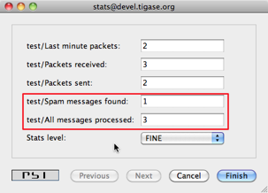

1.7.6. Component Implementation - Lesson 6 - Scripting Support
^^^^^^^^^^^^^^^^^^^^^^^^^^^^^^^^^^^^^^^^^^^^^^^^^^^^^^^^^^^^^^^

Scripting support is a basic API built-in to Tigase server and automatically available to any component at no extra resource cost. This framework, however, can only access existing component variables which are inherited by your code from parent classes. It can not access any data or any structures you added in your component. A little effort is needed to expose some of your data to the scripting API.

This guide shows how to extend existing scripting API with your component specific data structures.

Integrating your component implementation with the scripting API is as simple as the code below:

.. code:: java

   private static final String BAD_WORDS_VAR = "badWords";
   private static final String WHITE_LIST_VAR = "whiteList";

   @Override
   public void initBindings(Bindings binds) {
     super.initBindings(binds);
     binds.put(BAD_WORDS_VAR, testModule.badWords);
     binds.put(WHITE_LIST_VAR, testModule.whiteList);
   }

This way you expose two the component variables: ``badWords`` and ``whiteList`` to scripts under names the same names - two defined constants. You could use different names of course but it is always a good idea to keep things straightforward, hence we use the same variable names in the component and in the script.

Almost done, almost…​ In our old implementation these two variables are Java arrays of ``String``. Therefore we can only change their elements but we can not add or remove elements from these structures inside the script. This is not very practical and it puts some serious limits on the script’s code. To overcome this problem I have changed the test component code to keep bad words and whitelist in ``java.util.Set`` collection. This gives us enough flexibility to manipulate data.

As our component is now ready to cooperate with the scripting API, I will demonstrate now how to add remove or change elements of these collections using a script and ad-hoc commands.

|test comp newscript|

First, browse the server service discovery and double click on the test component. If you use `Psi <http://psi-im.org/>`__ client this should bring to you a new window with ad-hoc commands list. Other clients may present available ad-hoc commands differently.

The screenshot below shows how this may look. You have to provide some description for the script and an ID string. We use Groovy in this guide but you can as well use any different scripting language.

|badwords list script|

Please refer to the Tigase scripting documentation for all the details how to add support for more languages. From the Tigase API point of view it all looks the same. You have to select a proper language from the pull-down list on windows shown on the right. If your preferred language is not on the list, it means it is not installed properly and Tigase is unable to detect it.

The script to pull a list of current bad words can be as simple as the following Groovy code:

.. code:: groovy

   def badw = (java.util.Set)badWords
   def result = ""
   for (s in badw) { result += s + "\n" }
   return result

As you see from the code, you have to reference your component variables to a variables in your script to make sure a correct type is used. The rest is very simple and is a pure scripting language stuff.

Load the script on to the server and execute it. You should receive a new window with a list of all bad words currently used by the spam filter.

Below is another simple script which allows updating (adding/removing) bad words from the list.

.. code:: groovy

   import tigase.server.Command
   import tigase.server.Packet

   def WORDS_LIST_KEY = "words-list"
   def OPERATION_KEY = "operation"
   def REMOVE = "Remove"
   def ADD = "Add"
   def OPERATIONS = [ADD, REMOVE]

   def badw = (java.util.Set)badWords
   def Packet p = (Packet)packet
   def words = Command.getFieldValue(p, WORDS_LIST_KEY)
   def operation = Command.getFieldValue(p, OPERATION_KEY)

   if (words == null) {
     // No data to process, let's ask user to provide
     // a list of words
     def res = (Packet)p.commandResult(Command.DataType.form)
     Command.addFieldValue(res, WORDS_LIST_KEY, "", "Bad words list")
     Command.addFieldValue(res, OPERATION_KEY, ADD, "Operation",
       (String[])OPERATIONS, (String[])OPERATIONS)
     return res
   }

   def words_list = words.tokenize(",")

   if (operation == ADD) {
     words_list.each { badw.add(it.trim()) }
     return "Words have been added."
   }

   if (operation == REMOVE) {
     words_list.each { badw.remove(it.trim()) }
     return "Words have been removed."
   }

   return "Unknown operation: " + operation

These two scripts are just the beginning. The possibilities are endless and with the simple a few lines of code in your test component you can then extend your application at runtime with scripts doing various things; you can reload scripts, add and remove them, extending and modifying functionality as you need. No need to restart the server, no need to recompile the code and you can use whatever scripting language you like.

Of course, scripts for whitelist modifications would look exactly the same and it doesn’t make sense to attach them here.

Here is a complete code of the test component with the new method described at the beginning and data structures changed from array of **String*s to Java \*Set**:

**Example component code.**

.. code:: java

   public class TestComponent extends AbstractKernelBasedComponent {

     private static final Logger log = Logger.getLogger(TestComponent.class.getName());

     private static final String BAD_WORDS_KEY = "bad-words";
     private static final String WHITELIST_KEY = "white-list";

     @Inject
     private TestModule testModule;

     @Override
     public synchronized void everyMinute() {
       super.everyMinute();
       testModule.everyMinute();
     }

     @Override
     public String getComponentVersion() {
     String version = this.getClass().getPackage().getImplementationVersion();
       return version == null ? "0.0.0" : version;
     }

     @Override
     public String getDiscoDescription() {
       return "Spam filtering";
     }

     @Override
     public String getDiscoCategoryType() {
         return "spam";
     }

     @Override
     public int hashCodeForPacket(Packet packet) {
       if (packet.getElemTo() != null) {
         return packet.getElemTo().hashCode();
       }
       // This should not happen, every packet must have a destination
       // address, but maybe our SPAM checker is used for checking
       // strange kind of packets too....
       if (packet.getStanzaFrom() != null) {
         return packet.getStanzaFrom().hashCode();
       }
       // If this really happens on your system you should look carefully
       // at packets arriving to your component and decide a better way
       // to calculate hashCode
       return 1;
     }

     @Override
     public boolean isDiscoNonAdmin() {
       return false;
     }

     @Override
     public int processingInThreads() {
       return Runtime.getRuntime().availableProcessors();
     }

     @Override
     public int processingOutThreads() {
       return Runtime.getRuntime().availableProcessors();
     }

     @Override
     protected void registerModules(Kernel kernel) {
       // here we need to register modules responsible for processing packets
     }

     @Override
     public void getStatistics(StatisticsList list) {
       super.getStatistics(list);
       list.add(getName(), "Spam messages found", testModule.getTotalSpamCounter(), Level.INFO);
       list.add(getName(), "All messages processed", testModule.getMessagesCounter(), Level.FINE);
       if (list.checkLevel(Level.FINEST)) {
         // Some very expensive statistics generation code...
       }
     }

       @Override
       public void initBindings(Bindings binds) {
           super.initBindings(binds);
           binds.put(BAD_WORDS_KEY, testModule.badWords);
           binds.put(WHITELIST_KEY, testModule.whiteList);
       }

   }

**Example module code.**

.. code:: java

   @Bean(name = "test-module", parent = TestComponent.class, active = true)
   public static class TestModule extends AbstractModule {

     private static final Logger log = Logger.getLogger(TestModule.class.getCanonicalName());

     private Criteria CRITERIA = ElementCriteria.name("message");
     private String[] FEATURES = { "tigase:x:spam-filter", "tigase:x:spam-reporting" };

     @ConfigField(desc = "Bad words", alias = "bad-words")
     protected CopyOnWriteArraySet<String> badWords = new CopyOnWriteArraySet<>(Arrays.asList(new String[] {"word1", "word2", "word3"}));
     @ConfigField(desc = "White listed addresses", alias = "white-list")
     protected CopyOnWriteArraySet<String> whiteList = new CopyOnWriteArraySet<>(Arrays.asList(new String[] {"admin@localhost"}));
     @ConfigField(desc = "Logged packet types", alias = "packet-types")
     private String[] packetTypes = {"message", "presence", "iq"};
     @ConfigField(desc = "Prefix", alias = "log-prepend")
     private String prependText = "Spam detected: ";
     @ConfigField(desc = "Secure logging", alias = "secure-logging")
     private boolean secureLogging = false;
     @ConfigField(desc = "Abuse notification address", alias = "abuse-address")
     private JID abuseAddress = JID.jidInstanceNS("abuse@locahost");
     @ConfigField(desc = "Frequency of notification", alias = "notification-frequency")
     private int notificationFrequency = 10;
     private int delayCounter = 0;
     private long spamCounter = 0;
     private long totalSpamCounter = 0;
     private long messagesCounter = 0;


     @Inject
     private TestComponent component;

     public void everyMinute() {
       if ((++delayCounter) >= notificationFrequency) {
         write(Message.getMessage(abuseAddress, component.getComponentId(), StanzaType.chat,
                                  "Detected spam messages: " + spamCounter, "Spam counter", null,
                                  component.newPacketId("spam-")));
         delayCounter = 0;
         spamCounter = 0;
       }
     }

     @Override
     public String[] getFeatures() {
       return FEATURES;
     }

     @Override
     public Criteria getModuleCriteria() {
       return CRITERIA;
     }

     public int getMessagesCounter() {
       return messagesCounter;
     }

     public int getTotalSpamCounter() {
       return totalSpamCounter;
     }

     public void setPacketTypes(String[] packetTypes) {
       this.packetTypes = packetTypes;
       Criteria crit = new Or();
       for (String packetType : packetTypes) {
         crit.add(ElementCriteria.name(packetType));
       }
       CRITERIA = crit;
     }

     @Override
     public void process(Packet packet) throws ComponentException, TigaseStringprepException {
       // Is this packet a message?
       if ("message" == packet.getElemName()) {
         component.updateServiceDiscoveryItem(component.getName(), "messages",
                                              "Messages processed: [" + (++messagesCounter) + "]", true);
         String from = packet.getStanzaFrom().toString();
         // Is sender on the whitelist?
         if (!whiteList.contains(from)) {
           // The sender is not on whitelist so let's check the content
           String body = packet.getElemCDataStaticStr(Message.MESSAGE_BODY_PATH);
           if (body != null && !body.isEmpty()) {
             body = body.toLowerCase();
             for (String word : badWords) {
               if (body.contains(word)) {
                 log.finest(prependText + packet.toString(secureLogging));
                 ++spamCounter;
                 component.updateServiceDiscoveryItem(component.getName(), "spam", "Spam caught: [" +
                                                      (++totalSpamCounter) + "]", true);
                 return;
               }
             }
           }
         }
       }
       // Not a SPAM, return it for further processing
       Packet result = packet.swapFromTo();
       write(result);
     }
   }

.. |test comp newscript| image:: images/test-comp-newscript.png
.. |badwords list script| image:: images/badwords-list-script.png

1.7.7. Component Implementation - Lesson 7 - Data Repository
^^^^^^^^^^^^^^^^^^^^^^^^^^^^^^^^^^^^^^^^^^^^^^^^^^^^^^^^^^^^^

ConfigRepository
~~~~~~~~~~~~~~~~~~~

There are cases when you want to store some data permanently by your component. You can of course use the component configuration to provide some database connection settings, implement your own database connector and store records you need. There is, however, a very simple and useful framework which allows you to read and store some data transparently in either a database or a disk file. The framework also supports ad-hoc command interface straight away so you can manipulate your component data using an XMPP client.

In order to use it one needs to extend ``tigase.db.comp.ConfigRepository`` abstract class.

Accessing UserRepository or AuthRepository
~~~~~~~~~~~~~~~~~~~~~~~~~~~~~~~~~~~~~~~~~~~~

To use **AuthRepository** or **UserRepository** you need only to declare fields properly and annotated them with **@Inject**. This fields must be part of a class managed by Tigase Kernel - class of a component or any class annotated with **@Bean** annotation. For that classes proper instances of repositories will be injected by dependency injection.

**Example usage of AuthRepository and UserRepository.**

.. code:: java

   @Inject
   private AuthRepository authRepository;
   @Inject
   private UserRepository userRepository;

Accessing other repositories
~~~~~~~~~~~~~~~~~~~~~~~~~~~~~~

In order to have more freedom while accessing repositories it’s possible to create and use custom repository implementation which implements **DataSourceAware** interface.

For our example let’s assume it will be class implementing **TestRepositoryIfc** and our implementation will be using JDBC. To make it work, we need to define ``TestRepositoryIfc`` as a generic interface extending ``DataSourceAware`` interface. ``DataSourceAware`` interface will provide definition for methods required by Tigase XMPP Server internals to initialize custom repository classes based on ``TestRepositoryIfc``.

**TestRepositoryIfc.**

.. code:: java

   public interface TestRepositoryIfc<DS extends DataSource> extends DataSourceAware<DS> {
     // Example method
     void addItem(BareJID userJid, String item) throws RepositoryException;
   }

Next we need to prepare our actual implementation of repository - class responsible for execution of SQL statements. In this class we need to implement all of methods from our interface and method **void setDataSource(DataSource dataSource)** which comes from **DataSourceAware** interface. In this method we need to initialize data source, ie. create prepared statements. We should annotate our new class with ``@Repository.Meta`` annotation which will allow Tigase XMPP Server to find this class whenever class implementing ``TestRepositoryIfc`` and with support for data source with jdbc URI.

.. code:: java

   @Repository.Meta(supportedUris = "jdbc:.*")
   public static class JDBCTestRepository implements TestRepositoryIfc<DataRepository> {

     private static final String SOME_STATEMENT = "select * from tig_users";

     private DataRepository repository;

     @Override
     public void setDataSource(DataRepository repository) {
       // here we need to initialize required prepared statements
       try {
         repository.initPreparedStatement(SOME_STATEMENT, SOME_STATEMENT);
       } catch (SQLException ex) {
         throw new RuntimeException("Could not initialize repository", ex);
       }
       this.repository = repository;
     }

     @Override
     public void addItem(BareJID userJid, String item) throws RepositoryException {
       try {
         PreparedStatement stmt = repository.getPreparedStatement(userJid, SOME_STATEMENT);
         synchronized (stmt) {
           // do what needs to be done
         }
       } catch (SQLException ex) {
         throw new RepositoryException(ex);
       }
     }
   }

As you can see we defined type of a data source generic parameter for interface ``TestRepositoryIfc``. With that we make sure that only instance implementing ``DataRepository`` interface will be provided and thanks to that we do not need to cast provided instance of ``DataSource`` to this interface before any access to data source.

With that in place we need to create class which will take care of adding support for multi-database setup. In our case it will be **TestRepositoryMDBean**, which will take care of discovery of repository class, initialization and re-injection of data source. It is required to do so, as it was just mentioned our ``TestRepositoryMDBean`` will be responsible for initialization of ``JDBCTestRepository`` (actually this will be done by ``MDRepositoryBean`` which is extended by ``TestRepositoryMDBean``.

.. code:: java

   @Bean(name = "repository", parent = TestComponent.class, active = true)
   public static class TestRepositoryMDBean extends MDRepositoryBeanWithStatistics<TestRepositoryIfc>
       implements TestRepositoryIfc {

     public TestRepositoryMDBean() {
       super(TestRepositoryIfc.class);
     }

     @Override
     public Class<?> getDefaultBeanClass() {
       return TestRepositoryConfigBean.class;
     }

     @Override
     public void setDataSource(DataSource dataSource) {
       // nothing to do here
     }

     @Override
     public void addItem(BareJID userJid, String item) throws RepositoryException {
       getRepository(userJid.getDomain()).addItem(userJid, item);
     }

     @Override
     protected Class<? extends TestRepositoryIfc> findClassForDataSource(DataSource dataSource)
                   throws DBInitException {
       return DataSourceHelper.getDefaultClass(TestRepositoryIfc.class, dataSource.getResourceUri());
     }

     public static class TestRepositoryConfigBean extends MDRepositoryConfigBean<TestRepositoryIfc> {
     }
   }

Most of this code will be the same in all implementations based on ``MDRepositoryBeanWithStatistics``. In our case only custom method is **void addItem(…​)** which uses **getRepository(String domain)** method to retrieve correct repository for a domain. This retrieval of actual repository instance for a domain will need to be done for every custom method of ``TestRepositoryIfc``.

.. Tip::

   It is also possible to extend ``MDRepositoryBean`` or ``SDRepositoryBean`` instead of ``MDRepositoryBeanWithStatistics``. However, if you decide to extend abstract repository bean classes without ``withStatistics`` suffix, then no statistics data related to usage of this repository will be gathered. The only change, will be that you will not need to pass interface class to constructor of a superclass as it is not needed.

.. Note::

   As mentioned above, it is also possible to extend ``SDRepostioryBean`` and ``SDRepositoryBeanWithStatistics``. Methods which you would need to implement are the same is in case of extending ``MDRepositoryBeanWithStatistics``, however internally ``SDRepositoryBean`` will not have support for using different repository for different domain. In fact ``SDRepositoryBeanWithStatistics`` has only one repository instance and uses only one data source for all domains. The same behavior is presented by ``MDRepositoryBeanWithStatistics`` if only single ``default`` instance of repository is configured. However, ``MDRepositoryBeanWithStatistics`` gives better flexibility and due to that usage of ``SDRepositoryBean`` and ``SDRepositoryBeanWithStatistics`` is discouraged.

While this is more difficult to implement than in previous version, it gives you support for multi database setup and provides you with statistics of database query times which may be used for diagnosis.

As you can also see, we’ve annotated **TestRepositoryMDBean** with **@Bean** annotation which will force Tigase Kernel to load it every time **TestComponent** will be loaded. This way it is possible to inject instance of this class as a dependency to any bean used by this component (ie. component, module, etc.) by just creating a field and annotating it:

.. code:: java

   @Inject
   private TestRepositoryIfc testRepository;

.. Tip::

   In **testRepository** field instance of **TestRepositoryMDBean** will be injected.

.. Note::

   If the class in which we intend to use our repository is deeply nested within Kernel dependencies and we want to leverage automatic schema versioning we have to implement ``tigase.kernel.beans.RegistrarBean`` in our class!

Configuration
~~~~~~~~~~~~~~~

Our class ``TestRepositoryMDBean`` is annotated with ``@Bean`` which sets its name as ``repository`` and sets parent as ``TestComponent``. Instance of this component was configured by use under name of ``test`` in Tigase XMPP Server configuration file. As a result, all configuration related to our repositories should be placed in ``repository`` section placed inside ``test`` section.

**Example.**

.. code:: dsl

   test(class: TestComponent) {
       repository () {
           // repository related configuration
       }
   }

Defaults
''''''''''

As mentioned above, if we use ``MDRepositoryBeanWithStatistics`` as our base class for ``TestRepositoryMDBean``, then we may have different data sources used for different domains. By default, if we will not configure it otherwise, ``MDRepositoryBeanWithStatistics`` will create only single repository instance named ``default``. It will be used for all domains and it will, by default, use data source named the same as repository instance - it will use data source named ``default``. This defaults are equal to following configuration entered in the config file:

.. code:: dsl

   test(class: TestComponent) {
       repository () {
           default () {
               dataSourceName = 'default'
           }
       }
   }

Changing data source used by repository
''''''''''''''''''''''''''''''''''''''''

It is possible to make any repository use different data source than data source configured under the same name as repository instance. To do so, you need to set ``dataSourceName`` property of repository instance to the name of data source which it should use.

**Example setting repository ``default`` to use data source named ``test``.**

.. code:: dsl

   test(class: TestComponent) {
       repository () {
           default () {
               dataSourceName = 'test'
           }
       }
   }

Configuring separate repository for domain
'''''''''''''''''''''''''''''''''''''''''''

To configure repository instance to be used for particular domain, you need to define repository with the same name as domain for which it should be used. It will, by default, use data source with name equal domain name.

**Separate repository for ``example.com`` using data source named ``example.com``.**

.. code:: dsl

   dataSource () {
       // configuration of data sources here is not complete
       default () {
           uri = "jdbc:derby:/database"
       }
       'example.com' () {
           uri = "jdbc:derby/example"
       }
   }

   test(class: TestComponent) {
       repository () {
           default () {
           }
           'example.com' () {
           }
       }
   }

**Separate repository for ``example.com`` using data source named ``test``.**

.. code:: dsl

   dataSource () {
       // configuration of data sources here is not complete
       default () {
           uri = "jdbc:derby:/database"
       }
       'test' () {
           uri = "jdbc:derby/example"
       }
   }

   test(class: TestComponent) {
       repository () {
           default () {
           }
           'example.com' () {
               dataSourceName = 'test'
           }
       }
   }

.. Note::

   In both examples presented above, for domains other than ``example.com``, repository instance named ``default`` will be used and it will use data source named ``default``.


Repository Versioning
~~~~~~~~~~~~~~~~~~~~~~~

It’s also possible to enable repository versioning capabilities when creating custom implementation. There are a couple of parts/steps to fully take advantage of this mechanism.

Each ``DataSource`` has a table ``tig_schema_versions`` which contains information about component schema version installed in the database associated with particular DataSource.

Enabling version checking in implementation
''''''''''''''''''''''''''''''''''''''''''''

First of all, repository implementation should implement ``tigase.db.util.RepositoryVersionAware`` interface (all it’s methods are defined by default) and annotate it with ``tigase.db.Repository.SchemaId``. For example .Repository annoted with ``SchemaId`` and implementing ``RepositoryVersionAware``

.. code:: java

   @Repository.SchemaId(id = "test-component", name = "Test Component")
   public static class TestRepositoryMDBean extends MDRepositoryBeanWithStatistics<TestRepositoryIfc>
       implements TestRepositoryIfc {
   …
   }

This action alone will result in performing the check during Tigase XMPP Server startup and initialisation of repository whether tables, indexes, stored procedures and other elements are present in the configured data source in the required version. By default, required version matches the implementation version (obtained via call to ``java.lang.Package.getImplementationVersion()``), however it’s possible to specify required version manually, either:

-  by utilizing ``tigase.db.util.RepositoryVersionAware.SchemaVersion`` annotation:

::

   @Repository.SchemaId(id = "test_component", name = "Test Component")
   @RepositoryVersionAware.SchemaVersion(version = "0.0.1")
   public static class TestRepositoryMDBean extends MDRepositoryBeanWithStatistics<TestRepositoryIfc>
       implements TestRepositoryIfc {
   …
   }

-  or by overriding ``tigase.db.util.RepositoryVersionAware.getVersion`` method:

::

       @Override
       public Version getVersion() {
           return "0.0.1";
       }


Handling wrong version and the upgrade
''''''''''''''''''''''''''''''''''''''

To detect that version information in database is inadequate following logic will take place:

-  if there is no version information in the database the service will be stopped completely prompting to install the schema (either via ``update-schema`` or ``install-schema`` depending on user preference);

-  if there is an information about loaded component schema version in the repository and the base part of the required schema version (i.e. taking into account only *major.minor.bugfix* part) is different from the one present in the repository then:

   -  if the required version of the component schema is *final* (i.e. non ``SNAPSHOT``) the server will shutdown and print in the log file (namely ``logs/tigase-console.log``) terminal error forcing the user to upgrade the schema;

   -  if the required version of the component schema is *non-final* (i.e. having ``SNAPSHOT`` part) then there will be a warning printed in the log file (namely ``logs/tigase-console.log``) prompting user to run the upgrade procedure due to possible changes in the schema but the *server*\ **will not**\ *stop*;

Upgrade of the loaded schema in the database will be performed by executing:

.. code:: bash

   ./scripts/tigase.sh upgrade-schema etc/tigase.conf

The above command will load current configuration, information about all configured data sources and enabled components, and then perform upgrade of the schema of each configured component in the appropriate data source.

Depending on the type of the database (or specified annotation), how the upgrade procedure is handled internally is slightly different.

Relational databases (external handling)
'''''''''''''''''''''''''''''''''''''''''

For all relational databases (MySQL, PostgreSQL, MS SQL Server, etc…) we highly recommend storing complete database schema in external files with following naming convention: ``<database_type>-<component_name>-<version>.sql``, for example complete schema for our Test component version 0.0.5 intended for MySQL would be stored in file named ``mysql-test-0.0.5.sql``. What’s more - schema files must be stored under ``database/`` subdirectory in Tigase XMPP Server installation directory.

.. Note::

   this can be controlled with ``external`` property of ``Repository.SchemaId`` annotation, which defaults to "true", if set to ``false`` then handling will be done as described in `Relational databases (external handling) <#update-relational>`__

For example:

-  ``database/mysql-test-0.0.1.sql``

-  ``database/mysql-test-0.0.2.sql``

-  ``database/mysql-test-0.0.3.sql``

-  ``database/mysql-test-0.0.4.sql``

-  ``database/mysql-test-0.0.5.sql``

During the upgrade process all required schema files will be loaded in the ascending version order. Version range will depend on the conditions and will follow simple rules:

-  Start of the range will start at the next version to the one currently loaded in the database (e.g. if the current version loaded to the database is ``0.0.3`` and we are deploying component version ``0.0.5`` then SchemaLoader will try to load schema from files: ``database/mysql-test-0.0.4.sql`` and ``database/mysql-test-0.0.5.sql``)

-  If we are trying to deploy a *SNAPSTHOT* version of the component then schema file matching that version will always be included in the list of files to be loaded (e.g. if we are trying to deploy a nightly build with component version ``0.0.5-SNAPSHOT`` and currently loaded schema version in the database is ``0.0.5`` then SchemaLoader will include ``database/mysql-test-0.0.5.sql`` in the list of files to be loaded)

It’s also possible to skip above filtering logic and force loading all schema files for particular component/database from ``database/`` directory by appending ``--forceReloadAllSchemaFiles=true`` parameter to the ``upgrade-schema``/``install-schema`` command.

Non-relational databases (internal handling)
''''''''''''''''''''''''''''''''''''''''''''''

If there is a need to handle database schema internally (for example for cases like NoSQL databases or simply there is such preference) then it’s possible to do so by setting ``external`` attribute of ``Repository.SchemaId`` annotation to ``false``:

.. code:: java

   @Repository.SchemaId(id = "test_component", name = "Test Component", external = false)

In such case, ``updateSchema`` method from ``tigase.db.util.RepositoryVersionAware`` interface should be implemented to handle installation/updating of the schema. It takes two arguments:

-  ``Optional<Version> oldVersion`` - indicating current version of the schema loaded to the database (if it’s present)

-  ``Version newVersion`` - indicating required version (either version of component or specific version of the repository)

Setting required repository version in database
''''''''''''''''''''''''''''''''''''''''''''''''

Each versioned schema file should consist at the end code responsible for setting appropriate version of the loaded schema in the form of Stored Procedure call with the name of the component and the version as parameters:

-  Postgresql

::

   -- QUERY START:
   select TigSetComponentVersion('test_component', '0.0.5');
   -- QUERY END:

-  MsSQL Server

::

   -- QUERY START:
   exec TigSetComponentVersion 'test_component', '0.0.5';
   -- QUERY END:
   GO

-  MySQL

::

   -- QUERY START:
   call TigSetComponentVersion('test_component', '0.0.5');
   -- QUERY END:

-  Derby

::

   -- QUERY START:
   call TigSetComponentVersion('test_component', '0.0.5');
   -- QUERY END:

In case of schema handled internally, after successful load (i.e. execution of the implemented ``tigase.db.util.RepositoryVersionAware.updateSchema`` method returning ``tigase.db.util.SchemaLoader.Result.ok``) the version in the database will be set to the current version of the component.

This allows (in case of schema handled externally) to load it by hand by directly importing ``.sql`` files into database.

1.7.8. Component Implementation - Lesson 8 - Lifecycle of a component
^^^^^^^^^^^^^^^^^^^^^^^^^^^^^^^^^^^^^^^^^^^^^^^^^^^^^^^^^^^^^^^^^^^^^^

Initialization of a component
~~~~~~~~~~~~~~~~~~~~~~~~~~~~~~

A startup hook in the Tigase is different from the shutdown hook.

This is because you cannot really tell when exactly the startup time is. Is it when the application started, is it when configuration is loaded, is it when all objects are initialized. And this might be even different for each component. Therefore, in fact, there is no startup hook in Tigase in the same sense as the shutdown hook.

There are a few methods which are called at startup time of a component in the following order:

1. **Constructor** - there is of course constructor which has no parameters. However it does not guarantee that this instance of the component will be used at all. The object could be created just to get default values of a config fields and may be destroyed afterwards.

2. **Getters/Setters** - at second step of initialization of a component, Kernel configures component by reading and setting values of fields annotated with ``@ConfigField()`` annotation. If there is a public getter or setter for the same name as an annotated field - it will be used.

3. **void beanConfigurationChanged(Collection<String> changedFields)** *(optional)* - if component implements ``ConfigurationChangedAware`` interface, this method will be called to notify component about fields which values were changed. It is useful if case in which component internals depends on configuration stored in more than one field, as it allows you to reconfigure component internals only once.

4. **void register(Kernel kernel)** *(optional)* - if component implements ``RegistrarBean`` interface this method is called to allow registration of component private beans.

5. **Dependency Injection** - during this time Kernel injects beans to component fields annotated with ``@Inject``. If public getters or setters for this fields exist - kernel will use them.

6. **void initialized()** *(optional)* - called if component implements ``Initializable`` interface to notify it that configuration is set and dependencies are injected.

7. **void start()** - during this call component starts it’s internal jobs or worker threads or whatever it needs for future activity. Component’s queues and threads are initialized at this point. **(after this method returns the component is ready)**

Therefore, the ``start()`` hook is the best point if you want to be sure that component is fully loaded, initialized and functional.

.. Tip::

   Component instance may be started and stopped only once, however new instances of the same component with the same name may be created during Tigase XMPP Server uptime, ie. as a result of a server reconfiguration.

Reconfiguration
~~~~~~~~~~~~~~~~

During lifecycle of a component instance it may happen that Tigase XMPP Server will be reconfigured. If change in configuration of this component will not be related to it’s activity, then Kernel will set values of changes fields annotated with ``@ConfigField()``. In this case public field setters may be used.

.. Tip::

   If component implements ``ConfigurationChangedAware`` interface, then method **void beanConfigurationChanged(Collection<String> changedFields)** will be called to notify component about fields which values were changed. It is useful if same component internal depends on configuration stored in more than one field, as it allows you to reconfigure this internal once.

Update of injected dependencies
~~~~~~~~~~~~~~~~~~~~~~~~~~~~~~~~~~~

During lifecycle of a component instance it may happen that due to reconfiguration of a server other bean needs to be injected as a dependency to a component. In this case Tigase Kernel will inject dependencies to fields annotated with ``@Inject`` which value needs to be updated.

Stopping a component
~~~~~~~~~~~~~~~~~~~~~

Component instance may be stopped at any point of Tigase XMPP Server runtime, ie. due to reconfiguration, or due to server graceful shutdown.

In both cases following methods of a component will be called:

1. **void stop()** - first method stops component internal processing queues.

2. **void beforeUnregister()** *(optional)* - if component implements @UnregisterAware@ interface this method is called to notify instance of a component that it is being unloaded.

3. **void unregister(Kernel kernel)** *(optional)* - if component implements ``RegistrarBean`` called to give component a way to unregister beans (if needed).

1.8. Packet Filtering in Components
-------------------------------------

1.8.1. The Packet Filter API
^^^^^^^^^^^^^^^^^^^^^^^^^^^^^^^

Tigase server offers an API to filter packet traffic inside every component. You can separately filter incoming and outgoing packets.

By filtering we mean intercepting a packet and possibly making some changes to the packet or just blocking the packet completely. By blocking we mean stopping from any further processing and just dropping the packet.

The packet filtering is based on the `PacketFilterIfc <https://github.com/tigase/tigase-server/blob/master/src/main/java/tigase/server/PacketFilterIfc.java>`__ interface. Please have a look in the JavaDoc documentation to this interface for all the details. The main filtering method is ``Packet filter(Packet packet);`` which takes packets as an input, processes it, possibly alerting the packet content (may add or remove some payloads) and returns a **Packet** for further processing. If it returns **null** it means the packet is blocked and no further processing is permitted otherwise it returns a **Packet** object which is either the same object it received as a parameter or a modified copy of the original object.

Please note, although **Packet** object is not an unmodifiable instance, it is recommended that changes to the existing object are not made. The same **Packet** might be processed at the same time by other components or threads, therefore modification of the **Packet** may lead to unpredictable results.

Please refer to an example code in `PacketCounter <https://github.com/tigase/tigase-server/blob/master/src/main/java/tigase/server/filters/PacketCounter.java>`__ which is a very simple filter counting different types of packets. This filter is by default loaded to all components which might be very helpful for assessing traffic shapes on newly deployed installation. You can get counters for all types of packets, where they are generated, where they flow, what component they put the most load on.

This is because packet filter can also generate and present its own statistics which are accessible via normal statistics monitoring mechanisms. To take advantage of the statistics functionality, the packet filter has to implement the ``void getStatistics(StatisticsList list);`` method. Normally, the method is empty. However, you can generate and add statistics from the filter to the list. Please refer to `PacketCounter <https://github.com/tigase/tigase-server/blob/master/src/main/java/tigase/server/filters/PacketCounter.java>`__ for an example implementation code.

1.8.2. Configuration
^^^^^^^^^^^^^^^^^^^^^

Packet filters are configurable, that is a packet filters instances can be configured in Tigase server’s configuration for each component separately and for each traffic direction. This gives you a great flexibility and control over the data flow inside the Tigase server.

You can for example, load specific packet filters to all connections managers to block specific traffic or specific packet source from sending messages to users on your server. You could also reduce the server overall load by removing certain payload from all packets. The possibilities are endless.

The default configuration is generated in such a way that each component loads a single packet filter - ``PacketCounter`` for each traffic direction:

.. code:: bash

   bosh {
       incomingFilters (class: tigase.server.filters.PacketFiltersBean$IncomingPacketFiltersBean) {
           packetCounter (class: tigase.server.filters.PacketCounter) {}
       }
       outgoingFilters (class: tigase.server.filters.PacketFiltersBean$OutgoingPacketFiltersBean) {
           packetCounter (class: tigase.server.filters.PacketCounter) {}
       }
       seeOtherHost {}
   }
   c2s {
       incomingFilters (class: tigase.server.filters.PacketFiltersBean$IncomingPacketFiltersBean) {
           packetCounter (class: tigase.server.filters.PacketCounter) {}
       }
       outgoingFilters (class: tigase.server.filters.PacketFiltersBean$OutgoingPacketFiltersBean) {
           packetCounter (class: tigase.server.filters.PacketCounter) {}
       }
       seeOtherHost {}
   }
   'message-router' {
       incomingFilters (class: tigase.server.filters.PacketFiltersBean$IncomingPacketFiltersBean) {
           packetCounter (class: tigase.server.filters.PacketCounter) {}
       }
       outgoingFilters (class: tigase.server.filters.PacketFiltersBean$OutgoingPacketFiltersBean) {
           packetCounter (class: tigase.server.filters.PacketCounter) {}
       }
   }
   muc {
       incomingFilters (class: tigase.server.filters.PacketFiltersBean$IncomingPacketFiltersBean) {
           packetCounter (class: tigase.server.filters.PacketCounter) {}
       }
       outgoingFilters (class: tigase.server.filters.PacketFiltersBean$OutgoingPacketFiltersBean) {
           packetCounter (class: tigase.server.filters.PacketCounter) {}
       }
   }
   s2s {
       incomingFilters (class: tigase.server.filters.PacketFiltersBean$IncomingPacketFiltersBean) {
           packetCounter (class: tigase.server.filters.PacketCounter) {}
       }
       outgoingFilters (class: tigase.server.filters.PacketFiltersBean$OutgoingPacketFiltersBean) {
           packetCounter (class: tigase.server.filters.PacketCounter) {}
       }
   }
   'sess-man' () {
       incomingFilters (class: tigase.server.filters.PacketFiltersBean$IncomingPacketFiltersBean) {
           packetCounter (class: tigase.server.filters.PacketCounter) {}
       }
       outgoingFilters (class: tigase.server.filters.PacketFiltersBean$OutgoingPacketFiltersBean) {
           packetCounter (class: tigase.server.filters.PacketCounter) {}
       }
   }

Now, let’s say you have a packet filter implemented in class: **com.company.SpamBlocker**. You want to disable PacketCounter on most of the components leaving it only in the message router component and you want to install SpamBlocker in all connection managers.

*Please note, in case of the connection managers 'incoming' and 'outgoing' traffic is probably somehow opposite from what you would normally expect.*

-  **incoming** is traffic which is submitted to a component by message router and has to be further processed. For connection managers this further processing means sending it out to the network.

-  **outgoing** is traffic which is 'generated' by the component and goes out of the component. Such a packet is submitted to message router which then decides where to send it for further processing. For connection managers **outgoing** traffic is all the packets just received from the network.

According to that we have to apply the SpamBlocker filter to all 'outgoing' traffic in all connection managers. You may also decide that it might be actually useful to compare traffic shape between Bosh connections and standard XMPP c2s connections. So let’s leave packet counters for this components too.

Here is our new configuration applying SpamBlocker to connection managers and PacketCounter to a few other components:

.. code:: bash

   bosh {
       incomingFilters () {
           packetCounter () {}
       }
       outgoingFilters () {
           packetCounter (active: false) {}
           spamBlocker (class: com.company.SpamBlocker, active: true) {}
       }
       seeOtherHost {}
   }
   c2s {
       incomingFilters () {
           packetCounter () {}
       }
       outgoingFilters () {
           packetCounter (active: false) {}
           spamBlocker (class: com.company.SpamBlocker, active: true) {}
       }
       seeOtherHost {}
   }
   'message-router' {
       incomingFilters () {
           packetCounter () {}
       }
       outgoingFilters () {
           packetCounter () {}
       }
   }
   muc {
       incomingFilters () {
           packetCounter (active: false) {}
       }
       outgoingFilters () {
           packetCounter (active: false) {}
       }
   }
   s2s {
       incomingFilters () {
           packetCounter (active: false) {}
       }
       outgoingFilters () {
           packetCounter (active: false) {}
           spamBlocker (class: com.company.SpamBlocker, active: true) {}
       }
   }
   'sess-man' () {
       incomingFilters () {
           packetCounter (active: false) {}
       }
       outgoingFilters () {
           packetCounter (active: false) {}
       }
   }

In case of ``incomingFilters`` ``outgoingFilters`` and ``packetCounter`` we were able to skip providing ``class`` parameter as those classes are properly annotated with ``@Bean`` annotation.

The simplest way to apply the new configuration is via the ``config.tdsl`` file which is in details described in the *Admin Guide*.

1.9. EventBus API in Tigase
-----------------------------

EventBus is a custom publish-subscribe mechanism which allows for the use of Event Listener within Tigase Server. For a more detailed overview of EventBus and it’s features, please visit `The Administration Guide <http://docs.tigase.org/tigase-server/snapshot/Administration_Guide/html/#eventBus>`__.

1.9.1. EventBus API
^^^^^^^^^^^^^^^^^^^

To create instance of EventBus use the following code:

.. code:: java

   EventBus eventBus = EventBusFactory.getInstance();

.. Note::

   Remember, that EventBus is asynchronous. All handlers are called in a different thread than the thread that initially fired the event.

Events
~~~~~~~

Events may be defined in two ways: as a class or as an XML element(XML/Element based events are deprecated since version 8.2 and will be removed in version 9.0).

**Serialized event class.**

.. code:: java

   public class SampleSerializedEvent implements Serializable {
       private JID data;
       public JID getData() {
           return this.data;
       }
       public void setData(JID data) {
           this.data = data;
       }
   }

**Event class.**

.. code:: java

   public class SampleEvent {
       private JID data;
       public JID getData() {
           return this.data;
       }
       public void setData(JID data) {
           this.data = data;
       }
   }

**XML Element event(deprecated).**

.. code:: xml

   <EventName xmlns="tigase:demo">
     <sample_value>1</sample_value>
   </EventName>

.. Note::

   Events defined as XML element and class implementing ``Serializable`` interface will be distributed to all servers in cluster. Event ``SampleEvent`` will be broadcast only in the same instance what fired the event.

Requirements for class-based events
~~~~~~~~~~~~~~~~~~~~~~~~~~~~~~~~~~~

-  Default, explicit, public, paremeter-less constructor is mandatory.

-  If the event should be delivered to all cluster nodes then it **MUST** implement ``Serializable`` interface.

-  Variables serialisation follows ``Serializable`` semantics, which means that ``final``, ``static`` nor ``transient`` fields will be skipped. What’s more, fields with ``null`` value will not be serialised neither.

Serialisation of class-based events
~~~~~~~~~~~~~~~~~~~~~~~~~~~~~~~~~~~

Class based events are serialized (if it is required and possible) to XML element. Name of XML element is taken from full name of class:

**Class based event serialized to XML.**

.. code:: xml

   <net.tigase.sample.SampleSerializedEvent>
       <data>sample@data.tigase.net</data>
   </net.tigase.sample.SampleSerializedEvent>

Firing events
~~~~~~~~~~~~~~

To fire event, just get instance of EventBus and call method ``fire()``.

**Firing serialized event.**

.. code:: java

   EventBus eventBus = EventBusFactory.getInstance();
   SampleSerializedEvent event = new SampleSerializedEvent();
   eventBus.fire(event)

**Firing simple event.**

.. code:: java

   EventBus eventBus = EventBusFactory.getInstance();
   SampleEvent event = new SampleEvent();
   eventBus.fire(event)

**Firing event based on XML Element(deprecated).**

.. code:: java

   EventBus eventBus = EventBusFactory.getInstance();
   Element event = new Element("tigase.eventbus.impl.Event1");
   eventBus.fire(event)

Handling events
~~~~~~~~~~~~~~~~~

To handle fired event, we have to register listener in EventBus. When listener is registered, EventBus automatically subscribes for this type of event in all instances in cluster.

Depends on expected event type, we have to decide what type of listener we should register.

Handling class based events
~~~~~~~~~~~~~~~~~~~~~~~~~~~

This option is reserved for class based events only. It doesn’t matter if it is serialized class or not.

.. code:: java

   eventBus.addListener(SampleEvent.class, new EventListener<SampleEvent>() {

       @Override
       public void onEvent(SampleEvent event) {
       }
   });

To make registering listeners more easy, you can use method ``registerAll()`` from EventBus. This method registers all methods given class, annotated by ``@HandleEvent`` as listeners for event declared as the method argument.

.. code:: java

   public class SomeConsumer {

       @HandleEvent
       public void event1(Event12 e) {
       }

       public void initialize() {
           eventBus.registerAll(this);
       }
   }


Handling XML events
~~~~~~~~~~~~~~~~~~~

To handle XML events we have to register listener for specific event package and name. In our example, package is empty because event name has no package declared (see also `Filtering events <#_filtering_events>`__).

.. code:: java

   eventBus.addListener("", "EventName", new EventListener<Element>() {
       @Override
       public void onEvent(Element event) {

       }
   });
   eventBus.addListener("tigase.eventbus.impl", "Event1", new EventListener<Element>() {
       @Override
       public void onEvent(Element event) {

       }
   });

Because serialized class events, ale transformed to XML elements, we are able to listen for XML representation of class based event. To do that, we have to register listener for specific package and class name:

.. code:: java

   eventBus.addListener("net.tigase.sample", "SampleSerializedEvent", new EventListener<Element>() {
       @Override
       public void onEvent(Element event) {

       }
   });

..

   **Important**

   XML events created on others cluster node, will have attribute ``remote`` set to ``true`` and attribute ``source`` set to event creator node name:

   .. code:: xml

      <EventName xmlns="tigase:demo" remote="true" source="node1.example">
        <sample_value>1</sample_value>
      </EventName>


Filtering events
~~~~~~~~~~~~~~~~

Sometimes you may want to receive many kinds of events with the same handler. EventBus has very simple mechanism to generalization:

.. code:: java

   eventBus.addListener("net.tigase.sample", null,  event -> {}); 
   eventBus.addListener(null, null,  event -> {}); 

-  This listener will be called for each event with given package name (XML based, or serialized class based).

-  This listener will be called for ALL events (XML based, or serialized class based).

In case of class based events, EventBus is checking class inheritance.

.. code:: java

   class MainEvent { }
   class SpecificEvent extends MainEvent {}

   eventBus.addListener(SpecificEvent.class, event -> {}); 
   eventBus.addListener(MainEvent.class, event -> {}); 

   eventBus.fire(new SpecificEvent());

-  Will be called, because this is listener stricte for ``SpecificEvent``.

-  Will be called, because ``SpecificEvent`` extends ``MainEvent``.

1.10. Cluster Map Interface
----------------------------

Starting with v7.1.0, a cluster map interface has been implemented. The cluster map is aided by use of the distributed event bus system to communicate between all clusters.

1.10.1. Requirements
^^^^^^^^^^^^^^^^^^^^^^

Any full distribution of Tigase will support the Cluster Map API so long as the eventbus component is not disabled. JDK v8 is required for this feature, however since Tigase requires this, you should already have it installed.

The cluster map is stored in memory and follows the ``map.util.interface`` java standards can be used to improve cluster connections, and help clustered servers keep track of each other.

1.10.2. Map Creation
^^^^^^^^^^^^^^^^^^^^^

Map must be created with the following command:

.. code:: java

   java.util.Map<String, String> map = ClusterMapFactory.get().createMap("type",String.class,String.class,"1","2","3" )

Where "type" is the map ID. This creates the map locally and then fires an event to all clustered servers. Each cluster server has an event handler waiting for, in this case, ``NewMapCreate`` event. Map Key class and Map Value class are used to type conversion. Arrays of strings are parameters, for example ID of user session. Once received, the distributed eventbus will create a local map.

.. code:: java

   eventBus.addHandler(MapCreatedEvent.class, new EventHandler<MapCreatedEvent>() {
       @Override
       public void onEvent(MapCreatedEvent e) {
       }
   });

A brief example of a map creation is shown here:

.. code:: java

   java.util.Map<String, String> map = ClusterMapFactory.get().createMap("Very_Important_Map_In_User_Session",JID.class,Boolean.class,"user-session-identifier-123");

This will fire event ``MapCreatedEvent`` on all other cluster nodes. Strings "Very_Important_Map_In_User_Session" and "user-session-identifier-123" are given as parameters in :literal:`onMapCreated()\`` method. The event consumer code must know what to do with map with type "Very_Important_Map_In_User_Session". It may retrieve user session "user-session-identifier-123" and put this map in this session. It should be used to tell other nodes how to treat the event with a newly created map, and it should be stored in user session.

1.10.3. Map Changes
^^^^^^^^^^^^^^^^^^^^^

Changes to the map on one cluster will trigger ``AddValue`` or ``RemoveValue`` events in eventbus. Stanzas sent between clusters will look something like this:

.. code:: xml

   <ElementAdd xmlns="tigase:clustered:map">
     <uid>1-2-3</uid>
     <item>
       <key>xKEY</key>
       <value>xVALUE</value>
     </item>
     <item>
       <key>yKEY</key>
       <value>yVALUE</value>
     </item>
   </ElementAdd>

Code to handle adding an item:

.. code:: java

   eventBus.addHandler(ElementAdd, tigase:clustered:map, new EventHandler() {
     @Override
     public void onEvent(String name, String xmlns, Element event) {
     });

Where the element 'event' is the UID, and the name string is the name of the map key/value pair.

This example removes an element from the cluster map. Removal of items look similar:

.. code:: xml

   <ElementRemove xmlns="tigase:clustered:map">
     <uid>1-2-3</uid>
     <item>
       <key>xKEY</key>
       <value>xVALUE</value>
     </item>
   </ElementRemove>

with the code also being similar:

.. code:: java

   eventBus.addHandler(ElementRemove, tigase:clustered:map, new EventHandler() {
     @Override
     public void onEvent(String name, String xmlns, Element name) {
     });


1.10.4. Map Destruction
^^^^^^^^^^^^^^^^^^^^^^^^

Java Garbage Collector will normally remove a local map if it is no longer used. Clustered maps however are not removed in this manner. These maps must be destroyed manually if they are no longer used:

.. code:: java

   ClusterMapFactory.get().destroyMap(clmap);

Calling this, the map named clmap will be destroyed on each cluster node.

The event handler will catch event when map is destroyed on another cluster node:

.. code:: java

   eventBus.addHandler(MapDestroyedEvent.class, new EventHandler<MapDestroyedEvent>() {
       @Override
       public void onEvent(MapDestroyedEvent event) {
       }
   });

1.11. Plugin Development
-------------------------

This is a set of documents explaining details what is a plugin, how they are designed and how they work inside the Tigase server. The last part of the documentation explains step by step creating the code for a new plugin.

-  `Writing Plugin Code <#writePluginCode>`__

-  `Plugin Configuration <#pluginConf>`__

-  `How Packets are Processed by the SM and Plugins <#packetprocess>`__

-  `SASL Custom Mechanisms and Configuration <#saslcmac>`__

1.11.1. Writing Plugin Code
^^^^^^^^^^^^^^^^^^^^^^^^^^^^

Stanza processing takes place in 4 steps. A different kind of plugin is responsible for each step of processing:

1. `XMPPPreprocessorIfc <https://github.com/tigase/tigase-server/blob/master/src/main/java/tigase/xmpp/XMPPPreprocessorIfc.java>`__ - is the interface for packets pre-processing plugins.

2. `XMPPProcessorIfc <https://github.com/tigase/tigase-server/blob/master/src/main/java/tigase/xmpp/XMPPProcessor.java>`__ - is the interface for packets processing plugins.

3. `XMPPPostprocessorIfc <https://github.com/tigase/tigase-server/blob/master/src/main/java/tigase/xmpp/XMPPPostprocessorIfc.java>`__ - is the interface for packets post-processing plugins.

4. `XMPPPacketFilterIfc <https://github.com/tigase/tigase-server/blob/master/src/main/java/tigase/xmpp/XMPPPacketFilterIfc.java>`__ - is the interface for processing results filtering.

If you look inside any of these interfaces you will only find a single method. This is where all the packet processing takes place. All of them take a similar set of parameters and below is a description for all of them:

-  **Packet packet** - packet is which being processed. This parameter may never be null. Even though this is not an immutable object it mustn’t be altered. None of it’s fields or attributes can be changed during processing.

-  **XMPPResourceConnection session** - user session which keeps all the user session data and also gives access to the user’s data repository. It allows for the storing of information in permanent storage or in memory only during the life of the session. This parameter can be null if there is no online user session at the time of the packet processing.

-  **NonAuthUserRepository repo** - this is a user data storage which is normally used when the user session (parameter above) is null. This repository allows for a very restricted access only. It allows for storing some user private data (but doesn’t allow overwriting existing data) like messages for offline users and it also allows for reading user public data like VCards.

-  **Queue<Packet> results** - this a collection with packets which have been generated as input packet processing results. Regardless a response to a user request is sent or the packet is forwarded to it’s destination it is always required that a copy of the input packet is created and stored in the **results** queue.

-  **Map<String, Object> settings** - this map keeps plugin specific settings loaded from the Tigase server configuration. In most cases it is unused, however if the plugin needs to access an external database that this is a way to pass the database connection string to the plugin.

After a closer look in some of the interfaces you can see that they extend another interface: `XMPPImplIfc <https://github.com/tigase/tigase-server/blob/master/src/main/java/tigase/xmpp/XMPPImplIfc.java>`__ which provides a basic meta information about the plugin implementation. Please refer to `JavaDoc <http://docs.tigase.org/tigase-server/snapshot/javadoc/tigase/xmpp/impl/package-summary.html>`__ documentation for all details.

For purpose of this guide we are implementing a simple plugin for handling all **<message/>** packets that is forwarding packets to the destination address. Incoming packets are forwarded to the user connection and outgoing packets are forwarded to the external destination address. This `message plugin <https://github.com/tigase/tigase-server/blob/master/src/main/java/tigase/xmpp/impl/Message.java>`__ is actually implemented already and it is available in our Git repository. The code has some comments inside already but this guide goes deeper into the implementation details.

First of all you have to choose what kind of plugin you want to implement. If this is going to be a packet processor you have to implement the **XMPPProcessorIfc** interface, if this is going to be a pre-processor then you have to implement the **XMPPPreprocessorIfc** interface. Of course your implementation can implement more than one interface, even all of them. There are also two abstract helper classes, one of which you should use as a base for all you plugins **XMPPProcessor** or use **AnnotatedXMPPProcessor** for annotation support.

Using annotation support
~~~~~~~~~~~~~~~~~~~~~~~~~~

The class declaration should look like this (assuming you are implementing just the packet processor):

.. code:: java

   public class Message extends AnnotatedXMPPProcessor
      implements XMPPProcessorIfc

The first thing to create is the plugin **ID**. This is a unique string which you put in the configuration file to tell the server to load and use the plugin. In most cases you can use XMLNS if the plugin wants packets with elements with a very specific name space. Of course there is no guarantee there is no other packet for this specific XML element too. As we want to process all messages and don’t want to spend whole day on thinking about a cool ID, let’s say our ID is: *message*.

A plugin informs about it’s presence using a static **ID** field and **@Id** annotation placed on class:

.. code:: java

   @Id(ID)
   public class Message extends AnnotatedXMPPProcessor
      implements XMPPProcessorIfc {
     protected static final String ID = "message";
   }

As mentioned before, this plugin receives only this kind of packets for processing which it is interested in. In this example, the plugin is interested only in packets with **<message/>** elements and only if they are in the "**jabber:client**" namespace. To indicate all supported elements and namespaces we have to add 2 more annotations:

.. code:: java

   @Id(ID)
   @Handles({
     @Handle(path={ "message" },xmlns="jabber:client")
   })
   public class Message extends AnnotatedXMPPProcessor
      implements XMPPProcessorIfc {
     private static final String ID = "message";
   }

Using older non-annotation based implementation
~~~~~~~~~~~~~~~~~~~~~~~~~~~~~~~~~~~~~~~~~~~~~~~~

The class declaration should look like this (assuming you are implementing just the packet processor):

.. code:: java

   public class Message extends XMPPProcessor
      implements XMPPProcessorIfc

The first thing to create is the plugin **ID** like above.

A plugin informs about it’s ID using following code:

.. code:: java

   private static final String ID = "message";
   public String id() { return ID; }

As mentioned before this plugin receives only this kind of packets for processing which it is interested in. In this example, the plugin is interested only in packets with **<message/>** elements and only if they are in "**jabber:client**" namespace. To indicate all supported elements and namespaces we have to add 2 more methods:

.. code:: java

   public String[] supElements() {
     return new String[] {"message"};
   }

   public String[] supNamespaces() {
     return new String[] {"jabber:client"};
   }

Implementation of processing method
~~~~~~~~~~~~~~~~~~~~~~~~~~~~~~~~~~~~~

Now we have our plugin prepared for loading in Tigase. The next step is the actual packet processing method. For the complete code, please refer to the plugin in the Git. I will only comment here on elements which might be confusing or add a few more lines of code which might be helpful in your case.

.. code:: java

   @Override
   public void process(Packet packet, XMPPResourceConnection session,
       NonAuthUserRepository repo, Queue<Packet> results, Map<String, Object> settings)
       throws XMPPException {

       // For performance reasons it is better to do the check
       // before calling logging method.
       if (log.isLoggable(Level.FINEST)) {
           log.log(Level.FINEST, "Processing packet: {0}", packet);
       }

       // You may want to skip processing completely if the user is offline.
       if (session == null) {
           return;
       }    // end of if (session == null)

       try {

           // Remember to cut the resource part off before comparing JIDs
           BareJID id = (packet.getStanzaTo() != null) ? packet.getStanzaTo().getBareJID() : null;

           // Checking if this is a packet TO the owner of the session
           if (session.isUserId(id)) {

               // Yes this is message to 'this' client
               Packet result = packet.copyElementOnly();

               // This is where and how we set the address of the component
               // which should receive the result packet for the final delivery
               // to the end-user. In most cases this is a c2s or Bosh component
               // which keep the user connection.
               result.setPacketTo(session.getConnectionId(packet.getStanzaTo()));

               // In most cases this might be skipped, however if there is a
               // problem during packet delivery an error might be sent back
               result.setPacketFrom(packet.getTo());

               // Don't forget to add the packet to the results queue or it
               // will be lost.
               results.offer(result);

               return;
           }    // end of else

           // Remember to cut the resource part off before comparing JIDs
           id = (packet.getStanzaFrom() != null) ? packet.getStanzaFrom().getBareJID() : null;

           // Checking if this is maybe packet FROM the client
           if (session.isUserId(id)) {

               // This is a packet FROM this client, the simplest action is
               // to forward it to its destination:
               // Simple clone the XML element and....
               // ... putting it to results queue is enough
               results.offer(packet.copyElementOnly());

               return;
           }

           // Can we really reach this place here?
           // Yes, some packets don't even have from or to address.
           // The best example is IQ packet which is usually a request to
           // the server for some data. Such packets may not have any addresses
           // And they usually require more complex processing
           // This is how you check whether this is a packet FROM the user
           // who is owner of the session:
           JID jid = packet.getFrom();

           // This test is in most cases equal to checking getStanzaFrom()
           if (session.getConnectionId().equals(jid)) {

               // Do some packet specific processing here, but we are dealing
               // with messages here which normally need just forwarding
               Element el_result = packet.getElement().clone();

               // If we are here it means FROM address was missing from the
               // packet, it is a place to set it here:
               el_result.setAttribute("from", session.getJID().toString());

               Packet result = Packet.packetInstance(el_result, session.getJID(),
                   packet.getStanzaTo());

               // ... putting it to results queue is enough
               results.offer(result);
           }
       } catch (NotAuthorizedException e) {
           log.warning("NotAuthorizedException for packet: " + packet);
           results.offer(Authorization.NOT_AUTHORIZED.getResponseMessage(packet,
                   "You must authorize session first.", true));
       }    // end of try-catch
   }

1.11.2. Plugin Configuration
^^^^^^^^^^^^^^^^^^^^^^^^^^^^^

Plugin configuration is straightforward.

Tell the Tigase server to load or not to load the plugins via the ``config.tdsl`` file. Plugins fall within the ``'sess-man'`` container. To activate a plugin, simply list it among the sess-man plugins.

If you do not wish to use this method to find out what plugins are running, there are two ways you can identify if a plugin is running. One is the log file: logs/tigase-console.log. If you look inside you can find following output:

.. code:: bash

   Loading plugin: jabber:iq:register ...
   Loading plugin: jabber:iq:auth ...
   Loading plugin: urn:ietf:params:xml:ns:xmpp-sasl ...
   Loading plugin: urn:ietf:params:xml:ns:xmpp-bind ...
   Loading plugin: urn:ietf:params:xml:ns:xmpp-session ...
   Loading plugin: roster-presence ...
   Loading plugin: jabber:iq:privacy ...
   Loading plugin: jabber:iq:version ...
   Loading plugin: http://jabber.org/protocol/stats ...
   Loading plugin: starttls ...
   Loading plugin: vcard-temp ...
   Loading plugin: http://jabber.org/protocol/commands ...
   Loading plugin: jabber:iq:private ...
   Loading plugin: urn:xmpp:ping ...

and this is a list of plugins which are loaded in your installation.

Another way is to look inside the session manager source code which has the default list hardcoded:

.. code:: java

   private static final String[] PLUGINS_FULL_PROP_VAL =
     {"jabber:iq:register", "jabber:iq:auth", "urn:ietf:params:xml:ns:xmpp-sasl",
      "urn:ietf:params:xml:ns:xmpp-bind", "urn:ietf:params:xml:ns:xmpp-session",
      "roster-presence", "jabber:iq:privacy", "jabber:iq:version",
      "http://jabber.org/protocol/stats", "starttls", "msgoffline",
      "vcard-temp", "http://jabber.org/protocol/commands", "jabber:iq:private",
      "urn:xmpp:ping", "basic-filter", "domain-filter"};

In you wish to load a plugin outside these defaults, you have to edit the list and add your plugin IDs as a value to the plugin list under 'sess-man'. Let’s say our plugin ID is **message** as in our all examples:

.. code:: bash

   'sess-man' () {
       'jabber:iq:register' () {}
       'jabber:iq:auth' () {}
       message () {}
   }

Assuming your plugin class is in the classpath it will be loaded and used at the runtime. You may specify class by adding ``class: class.implementing.plugin`` within the parenthesis of the plugin.

.. Note::

   If your plugin name has any special characters (-,:\|/.) it needs to be encapsulated in single quotation marks.

There is another part of the plugin configuration though. If you looked at the `Writing Plugin Code <#writePluginCode>`__ guide you can remember the **Map settings** processing parameter. This is a map of properties you can set in the configuration file and these setting will be passed to the plugin at the processing time.

Again **config.tdsl** is the place to put the stuff. These kind of properties start under your **plugin ID** and each key and value will be a child underneath:

.. code:: dsl

   'sess-man' () {
       pluginID {
         key1 = 'val1'
         key2 = 'val2'
         key3 = 'val3'
       }
   }

.. Note::

   From v8.0.0 you will no longer be able to specify one value for multiple keys, you must set each one individually.

Last but not least - in case you have **omitted plugin ID**:

.. code:: bash

   'sess-man' () {
       key1 = 'val1'
   }

then the configured key-value pair will be a global/common plugin setting available to all loaded plugins.

1.11.3. How Packets are Processed by the SM and Plugins
^^^^^^^^^^^^^^^^^^^^^^^^^^^^^^^^^^^^^^^^^^^^^^^^^^^^^^^^

For Tigase server plugin development it is important to understand how it all works. There are different kind of plugins responsible for processing packets at different stages of the data flow. Please read the introduction below before proceeding to the actual coding part.

Introduction
~~~~~~~~~~~~~

In Tigase server **plugins** are pieces of code responsible for processing particular XMPP stanzas. A separate plugin might be responsible for processing messages, a different one for processing presences, a separate plugins responsible for iq roster, and a different one for iq version and so on.

A plugin provides information about what exact XML element(s) name(s) with xmlns it is interested in. So you can create a plugin which is interested in all packets containing caps child.

There might be no plugin for a particular stanza element, in this case the default action is used which is simple forwarding stanza to a destination address. There might be also more than one plugin for a specific XML element and then they all process the same stanza simultaneously in separate threads so there is no guarantee on the order in which the stanza is processed by a different plugins.

Each stanza goes through the Session Manager component which processes packets in a few steps. Have a look at the picture below:

|Consumer|

The picture shows that each stanza is processed by the session manager in 4 steps:

1. Pre-processing - All loaded pre-processors receive the packet for processing. They work within session manager thread and they have no internal queue for processing. As they work within Session Manager thread it is important that they limit processing time to absolute minimum as they may affect the Session Manager performance. The intention for the pre-processors is to use them for packet blocking. If the pre-processing result is 'true' then the packet is blocked and no further processing is performed.

2. Processing - This is the next step the packet gets through if it wasn’t blocked by any of the pre-processors. It gets inserted to all processors queues with requested interest in this particular XML element. Each processor works in a separate thread and has own internal fixed size processing queue.

3. Post-processing - If there is no processor for the stanza then the packet goes through all post-processors. The last post-processor that is built into session manager post-processor tries to apply a default action to a packet which hasn’t been processed in step 2. Normally the default action is just forwarding the packet to a destination. Most commonly it is applied to <message/> packets.

4. Finally, if any of above 3 steps produced output/result packets all of them go through all filters which may or may not block them.

An important thing to note is that we have two kinds or two places where packets may be blocked or filtered out. One place is before packet is processed by the plugin and another place is after processing where filtering is applied to all results generated by the processor plugins.

It is also important to note that session manager and processor plugins act as packet consumers. The packet is taken for processing and once processing is finished the packet is destroyed. Therefore to forward a packet to a destination one of the processor must create a copy of the packet, set all properties and attributes and return it as a processing result. Of course processor can generate any number of packets as a result. Result packets can be generated in any of above 4 steps of the processing. Have a look at the picture below:

|User Send to Comp|

If the packet P1 is sent from outside of the server, for example to a user on another server or to some component (MUC, PubSub, transport), then one of the processor must create a copy (P2) of the packet and set all attributes and destination addresses correctly. Packet P1 has been consumed by the session manager during processing and a new packet has been generated by one of the plugins.

The same of course happens on the way back from the component to the user:

|Comp Sends to User|

The packet from the component is processed and one of the plugins must generate a copy of the packet to deliver it to the user. Of course packet forwarding is a default action which is applied when there is no plugin for the particular packet.

It is implemented this way because the input packet P1 can be processed by many plugins at the same time therefore the packet should be in fact immutable and must not change once it got to the session manager for processing.

The most obvious processing work flow is when a user sends request to the server and expects a response from the server:

|User Request Response|

This design has one surprising consequence though. If you look at the picture below showing communication between 2 users you can see that the packet is copied twice before it is delivered to a final destination:

|User Sends to User|

The packet has to be processed twice by the session manager. The first time it is processed on behalf of the User A as an outgoing packet and the second time it is processed on behalf of the User B as an incoming packet.

This is to make sure the User A has permission to send a packet out and all processing is applied to the packet and also to make sure that User B has permission to receive the packet and all processing is applied. If, for example, the User B is offline there is an offline message processor which should send the packet to a database instead of User B.

.. |Consumer| image:: images/sm-consumer.png
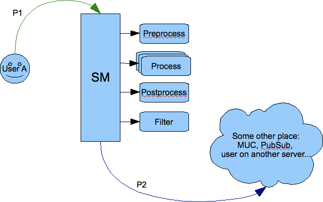
.. |Comp Sends to User| image:: images/comp-sends-to-user.png
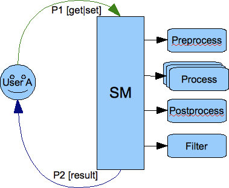
.. |User Sends to User| image:: images/user-sends-to-user.png

1.11.4. SASL Custom Mechanisms and Configuration
^^^^^^^^^^^^^^^^^^^^^^^^^^^^^^^^^^^^^^^^^^^^^^^^^^

**This API is available from Tigase XMPP Server version 5.2.0 or later on our current master branch.**

**In version 8.0.0 there was a major change to the API and configuration of custom SASL mechanisms.**

*Note that API is under active development. This description may be updated at any time.*

Basic SASL Configuration
~~~~~~~~~~~~~~~~~~~~~~~~~

SASL implementation in Tigase XMPP Server is compatible with Java API, the same exact interfaces are used.

The SASL implementation consists of following parts:

1. mechanism

2. CallbackHandler

Mechanisms Configuration
'''''''''''''''''''''''''

To add a new mechanism, a new factory for the mechanism has to be implemented and registered.

The simplest way to add register a new factory is to annotate its class with ``@Bean`` annotation:

**Example of the registration of a SASL mechanism factory with an annotation setting id of the factory to ``customSaslFactory``.**

.. code:: java

   @Bean(name="customSaslFactory", parent = TigaseSaslProvider.class, active = true)
   public class OwnFactory implements SaslServerFactory {}

It can also be done by specifying the class directly for bean ``customSaslFactory`` in the ``config.tdsl`` file like in the example below:

**Example of the registration of a SASL mechanism factory with TDSL setting id of the factory to ``customSaslFactory``.**

.. code:: dsl

   'sess-man' () {
       'sasl-provider' () {
           customSaslFactory(class: com.example.OwnFactory) {}
       }
   }

The class must implement the ``SaslServerFactory`` interface and has public constructor without any arguments. All mechanisms returned by ``getMechanismNames()`` method will be registered automatically.

The default factory that is available and registered by default is ``tigase.auth.TigaseSaslServerFactory`` which provides ``PLAIN``, ``ANONYMOUS``, ``EXTERNAL``, ``SCRAM-SHA-1``, ``SCRAM-SHA-256`` and ``SCRAM-SHA-512`` mechanisms.

CallbackHandler Configuration
'''''''''''''''''''''''''''''''

The ``CallbackHandler`` is a helper class used for loading/retrieving authentication data from data repository and providing them to a mechanism.

To register a new callback handler you need to create a new class extending ``tigase.auth.CallbackHandlerFactory`` (if you wish to keep existing SASL callback handlers) or implementing ``tigase.auth.CallbackHandlerFactoryIfc``. You will need to override ``create()`` method to return an instance of your custom ``CallbackHandler`` when appropriate.

Next you need to register new implementation of ``CallbackHandlerFactoryIfc``. The ``config.tdsl`` file should include:

.. code:: dsl

   'sess-man' () {
       'sasl-provider' () {
           callback-handler-factory(class: com.example.OwnCallbackHandlerFactory) {}
       }
   }

During the authentication process, Tigase server always checks for asks callback handler factory for specific handler to selected mechanisms, and if there is no specific handler the default one is used.

Selecting Mechanisms Available in the Stream
'''''''''''''''''''''''''''''''''''''''''''''

The ``tigase.auth.MechanismSelector`` interface is used for selecting mechanisms available in a stream. Method ``filterMechanisms()`` should return a collection with mechanisms available based on:

1. all registered SASL factories

2. XMPP session data (from ``XMPPResourceConnection`` class)

The default selector returns mechanisms from all mechanism factories registered in ``sasl-provider`` ``(TigaseSaslProvider)``.

It is possible to use a custom selector by specifying it’s class int the ``config.tdsl`` file:

.. code:: dsl

   'sess-man' () {
       'sasl-provider' () {
           'mechanism-selector'(class: com.example.OwnSelector) {}
       }
   }

Logging/Authentication
~~~~~~~~~~~~~~~~~~~~~~~~~~

After the XMPP stream is opened by a client, the server checks which SASL mechanisms are available for the XMPP session. Depending on whether the stream is encrypted or not, depending on the domain, the server can present different available authentication mechanisms. ``MechanismSelector`` is responsible for choosing mechanisms. List of allowed mechanisms is stored in the XMPP session object.

When the client/user begins the authentication procedure it uses one particular mechanism. It must use one of the mechanisms provided by the server as available for this session. The server checks whether mechanisms used by the client is on the list of allowed mechanisms. It the check is successful, the server creates ``SaslServer`` class instance and proceeds with exchanging authentication information. Authentication data is different depending on the mechanism used.

When the SASL authentication is completed without any error, Tigase server should have authorized user name or authorized BareJID. In the first case, the server automatically builds user’s JID based on the domain used in the stream opening element in ``to`` attribute.

If, after a successful authentication, method call: ``getNegotiatedProperty("IS_ANONYMOUS")`` returns ``Boolean.TRUE`` then the user session is marked as anonymous. For valid and registered users this can be used for cases when we do not want to load any user data such as roster, vcard, privacy lists and so on. This is a performance and resource usage implication and can be useful for use cases such as support chat. The authorization is performed based on the client database but we do not need to load any XMPP specific data for the user’s session.

More details about implementation can be found in the `custom mechanisms development <#cmd>`__ section.

Custom Mechanisms Development
~~~~~~~~~~~~~~~~~~~~~~~~~~~~~~~

**Mechanism**
''''''''''''''

``getAuthorizationID()`` method from ``SaslServer`` class **should** return bare JID authorized user. In case that the method returns only user name such as **romeo** for example, the server automatically appends domain name to generate a valid BareJID: *romeo@example.com*. In case the method returns a full, valid BareJID, the server does not change anything.

``handleLogin()`` method from ``SessionManagerHandler`` will be called with user’s Bare JID provided by ``getAuthorizationID()`` (or created later using stream domain name).

**CallbackHandler**
'''''''''''''''''''''

For each session authorization, the server creates a new and separate empty handler. Factory which creates handler instance allows to inject different objects to the handler, depending on interfaces implemented by the handler class:

-  ``AuthRepositoryAware`` - injects ``AuthRepository;``

-  ``DomainAware`` - injects domain name within which the user attempts to authenticate

-  ``NonAuthUserRepositoryAware`` - injects ``NonAuthUserRepository``

General Remarks
''''''''''''''''

``JabberIqAuth`` used for non-SASL authentication mechanisms uses the same callback as the SASL mechanisms.

Methods ``auth`` in ``Repository`` interfaces will be deprecated. These interfaces will be treated as user details providers only. There will be new methods available which will allow for additional login operations on the database such as last successful login recording.

1.12. Using Maven
------------------

Documents Describing Maven Use with the Tigase Projects

1.12.1. Setting up Maven in Windows
^^^^^^^^^^^^^^^^^^^^^^^^^^^^^^^^^^^^^

Here at Tigase, we employ Apache Maven to download latest builds, compile codes for export, and check for errors in the code during build. This guide will go over installing and running Maven from a Windows operating environment. We will consider windows versions 7, 8, and 8.1 for this guide. Because Maven does not come with an installer, there is a manual install process which might be a bit daunting for the new user, but setup and use is fairly simple.

Requirements
~~~~~~~~~~~~~~

1. Maven requires Java Development Kit (JDK) 6 or later. As Tigase requires the latest JDK to run, that will do for our purposes. If you haven’t installed it yet, download the installer from `this website <http://www.oracle.com/technetwork/java/javase/downloads/index.html>`__. Once you install JDK and restart your machine, be sure that you have the **JAVA_HOME** variable entered into Environment Variables so calls to Java will work from the command line.

2. Download the Maven package from `here <https://maven.apache.org/download.cgi>`__ and unpack it into a directory of your choice. For this guide we will use ``C:\Maven\`` .

Setting up Environment Variables
~~~~~~~~~~~~~~~~~~~~~~~~~~~~~~~~~~~

The Environment Variables panel is brought up from the Control Panel by clicking **System and Security** > **System** > **Advanced System Settings**. Now click the |Environment Variables| button at the bottom of the panel and the Environment Variables panel will show.

**IMPORTANT NOTICE: CHANGING THESE SETTINGS CAN BREAK OTHER FUNCTIONS IN THE OPERATING SYSTEM. DO NOT FOLLOW THIS GUIDE IF YOU DO NOT KNOW WHAT YOU ARE DOING!**

|Env Panel|

We need to first add two variable paths to the System variables to account for Maven’s install location. As there are some programs that look for M2_HOME, and others that look for MAVEN_HOME, it’s easier to just add both and have all the bases covered.

Click on New…​

|Env New|

For the Name, use M2_HOME, and for the variable enter the path to maven, which in this case is

::

   C:\Maven

Create another new variable with the MAVEN_HOME name and add the same directory. **These variable values just point to where you have unpacked maven, so they do not have to be in the C directory.**

Go down to the system variables dialog and select Path, then click on Edit. The Path variables are separated by semicolons, find the end of the Variable value string, and add the following after the last entry:

::

   ;%M2_HOME%\bin;%MAVEN_HOME%\bin;

We have added two variables using the %% wildcards surrounding our Variable names from earlier.

Testing Maven
~~~~~~~~~~~~~~~

Now we must test the command line to be sure everything installed correctly. Bring up the command line either by typing ``cmd`` in search, or navigating the start menu.

From the prompt, you do not need to change directory as setting Path allows you to reference it. Type the following command: ``mvn -v``

something like this should show up

::

   Apache Maven 3.3.3 (7994120775791599e205a5524ec3e0dfe41d4a06; 2015-04-22T04:57:3
   7-07:00)
   Maven home: C:\Maven
   Java version: 1.8.0_45, vendor: Oracle Corporation
   Java home: C:\Program Files\Java\jdk1.8.0_45\jre
   Default locale: en_US, platform encoding: Cp1252
   OS name: "windows 7", version: "6.1", arch: "amd64", family: "dos"

If you see this message, success! You have finished installation and are ready to use Maven! If not, go back on your settings and insure that JDK is installed, and the JAVA_HOME, M2_HOME, and MAVEN_HOME variables are set properly.

.. |Environment Variables| image:: images/Env-button.jpg
.. |Env Panel| image:: images/Env-Panel.jpg
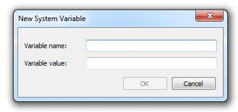

1.12.2. A Very Short Maven Guide
^^^^^^^^^^^^^^^^^^^^^^^^^^^^^^^^^^^

If you don’t use `Maven <http://maven.apache.org/>`__ at all or use it once a year you may find the document a useful maven commands reminder:

Snapshot Compilation and Snapshot Package Generation
~~~~~~~~~~~~~~~~~~~~~~~~~~~~~~~~~~~~~~~~~~~~~~~~~~~~~

-  ``mvn compile`` - compilation of the snapshot package

-  ``mvn package`` - create snapshot jar file

-  ``mvn install`` - install in local repository snapshot jar file

-  ``mvn deploy`` - deploy to the remote repository snapshot jar file

Release Compilation, Generation
~~~~~~~~~~~~~~~~~~~~~~~~~~~~~~~~~

-  ``mvn release:prepare`` prepare the project for a new version release

-  ``mvn release:perform`` execute new version release generation

Generating tar.gz, tar.bz2 File With Sources Only
~~~~~~~~~~~~~~~~~~~~~~~~~~~~~~~~~~~~~~~~~~~~~~~~~~

-  ``mvn -DdescriptorId=src assembly:assembly``

Any of these commands will work when your commandline is in a directory with a pom.xml file. This file will instruct what Maven will do.

Profiles
~~~~~~~~

Maven uses profiles with the -P switch to tell what to compile and build. Tigase uses two different profiles:

-  -Pdist - creates distribution archives

-  -Pdoc - creates documentation

1.13. Tests
------------

1.13.1. Tests
^^^^^^^^^^^^^^^

Tests are very important part of Tigase server development process.

Each release goes through fully automated testing process. All server functions are considered implemented only when they pass the testing cycle. Tigase test suite is used for all our automatic tests which allows to define different test scenarios.

There is no tweaking on databases for tests. All databases are installed in a standard way and run with default settings. Databases are cleared each time before the test cycle starts.

There are no modifications needed to be made to Tigase’s configuration file as well. All tests are performed on a default configuration generated by the configuration wizards.

The server is tested in all supported environments:

1. **XMLDB** - tests with built-in simple XML database. This is a simple and efficient solution for small installations. It is recommended for services with up to 100 user accounts although it has been successfully tested with 10,000 user accounts.

2. **MySQL** - tests with a `MySQL <http://www.mysql.com/>`__ database. Much slower than XMLDB but may handle many more user accounts.

3. **PostgreSQL** - tests with a `PostgreSQL <http://www.postgresql.org/>`__ database. Again it is much slower than XMLDB but may handle much more user accounts. This is basically exactly the same code as for MySQL database (SQL Connector) but tests are executed to make sure the code is compatible with all supported SQL databases and to compare performance.

4. **Distributed** - is a test for distributed installation where c2s and s2s components run on separated machine which connects using external an component protocol (`XEP-0114 <http://www.xmpp.org/extensions/xep-0114.html>`__) to another machine with SessionManager running.


Functional Tests
~~~~~~~~~~~~~~~~~~~~

Basic checking to see if all the functions work at correctly. These tests are performed every time the code is sent to source repository.

+------------+------------------------------------------------------------------+------------------------------------------------------------------+------------------------------------------------------------------+---------------------------------------------------------------------+
| Version    | XMLDB                                                            | MySQL                                                            | PGSQL                                                            | Distributed                                                         |
+------------+------------------------------------------------------------------+------------------------------------------------------------------+------------------------------------------------------------------+---------------------------------------------------------------------+
| 3.3.2-b889 | `00:00:12 <tests/3.3.2-b889/func/xmldb/functional-tests.html>`__ | `00:00:17 <tests/3.3.2-b889/func/mysql/functional-tests.html>`__ | `00:00:17 <tests/3.3.2-b889/func/pgsql/functional-tests.html>`__ | none                                                                |
+------------+------------------------------------------------------------------+------------------------------------------------------------------+------------------------------------------------------------------+---------------------------------------------------------------------+
| 3.3.2-b880 | `00:00:13 <tests/3.3.2-b880/func/xmldb/functional-tests.html>`__ | `00:00:15 <tests/3.3.2-b880/func/mysql/functional-tests.html>`__ | `00:00:15 <tests/3.3.2-b880/func/pgsql/functional-tests.html>`__ | None                                                                |
+------------+------------------------------------------------------------------+------------------------------------------------------------------+------------------------------------------------------------------+---------------------------------------------------------------------+
| 3.0.2-b700 | `00:00:22 <tests/3.0.2-b700/func/xmldb/functional-tests.html>`__ | `00:00:24 <tests/3.0.2-b700/func/mysql/functional-tests.html>`__ | `00:00:25 <tests/3.0.2-b700/func/pgsql/functional-tests.html>`__ | `00:00:25 <tests/3.0.2-b700/func/sm-mysql/functional-tests.html>`__ |
+------------+------------------------------------------------------------------+------------------------------------------------------------------+------------------------------------------------------------------+---------------------------------------------------------------------+
| 2.9.5-b606 | `00:00:22 <tests/2.9.5-b606/func/xmldb/functional-tests.html>`__ | `00:00:24 <tests/2.9.5-b606/func/mysql/functional-tests.html>`__ | `00:00:24 <tests/2.9.5-b606/func/pgsql/functional-tests.html>`__ | `00:00:24 <tests/2.9.5-b606/func/sm-mysql/functional-tests.html>`__ |
+------------+------------------------------------------------------------------+------------------------------------------------------------------+------------------------------------------------------------------+---------------------------------------------------------------------+
| 2.9.3-b548 | `00:00:22 <tests/2.9.3-b548/func/xmldb/functional-tests.html>`__ | `00:00:23 <tests/2.9.3-b548/func/mysql/functional-tests.html>`__ | `00:00:25 <tests/2.9.3-b548/func/pgsql/functional-tests.html>`__ | `00:00:25 <tests/2.9.3-b548/func/sm-mysql/functional-tests.html>`__ |
+------------+------------------------------------------------------------------+------------------------------------------------------------------+------------------------------------------------------------------+---------------------------------------------------------------------+
| 2.9.1-b528 | `00:00:21 <tests/2.9.1-b528/func/xmldb/functional-tests.html>`__ | `00:00:23 <tests/2.9.1-b528/func/mysql/functional-tests.html>`__ | `00:00:24 <tests/2.9.1-b528/func/pgsql/functional-tests.html>`__ | `00:00:25 <tests/2.9.1-b528/func/sm-mysql/functional-tests.html>`__ |
+------------+------------------------------------------------------------------+------------------------------------------------------------------+------------------------------------------------------------------+---------------------------------------------------------------------+
| 2.8.6-b434 | `00:00:21 <tests/2.8.6-b434/func/xmldb/functional-tests.html>`__ | `00:00:24 <tests/2.8.6-b434/func/mysql/functional-tests.html>`__ | `00:00:24 <tests/2.8.6-b434/func/pgsql/functional-tests.html>`__ | `00:00:25 <tests/2.8.6-b434/func/sm-mysql/functional-tests.html>`__ |
+------------+------------------------------------------------------------------+------------------------------------------------------------------+------------------------------------------------------------------+---------------------------------------------------------------------+
| 2.8.5-b422 | `00:00:21 <tests/2.8.5-b422/func/xmldb/functional-tests.html>`__ | `00:00:24 <tests/2.8.5-b422/func/mysql/functional-tests.html>`__ | `00:00:24 <tests/2.8.5-b422/func/pgsql/functional-tests.html>`__ | `00:00:26 <tests/2.8.5-b422/func/sm-mysql/functional-tests.html>`__ |
+------------+------------------------------------------------------------------+------------------------------------------------------------------+------------------------------------------------------------------+---------------------------------------------------------------------+
| 2.8.3-b409 | `00:00:27 <tests/2.8.3-b409/func/xmldb/functional-tests.html>`__ | `00:00:29 <tests/2.8.3-b409/func/mysql/functional-tests.html>`__ | `00:00:29 <tests/2.8.3-b409/func/pgsql/functional-tests.html>`__ | `00:00:32 <tests/2.8.3-b409/func/sm-mysql/functional-tests.html>`__ |
+------------+------------------------------------------------------------------+------------------------------------------------------------------+------------------------------------------------------------------+---------------------------------------------------------------------+
| 2.7.2-b378 | `00:00:30 <tests/2.7.2-b378/func/xmldb/functional-tests.html>`__ | `00:00:34 <tests/2.7.2-b378/func/mysql/functional-tests.html>`__ | `00:00:33 <tests/2.7.2-b378/func/pgsql/functional-tests.html>`__ | `00:00:35 <tests/2.7.2-b378/func/sm-mysql/functional-tests.html>`__ |
+------------+------------------------------------------------------------------+------------------------------------------------------------------+------------------------------------------------------------------+---------------------------------------------------------------------+
| 2.6.4-b300 | `00:00:30 <tests/2.6.4-b300/func/xmldb/functional-tests.html>`__ | `00:00:32 <tests/2.6.4-b300/func/mysql/functional-tests.html>`__ | `00:00:35 <tests/2.6.4-b300/func/pgsql/functional-tests.html>`__ | `00:00:39 <tests/2.6.4-b300/func/sm-mysql/functional-tests.html>`__ |
+------------+------------------------------------------------------------------+------------------------------------------------------------------+------------------------------------------------------------------+---------------------------------------------------------------------+
| 2.6.4-b295 | `00:00:29 <tests/2.6.4-b295/func/xmldb/functional-tests.html>`__ | `00:00:32 <tests/2.6.4-b295/func/mysql/functional-tests.html>`__ | `00:00:45 <tests/2.6.4-b295/func/pgsql/functional-tests.html>`__ | `00:00:36 <tests/2.6.4-b295/func/sm-mysql/functional-tests.html>`__ |
+------------+------------------------------------------------------------------+------------------------------------------------------------------+------------------------------------------------------------------+---------------------------------------------------------------------+
| 2.6.0-b287 | `00:00:31 <tests/2.6.0-b287/func/xmldb/functional-tests.html>`__ | `00:00:34 <tests/2.6.0-b287/func/mysql/functional-tests.html>`__ | `00:00:47 <tests/2.6.0-b287/func/pgsql/functional-tests.html>`__ | `00:00:43 <tests/2.6.0-b287/func/sm-mysql/functional-tests.html>`__ |
+------------+------------------------------------------------------------------+------------------------------------------------------------------+------------------------------------------------------------------+---------------------------------------------------------------------+
| 2.5.0-b279 | `00:00:30 <tests/2.5.0-b279/func/xmldb/functional-tests.html>`__ | `00:00:34 <tests/2.5.0-b279/func/mysql/functional-tests.html>`__ | `00:00:45 <tests/2.5.0-b279/func/pgsql/functional-tests.html>`__ | `00:00:43 <tests/2.5.0-b279/func/sm-mysql/functional-tests.html>`__ |
+------------+------------------------------------------------------------------+------------------------------------------------------------------+------------------------------------------------------------------+---------------------------------------------------------------------+
| 2.4.0-b263 | `00:00:29 <tests/2.4.0-b263/func/xmldb/functional-tests.html>`__ | `00:00:33 <tests/2.4.0-b263/func/mysql/functional-tests.html>`__ | `00:00:45 <tests/2.4.0-b263/func/pgsql/functional-tests.html>`__ | `00:00:44 <tests/2.4.0-b263/func/sm-mysql/functional-tests.html>`__ |
+------------+------------------------------------------------------------------+------------------------------------------------------------------+------------------------------------------------------------------+---------------------------------------------------------------------+
| 2.3.4-b226 | None                                                             | `00:00:48 <tests/functional-tests.html>`__                       | None                                                             | None                                                                |
+------------+------------------------------------------------------------------+------------------------------------------------------------------+------------------------------------------------------------------+---------------------------------------------------------------------+

Performance Tests
~~~~~~~~~~~~~~~~~~~~~

Checking to see whether the function performs well enough.

+------------+-------------------------------------------------------------------+-------------------------------------------------------------------+-------------------------------------------------------------------+----------------------------------------------------------------------+
| Version    | XMLDB                                                             | MySQL                                                             | PGSQL                                                             | Distributed                                                          |
+------------+-------------------------------------------------------------------+-------------------------------------------------------------------+-------------------------------------------------------------------+----------------------------------------------------------------------+
| 3.3.2-b889 | `00:12:17 <tests/3.3.2-b889/perf/xmldb/performance-tests.html>`__ | `00:13:42 <tests/3.3.2-b889/perf/mysql/performance-tests.html>`__ | `00:17:10 <tests/3.3.2-b889/perf/pgsql/performance-tests.html>`__ | none                                                                 |
+------------+-------------------------------------------------------------------+-------------------------------------------------------------------+-------------------------------------------------------------------+----------------------------------------------------------------------+
| 3.3.2-b880 | `00:13:39 <tests/3.3.2-b880/perf/xmldb/performance-tests.html>`__ | `00:14:09 <tests/3.3.2-b880/perf/mysql/performance-tests.html>`__ | `00:17:39 <tests/3.3.2-b880/perf/pgsql/performance-tests.html>`__ | None                                                                 |
+------------+-------------------------------------------------------------------+-------------------------------------------------------------------+-------------------------------------------------------------------+----------------------------------------------------------------------+
| 3.0.2-b700 | `00:10:26 <tests/3.0.2-b700/perf/xmldb/performance-tests.html>`__ | `00:11:00 <tests/3.0.2-b700/perf/mysql/performance-tests.html>`__ | `00:12:08 <tests/3.0.2-b700/perf/pgsql/performance-tests.html>`__ | `00:24:05 <tests/3.0.2-b700/perf/sm-mysql/performance-tests.html>`__ |
+------------+-------------------------------------------------------------------+-------------------------------------------------------------------+-------------------------------------------------------------------+----------------------------------------------------------------------+
| 2.9.5-b606 | `00:09:54 <tests/2.9.5-b606/perf/xmldb/performance-tests.html>`__ | `00:11:18 <tests/2.9.5-b606/perf/mysql/performance-tests.html>`__ | `00:37:08 <tests/2.9.5-b606/perf/pgsql/performance-tests.html>`__ | `00:16:20 <tests/2.9.5-b606/perf/sm-mysql/performance-tests.html>`__ |
+------------+-------------------------------------------------------------------+-------------------------------------------------------------------+-------------------------------------------------------------------+----------------------------------------------------------------------+
| 2.9.3-b548 | `00:10:00 <tests/2.9.3-b548/perf/xmldb/performance-tests.html>`__ | `00:11:29 <tests/2.9.3-b548/perf/mysql/performance-tests.html>`__ | `00:36:43 <tests/2.9.3-b548/perf/pgsql/performance-tests.html>`__ | `00:16:47 <tests/2.9.3-b548/perf/sm-mysql/performance-tests.html>`__ |
+------------+-------------------------------------------------------------------+-------------------------------------------------------------------+-------------------------------------------------------------------+----------------------------------------------------------------------+
| 2.9.1-b528 | `00:09:46 <tests/2.9.1-b528/perf/xmldb/performance-tests.html>`__ | `00:11:15 <tests/2.9.1-b528/perf/mysql/performance-tests.html>`__ | `00:36:12 <tests/2.9.1-b528/perf/pgsql/performance-tests.html>`__ | `00:16:36 <tests/2.9.1-b528/perf/sm-mysql/performance-tests.html>`__ |
+------------+-------------------------------------------------------------------+-------------------------------------------------------------------+-------------------------------------------------------------------+----------------------------------------------------------------------+
| 2.8.6-b434 | `00:10:02 <tests/2.8.6-b434/perf/xmldb/performance-tests.html>`__ | `00:11:45 <tests/2.8.6-b434/perf/mysql/performance-tests.html>`__ | `00:36:36 <tests/2.8.6-b434/perf/pgsql/performance-tests.html>`__ | `00:17:36 <tests/2.8.6-b434/perf/sm-mysql/performance-tests.html>`__ |
+------------+-------------------------------------------------------------------+-------------------------------------------------------------------+-------------------------------------------------------------------+----------------------------------------------------------------------+
| 2.8.5-b422 | `00:12:37 <tests/2.8.5-b422/perf/xmldb/performance-tests.html>`__ | `00:14:40 <tests/2.8.5-b422/perf/mysql/performance-tests.html>`__ | `00:38:59 <tests/2.8.5-b422/perf/pgsql/performance-tests.html>`__ | `00:21:40 <tests/2.8.5-b422/perf/sm-mysql/performance-tests.html>`__ |
+------------+-------------------------------------------------------------------+-------------------------------------------------------------------+-------------------------------------------------------------------+----------------------------------------------------------------------+
| 2.8.3-b409 | `00:12:32 <tests/2.8.3-b409/perf/xmldb/performance-tests.html>`__ | `00:14:26 <tests/2.8.3-b409/perf/mysql/performance-tests.html>`__ | `00:37:57 <tests/2.8.3-b409/perf/pgsql/performance-tests.html>`__ | `00:21:26 <tests/2.8.3-b409/perf/sm-mysql/performance-tests.html>`__ |
+------------+-------------------------------------------------------------------+-------------------------------------------------------------------+-------------------------------------------------------------------+----------------------------------------------------------------------+
| 2.7.2-b378 | `00:12:28 <tests/2.7.2-b378/perf/xmldb/performance-tests.html>`__ | `00:14:57 <tests/2.7.2-b378/perf/mysql/performance-tests.html>`__ | `00:37:09 <tests/2.7.2-b378/perf/pgsql/performance-tests.html>`__ | `00:22:20 <tests/2.7.2-b378/perf/sm-mysql/performance-tests.html>`__ |
+------------+-------------------------------------------------------------------+-------------------------------------------------------------------+-------------------------------------------------------------------+----------------------------------------------------------------------+
| 2.6.4-b300 | `00:12:46 <tests/2.6.4-b300/perf/xmldb/performance-tests.html>`__ | `00:14:59 <tests/2.6.4-b300/perf/mysql/performance-tests.html>`__ | `00:36:56 <tests/2.6.4-b300/perf/pgsql/performance-tests.html>`__ | `00:35:00 <tests/2.6.4-b300/perf/sm-mysql/performance-tests.html>`__ |
+------------+-------------------------------------------------------------------+-------------------------------------------------------------------+-------------------------------------------------------------------+----------------------------------------------------------------------+
| 2.6.4-b295 | `00:12:23 <tests/2.6.4-b295/perf/xmldb/performance-tests.html>`__ | `00:14:59 <tests/2.6.4-b295/perf/mysql/performance-tests.html>`__ | `00:42:24 <tests/2.6.4-b295/perf/pgsql/performance-tests.html>`__ | `00:30:18 <tests/2.6.4-b295/perf/sm-mysql/performance-tests.html>`__ |
+------------+-------------------------------------------------------------------+-------------------------------------------------------------------+-------------------------------------------------------------------+----------------------------------------------------------------------+
| 2.6.0-b287 | `00:13:50 <tests/2.6.0-b287/perf/xmldb/performance-tests.html>`__ | `00:16:53 <tests/2.6.0-b287/perf/mysql/performance-tests.html>`__ | `00:48:17 <tests/2.6.0-b287/perf/pgsql/performance-tests.html>`__ | `00:49:06 <tests/2.6.0-b287/perf/sm-mysql/performance-tests.html>`__ |
+------------+-------------------------------------------------------------------+-------------------------------------------------------------------+-------------------------------------------------------------------+----------------------------------------------------------------------+
| 2.5.0-b279 | `00:13:29 <tests/2.5.0-b279/perf/xmldb/performance-tests.html>`__ | `00:16:58 <tests/2.5.0-b279/perf/mysql/performance-tests.html>`__ | `00:47:15 <tests/2.5.0-b279/perf/pgsql/performance-tests.html>`__ | `00:41:52 <tests/2.5.0-b279/perf/sm-mysql/performance-tests.html>`__ |
+------------+-------------------------------------------------------------------+-------------------------------------------------------------------+-------------------------------------------------------------------+----------------------------------------------------------------------+
| 2.4.0-b263 | `00:13:20 <tests/2.4.0-b263/perf/xmldb/performance-tests.html>`__ | `00:16:21 <tests/2.4.0-b263/perf/mysql/performance-tests.html>`__ | `00:43:56 <tests/2.4.0-b263/perf/pgsql/performance-tests.html>`__ | `00:42:08 <tests/2.4.0-b263/perf/sm-mysql/performance-tests.html>`__ |
+------------+-------------------------------------------------------------------+-------------------------------------------------------------------+-------------------------------------------------------------------+----------------------------------------------------------------------+
| 2.3.4-b226 | None                                                              | `01:23:30 <tests/performance-tests.html>`__                       | None                                                              | None                                                                 |
+------------+-------------------------------------------------------------------+-------------------------------------------------------------------+-------------------------------------------------------------------+----------------------------------------------------------------------+

Stability Tests
~~~~~~~~~~~~~~~~~~

Checking to see whether the function behaves well in long term run. It must handle hundreds of requests a second in a several hour server run.

+------------+-------+-------------------------------------------+-------+-------------+
| Version    | XMLDB | MySQL                                     | PGSQL | Distributed |
+------------+-------+-------------------------------------------+-------+-------------+
| 2.3.4-b226 | None  | `16:06:31 <tests/stability-tests.html>`__ | None  | None        |
+------------+-------+-------------------------------------------+-------+-------------+

1.13.2. Tigase Test Suite
^^^^^^^^^^^^^^^^^^^^^^^^^^^

Tigase Test Suite is an engine which allows you to run tests. Essentially it just executes **TestCase** implementations. The tests may depend on other tests which means they are executed in specific order. For example authentication test is executed after the stream open test which in turn is executed after network socket connection test.

Each **TestCase** implementation may have it’s own set of specific parameters. There is a set of common parameters which may be applied to any **TestCase**. As an example of the common parameter you can take **-loop = 10** which specified that the **TestCase** must be executed 10 times. The test specific parameter might be **-user-name = tester** which may set the user name for authentication test.

The engine is very generic and allows you to write any kind of tests but for the Tigase projects the current TestCase implementations mimic an XMPP client and are designed to test XMPP servers.

The suite contains a kind of scripting language which allows you to combine test cases into a test scenarios. The test scenario may contain full set of functional tests for example, another test scenario may contain performance tests and so on.

Running Tigase Test Suite (TTS)
~~~~~~~~~~~~~~~~~~~~~~~~~~~~~~~~~

To obtain TTS, you will first need to clone the repository

::

   git clone https://repository.tigase.org/git/tigase-testsuite.git

Once cloning is finished, navigate to the TTS root directory and compile with maven:

::

   mvn clean install

Maven will compile TTS and place jars in the necessary locations. From the same directory, you can begin running TTS using the following command:

::

   ./scripts/all-tests-runner.sh

You should see the following, which outlines the possible options to customize your test run

.. code:: bash

   Run selected or all tests for Tigase server
   ----
   Author: Artur Hefczyc <artur_hefczyc@vnu.co.uk>
   Version: 2.0.0
   ----
     --help|-h This help message
     --func [mysql|pgsql|derby|mssql|mongodb]
                 Run all functional tests for a single database configuration
     --lmem [mysql|pgsql|derby|mssql|mongodb]
                 Run low memory tests for a single database configuration
     --perf [mysql|pgsql|derby|mssql|mongodb]
                 Run all performance tests for a single database configuration
     --stab [mysql|pgsql|derby|mssql|mongodb]
                 Run all stability tests for a single database
                 configuration
     --func-all  Run all functional tests for all database
                 configurations
     --lmem-all  Run low memory tests for all database
                 configurations
     --perf-all  Run all performance tests for all database
                 configurations
     --stab-all  Run all stability tests for all database
                 configurations
     --all-tests Run all functionality and performance tests for
                 database configurations
     --single test_file.cot
     --other script_file.xmpt
   ----
     Special parameters only at the beginning of the parameters list
     --debug|-d                 Turns on debug mode
     --skip-db-relad|-no-db     Turns off reloading database
     --skip-server|-no-serv     Turns off Tigase server start
     --small-mem|-sm            Run in small memory mode
   -----------
     Other possible parameters are in following order:
     [server-dir] [server-ip]

Customizing Tigase Test Suite
~~~~~~~~~~~~~~~~~~~~~~~~~~~~~~~

You may run the tests from a command line like above, however you may create and edit the /scripts/tests-runner-settings.sh file to fit your Tigase installation and avoid having to have long complex commands as this template shows:

.. code:: script

   #!/bin/bash

   func_rep="func-rep.html"
   perf_rep="perf-rep.html"
   db_name="tigasetest"
   db_user="tigase"
   db_pass="tigase"
   root_user="root"
   root_pass="root"

   TESTS=("derby" "mysql" "pgsql" "mssql")
   IPS=("127.0.0.1" "127.0.0.1" "127.0.0.1" "127.0.0.1")

   server_timeout=10

   server_dir="/home/tigase/tigase-server"
   database="derby"
   #database="mysql"
   server_ip="127.0.0.1"

   MS_MEM=100
   MX_MEM=1000

   SMALL_MS_MEM=10
   SMALL_MX_MEM=50

This will allow you to maintain identical settings through multiple runs of TTS. See the next section for learning how the scripting language works and how you can create and run your own custom tests.

1.13.3. Test Suite Scripting Language
^^^^^^^^^^^^^^^^^^^^^^^^^^^^^^^^^^^^^^

The test suite contains scripting language which allows you to combine test cases into a test scenarios. On the lowest level, however the language is designed to allow you to describe the test by setting test parameters, test comments, identification and so on.

Let’s look at the example test description.

.. code:: java

   Short name@test-id-1;test-id-2: Short description for the test case
   {
    -loop = 10
    -user-name = Frank
    # This is a comment which is ignored
   }
   >> Long, detailed description of the test case <<

Meaning of all elements:

1. **Short name** is any descriptive name you want. It doesn’t need to be unique, just something which tells you what this test is about. @ is a separator between the short name and the test ids.

2. **test-id-1;test-id-2** is a semicolon separated of the test cases IDs. The tests cases are executed in the listed order. And listing them there means that the test-id-2 depends on test-id-1. Normally you don’t have to list all the dependencies because all mandatory dependencies are included automatically. Which means if you have an authentication test case the suite adds the network socket connection and stream opening tests automatically. Sometimes however, there are dependencies which are optional or multiple mandatory dependencies and you need to select which one has to be executed. As a good example is the authentications test case. There are many authentication tests: PLAIN-AUTH, SASL-DIGESTMD5, SASL-PLAIN, DIGEST-AUTH and they are all mandatory for most of other tests like roster, presence and so on. One of the authentication tests is a default dependency but if you put on the list different authentication it will be used instead of default one.

3. **:** is a separator between test cases ids list and the short test description.

4. **Short test description** is placed between : - colon and opening **{** - curly bracket. This is usually quite brief, single line test description.

5. **{ }** curly brackets contain all the test parameters, like how many times the test has to be executed or run the test in a separate thread, user name, host IP address for the network connection and many others.

6. **>> <<** inside the double greater than and double less than you put a very long, multiple line test description.

As for the testing script between open curly brackets { and close one } you can put all the test case parameters you wish. The format for it is:

**-parameter-name = value**

Parameter names always start with **-**. Note, some parameters don’t require any value. They can exist on their own without any value assigned:

**-debug-on-error**

This imitates if you were to put **yes** or **true** as the value.

The scripting language includes also support for variables which can be assigned any value and used multiple times later on. You assign a value to the variable the same way as you assign it to the parameter:

**$(variable-name) = value**

The variable name must be always enclosed with brackets **()** and start with **$**.

The value may be enclosed within double quotes **""** or double quotes may be omitted. If this is a simple string like a number or character string consisting only of digits, letters, underscore **\_** and hyphen **-** then you can omit double quotes otherwise you must enclose the value.

The test case descriptions can be nested inside other test case descriptions. Nested test case descriptions inherit parameters and variables from outer test case description.

1.13.4. Writing Tests for Plugins
^^^^^^^^^^^^^^^^^^^^^^^^^^^^^^^^^^^

You can write tests in a simple text file which is loaded during test suite runtime.

You simply specify what should be send to the server and what response should be expected from the server. No need to write Java code and recompile the whole test suite for new tests. It means new test cases can be now written easily and quickly which hopefully means more detailed tests for the server.

How it works:

Let’s take `XEP-0049 <http://www.xmpp.org/extensions/xep-0049.html>`__ Private XML Storage. Looking into the spec we can see the first example:

Example: Client Stores Private Data
~~~~~~~~~~~~~~~~~~~~~~~~~~~~~~~~~~~~

**CLIENT:**

.. code:: xml

   <iq type="set" id="1001">
     <query xmlns="jabber:iq:private">
       <exodus xmlns="exodus:prefs">
         <defaultnick>Hamlet</defaultnick>
       </exodus>
     </query>
   </iq>

**SERVER:**

.. code:: xml

   <iq type="result" id="1001"/>

This is enough for the first simple test. I have to create text file ``JabberIqPrivate.test`` looking like this:

::

   send: {

   <iq type="set" id="1001">
     <query xmlns="jabber:iq:private">
       <exodus xmlns="exodus:prefs">
         <defaultnick>Hamlet</defaultnick>
       </exodus>
     </query>
   </iq>
   }

   expect: {
   <iq type="result" id="1001"/>
   }

And now I can execute the test:

.. code:: bash

   testsuite $ ./scripts/all-tests-runner.sh --single JabberIqPrivate.test

   Tigase server home directory: ../server
   Version: 2.8.5-b422
   Database:         xmldb
   Server IP:        127.0.0.1
   Extra parameters: JabberIqPrivate.test
   Starting Tigase:
   Tigase running pid=6751

   Running: 2.8.5-b422-xmldb test, IP 127.0.0.1...
   Script name: scripts/single-xmpp-test.xmpt
   Common test:  Common test  ...        failure!
   FAILURE,  (Received result doesnt match expected result.,
   Expected one of: [<iq id="1001" type="result"/>],
   received:
   [<iq id="1001" type="error">
     <query xmlns="jabber:iq:private">
       <exodus xmlns="exodus:prefs">
         <defaultnick>Hamlet</defaultnick>
       </exodus>
     </query>
     <error type="cancel">
       <feature-not-implemented xmlns="urn:ietf:params:xml:ns:xmpp-stanzas"/>
       <text xml:lang="en" xmlns="urn:ietf:params:xml:ns:xmpp-stanzas">
         Feature not supported yet.</text>
     </error>
   </iq>]),

   Total: 100ms
   Test time: 00:00:02
   Shutting down Tigase: 6751

If I just started working on this XEP and there is no code on the server side, the result is perfectly expected although maybe this is not what we want. After a while of working on the server code I can execute the test once again:

.. code:: bash

   testsuite $ ./scripts/all-tests-runner.sh --single JabberIqPrivate.test

   Tigase server home directory: ../server

   Version: 2.8.5-b422

   Database:         xmldb

   Server IP:        127.0.0.1

   Extra parameters: JabberIqPrivate.test

   Starting Tigase:

   Tigase running pid=6984

   Running: 2.8.5-b422-xmldb test, IP 127.0.0.1...

   Script name: scripts/single-xmpp-test.xmpt

   Common test:  Common test  ... success,  Total: 40ms

   Test time: 00:00:01

   Shutting down Tigase: 6984

This is it. The result we want in a simple and efficient way. We can repeat it as many times we want which is especially important in longer term trials. Every time we change the server code we can re-run tests to make sure we get correct responses from the server.

You can have a look in the current build, with more complete test cases, file for `JabberIqPrivate <https://github.com/tigase/tigase-testsuite/tree/master/tests/data/JabberIqPrivate.cot>`__.

Now my server tests are no longer outdated. Of course not all cases are so simple. Some XEPs require calculations to be done before stanza is sent or to compare received results. A good example for this case is user authentication like SASL and even NON-SASL. But still, there are many cases which can be covered by simple tests: roster management, privacy lists management, vCard, private data storage and so on.

1.13.5. Test Case Parameters Description
^^^^^^^^^^^^^^^^^^^^^^^^^^^^^^^^^^^^^^^^^^^

There is long list of parameters which can be applied to any test case. Here is the description of all possible parameters which can be used to build test scenarios.

There is long list of parameters which can be applied to any test case. Here is the description of all possible parameters which can be used to build test scenarios.

Test Report Configuration
~~~~~~~~~~~~~~~~~~~~~~~~~~~~

There are test report parameters which must be set in the main script file in order to generate HTML report from the test. These parameters have no effect is they are set inside the test case description.

1. **-version = 2.0.0** sets the test script version. This is used to easily detect incompatibility issues when the test suite loads a script created for more recent version of the suite and may not work properly for this version.

2. **-output-format = (html \| html-content)** sets the output format for the test report. There is actually only one format possible right now - HTML. The only difference between these 2 options is that the **html** format creates full HTML page with HTML header and body. The **html-content** format on the other hand creates only what is inside ``<body/>`` element. And is used to embed test result inside other HTML content.

3. **-output-file = "report-file.html"** sets the file name for the test report.

4. **-output-history = (yes \| no)** sets logging of the all protocol data sent between test suite and the XMPP server. Normally for functional tests it is recommended to set it to **yes** but for all other tests like performance or load tests it should be set to **no**.

5. **-history-format = separate-file** sets protocol data logging to a separate file. Currently this is the only possible option.

6. **-output-cols = (5 \| 7)** Only valid values are:

   .. code:: bash

      5: "Test name", "Result", "Test time", "Description" [, "History" ]
      7: "Test name", "Result", "Total time", "OK", "Average", "Description" [, "History" ]

7. **-title** = "The title of the report page" This parameter sets the test report title which is placed in the HTML page in the ``<title/>`` element as well as in the first page header.

Basic Test Parameters
~~~~~~~~~~~~~~~~~~~~~~~~~

These parameters can be set on per-test case basis but usually they are set in the main script file to apply them to all test cases.

1.  **-base-ns = "jabber:client"** sets the XML name space used for the XML stream in the XMPP connection. Some test cases can be used to test client to server protocol as well as server to server protocol and possibly different protocols added in the future.

2.  **-debug** switches debugging mode on. All the communication between the test suite and the server is printed out to the text console and all other debugging information including java exceptions are displayed as well. It is especially useful when some test fails and you want to find out why.

3.  **-debug-on-error** switches on debugging mode on error detection. Normally debug output generates lots of message which makes the output very hard to read. Especially in the performance tests not only you can read fast scrolling lines of the protocol data but also it slows the test down. This option however turns debugging off if everything is working well and then generates debug output if any test error us detected.

4.  **-def-auth = (auth-plain \| auth-digest \| auth-sasl)** sets the default authentication method for the user connection.

5.  **-def-stream = (stream-client \| stream-server \| stream-component \| stream-bosh)** sets the connection stream to be tested and the name space for the connection.

6.  **-host = "host.name"** the vhost name the tested server runs for. It may be the real DNS name or just configured for testing purposes hostname. It must match however the server configuration.

7.  **-keys-file = "certs/keystore"** sets the location of the keys store file. No need to touch it.

8.  **-keys-file-password = keystore** sets the password for the keystore file. Normally you don’t have to touch it.

9.  **-serverip = "127.0.0.1"** defines the XMPP server IP address. You may omit this parameter and then the IP address will be determined automatically based on the server DNS address. However if the DNS address can not be correctly resolved or if you run tests on the localhost you can use this parameter to enforce the IP address.

10. **-socket-wait = 10000** sets the network socket timeout in milliseconds that is maximum time the test suite will wait for the response from the server. You may want to increase the timeout for some specific tests which require lots of computation or database activity on the server. Normally 10 seconds is enough for most cases.

11. **-stop-on-fail = true** causes the script to terminate all actions on the first failed test case. It helps diagnosing the server state at the failure point.

12. **-trust-file = "certs/client_truststore"** sets the file name for the client trust store file. No need to change it.

13. **-trust-file-password = truststore** sets the password for the trust store file. Normally you don’t have to touch it.

14. **-user-name = tester** sets the user name used for the XMPP connections between the test suite and the XMPP server. It is usually set globally the same for all tests and for some tests like receiving the server configuration you may want to use a different account (with admin permissions). Then you can set a different user for this specific test case.

15. **-user-pass = tester-password** sets the password for the user used for the XMPP connection between the test suite and the XMPP server.

16. **-user-resr = resource** sets the user JID resource part for the XMPP connection between the test suite and the XMPP server.

Test Case Parameters
~~~~~~~~~~~~~~~~~~~~~

Test parameters which are normally set on per-test case basis and apply only to the test they are set for and all inherited tests. Some of the parameters though are applied only to inherited test cases. Please look in the description below to find more details.

1.  **-active-connection** is a similar parameter to **-on-one-socket** option. If set the suite doesn’t close the network socket and if the test is run in loop each loop run re-uses the network connection. Unlike in the -on-one-socket mode the whole test is executed on each run including XMPP stream initialization and user authentication. This option is currently not recommended in a normal use. It is useful only to debug the server behavior in very special use cases.

2.  **-background** executes the test in a separate thread in background and immediately returns control to the test suite program without waiting for the test to complete. Default behavior is to execute all tests sequentially and run next test when previous one has been completed. This parameter however allows to run tests concurrently. This a bit similar option to the **-daemon** parameter. The daemon test/task however is ignored completely and results from the daemon are not collected where the background test is a normal test which is run concurrently with another one or possibly many other tests.

3.  **-daemon** creates a task running in background in a separate thread. Such a test runs infinitely as a daemon, it is not recorded in the test report and it’s result is not calculated. The purpose of such test/task is to work as a helper for other test cases. A good example of such daemon test is message responder - the test which runs under a different user name and waits for messages and responding to the sender.

4.  **-delay = 1000** sets the waiting time in milliseconds after the test case is completed. You may use it if you want to introduce short delay between each test cases run in the loop or if you start the helper daemon thread and you have to add the delay to make sure it is ready to work before next real test starts sending requests to the daemon.

5.  **-expect-type = error** sets the type for a packet expected as a response. Some test cases like message sender expects sometimes response with the same type it has sent the packet ( **chat** ) but in some other cases when it sends a message to a user who has privacy lists set to block messages the response should be with an error. This way we can use the same test cases for testing different responses scenarios.

6.  **-loop = 10** sets the number of times the test (and all inherited tests) are repeated. You can use a **$(loop)** pseudo-variable to obtain and use the current loop run number. This is useful if you want to run every loop run for a different user name like registering 10 different user accounts. To do this you stick the $(loop) variable to the user name string: **-user-name = "nick_name_$(loop)"**.

7.  **-loop-delay = 10** sets a delay in milliseconds between each individual loop run for the tests which is run multiple times. This is similar parameter to the **-delay** one but the **-delay** option introduces a delay after the whole test (or all loop runs) has been completed. The loop delay options adds waiting time between each run of the looped test.

8.  **-loop-start = 5** sets the loop starting value. It doesn’t affect number of loop runs in a any way. It only affects the value of the **$(loop)** variable. Let’s say you want to run a load test for the server with 100k concurrent users and you want to run the test from 3 different machines. To make sure each machine uses distinct user accounts you have to set a different **-loop-start** parameter on each to prevent from overlapping.

9.  **-messages = 10** sets the number of messages to send to the server. This is another way of looping the test. Instead of repeating the whole test with opening network connection, XMPP stream, authentication and so on it causes only to send the message this many times. This parameters is accepted by some test cases only which send messages. For the messages listeners - test cases which is supposed to respond to the messages the number set here specifies how many times the the response must be sent before the test successfully terminates it’s work.

10. **-multi-thread** option causes to run the test case and all inherited in all levels test cases in separate threads. Normally the test case where you put the parameter doesn’t have a test ID (what you put between '@' and ':' characters so it doesn’t run a test on it’s own. Instead it contains a series of test cases inside which are then run in a separate thread each. This is a key parameter to run tests for many concurrent users. (Not a load tests though.) For example you can see whether the server behaves correctly when 5 simultaneous modifies their roster. The execution time all inherited tests run in a separate threads is added together and also results from each individual test is calculated and added to the total main test results.

11. **-no-record** is used for kind of configuration tests (tasks) which are used to prepare the XMPP server or database for later tests. As an example can be creation of the test user account which is later on used for the roster tests. Usually you don’t want to include such tests in the test report and using this parameter you essentially exclude the test from the report. The test and the result however shows in the command line output so you can still track what is really going on.

12. **-on-one-socket** is a modifier for a looped test case. Normally when we switch looping on using **-loop** parameter the suite resets the state, closes the network socket and runs the test from the very beginning including opening network socket, XMPP stream, authentication and so on. This parameter however changes this behavior. The network socket is not closed when the test run is completed (successfully) and next run executes only the last part of the test omitting the XMPP stream initialization, authentication and all others but last. This is useful when you want to send many messages to the server (although this effect may be accomplished using **-messages** parameter as well) or registering many user accounts on the server, unregistering user accounts and any other which might make sense repeating many times.

13. **-port = 5223** this parameter is similar to the IP address setting and can be also set globally for all tests. Normally however you set it for a selected tests only to check SSL connection. For all other tests default port number is used. Therefore this parameters has been included in this section instead of "Basic test parameters".

14. **-presence** this parameter enables sending initial presence with positive priority after connection and binding the session.

15. **-repeat-script = 100** and **-repeat-wait = 10** are 2 parameters are specific to the common test cases. (The test cases which reads the test input/output data from the pseudo-xml text file. The first parameter is another variation of test looping. It sets how many times the test has to be repeated. It works very much like the **-on-one-socket** parameter. The only difference is that the common test can preserve some internal states between runs and therefore it has more control over the data. The second parameter sets the timeout in milliseconds to wait/delay between each individual test run and it is a very similar parameter to the **-delay** one but it sets a timeout inside the common test instead.

16. **-source-file = "dir/path/to/file.cot"** is a parameter to set the "common test" script file. The common test is a test cases which depends on the authentication test case and can read data to send and responses to expect from the text file. The "cot" file is a pseudo-xml file with stanzas to send and stanzas to expect. The the test cases compares the received packets with those in the text file and reports the test result. This is usually a more convenient way to write a new test cases than coding them in Java.

17. **-time-out-ok** is set for a test case when we expect socket timeout as a correct result from the test case. Normally the timeout means that the test failed and there was no response from the server at all or the response was incorrect. For some tests however (like sending a message to the user who is blocking messages through privacy lists) the timeout is the desired correct test result.

18. **-to-jid = "**\ user_name@host.name\ **"** sets the destination address for packets sending packets somewhere. As an example is the test case sending ``<message/>`` packet. You can set the destination address for the packet. Mind, normally every test expects some response for the data sent so make sure the destination end-point will send back the data expected by the test case.

1.14. Experimental
-------------------

The guide contains description of non-standard or experimental functionality of the server. Some of them are based on never published extensions, some of them are just test implementation for new ideas or performance improvements.

-  `Dynamic Rosters <#dynamicRosters>`__

-  `Mobile Optimizations <#mobileoptimizations>`__

-  `Bosh Session Cache <#boshsessioncache>`__

1.14.1. Dynamic Rosters
^^^^^^^^^^^^^^^^^^^^^^^^

Problem Description
~~~~~~~~~~~~~~~~~~~~~~

Normal roster contacts stored and created as **dynamic roster parts** are delivered to the end user transparently. The XMPP client doesn’t really know what contacts come from its own **static** roster created manually by the user and what contacts come from a **dynamic** roster part; contacts and groups generated dynamically by the server logic.

Some specialized clients need to store extra bits of information about roster contacts. For the normal user **static** roster information can be stored as private data and is available only to this single user. In some cases however, clients need to store information about contacts from the dynamic roster part and this information must be available to all users accessing **dynamic** roster part.

The protocol defined here allows the exchange of information, saving and retrieving extra data about the contacts.

Syntax and Semantics
~~~~~~~~~~~~~~~~~~~~~~

Extra contact data is accessed using IQ stanzas, specifically by means of a child element qualified by the **jabber:iq:roster-dynamic** namespace. The child element MAY contain one or more children, each describing a unique contact item. Content of the element is not specified and is implementation dependent. From Tigase’s point of view it can contain any valid XML data. Whole element is passed to the DynamicRoster implementation class as is and without any verification. Upon retrieving the contact extra data the DynamicRoster implementation is supposed to provide a valid XML element with all the required data for requested **jid**.

The **jid** attribute specifies the Jabber Identifier (JID) that uniquely identifies the roster item. Inclusion of the **jid** attribute is **REQUIRED**.

Following actions on the extra contact data are allowed:

-  **set** - stores extra information about the contact

-  **get** - retrieves extra information about the contact

Retrieving Contact Data
~~~~~~~~~~~~~~~~~~~~~~~~~

Upon connecting to the server and becoming an active resource, a client can request the extra contact data. This request can be made either before or after requesting the user roster. The client’s request for the extra contact data is **OPTIONAL**.

Example: Client requests contact extra data from the server using **get** request:

.. code:: xml

   <iq type='get' id='rce_1'>
   <query xmlns='jabber:iq:roster-dynamic'>
   <item jid='archimedes@eureka.com'/>
   </query>
   </iq>

Example: Client receives contact extra data from the server, but there was either no extra information for the user, or the user was not found in the dynamic roster:

.. code:: xml

   <iq type='result' id='rce_1'>
   <query xmlns='jabber:iq:roster-dynamic'>
   <item jid='archimedes@eureka.com'/>
   </query>
   </iq>

Example: Client receives contact extra data from the server, and there was some extra information found about the contact:

.. code:: xml

   <iq type='result' id='rce_1'>
   <query xmlns='jabber:iq:roster-dynamic'>
   <item jid='archimedes@eureka.com'>
   <phone>+12 3234 322342</phone>
   <note>This is short note about the contact</note>
   <fax>+98 2343 3453453</fax>
   </item>
   </query>
   </iq>

Updating/Saving Extra Information About the Contact
~~~~~~~~~~~~~~~~~~~~~~~~~~~~~~~~~~~~~~~~~~~~~~~~~~~~~

At any time, a client **MAY** update extra contact information on the server.

Example: Client sends contact extra information using **set** request.

.. code:: xml

   <iq type='set' id='a78b4q6ha463'>
   <query xmlns='jabber:iq:roster-dynamic'>
   <item jid='archimedes@eureka.com'>
   <phone>+22 3344 556677</phone>
   <note>he is a smart guy, he knows whether the crown is made from pure gold or not.</note>
   </item>
   </query>
   </iq>

Client responds to the server:

.. code:: xml

   <iq type='result' id='a78b4q6ha463'/>

A client **MAY** update contact extra information for more than a single item in one request:

Example: Client sends contact extra information using **set** request with many <item/> elements.

.. code:: xml

   <iq type='set' id='a78b4q6ha464'>
   <query xmlns='jabber:iq:roster-dynamic'>
   <item jid='archimedes@eureka.com'>
   <phone>+22 3344 556677</phone>
   <note>he is a smart guy, he knows whether the crown is made from pure gold or not.</note>
   </item>
   <item jid='newton@eureka.com'>
   <phone>+22 3344 556688</phone>
   <note>He knows how heavy I am.</note>
   </item>
   <item jid='pascal@eureka.com'>
   <phone>+22 3344 556699</phone>
   <note>This guy helped me cure my sickness!</note>
   </item>
   </query>
   </iq>

Client responds to the server:

.. code:: xml

   <iq type='result' id='a78b4q6ha464'/>

Configuration
~~~~~~~~~~~~~~

DynamicRoster implementation class should be configured in the **config.tdsl** file:

.. code:: dsl

   'sess-man' () {
       'dynamic-rosters' () {
           class (class: package.custom.DynamicRosterImplementation) {}
       }
   }

If you want to pass configuration to your implementation simply use ``@ConfigField`` annotation on your variable (see `Component implementation - Lesson 2 - Configuration <#cil2>`__ for more details).

1.14.2. Mobile Optimizations
^^^^^^^^^^^^^^^^^^^^^^^^^^^^^

Problem Description
~~~~~~~~~~~~~~~~~~~~

In default configuration stanzas are sent to the client when processing is finished, but in mobile environment sending or receiving data drains battery due to use of the radio.

To save energy data should be sent to client only if it is important or client is waiting for it.

Solution
~~~~~~~~~

When mobile client is entering inactive state it notifies server about it by sending following stanza:

.. code:: xml

   <iq type="set" id="xx">
   <mobile
     xmlns="http://tigase.org/protocol/mobile#v3"
     enable="true"/>
   </iq>

After receiving stanza server starts queuing stanza which should be send to mobile client. What kind of queued stanzas depends on the plugins used and in case of **Mobile v3** presence stanzas are queued as well as message stanzas which are Message Carbons. Any other stanza (such as iq or plain message) is sent immediately to the client and every stanza from queue is also sent at this time.

When mobile client is entering active state it notifies server by sending following stanza:

.. code:: xml

   <iq type="set" id="xx">
   <mobile
     xmlns="http://tigase.org/protocol/mobile#v3"
     enable="false"/>
   </iq>

After receiving stanza server sends all queued stanzas to the client.

Also all stanzas from queue will be sent if number of stanzas in queue will reach queue size limit. By default this limit is set to 50.

Queuing Algorithms
~~~~~~~~~~~~~~~~~~~~~

There are three mobile optimization plugins for Tigase:

-  **Mobile v1** - all presence stanzas are kept in queue

-  **Mobile v2** - only last presence from each source is kept in queue

-  **Mobile v3** - only last presence from each source is kept in queue, also Message Carbons are queued

If you wish to activate you Mobile v1 plugin you need to send presented above with xmlns attribute value replaced with http://tigase.org/protocol/mobile#v1

If you wish to activate you Mobile v2 plugin you need to send presented above with xmlns attribute value replaced with http://tigase.org/protocol/mobile#v2

Configuration
~~~~~~~~~~~~~~~~~

Mobile plugins are not activated by default thus additional entry in the ``config.tdsl`` is required:

.. code:: dsl

   'sess-man' () {
       mobile_v1 () {}
   }

You may substitute ``mobile_v1`` with ``mobile_v2`` or ``mobile_v3`` depending on which algorithm you wish to use.

.. Note::

   USE ONLY ONE PLUGIN AT A TIME!

1.14.3. Bosh Session Cache
^^^^^^^^^^^^^^^^^^^^^^^^^^^^

Problem Description
~~~~~~~~~~~~~~~~~~~~~~

Web clients have no way to store any data locally, on the client side. Therefore after a web page reload the web clients loses all the context it was running in before the page reload.

Some elements of the context can be retrieved from the server like the roster and all contacts presence information. Some other data however, can not be restored easily like opened chat windows and the chat windows contents. Even if the roster restoring is possible, this operation is very expensive in terms of time and resources on the server side.

On of possible solutions is to allow web client to store some data in the Bosh component cache on the server side for the time while the Bosh session is active. After the page reloads, if the client can somehow retrieve SID (stored in cookie or provided by the web application running the web client) it is possible to reload all the data stored in the Bosh cache to the client.

Bosh session context data are: roster, contacts presence information, opened chat windows, chat windows content and some other minor data. Ideally the web client should be able to store any data in the Bosh component cache it wants.


Bosh Session Cache Description
~~~~~~~~~~~~~~~~~~~~~~~~~~~~~~~~~

The Bosh Session Cache is divided into 2 parts - automatic cache and dynamic cache.

The reason for splitting the cache into 2 parts is that some data can be collected automatically by the Bosh component and it would be very inefficient to require the client to store the data in the Bosh cache. The best example for such data is the Roster and contacts presence information.

-  **automatic cache** - is the cache part which is created automatically by the Bosh component without any interaction with the client. The client, however, can access the cache at any time. I would say this is a read-only cache but I don’t want to stop client from manipulating the cache if it needs. The client usually, only retrieves data from this part of the cache as all changes should be automatically updated by the Bosh component. The general idea for the automatic cache is that the data stored there are accessible in the standard XMPP form. So no extra code is needed for processing them.

-  **dynamic cache** - is the cache part which is or can be modified at any time by the client. Client can store, retrieve, delete and modify data in this part of the cache.

Cache Protocol
~~~~~~~~~~~~~~~~~

All the Bosh Session Cache actions are executed using additional ``<body/>`` element attributes: ``cache`` and ``cache-id``. Attribute cache stores the action performed on the Bosh ``cache`` and the ``cache-id`` attribute refers to the ``cache`` element if the action attribute needs it. ``cache-id`` is optional. There is a default cache ID (empty one) associated with the elements for which the ``cache-id`` is not provided.

If the ``<body/>`` element contains the cache attribute it means that all data included in the ``<body/>`` refer to the cache action. It is not allowed, for example to send a message in the body and have the cache action set to **get**. The ``<body/>`` element with cache action **get**, **get_all**, **on**, **off**, **remove** must be empty. The ``<body/>`` element with actions **set** or **add** must contain data to store in the cache.

Cache Actions
''''''''''''''

-  **on** or **off** - the client can switch the cache on or off at any time during the session. It is recommended, however that the client switches the cache **on** in the first body packet, otherwise some information from the automatic cache may be missing. The automatic cache is created from the stream of data passing the Bosh component. Therefore if the cache is switched on after the roster retrieval is completed then the roster information will be missing in the cache. If the cache is set to **off** (the default value) all requests to the cache are ignored. This is to ensure backward compatibility with the original Bosh specification and to make sure that in a default environment the Bosh component doesn’t consume any extra resources for cache processing and storing as the cache wouldn’t be used by the client anyway.

-  **get** - retrieves the cache element pointing by the cache-id from the Bosh cache. Note there is no **result** cache action. The ``<body/>`` sent as a response from the server to the client may contain cache results for a given cache-id and it may also contain other data received by the Bosh component for the client. It may also happen that large cached data are split into a few parts and each part can be sent in a separate ``<body/>`` element. It may usually happen for the Roster data.

-  **get_all** - retrieves all the elements kept in the Bosh cache. That action can can be performed after the page reload. The client doesn’t have to request every single cached item one by one. It can retrieve all cache items in one go. It doesn’t mean however the whole cache is sent to the client in a single ``<body/>`` element. The cache content will be divided into a smaller parts of a reasonable size and will be sent to the client in a separate ``<body/>`` elements. It may also happen that the **``<body/>``** element contain the cache elements as well as the new requests sent to the user like new messages or presence information.

-  **set** - sends data to the Bosh Session cache for later retrieval. The client can store any data it wants in the cache. The Bosh components stores in the cache under the selected ID all the data inside the ``<body/>`` element. The only restriction is that the cached data must be a valid XML content. The data are returned to the client in exactly the same form as they were received from the server. The **set** action replaces any previously stored data under this ID.

-  **add** - adds new element to the cache under the given ID. This action might be useful for storing data for the opened chat window. The client can add new elements for the chat window, like new messages, icons and so on…​

-  **remove** - removes the cached element for the given cache ID.

Cache ID
''''''''''

Cache ID can be an any character string. There might be some IDs reserved for a special cases, like for the Roster content. To avoid any future ID conflicts reserved ID values starts with: **bosh** - string.

There is a default cache ID - en empty string. Thus cache-id attribute can be omitted and then the requests refers to data stored under the default (empty) ID.

Reserved Cache ID Names
'''''''''''''''''''''''''

Here is a list of reserved Cache IDs:

-  **bosh-roster** - The user roster is cached in the Bosh component in exactly the same form as it was received from the core server. The Bosh Cache might or might not do optimizations on the roster like removing elements from the cached roster if the roster **remove** has been received or may just store all the roster requests and then send them all to the client. There is a one mandatory optimization the Bosh Cache must perform. It must remember the last (and only the last) presence status for each roster item. Upon roster retrieving from the cache the Bosh component must send the roster item first and then the presence for the item. If the presence is missing it means an offline presence. If the roster is small it can be sent to the client in a single packet but for a large roster it is recommended to split contact lists to batches of max 100 elements. The Bosh component may send all roster contacts first and then all presences or it can send a part of the roster, presences for sent items, next part of the roster, presences for next items and so on.

-  **bosh-resource-bind** - The user resource bind is also cached to allow the client quickly retrieve information about the full JID for the established Bosh session.

1.15. Old Stuff
----------------

This contains sections on old features, or information pertaining to old builds of Tigase. It is kept here for archival purposes.

1.15.1. Tigase DB Schema Explained
^^^^^^^^^^^^^^^^^^^^^^^^^^^^^^^^^^^^

The schema basics, how it looks like and brief explanation to all rows can be found in the `list of schema files <https://github.com/tigase/tigase-server/tree/master/src/main/database>`__. However, this is hardly enough to understand how it works and how all the data is accessed. There are only 3 basic tables which actually keep all the Tigase server users' data: **tig_users**, **tig_nodes** and **tig_pairs**. Therefore it is not clear at first how Tigase’s data is organized.

Before you can understand the Tigase XMPP Server database schema, how it works and how to use it, is it essential to know what were the goals of it’s development and why it works that way. Let’s start with the API as this gives you the best introduction.

Simplified access can be made through methods:

.. code:: java

   void setData(BareJID user, String key, String value);
   String getData(BareJID user, String key);

And more a complex version:

.. code:: java

   void setData(BareJID user, String subnode, String key, String value);
   String getData(BareJID user, String subnode, String key, String def);

Even though the API contains more methods, the rest is more or less a variation of presented above. A complete API description for all access methods is available in JavaDoc documentation in the `UserRepository <https://github.com/tigase/tigase-server/tree/master/src/main/java/tigase/db/UserRepository.java>`__ interface. So we are not going into too much detail here except for the main idea.

Tigase operates on <*key*, **value**> pairs for the individual user data. The idea behind this was to make the API very simple and also at the same time very flexible, so adding a new plugin or component would not require a database schema change, adding new tables, or conversion of the DB schema to a new version.

As a result the **UserRepository** interface is exposed to all of Tigase’s code, mainly the components and plugins (let’s call all of them modules). These modules simply call set/get methods to store or access module specific data.

As plugins or components are developed independently it may easily happen that developer choses the same key name to store some information. To avoid key name conflicts in the database a 'node' concept has been introduced. Therefore, most modules when set/get key value they also provide a subnode part, which in most cases is just XMLNS or some other unique string.

The 'node' thing is a little bit like directory in a file system, it may contain subnodes which makes the Tigase database behave like a hierarchical structure. And the notation is also similar to file systems, you use just **/** to separate node levels. In practice you can have the database organized like this:

.. code:: sql

   user-name@domain  --> (key, value) pairs
                      |
                  roster -->
                          |
                        item1 --> (key1, value1) pairs.
                          |
                        item2 --> (key1, value1) pairs.

So to access item’s 1 data from the roster you could call method like this:

.. code:: java

   getData("user-name@domain", "roster/item1", key1, def1);

This is huge convenience for the developer, as he can focus on the module logic instead of worrying about data storage implementation and organization. Especially at the prototype phase it speeds development up and allows for a quick experiments with different solutions. In practice, accessing user’s roster in such a way would be highly inefficient so the roster is stored a bit differently but you get the idea. Also there is a more complex API used in some places allowing for more direct access to the database and store data in any format optimized for the scenario.

Right now such a hierarchical structure is implemented on top of SQL databases but initially Tigase’s database was implemented as an XML structure, so it was natural and simple.

In the SQL database we simulate hierarchical structure with three tables:

1. **tig_users** - with main users data, user id (JID), optional password, active flag, creation time and some other basic properties of the account. All of them could be actually stored in tig_pairs but for performance reasons they are in one place to quickly access them with a single, simple query.

2. **tig_nodes** - is a table where the hierarchy is implemented. When Tigase was storing data in XML database the hierarchy was quite complex. However, in a SQL database it resulted in a very slow access to the data and a now more flat structure is used by most components. Please note, every user’s entry has something called root node, which is represented by 'root' string;

3. **tig_pairs** - this is the table where all the user’s information is stored in form of the <key, value> pairs.

So we now know how the data is organized. Now we are going to learn how to access the data directly in the database using SQL queries.

Let’s assume we have a user 'admin@test-d' for whom we want to retrieve the roster. We could simply execute query:

.. code:: sql

   select pval
     from tig_users, tig_pairs
     where user_id = 'admin@test-d' and
           tig_users.uid = tig_pairs.uid and
           pkey = 'roster';

However, if multiple modules store data under the key 'roster' for a single user, we would receive multiple results. To access the correct 'roster' we also have to know the node hierarchy for this particular key. The main users roster is stored under the 'root' node, so the query would look like:

.. code:: sql

   select pval
     from tig_users, tig_nodes, tig_pairs
     where user_id = 'admin@test-d' and
               tig_users.uid = tig_nodes.uid and
               node = 'root' and
               tig_users.uid = tig_pairs.uid and
              pkey = 'roster';

How exactly the information is stored in the **tig_pairs** table depends on the particular module. For the roster it looks a bit like XML content:

.. code:: xml

   <contact jid="all-xmpp-test@test-d" subs="none" preped="simple" name="all-xmpp-test"/>

1.15.2. Why the most recent JDK?
^^^^^^^^^^^^^^^^^^^^^^^^^^^^^^^^^

There are many reasons but the main is that we are a small team working on source code. So the whole approach is to make life easier for us, make the project easier to maintain, and development more efficient.

Here is the list:

-  **Easy to maintain** - No third-party libraries are used for the project which makes this project much easier to maintain. This simplifies issues of compatibility between particular versions of libraries. This also unifies coding with a single library package without having to rely on specific versions that may not be supported.

-  **Easy to deploy** - Another reason to not use third-party tools is to make it easier for end-users to install and use the server.

-  **Efficient development** - As no third-party libraries are used, Tigase needs either to implement many things on its own or use as much as possible of JDK functionality. We try to use as much as possible of existing library provided with JDK and the rest is custom coded.

What features of JDKv5 are critical for Tigase development? Why I can’t simply re-implement some code to make it compatible with earlier JDK versions?

-  **Non-blocking I/O for SSL/TLS** - This is functionality which can’t be simply re-implemented in JDK-1.4. As the whole server uses NIO it doesn’t make sense to use blocking I/O for SSL and TLS.

-  **SASL** - This could be re-implemented for JDK-1.4 without much effort.

-  **Concurrent package** - This could be re-implemented for JDK-1.4 but takes a lot of work. This is a critical part of the server as it uses multi-threading and concurrent processing.

-  **Security package** - There number of extensions to the security package which otherwise would not work as easily with earlier versions of JDK.

-  **LinkedHashMap** - in JDKv6 is a basement for the Tigase cache implementation.

-  **Light HTTP server** - JDKv6 offers built-in light HTTP server which is needed to implement HTTP binding (JEP-0124) and HTTP user interface to monitor server activity and work with the server configuration.

As the JDK improves, so does our programming as we gain the ability to use new methods, efficiencies, and sometimes shortcuts.

Currently Tigase requires **JDKv8** and we recommend updating it as often as needed!

1.15.3. API Description for Virtual Domains Management in the Tigase Server
^^^^^^^^^^^^^^^^^^^^^^^^^^^^^^^^^^^^^^^^^^^^^^^^^^^^^^^^^^^^^^^^^^^^^^^^^^^^

The purpose of this guide is to introduce vhost management in Tigase server. Please refer to the JavaDoc documentation for all specific details not covered in this guide. All interfaces are well documented and you can use existing implementation as an example code base and reference point. The VHost management files are located in the repository and you can browse them using the `source viewer <https://github.com/tigase/tigase-server/blob/master/src/main/java/tigase/vhosts>`__.

Virtual hosts management in Tigase can be adjusted in many ways through the flexible API. The core elements of the virtual domains management is interface `VHostManager <https://github.com/tigase/tigase-server/blob/master/src/main/java/tigase/vhosts/VHostManager.java>`__ class. They are responsible for providing the virtual hosts information to the rest of the Tigase server components. In particular to the `MessageRouter <https://github.com/tigase/tigase-server/blob/master/src/main/java/tigase/server/MessageRouter.java>`__ class which controls how XMPP packets flow inside the server.

The class you most likely want to re-implement is `VHostJDBCRepository <https://github.com/tigase/tigase-server/blob/master/src/main/java/tigase/vhosts/VHostJDBCRepository.java>`__ used as a default virtual hosts storage and implementing the `VHostRepository <https://github.com/tigase/tigase-server/blob/master/src/main/java/tigase/vhosts/VHostRepository.java>`__ interface. You might need to have your own implementation in order to store and access virtual hosts in other than Tigase’s own data storage. This is especially important if you are going to modify the virtual domains list through systems other than Tigase.

The very basic virtual hosts storage is provided by `VHostItem <https://github.com/tigase/tigase-server/blob/master/src/main/java/tigase/vhosts/VHostItem.java>`__ class. This is read only storage and provides the server a bootstrap vhosts data at the first startup time when the database with virtual hosts is empty or is not accessible. Therefore it is advised that all `VHostItem <https://github.com/tigase/tigase-server/blob/master/src/main/java/tigase/vhosts/VHostItem.java>`__ implementations extend this class. The example code is provided in the `VHostJDBCRepository <https://github.com/tigase/tigase-server/blob/master/src/main/java/tigase/vhosts/VHostJDBCRepository.java>`__ file.

All components which may need virtual hosts information or want to interact with virtual hosts management subsystem should implement the `VHostListener <https://github.com/tigase/tigase-server/blob/master/src/main/java/tigase/vhosts/VHostListener.java>`__ interface. In some cases implementing this interface is necessary to receive packets for processing.

Virtual host information is carried out in 2 forms inside the Tigase server:

1. As a **String** value with the domain name

2. As a `VHostItem <https://github.com/tigase/tigase-server/blob/master/src/main/java/tigase/vhosts/VHostItem.java>`__ which contains all the domain information including the domain name, maximum number of users for this domain, whether the domain is enabled or disabled and so on. The JavaDoc documentation contains all the details about all available fields and usage.

Here is a complete list of all interfaces and classes with a brief description for each of them:

1. `VHostManagerIfc <https://github.com/tigase/tigase-server/blob/master/src/main/java/tigase/vhosts/VHostManagerIfc.java>`__ - is an interface used to access virtual hosts information in all other server components. There is one default implementation of the interface: `VHostManager <#vhostMgr>`__.

2. `VHostListener <https://github.com/tigase/tigase-server/blob/master/src/main/java/tigase/vhosts/VHostListener.java>`__ - is an interface which allows components to interact with the `VHostManager <#vhostMgr>`__. The interaction is in both ways. The VHostManager provides virtual hosts information to components and components provide some control data required to correctly route packets to components.

3. `VHostRepository <https://github.com/tigase/tigase-server/blob/master/src/main/java/tigase/vhosts/VHostRepository.java>`__ - is an interface used to store and load virtual domains list from the database or any other storage media. There are 2 implementations for this interface: `VHostConfigRepository <https://github.com/tigase/tigase-server/blob/master/src/main/java/tigase/vhosts/VhostConfigRepository.java>`__ which loads vhosts information for the configuration file and provides read-only storage and - `VHostJDBCRepository <https://github.com/tigase/tigase-server/blob/master/src/main/java/tigase/vhosts/VHostJDBCRepository.java>`__ class which extends `VHostConfigRepository <https://github.com/tigase/tigase-server/blob/master/src/main/java/tigase/vhosts/VhostConfigRepository.java>`__ and allows for both - reading and saving virtual domains list. VHostJDBCRepository is loaded as a default repository by Tigase server.

4. `VHostItem <https://github.com/tigase/tigase-server/blob/master/src/main/java/tigase/vhosts/VHostItem.java>`__ - is an interface which allows for accessing all the virtual domain properties. Sometimes the domain name is not sufficient for data processing. The domain may be temporarily disabled, may have a limited number of users and so on. Instances of this class keep all the information about the domain which might be needed by the server components.

5. `VHostManager <https://github.com/tigase/tigase-server/blob/master/src/main/java/tigase/vhosts/VHostManager.java>`__ - the default implementation of the VHostManagerIfc interface. It provides components with the virtual hosts information and manages the virtual hosts list. Processes ad-hoc commands for reloading, updating and removing domains.

6. `VHostConfirRepository <https://github.com/tigase/tigase-server/blob/master/src/main/java/tigase/vhosts/VhostConfigRepository.java>`__ - a very basic implementation of the `VHostRepository <https://github.com/tigase/tigase-server/blob/master/src/main/java/tigase/vhosts/VHostRepository.java>`__ for loading domains list from the configuration file.

7. `VHostJDBCRepository <https://github.com/tigase/tigase-server/blob/master/src/main/java/tigase/vhosts/VHostJDBCRepository.java>`__ - the default implementation of the `VHostRepository <https://github.com/tigase/tigase-server/blob/master/src/main/java/tigase/vhosts/VHostRepository.java>`__ loaded by Tigase server. It allows to read and store virtual domains list in the database accessible through UserRepository.

Extending Virtual Domain settings
~~~~~~~~~~~~~~~~~~~~~~~~~~~~~~~~~~~~

In some cases it is desired to extend Virtual Domain to add some additional settings. Since version 8.1.0 it is possible with use of ``VHostItemExtension`` and VHostItemExtensionProvider`.

To do so, you need to create a class implementing ``VHostItemExtension``. This class will hold values of settings for each virtual host. It is required to make it serializable to ``Element`` and deserializable from ``Element``. Moreover, it is required to make values of this class modifiable by ad-hoc commands.

It is recommended to provide additional methods allowing you to access values of this class.

Additionally, you need to implement ``VHostItemExtensionProvider`` interface as a bean and return a class of your implementation of ``VHostItemExtension``.

**Example VHostItemExtensionProvider\` implementation for ``SeeOtherHostVHostItemExtension``..**

.. code:: java

   @Bean(name = SeeOtherHostVHostItemExtension.ID, parent = VHostItemExtensionManager.class, active = true)
   public static class SeeOtherHostVHostItemExtensionProvider implements VHostItemExtensionProvider<SeeOtherHostVHostItemExtension> {

       @Override
       public String getId() {
           return SeeOtherHostVHostItemExtension.ID;
       }

       @Override
       public Class<SeeOtherHostVHostItemExtension> getExtensionClazz() {
           return SeeOtherHostVHostItemExtension.class;
       }
   }

1.15.4. Stanza Limitations
^^^^^^^^^^^^^^^^^^^^^^^^^^^^

Although XMPP is robust and can process stanzas of any size in bytes, there are some limitations to keep in mind for Tigase server.

Please keep these in mind when using default Tigase settings and creating custom stanzas.

-  Limit to number of attributes of single element = 50 attributes

-  Limit to number of elements = 1024 elements

-  Limit to length of element name = 1024 characters

-  Limit to length of attribute name = 1024 characters

-  Limit to length of attribute value = 10240 characters

-  Limit to length of content of single element CDATA = 1048576b or 1Mb

These values may be changed.

**Note that these limitations are to elements and attributes that may be within a stanza, but do not limit the overall stanza length.**

Escape Characters
~~~~~~~~~~~~~~~~~~

There are special characters that need to be escaped if they are included in the stanza to avoid conflicts. The rules are similar to normal XML escaping. The following is a list of characters that need to be escaped and what to use to escape them:

::

   &    &amp;
   <    &lt;
   >    &gt;
   "    &quot;
   '    &apos;

1.15.5. API changes in the Tigase Server 5.x
^^^^^^^^^^^^^^^^^^^^^^^^^^^^^^^^^^^^^^^^^^^^^^^

**THIS INFORMATION IS FOR OLDER VERSIONS OF TIGASE**

The API changes can effect you only if you develop own code to run inside Tigase server. The changes are not extensive but in some circumstances may require many simple changes in a few files.

All the changes are related to introducing tigase.xmpp.JID and tigase.xmpp.BareJID classes. It is recommended to use them for all operations performed on the user JID instead of the String class which was used before changes.

There are a few advantages to using the new classes. First of all they do all the user JID checking and parsing, they also perform stringprep processing. Therefore if you use data kept by instance of the JID or BareJID you can be sure they are valid and correct.

These are not all advantages however. JID parsing code appears to use a lot of CPU power to conduct it’s operations. JIDs and parts of the JIDs are used in many places of the stanza processing and the parsing is performed over and over again in all these places, wasting CPU cycles, memory and time. Therefore, great performance benefits can be gained from these new class are in if, once parsed, JIDs are reused in all further stanza processing.

This is where the tigase.server.Packet class comes in handy. Instances of the Packet class encloses XML stanza and pre-parses some, the most commonly used elements of the stanza, stanza source and destination addresses among them. As an effect there are all new methods available in the class:

.. code:: java

   JID getStanzaFrom();
   JID getStanzaTo();
   JID getFrom();
   JID getTo();
   JID getPacketFrom();
   JID getPacketTo();

Whereas following methods are still available but have been deprecated:

.. code:: java

   String getStanzaFrom();
   String getStanzaTo();

Please refer to the JavaDoc documentation for the ```Packet`` <http://docs.tigase.org/tigase-server/snapshot/javadoc/tigase/server/Packet.html>`__ class and methods to learn all the details of these methods and difference between them.

Another difference is that you can no longer create the ``Packet`` instance using a constructor. Instead there are a few factory methods available:

.. code:: java

   static Packet packetInstance(Element elem);
   static Packet packetInstance(Element elem,
       JID stanzaFrom, JID stanzaTo);

Again, please refer to the JavaDoc documentation for all the details. The main point of using these methods is that they actually return an instance of one of the following classes instead of the ``Packet`` class: ``Iq``, ``Presence`` or ``Message``.

There is also a number of utility methods helping with creating a copy of the Packet instance preserving as much pre-parsed data as possible:

.. code:: java

   Packet copyElementOnly();
   Packet errorResult(...);
   Packet okResult(...);
   Packet swapFromTo();
   Packet swapStanzaFromTo();

We try to keep the `JavaDoc <http://docs.tigase.org/tigase-server/snapshot/javadoc/>`__ documentation as complete as possible. Please contact us if you find missing or incorrect information.

The main point is to reuse ``JID`` or ``BareJID`` instances in your code as much as possible. You never know, your code may run in highly loaded systems with throughput of 100k XMPP packets per second.

Another change. This one a bit risky as it is very difficult to find all places where this could be used. There are several utility classes and methods which accept source and destination address of a stanza and produce something. There was a great confusion with them, as in some of them the first was the source address and in others the destination address. All the code has been re-factored to keep the parameter order the same in all places. Right now the policy is: **source address first**. Therefore in all places where there was a method:

.. code:: java

   Packet method(String to, String from);

it has been changed to:

.. code:: java

   Packet method(JID from, JID to);

As far as I know most of these method were used only by myself so I do not expect much trouble for other developers.

